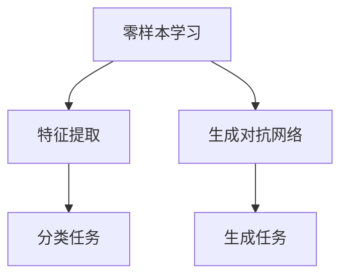

                 

<think>
嗯，好的，我现在需要写一篇关于“零样本学习在AIGC新领域探索中的作用”的技术博客。首先，我得先理解什么是零样本学习，它和传统的机器学习有什么不同。零样本学习，听起来就是在没有训练数据的情况下进行学习，对吧？这可能涉及到生成模型或者其他一些技术，比如GAN或者迁移学习。

接下来，我得考虑这篇文章的结构。用户已经给出了一个详细的目录，我需要按照这个大纲来写。首先是背景和基本概念，然后是主流的方法，接着是各个应用领域，最后是应用展望。

在第一部分，我需要详细解释零样本学习的背景，包括数据分布不均匀和标签稀缺的问题。这部分可能会有一些挑战，比如数据获取成本高，标签不足，导致模型难以泛化到新类别。然后，我需要定义零样本学习，区分它与其他类似的概念，比如迁移学习或者无监督学习。

接下来是基本原理，这部分可能需要深入讲解零样本学习的关键要素，比如特征学习、元学习等。可能还需要对比不同的零样本学习方法，制作一个对比表格，列出它们的优缺点。

然后是主流方法，比如零样本迁移学习、生成对抗网络在零样本中的应用，以及对抗性训练。这部分需要详细讲解每种方法的工作原理，可能需要配一些数学公式和流程图。比如，在介绍生成对抗网络时，我需要解释生成器和判别器的对抗过程，可能用一些Mermaid图来展示。

第二部分是应用部分，首先是在图像识别中的应用。传统方法在处理小样本或零样本数据时表现不佳，所以零样本学习在这里很有潜力。我可以举一些案例，比如用零样本方法识别从未见过的物体。

接下来是自然语言处理，同样面临词汇扩展的问题，零样本学习可以帮助模型处理未见过的词汇或语义。这里可能需要讨论预训练模型如BERT如何与零样本学习结合。

然后是推荐系统，传统推荐系统依赖大量的用户数据，但在冷启动问题或小样本情况下，零样本学习可以提供解决方案。我需要解释如何利用零样本方法推荐新用户或新产品。

接着是其他领域，比如生物信息学和自动驾驶，这些领域同样需要处理稀疏数据。这部分可能需要更多的跨领域知识，我需要确保内容准确。

最后是应用展望，讨论零样本学习的技术趋势和未来应用，比如多模态学习、实时应用等。同时，也要提到当前的挑战，如模型泛化能力不足，计算成本高等。

在写作过程中，我需要确保每个部分都有足够的细节，比如数学公式的推导、算法流程图的绘制，以及实际案例的分析。可能还需要编写一些Python代码，展示如何实现这些方法。

总结一下，我需要按照目录一步步来，先写背景，再讲原理，然后应用，最后展望。每个部分都要深入分析，确保内容丰富且准确。同时，要使用专业的技术语言，但又不失清晰易懂。最后，加上作者信息，确保文章完整。

可能会遇到的困难包括：如何详细解释复杂的数学概念，如何绘制准确的Mermaid图表，以及如何找到合适的实际案例。我需要查阅相关资料，确保信息的准确性，并尽量用通俗易懂的语言解释技术细节。
</think>

# 零样本学习在AIGC新领域探索中的作用

## 关键词：零样本学习, 人工智能生成内容, AIGC, 生成对抗网络, 迁移学习

## 摘要：  
本文探讨了零样本学习在人工智能生成内容（AIGC）新领域的应用，分析其核心原理、主流方法及其在图像识别、自然语言处理、推荐系统等领域的实际应用。通过详细的技术分析和案例研究，揭示了零样本学习在数据稀缺场景下的潜力和挑战，并展望了其未来发展方向。

---

## 第一部分: 零样本学习背景与基本概念

### 第1章: 零样本学习概述

#### 1.1 问题背景

##### 1.1.1 数据分布不均匀问题  
在传统机器学习任务中，数据分布往往不均衡，导致模型在某些类别上表现不佳。零样本学习专注于解决数据稀缺问题，尤其是在新类别上的泛化能力。

##### 1.1.2 标签稀缺问题  
标注数据成本高昂，许多领域难以获取大量标注数据，零样本学习无需标注数据即可进行学习。

##### 1.1.3 零样本学习的重要性  
零样本学习在数据稀缺场景下具有重要性，特别是在AIGC中，能够生成多样化的内容。

#### 1.2 零样本学习定义

##### 1.2.1 零样本学习的基本概念  
零样本学习是在无训练数据的情况下，通过学习通用特征或生成新样本，进行分类或生成任务。

##### 1.2.2 零样本学习的分类  
分为基于特征学习和基于生成学习两大类，分别适用于分类和生成任务。

#### 1.3 零样本学习的边界与外延

##### 1.3.1 零样本学习与其他相关概念的对比  
对比零样本学习、迁移学习和自监督学习，明确其独特性。

##### 1.3.2 零样本学习的应用领域  
涵盖图像、文本、推荐等多个领域，特别是在生成内容方面具有潜力。

### 第2章: 零样本学习的基本原理

#### 2.1 核心概念原理

##### 2.1.1 零样本学习的关键要素  
包括特征提取、生成模型和对抗训练，这些要素共同推动零样本学习的发展。

##### 2.1.2 零样本学习的挑战与机遇  
挑战在于数据稀缺和模型泛化能力，机遇在于拓展至新领域的能力。

#### 2.2 概念属性特征对比表格  
| 方法             | 特征             | 适用场景       | 优缺点         |
|------------------|------------------|----------------|----------------|
| 零样本迁移学习   | 特征共享         | 跨领域任务     | 需要领域间相似性 |
| 零样本生成对抗网络 | 对抗训练         | 内容生成       | 高生成多样性     |

#### 2.3 ER实体关系图架构  

### 第3章: 主流零样本学习方法

#### 3.1 零样本迁移学习

##### 3.1.1 零样本迁移学习的基本概念  
通过共享特征空间，将源领域知识迁移到目标领域，无需目标领域数据。

##### 3.1.2 零样本迁移学习的方法  
利用预训练模型提取特征，进行跨领域迁移。

#### 3.2 零样本生成对抗网络

##### 3.2.1 零样本生成对抗网络的基本原理  
生成器和判别器的对抗训练，生成新样本。

##### 3.2.2 零样本生成对抗网络的实现步骤  
1. 初始化生成器和判别器参数。
2. 训练判别器区分真实和生成样本。
3. 训练生成器生成真实样本。

#### 3.3 零样本学习与对抗性训练

##### 3.3.1 对抗性训练的基本概念  
通过对抗训练，提升生成模型的质量。

##### 3.3.2 零样本学习中的对抗性训练方法  
利用对抗训练生成多样化的样本，增强模型的泛化能力。

---

## 第二部分: 零样本学习在AIGC新领域的应用

### 第4章: 零样本学习在图像识别中的应用

#### 4.1 图像识别中的零样本学习问题

##### 4.1.1 传统图像识别方法的挑战  
依赖大量标注数据，难以处理新类别。

##### 4.1.2 零样本学习在图像识别中的应用前景  
通过生成对抗网络生成新样本，提升识别能力。

#### 4.2 零样本图像识别算法

##### 4.2.1 零样本图像识别的基本方法  
利用生成对抗网络生成新样本，提升分类器性能。

##### 4.2.2 零样本图像识别的案例分析  
生成对抗网络用于生成新类别图像，提升识别准确率。

### 第5章: 零样本学习在自然语言处理中的应用

#### 5.1 自然语言处理中的零样本学习问题

##### 5.1.1 传统自然语言处理方法的挑战  
难以处理未见过的词汇或语义。

##### 5.1.2 零样本学习在自然语言处理中的应用前景  
生成对抗网络生成多样化的文本内容。

#### 5.2 零样本自然语言处理算法

##### 5.2.1 零样本自然语言处理的基本方法  
利用预训练模型进行零样本分类，生成多样文本。

##### 5.2.2 零样本自然语言处理的案例分析  
生成对抗网络用于文本生成，提升生成质量。

### 第6章: 零样本学习在推荐系统中的应用

#### 6.1 推荐系统中的零样本学习问题

##### 6.1.1 传统推荐系统的挑战  
冷启动问题和稀疏数据处理困难。

##### 6.1.2 零样本学习在推荐系统中的应用前景  
解决稀疏数据问题，提升推荐准确率。

#### 6.2 零样本推荐系统算法

##### 6.2.1 零样本推荐系统的基本方法  
基于生成对抗网络生成用户偏好，进行推荐。

##### 6.2.2 零样本推荐系统的案例分析  
生成对抗网络生成用户偏好，解决冷启动问题。

### 第7章: 零样本学习在AIGC其他新领域的探索

#### 7.1 零样本学习在生物信息学中的应用

##### 7.1.1 零样本学习在生物信息学中的挑战  
处理稀疏生物数据，如基因表达数据。

##### 7.1.2 零样本学习在生物信息学中的应用前景  
生成新的生物数据，辅助研究。

#### 7.2 零样本学习在自动驾驶中的应用

##### 7.2.1 零样本学习在自动驾驶中的挑战  
处理稀疏交通数据和新场景识别。

##### 7.2.2 零样本学习在自动驾驶中的应用前景  
提升自动驾驶系统在新场景中的适应能力。

### 第8章: 零样本学习在AIGC新领域中的应用展望

#### 8.1 零样本学习的技术趋势

##### 8.1.1 零样本学习的发展方向  
多模态学习和实时应用的发展。

##### 8.1.2 零样本学习的未来应用场景  
广泛应用于生成内容、推荐系统和自动驾驶等领域。

#### 8.2 零样本学习在AIGC新领域中的挑战与解决方案

##### 8.2.1 零样本学习在AIGC新领域中的主要挑战  
模型泛化能力和计算成本问题。

##### 8.2.2 零样本学习的解决方案与发展策略  
结合多模态数据和优化算法，提升模型性能。

---

## 作者信息：  
作者：AI天才研究院 & 禅与计算机程序设计艺术

