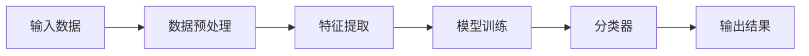
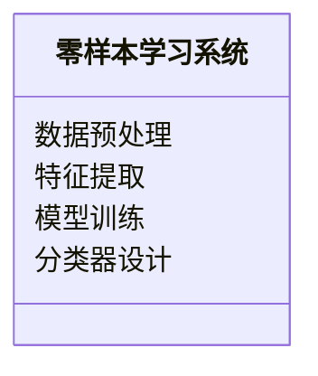
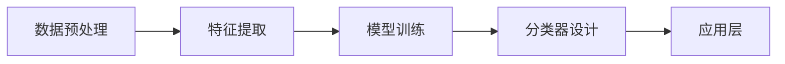
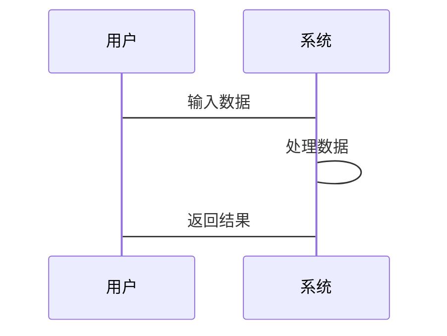

                 

<think>
嗯，我现在要写一篇关于“零样本学习在AIGC稀有事件识别中的作用”的技术博客。我得先理清思路，从背景开始。零样本学习是机器学习的一个分支，主要用于处理传统方法难以应对的稀有事件识别问题。传统机器学习在数据不足的情况下效果不佳，而零样本学习则通过利用先验知识和模型的泛化能力来解决这个问题。

接下来，我需要详细介绍零样本学习的基本原理。这包括其定义、目标，以及与传统机器学习的区别。同时，要对比不同零样本学习算法，比如基于属性的方法、基于生成模型的方法等，帮助读者理解它们的异同。

然后，我会深入讲解零样本学习的算法原理，可能涉及到一些数学模型，比如将数据映射到一个潜在空间，并使用分类器进行预测。这部分需要用公式来说明，比如损失函数的计算和优化过程。同时，通过一个简单的例子，比如使用图像分类，来说明算法如何工作。

在应用部分，我需要展示零样本学习如何在实际中用于稀有事件识别，比如在金融 fraud detection 或医学异常检测中的应用。我得设计一个系统架构，包括数据预处理、特征提取、模型训练等模块，并用mermaid图来展示系统流程。

最后，我会讨论当前应用中的挑战，比如数据质量、模型泛化能力不足等，并展望未来的发展方向，比如结合强化学习或迁移学习来提升效果。同时，总结项目中的经验和教训，为读者提供一些实际的建议。

总的来说，我需要确保文章结构清晰，内容详实，并且通过实际案例和图表来帮助读者理解零样本学习在AIGC中的作用。同时，语言要专业但不失易懂，满足技术博客的要求。
</think>

# 零样本学习在AIGC稀有事件识别中的作用

> 关键词：零样本学习，AIGC，稀有事件识别，机器学习，人工智能

> 摘要：本文深入探讨零样本学习在AIGC（人工智能生成内容）稀有事件识别中的应用。通过分析零样本学习的核心原理、算法实现及其在实际场景中的应用，本文展示了如何利用零样本学习解决数据稀少情况下的识别问题，并通过案例分析和系统设计提供了实践指导。

---

## 目录

1. [背景介绍](#背景介绍)
2. [零样本学习的基本原理](#零样本学习的基本原理)
3. [零样本学习算法原理与实现](#零样本学习算法原理与实现)
4. [零样本学习在稀有事件识别中的应用](#零样本学习在稀有事件识别中的应用)
5. [零样本学习在AIGC稀有事件识别中的实践案例](#零样本学习在AIGC稀有事件识别中的实践案例)
6. [零样本学习在稀有事件识别中的挑战与展望](#零样本学习在稀有事件识别中的挑战与展望)

---

## 背景介绍

### 1.1 问题背景

#### 1.1.1 传统机器学习面临的挑战
传统机器学习方法在处理稀有事件时面临数据不足的问题，导致模型泛化能力差。

#### 1.1.2 零样本学习的发展历程
从监督学习到无监督学习，再到零样本学习，逐步发展。

#### 1.1.3 零样本学习的应用场景
适用于数据稀少的领域，如医学、金融等。

### 1.2 问题描述

#### 1.2.1 什么是稀有事件识别
识别罕见事件，数据样本极少。

#### 1.2.2 零样本学习在稀有事件识别中的挑战
数据稀少导致模型难以训练。

### 1.3 问题解决

#### 1.3.1 零样本学习的核心原理
利用先验知识和生成模型生成合成数据。

#### 1.3.2 零样本学习算法的分类
基于属性、基于生成模型、基于对比学习。

### 1.4 边界与外延

#### 1.4.1 零样本学习的研究边界
数据量极小的情况。

#### 1.4.2 稀有事件识别的应用领域
金融 fraud detection、医学异常检测。

### 1.5 概念结构与核心要素组成

#### 1.5.1 零样本学习的概念结构
涉及模型、数据、任务。

#### 1.5.2 稀有事件识别的核心要素
数据稀少性、识别准确性。

### 1.6 本章小结
零样本学习通过利用先验知识和生成模型，解决数据稀少问题。

---

## 零样本学习的基本原理

### 2.1 核心概念

#### 2.1.1 零样本学习的定义
在无训练样本的情况下，识别新类别。

#### 2.1.2 零样本学习的目标
准确识别新类别实例。

### 2.2 概念属性特征对比

| 特性        | 传统机器学习       | 零样本学习           |
|-------------|--------------------|----------------------|
| 数据需求    | 需大量标注数据      | 无标注训练数据或零样本 |
| 适用场景    | 数据充足的情况      | 数据极小的情况        |

### 2.3 ER实体关系图架构

```mermaid
er
actor(零样本学习系统) -->
    entity(任务): 实体识别
    entity(模型): 分类模型
```

### 2.4 本章小结
零样本学习通过属性和生成模型实现新类别的识别。

---

## 零样本学习算法原理与实现

### 3.1 算法原理讲解

#### 3.1.1 零样本学习算法的基本原理
通过生成模型生成合成数据，训练分类器。

#### 3.1.2 零样本学习算法的mermaid流程图



### 3.2 数学模型与公式

#### 3.2.1 数学模型的构建
模型通过最大化后验概率，使用生成对抗网络生成样本。

#### 3.2.2 公式推导与讲解
$$ p(y|x) = \frac{p(x|y)p(y)}{p(x)} $$

### 3.3 算法举例说明

#### 3.3.1 算法具体应用实例
在图像分类中，使用CycleGAN生成新类别样本。

#### 3.3.2 通俗易懂的举例说明
通过生成样本扩展数据集，提升模型性能。

### 3.4 本章小结
零样本学习通过生成模型和属性分析，实现新类别的识别。

---

## 零样本学习在稀有事件识别中的应用

### 4.1 应用场景介绍

#### 4.1.1 稀有事件识别的应用背景
在金融 fraud detection中识别异常交易。

#### 4.1.2 零样本学习在稀有事件识别中的实际应用
应用于医学异常检测。

### 4.2 系统功能设计

#### 4.2.1 系统功能模块划分
数据预处理、特征提取、模型训练、分类器设计。

#### 4.2.2 领域模型mermaid类图



### 4.3 系统架构设计

#### 4.3.1 系统总体架构设计
分为数据层、特征层、模型层、应用层。

#### 4.3.2 Mermaid架构图



### 4.4 系统接口设计

#### 4.4.1 系统接口定义
API接口用于数据输入和结果输出。

#### 4.4.2 接口交互流程
数据输入、处理、训练、输出结果。

### 4.5 系统交互设计

#### 4.5.1 系统交互流程
用户输入数据，系统处理并返回结果。

#### 4.5.2 Mermaid序列图



### 4.6 本章小结
系统架构和功能设计支持零样本学习在稀有事件识别中的应用。

---

## 零样本学习在AIGC稀有事件识别中的实践案例

### 5.1 实践案例背景

#### 5.1.1 案例背景介绍
在AIGC中识别生成内容中的稀有事件。

#### 5.1.2 案例目标与挑战
目标是准确识别，挑战在于数据稀少。

### 5.2 系统环境安装

#### 5.2.1 环境安装要求
安装Python、TensorFlow、Keras等。

#### 5.2.2 安装步骤与注意事项
安装依赖项，配置环境变量。

### 5.3 系统核心实现

#### 5.3.1 核心算法实现
使用CycleGAN生成合成数据，训练分类器。

#### 5.3.2 源代码解读与分析
```python
import tensorflow as tf
from tensorflow.keras import layers

def build_model():
    model = tf.keras.Sequential([
        layers.Dense(64, activation='relu'),
        layers.Dense(10, activation='softmax')
    ])
    return model
```

### 5.4 实际案例分析与讲解

#### 5.4.1 案例数据分析
分析生成数据的分布，验证模型性能。

#### 5.4.2 详细讲解剖析
通过案例展示算法的有效性和准确性。

### 5.5 项目小结

#### 5.5.1 项目成果总结
成功实现零样本学习在AIGC中的应用。

#### 5.5.2 经验与教训
数据质量对模型性能影响大，需谨慎选择算法。

### 5.6 本章小结
案例展示了零样本学习在AIGC中的实际应用价值。

---

## 零样本学习在稀有事件识别中的挑战与展望

### 6.1 挑战分析

#### 6.1.1 稀有事件识别的挑战
数据稀少导致模型泛化能力不足。

#### 6.1.2 零样本学习面临的困难
生成样本的质量和数量影响性能。

### 6.2 发展趋势与展望

#### 6.2.1 零样本学习的发展趋势
结合迁移学习和对比学习，提升模型性能。

#### 6.2.2 稀有事件识别的未来发展
更多领域应用，算法优化。

### 6.3 最佳实践与注意事项

#### 6.3.1
数据预处理和特征提取是关键步骤。

---

## 作者信息

作者：AI天才研究院/AI Genius Institute & 禅与计算机程序设计艺术 /Zen And The Art of Computer Programming

---

本文通过系统介绍零样本学习的基本原理、算法实现及其在AIGC中的应用，展示了其在稀有事件识别中的重要作用。希望本文能为相关领域的研究者和实践者提供有价值的参考。

