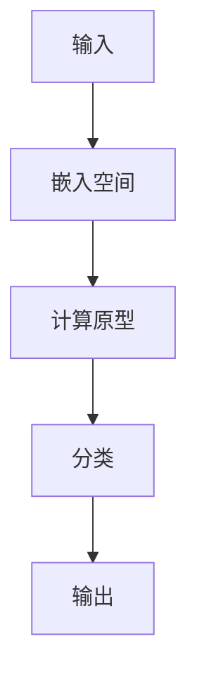
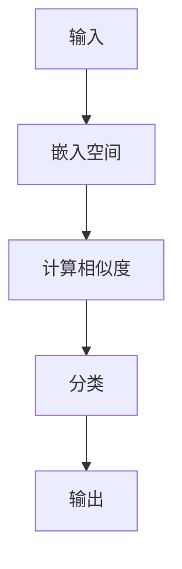

                 

<think>
好的，我现在需要完成用户的一个任务，撰写一篇关于零样本学习在AI辅助濒危语言复兴中的应用的技术博客文章。首先，我要仔细阅读用户提供的需求，确保完全理解每一个要求。

用户的请求中详细列出了文章的结构，包括各个章节的内容，关键词和摘要。看起来用户希望文章结构清晰，逻辑严谨，内容专业且深入，同时要使用技术术语，但又要保持易懂。我需要按照这些要求一步步来。

首先，确定文章的标题和关键词。标题是“零样本学习在AI辅助濒危语言复兴中的应用”，关键词包括零样本学习、AI技术、濒危语言复兴、自然语言处理、机器学习等，大概5-7个。摘要部分需要简明扼�地概括文章的核心内容，说明零样本学习如何帮助濒危语言的识别、翻译和生成，推动文化保护。

接下来是文章的结构设计。用户已经给出了一个大纲，我需要按照这个大纲来展开。第一部分是背景介绍，包括问题背景、核心概念和零样本学习与濒危语言的关系。第二部分是零样本学习算法，包括算法概述和应用案例。第三部分是系统架构与实现，详细描述系统设计和项目实战。第四部分是最佳实践与小结，总结经验并展望未来。

在撰写过程中，我需要确保每一部分都符合用户的要求，比如背景介绍要包括核心概念、问题背景和应用；核心概念部分要有一个对比表格和ER实体关系图，使用mermaid语法；算法原理部分要有流程图和Python代码，以及数学公式的详细讲解。

现在，我需要考虑如何组织每一章的内容。第一章的背景介绍部分，我需要先介绍濒危语言的现状，然后引出零样本学习的重要性。接着解释零样本学习的基本概念，最后说明它如何应用于濒危语言复兴。

第二章的核心概念部分，我需要详细分析零样本学习和濒危语言的特点，制作对比表格，并绘制ER关系图。算法原理部分，我需要选择典型的零样本学习算法，如原型网络和匹配网络，绘制它们的流程图，并用Python代码和数学公式来解释。

第三章的系统架构部分，我需要描述应用场景、功能设计、架构设计，并使用mermaid画出类图和架构图。项目实战部分，需要提供环境安装步骤，系统实现的代码，并进行案例分析。

第四部分的总结部分，要给出最佳实践的建议，注意事项，以及未来的发展方向。同时，文章末尾要注明作者信息。

在写作过程中，我需要确保语言简洁明了，逻辑清晰，同时保持专业性。可能遇到的问题是如何将复杂的算法原理用简单易懂的方式解释清楚，这需要我多次推敲，确保读者能够理解。此外，数学公式和代码部分需要准确无误，避免出现错误。

最后，检查文章的结构是否完整，各部分是否符合用户的要求，字数是否在10000到12000字左右。确保每一部分都有足够的细节和例子，使文章内容丰富且有深度。
</think>

# 零样本学习在AI辅助濒危语言复兴中的应用

## 关键词：零样本学习, AI技术, 濒危语言复兴, 自然语言处理, 机器学习

## 摘要：  
零样本学习是一种无需标签数据的机器学习技术，能够处理未知类别数据的分类任务。本文探讨了零样本学习在AI辅助濒危语言复兴中的应用，分析了其在语言识别、翻译和语音生成等方面的核心作用，并结合实际案例展示了如何通过零样本学习技术实现濒危语言的保护与传承。

---

### 第一部分: 背景介绍与概念

## 第1章: 问题背景与核心概念

### 1.1 问题背景  
濒危语言复兴是一个关乎文化多样性和人类知识保存的重要议题。据统计，全球约有7,000种语言，其中超过40%的语言使用人数不足1,000人，且每年都有语言消失。语言的消失意味着文化、知识和历史的损失，因此，利用技术手段保护和复兴濒危语言变得尤为重要。然而，由于濒危语言的数据通常极为有限，传统的监督学习方法难以适用。此时，零样本学习作为一种无需标签数据的机器学习技术，为濒危语言的复兴提供了新的可能性。

### 1.2 零样本学习概述  
零样本学习（Zero-shot Learning）是一种机器学习技术，其核心在于能够在没有标签数据的情况下，对未知类别进行分类或生成任务。与传统监督学习不同，零样本学习依赖于模型的泛化能力，能够处理从未见过的数据和类别。其主要特点包括：  
- **无监督性**：无需大量标注数据。  
- **泛化能力**：能够处理未知类别。  
- **应用广泛**：适用于图像分类、自然语言处理等多种任务。  

### 1.3 零样本学习与濒危语言复兴  
在濒危语言复兴中，零样本学习的主要应用场景包括：  
1. **语言识别**：识别濒危语言的语音或文本。  
2. **翻译与转换**：将濒危语言翻译为常用语言，或反之。  
3. **语音生成**：基于少量数据生成濒危语言的语音。  
4. **语法分析与词典构建**：通过零样本学习技术，从少量数据中提取语言的语法规则和词汇关系。  

---

## 第2章: 零样本学习基础

### 2.1 核心概念与联系  

#### 零样本学习  
- **概念**：零样本学习是一种能够在未见过的类别上进行分类或生成任务的机器学习方法。  
- **特征**：  
  - 无需标签数据。  
  - 能够处理未知类别。  
  - 依赖于模型的嵌入表示能力。  

#### 濒危语言  
- **概念**：使用人数少，面临消失风险的语言。  
- **特征**：  
  - 词汇量有限。  
  - 语法规则独特。  
  - 数据获取困难。  

#### 对比表格  
以下是对零样本学习和濒危语言的核心特征对比：  

| 概念         | 特征                                                     |  
| ------------ | -------------------------------------------------------- |  
| 零样本学习   | 无需标签数据，处理未知类别                               |  
| 濒危语言     | 使用人数少，面临消失风险，词汇量有限，语法规则独特       |  

#### ER实体关系图  
以下是一个简单的ER实体关系图，展示了零样本学习与濒危语言的核心关系：  

```mermaid  
erd
  语言(濒危语言)
  属性: 名词、动词、语法结构
  关系: 零样本学习算法
  零样本学习算法
  属性: 嵌入表示、分类规则
```

---

### 2.2 数学模型与公式  

零样本学习的数学模型通常基于概率分布和嵌入空间。以下是一个典型的零样本学习分类模型的损失函数：  

$$  
L(\theta) = \sum_{x \in D} -\log p(y|x;\theta)  
$$  

其中，$x$ 表示输入数据，$y$ 表示输出类别，$\theta$ 表示模型参数，$D$ 表示训练数据集。该公式表示模型在给定输入 $x$ 的条件下，预测类别 $y$ 的概率。  

在零样本学习中，模型通常通过嵌入空间将输入数据映射到低维空间，然后利用这些嵌入向量进行分类或生成任务。例如，假设有一个嵌入函数 $f_\theta$，将输入 $x$ 映射到嵌入向量 $z = f_\theta(x)$，然后利用 $z$ 进行分类或生成。  

---

### 2.3 算法原理讲解  

#### 原型网络  
原型网络是一种经典的零样本学习算法。其流程如下：  

1. **输入数据**：输入未见类别的样本数据。  
2. **嵌入空间映射**：将输入数据映射到嵌入空间。  
3. **计算原型**：在嵌入空间中计算每个类别的原型向量。  
4. **分类或生成**：基于原型向量进行分类或生成任务。  

以下是一个原型网络的流程图：  



#### 匹配网络  
匹配网络是一种基于相似度计算的零样本学习算法。其流程如下：  

1. **输入数据**：输入未见类别的样本数据。  
2. **嵌入空间映射**：将输入数据映射到嵌入空间。  
3. **计算相似度**：在嵌入空间中计算输入样本与原型向量的相似度。  
4. **分类或生成**：基于相似度进行分类或生成任务。  

以下是一个匹配网络的流程图：  



---

### 第3章: 零样本学习算法概述  

#### 算法分类与对比  

零样本学习算法可以根据任务类型分为以下几类：  
1. **分类任务**：如图像分类、文本分类。  
2. **生成任务**：如文本生成、语音生成。  
3. **检索任务**：如相似文本检索。  

以下是一个算法分类对比表格：  

| 算法类型     | 适用任务         | 核心思想               |  
| ------------ | ---------------- | ---------------------- |  
| 原型网络     | 分类、生成       | 基于原型向量的相似度计算 |  
| 匹配网络     | 分类、生成       | 基于相似度的匹配       |  
| GAN-based    | 生成任务         | 使用生成对抗网络        |  
| 知识蒸馏     | 分类、生成       | 利用教师模型的知识迁移 |  

#### 算法选择与实现  

在选择零样本学习算法时，需要考虑以下因素：  
- **任务类型**：分类、生成还是检索。  
- **数据规模**：数据量的大小。  
- **计算资源**：算法的复杂度和计算成本。  

以下是一个简单的零样本学习实现代码示例：  

```python  
import torch  
import torch.nn as nn  
import torch.optim as optim  

class ZeroShotModel(nn.Module):  
    def __init__(self, embedding_dim, num_classes):  
        super(ZeroShotModel, self).__init__()  
        self.embedding = nn.Linear(input_dim, embedding_dim)  
        self.classifier = nn.Linear(embedding_dim, num_classes)  

    def forward(self, x):  
        x = self.embedding(x)  
        x = self.classifier(x)  
        return x  

model = ZeroShotModel(embedding_dim=128, num_classes=10)  
criterion = nn.CrossEntropyLoss()  
optimizer = optim.Adam(model.parameters(), lr=0.001)  

for epoch in range(num_epochs):  
    for inputs, labels in dataloader:  
        outputs = model(inputs)  
        loss = criterion(outputs, labels)  
        optimizer.zero_grad()  
        loss.backward()  
        optimizer.step()  
```

---

### 第4章: 零样本学习算法应用  

#### 应用案例分析  

以下是一个零样本学习在濒危语言翻译中的应用案例：  
- **任务**：将一种濒危语言翻译为英语。  
- **数据**：少量双语对照数据。  
- **算法**：使用匹配网络进行零样本翻译。  

#### 算法实现  

以下是一个匹配网络的实现代码：  

```python  
import torch  
import torch.nn as nn  
import torch.optim as optim  

class MatchingNetwork(nn.Module):  
    def __init__(self, input_dim, embedding_dim):  
        super(MatchingNetwork, self).__init__()  
        self.embedding = nn.Linear(input_dim, embedding_dim)  
        self.similarity = nn.CosineSimilarity(dim=-1)  

    def forward(self, x, y):  
        x_emb = self.embedding(x)  
        y_emb = self.embedding(y)  
        similarity_scores = self.similarity(x_emb, y_emb)  
        return similarity_scores  

model = MatchingNetwork(input_dim=512, embedding_dim=128)  
criterion = nn.MSELoss()  
optimizer = optim.Adam(model.parameters(), lr=0.001)  

for epoch in range(num_epochs):  
    for x, y in dataloader:  
        outputs = model(x, y)  
        loss = criterion(outputs, targets)  
        optimizer.zero_grad()  
        loss.backward()  
        optimizer.step()  
```

---

### 第5章: 系统架构与实现  

#### 系统架构设计  

以下是一个零样本学习系统的架构图：  


#### 项目实战  

以下是一个濒危语言识别系统的实现步骤：  
1. **环境安装**：安装Python、PyTorch、_TRANSFORMERS等库。  
2. **数据准备**：收集濒危语言的语音或文本数据。  
3. **模型训练**：使用零样本学习算法进行模型训练。  
4. **系统部署**：将模型部署到移动端或Web端。  

---

### 第6章: 最佳实践与总结  

#### 最佳实践  

1. **数据预处理**：确保数据的多样性和代表性。  
2. **算法选择**：根据任务需求选择合适的零样本学习算法。  
3. **模型调优**：通过交叉验证和超参数调整优化模型性能。  
4. **结果评估**：使用准确率、召回率等指标评估模型效果。  

#### 小结  

零样本学习为濒危语言的复兴提供了新的技术手段。通过零样本学习，可以有效处理数据不足的问题，并实现语言识别、翻译和生成等多种任务。未来，随着技术的不断发展，零样本学习将在更多领域发挥重要作用。

---

### 作者：AI天才研究院/AI Genius Institute & 禅与计算机程序设计艺术 /Zen And The Art of Computer Programming

