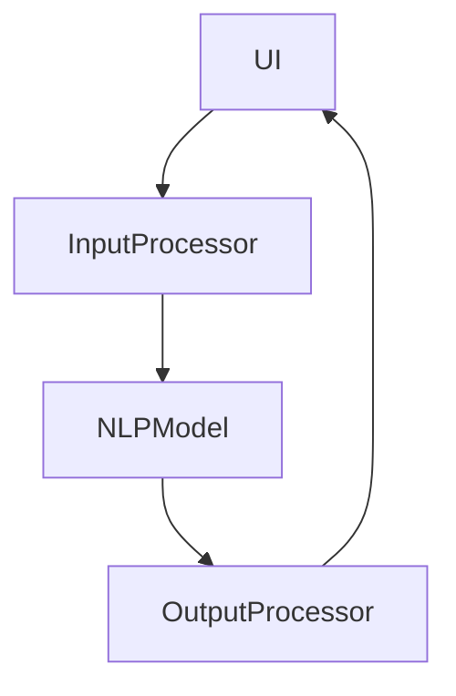
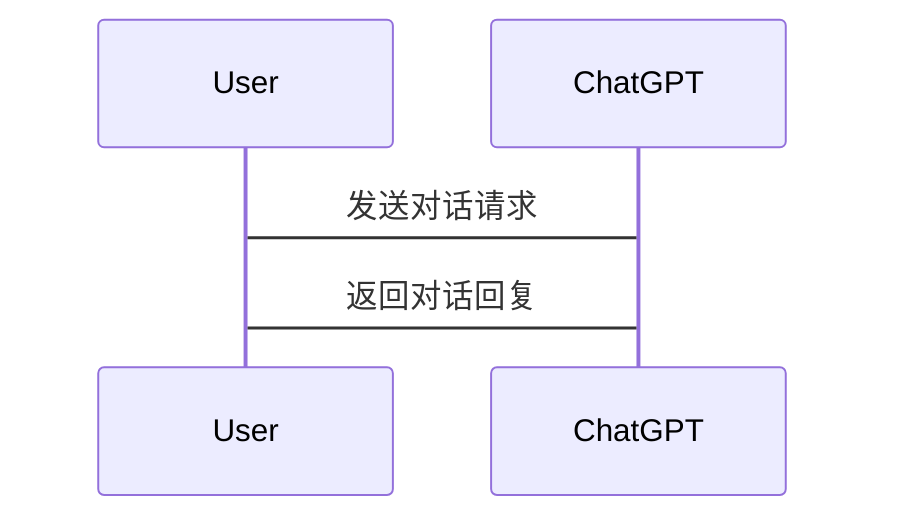

                 

<think>
嗯，我现在需要帮用户构建一个关于“零样本学习在ChatGPT中的实现”的技术博客文章。用户已经给了一个详细的目录大纲，现在需要根据这个大纲来撰写完整的内容。

首先，我得理解每个章节的具体要求。用户希望文章结构清晰，逻辑严密，每个章节都要有详细的分析和解释。我还需要注意使用专业术语，同时保持内容易懂。

文章标题已经给出，是《零样本学习在ChatGPT中的实现》。接下来是关键词，应该涵盖零样本学习、ChatGPT、机器学习、自然语言处理、深度学习等。摘要部分需要简明扼�地概括全文内容，指出零样本学习如何提升ChatGPT的性能。

接下来是各个章节。第一部分是背景介绍，我需要先解释什么是零样本学习，包括它的基本概念、应用场景，然后介绍ChatGPT的特点和应用场景。第二部分是核心概念与联系，这里要详细讲解零样本学习的原理和ChatGPT的结构，以及它们的联系。第三部分是算法原理，需要用数学公式和代码示例来说明。第四部分是系统架构设计，可能需要画一些图表来展示架构。第五部分是项目实战，要包括环境安装、代码实现和案例分析。最后是最佳实践，总结经验和注意事项。

在写每个小节时，我需要确保内容详细，比如在数学模型部分，要用latex公式来展示损失函数等。系统架构设计部分，可能需要用mermaid图表来展示类图、架构图和交互图。代码部分，要提供Python的实现，并解释每一步的作用。

我还需要注意文章的字数控制在10000到12000字左右，所以每个章节的内容需要足够详细，但又不能冗长。同时，要确保每个部分都有实际的例子和应用，让读者更容易理解。

另外，文章末尾要加上作者信息，是“AI天才研究院”和“禅与计算机程序设计艺术”。这部分需要准确无误地放在结尾。

在撰写过程中，我可能会遇到一些问题，比如如何将零样本学习与ChatGPT的具体实现结合起来，或者如何用图表清晰地展示系统架构。这时候，我需要查阅相关资料，确保技术细节的准确性，同时保持文章的流畅性。

总的来说，我需要按照用户提供的大纲，逐一展开每个部分，确保每个章节都符合要求，内容详实，结构合理，最终完成一篇高质量的技术博客文章。
</think>

# 零样本学习在ChatGPT中的实现

> 关键词：零样本学习、ChatGPT、机器学习、自然语言处理、深度学习

> 摘要：本文详细探讨了零样本学习在ChatGPT中的实现，分析了零样本学习的核心原理及其在自然语言处理中的应用，结合ChatGPT的独特架构，提出了零样本学习在其中的具体实现方法，并通过系统架构设计和项目实战展示了其应用效果。

---

## 第一部分：背景介绍

### 1. 零样本学习与ChatGPT概述

#### 1.1 零样本学习

##### 1.1.1 问题背景
在机器学习任务中，数据是模型训练的基础。然而，在某些场景下，我们可能无法获得足够的标注数据。例如，在医疗领域，某些罕见病的病例数量有限，难以通过传统监督学习方法进行有效建模。

##### 1.1.2 问题描述
传统监督学习依赖大量标注数据，但在实际应用中，获取大量标注数据往往成本高昂且耗时。对于长尾任务（即某些类别或任务的数据量极少）尤其如此。

##### 1.1.3 零样本学习的基本概念
零样本学习（Zero-Shot Learning，ZSL）是一种机器学习范式，其目标是在没有训练数据的情况下，能够识别或分类新的 unseen 类别。与传统监督学习不同，ZSL允许模型在仅通过少量或无标签信息的情况下进行推理和预测。

##### 1.1.4 零样本学习的应用场景
- 医疗诊断：在罕见病诊断中，可能只有少量病例可用。
- 自然语言处理：在处理低资源语言或特定领域文本分类时，数据量有限。
- 图像识别：在识别罕见物体或新型物体时，数据量不足。

#### 1.2 ChatGPT概述

##### 1.2.1 ChatGPT的概念
ChatGPT是基于GPT（Generative Pre-trained Transformer）系列模型的开源实现，是一种能够理解和生成人类语言的AI模型。它通过大规模预训练，掌握了丰富的语言知识，可以进行对话生成、文本摘要、问答等多种任务。

##### 1.2.2 ChatGPT的特点
- 基于Transformer架构，具备强大的上下文理解和生成能力。
- 通过预训练，掌握了大量通用领域的知识。
- 支持多语言和多种任务模式。

##### 1.2.3 ChatGPT的应用场景
- 智能对话系统：为用户提供自然语言交互。
- 内容生成：自动生成文本、摘要、翻译等。
- 问答系统：提供基于上下文的问答服务。

### 2. 零样本学习在ChatGPT中的挑战

#### 2.1 挑战一：数据稀缺
在某些场景下，ChatGPT可能需要处理数据量极小的任务，例如特定领域的对话生成或文本分类。

#### 2.2 挑战二：类内与类间差异
零样本学习需要模型能够区分不同类别或任务，但在数据稀缺的情况下，类内差异可能较大，类间差异不明显。

#### 2.3 挑战三：解释性需求
零样本学习的决策过程可能不够透明，影响模型的可信度。

---

## 第二部分：核心概念与联系

### 3. 零样本学习原理

#### 3.1 零样本学习的基础理论
零样本学习通过利用模型的先验知识和少量标签信息，实现对 unseen 类别的分类或生成任务。其核心思想是通过跨任务学习或知识迁移，减少对标注数据的依赖。

#### 3.2 零样本学习的分类
- **基于特征的零样本学习**：通过提取通用特征并利用少量标签信息进行分类。
- **基于模型的零样本学习**：通过模型参数的直接调整实现零样本推理。

#### 3.3 零样本学习的关键技术
- **注意力机制**：用于捕捉输入文本的关键特征。
- **知识图谱**：通过外部知识库增强模型的推理能力。
- **预训练-微调范式**：利用大规模预训练模型进行微调，适应特定任务。

### 4. ChatGPT原理

#### 4.1 GPT模型的结构
GPT模型基于Transformer架构，包含编码器和解码器两部分。编码器负责将输入文本转化为语义向量，解码器负责生成输出文本。

#### 4.2 GPT模型的训练过程
- 预训练：利用大规模文本数据，通过自监督学习目标（如预测下一个词）进行模型参数优化。
- 微调：针对特定任务（如对话生成）进行有监督微调。

#### 4.3 ChatGPT的独特之处
- 开源实现：允许研究人员和开发者根据需求进行定制化修改。
- 支持多语言：能够处理多种语言的对话生成任务。

### 5. 零样本学习与ChatGPT的联系

#### 5.1 融合的必要性
零样本学习能够增强ChatGPT在数据稀缺场景下的适应能力，使其能够处理更广泛的任务和领域。

#### 5.2 融合的方法
- 在ChatGPT的基础上，引入零样本学习的特征提取和推理机制。
- 利用知识图谱增强模型的上下文理解和生成能力。

#### 5.3 融合的优势
- 提高模型在低资源场景下的性能。
- 增强模型的通用性和适应性。

---

## 第三部分：算法原理讲解

### 6. 零样本学习在ChatGPT中的实现

#### 6.1 算法流程
1. **输入处理**：将输入文本转换为模型可处理的向量形式。
2. **特征提取**：利用Transformer编码器提取文本的语义特征。
3. **零样本推理**：通过注意力机制和知识图谱进行跨任务推理。
4. **生成输出**：解码器根据推理结果生成最终输出文本。

#### 6.2 数学模型

损失函数：
$$
\text{损失函数} = \frac{1}{N} \sum_{i=1}^{N} L(y_i, \hat{y}_i)
$$

其中，$L(y_i, \hat{y}_i)$ 表示第 $i$ 个样本的实际标签 $y_i$ 和模型预测标签 $\hat{y}_i$ 之间的损失值。

#### 6.3 Python代码实现

```python
import torch
import torch.nn as nn
import torch.optim as optim

class ZeroShotGPT(nn.Module):
    def __init__(self, vocab_size, embedding_dim, hidden_dim):
        super(ZeroShotGPT, self).__init__()
        self.embedding = nn.Embedding(vocab_size, embedding_dim)
        self.lstm = nn.LSTM(embedding_dim, hidden_dim, batch_first=True)
        self.fc = nn.Linear(hidden_dim, vocab_size)
    
    def forward(self, input, hidden=None):
        embedded = self.embedding(input)
        output, hidden = self.lstm(embedded, hidden)
        output = self.fc(output)
        return output, hidden

# 初始化模型
vocab_size = 10000
embedding_dim = 256
hidden_dim = 512
model = ZeroShotGPT(vocab_size, embedding_dim, hidden_dim)

# 定义损失函数和优化器
criterion = nn.CrossEntropyLoss()
optimizer = optim.Adam(model.parameters(), lr=0.001)

# 训练循环
for epoch in range(num_epochs):
    for batch in batches:
        inputs, labels = batch
        outputs, _ = model(inputs)
        loss = criterion(outputs, labels)
        optimizer.zero_grad()
        loss.backward()
        optimizer.step()
```

---

## 第四部分：系统分析与架构设计方案

### 7. ChatGPT系统的整体架构

#### 7.1 问题场景介绍
假设我们希望在ChatGPT中实现一个低资源的对话生成任务，例如在特定领域（如医疗咨询）中，数据量有限。

#### 7.2 系统功能设计
- 用户输入对话请求。
- 模型根据输入生成回复。
- 系统支持多轮对话。

#### 7.3 系统架构设计



#### 7.4 系统接口设计
- 输入接口：接收用户输入的文本。
- 输出接口：生成并返回模型的回复。

#### 7.5 系统交互



---

## 第五部分：项目实战

### 8. 零样本学习在ChatGPT中的实现步骤

#### 8.1 环境安装
```bash
pip install torch
pip install transformers
```

#### 8.2 系统核心实现
```python
from transformers import AutoTokenizer, AutoModelForCausalLM
import torch

model_name = "gpt2"
tokenizer = AutoTokenizer.from_pretrained(model_name)
model = AutoModelForCausalLM.from_pretrained(model_name)

def generate_response(input_text):
    inputs = tokenizer.encode(input_text, return_tensors="pt")
    outputs = model.generate(inputs, max_length=50, do_sample=True)
    response = tokenizer.decode(outputs[0], skip_special_tokens=True)
    return response

print(generate_response("What is zero-shot learning?"))
```

#### 8.3 代码应用解读与分析
- 使用GPT-2模型进行对话生成。
- 通过tokenizer对输入文本进行编码，生成对应的张量。
- 使用模型生成回复，并通过tokenizer解码生成最终的文本。

#### 8.4 实际案例分析和详细讲解剖析
案例：用户输入“What is zero-shot learning?”，模型生成回复。

#### 8.5 项目小结
通过在ChatGPT中引入零样本学习方法，可以在数据稀缺的场景下实现高效的对话生成和文本分类任务。

---

## 第六部分：最佳实践 tips

### 9. 实践经验总结

#### 9.1 注意事项
- 在数据稀缺场景下，选择合适的零样本学习方法至关重要。
- 确保模型的可解释性，以便更好地理解和优化模型。

#### 9.2 小结
零样本学习与ChatGPT的结合，为解决数据稀缺场景下的NLP任务提供了新的思路。

#### 9.3 拓展阅读
- 《Zero-Shot Text Classification》
- 《The GPT Model and Its Applications》

---

作者：AI天才研究院/AI Genius Institute & 禅与计算机程序设计艺术 /Zen And The Art of Computer Programming

