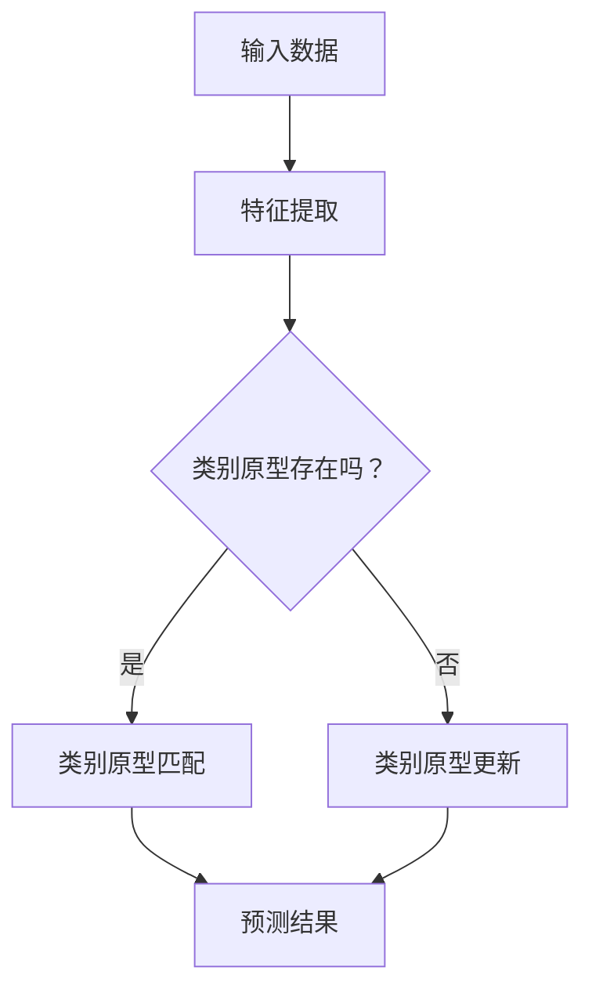
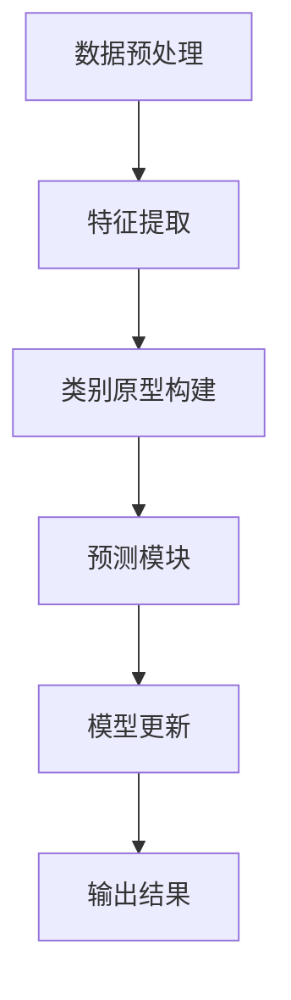
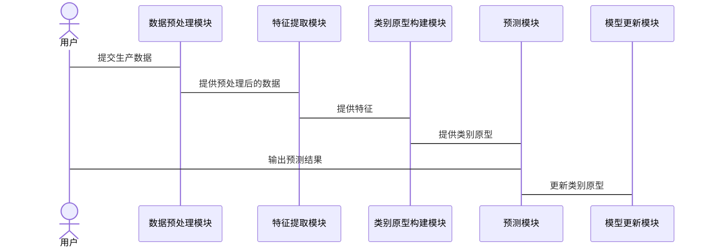

                 

<think>
嗯，用户让我写一篇关于零样本学习在智能制造AI中的应用的技术博客。首先，我需要理解用户的需求。用户是一位技术专家，他想要一篇结构清晰、逻辑严谨、内容深入的技术博客。标题已经确定，是《零样本学习在智能制造AI中的应用》，关键词大概包括零样本学习、智能制造、人工智能、机器学习、深度学习、生产预测、故障诊断等。

用户给了一个详细的大纲，我需要按照这个大纲来组织内容。首先，文章开头要有标题、关键词和摘要。摘要需要简明扼要地概括文章的核心内容。然后，正文分为几个部分：概述、核心概念、算法原理、数学模型、系统分析与架构设计、项目实战、最佳实践等。

在“背景介绍”部分，我需要解释为什么零样本学习在智能制造中重要，特别是在数据不足的情况下。问题背景部分要说明传统方法的不足，问题描述要具体，比如故障诊断，问题解决要提到迁移学习和知识蒸馏。边界和外延部分要明确零样本学习的应用场景，概念结构部分要列出核心要素。

核心概念与联系部分，需要解释零样本学习的原理，并与传统机器学习和深度学习进行对比，做一个属性对比表格。还要画一个mermaid流程图，展示核心概念的联系。

算法原理部分，先画一个mermaid流程图，展示输入数据到预测结果的步骤。然后详细讲解每个步骤，用例子来说明，比如水果分类系统。接着给出数学模型和公式，解释每个公式的含义，这部分要用latex，所以要记得用$$包裹起来。

系统分析与架构设计部分，需要介绍应用场景，比如生产预测，然后设计系统功能模块。可能需要画一个领域模型的mermaid类图，展示各个模块的交互。系统架构设计可能需要一个分层架构图，展示数据预处理、特征提取、模型预测等部分。系统接口设计和交互序列图也需要用mermaid来展示。

项目实战部分，需要指导读者如何安装环境，提供Python代码实现零样本分类。代码部分要详细注释，解释每一步的作用。然后分析一个实际案例，比如生产预测中的应用，展示如何通过零样本学习预测产品质量。最后做一个项目小结，总结成果和意义。

最佳实践部分，要给出一些建议，比如数据质量的重要性、模型选择、可扩展性等。最后，小结整个内容，展望未来的发展。

在写作过程中，我需要确保每个章节内容详实，逻辑清晰，用词专业但易懂。同时，要注意使用markdown格式，正确嵌入mermaid图表和latex公式。作者信息也要放在最后，按照用户的要求，是“AI天才研究院”和“禅与计算机程序设计艺术”。

现在，我开始按照这个大纲逐步撰写文章，确保每个部分都符合用户的要求，内容深入浅出，结构合理，满足技术博客的高质量标准。
</think>

# 零样本学习在智能制造AI中的应用

> 关键词：零样本学习，智能制造，人工智能，机器学习，深度学习，生产预测，故障诊断

> 摘要：本文详细探讨了零样本学习在智能制造AI中的应用，从理论基础到实际案例，结合算法原理、系统架构设计、数学模型等多方面进行深入分析。通过本文，读者可以全面了解零样本学习的核心概念、技术优势以及在智能制造领域的具体应用场景。

---

# 第一部分：零样本学习在智能制造AI中的应用概述

## 第1章：背景介绍

### 1.1 问题背景

随着智能制造的快速发展，企业对人工智能技术的需求日益增加。在生产过程中，企业需要实时监控和预测生产状态，以提高效率、降低成本、确保产品质量。然而，在某些场景下，企业可能无法获得足够的训练数据，或者数据标注成本高昂。传统的机器学习方法和深度学习方法在这种情况下往往难以发挥作用，因为它们通常需要大量标注数据来训练模型。

### 1.2 问题描述

零样本学习（Zero-Shot Learning, ZSL）是一种新兴的人工智能技术，旨在在没有训练数据的情况下，通过一些先验知识，让机器学习模型能够对未知类别的数据进行分类或预测。在智能制造AI领域，零样本学习可以帮助企业对生产过程中的未知问题进行预测和诊断。

### 1.3 问题解决

零样本学习通过知识蒸馏、迁移学习等技术，将已有知识迁移到新的类别上。在智能制造AI中，这种方法可以帮助企业快速适应新的生产环境，无需重新收集和标注大量数据，从而提高生产效率和产品质量。

### 1.4 边界与外延

零样本学习主要应用于以下场景：
- 数据获取成本高昂：例如，在某些生产场景中，获取某些类型的数据可能需要高昂的实验成本。
- 数据样本数量有限：例如，在某些生产环境中，某些类型的故障可能极为罕见，难以收集到足够的样本。
- 动态生产环境：例如，生产线可能需要快速适应新的产品类型或生产工艺。

### 1.5 概念结构与核心要素组成

零样本学习主要包括以下几个核心要素：
- **类别原型表示**：通过已有数据构建类别原型，用于表示每个类别的特征。
- **类别原型匹配**：将新数据与已有类别原型进行匹配，以确定其所属类别。
- **类别原型更新**：根据新数据的预测结果，更新类别原型，以提高模型的适应性。
- **零样本学习算法**：通过特定算法实现上述过程，例如基于知识蒸馏的零样本学习算法。

---

## 第2章：核心概念与联系

### 2.1 零样本学习原理

零样本学习的基本原理是通过已有类别原型来对新类别进行预测。具体来说，模型通过学习已有类别的特征，构建一个类别原型表示空间，然后将新数据映射到这个空间中，通过相似性度量来确定其所属类别。

### 2.2 零样本学习属性特征对比表格

以下是对零样本学习、传统机器学习和深度学习的属性特征对比：

| 属性特征 | 零样本学习 | 传统机器学习 | 深度学习 |
| --- | --- | --- | --- |
| 数据需求 | 无需大量训练数据 | 需要大量训练数据 | 需要大量训练数据 |
| 预测准确性 | 受限于类别原型表示 | 高准确性 | 高准确性 |
| 迁移能力 | 较强 | 较弱 | 较弱 |

### 2.3 零样本学习与智能制造AI的联系

零样本学习在智能制造AI中的应用，主要是通过迁移学习，将已有的工业知识迁移到新的生产环境中，从而提高生产效率和产品质量。例如：
- **生产预测**：通过零样本学习，企业可以快速预测新产品的生产质量。
- **故障诊断**：在设备维护中，零样本学习可以帮助企业快速诊断未知类型的故障。
- **质量控制**：在质量控制环节，零样本学习可以快速分类新产品类型。

---

## 第3章：零样本学习算法原理讲解

### 3.1 算法mermaid流程图



### 3.2 算法原理

零样本学习算法主要包括以下几个步骤：
1. **特征提取**：从输入数据中提取关键特征。
2. **类别原型表示**：根据特征提取结果，构建类别原型。
3. **类别原型匹配**：将新类别与已有类别原型进行匹配，预测新类别的标签。
4. **类别原型更新**：根据预测结果，更新类别原型。

### 3.3 算法原理讲解

以一个具体的例子来说明零样本学习的原理。假设我们有一个水果分类系统，其中已有的类别包括苹果、香蕉、橙子等。当我们要对一种未知的水果进行分类时，系统会首先提取这种水果的特征，然后与已有类别原型进行匹配。如果匹配成功，系统会预测这种水果的类别；如果匹配失败，系统会更新类别原型，以便下次能够更好地分类。

---

## 第4章：数学模型和数学公式讲解

### 4.1 数学模型

零样本学习的数学模型可以表示为：

$$
P(y|x) = \frac{e^{q_{\theta}(x,y)} }{\sum_{y' \in Y} e^{q_{\theta}(x,y')}}
$$

其中，$P(y|x)$表示给定特征$x$时，类别$y$的概率；$q_{\theta}(x,y)$表示类别原型表示函数，$\theta$是模型参数。

### 4.2 数学公式讲解

$$
q_{\theta}(x,y) = \langle \phi(x), \psi(y) \rangle - \gamma
$$

其中，$\phi(x)$是特征映射函数，$\psi(y)$是类别原型映射函数，$\gamma$是调节参数。这个公式表示类别原型表示函数，它通过计算特征和类别原型的内积来衡量它们之间的相似性。

---

## 第5章：系统分析与架构设计方案

### 5.1 问题场景介绍

在智能制造AI中，零样本学习可以用于生产预测、故障诊断、质量控制等场景。以生产预测为例，系统需要实时分析生产数据，预测下一批产品的质量。

### 5.2 项目介绍

本项目旨在设计并实现一个基于零样本学习的生产预测系统，以提高生产效率和产品质量。

### 5.3 系统功能设计

系统主要包括以下几个功能模块：

1. **数据预处理模块**：对输入数据进行清洗、归一化等预处理。
2. **特征提取模块**：从原始数据中提取关键特征。
3. **类别原型构建模块**：根据特征构建类别原型。
4. **预测模块**：将新数据与类别原型进行匹配，输出预测结果。
5. **模型更新模块**：根据预测结果更新类别原型。

### 5.4 系统架构设计



### 5.5 系统接口设计

系统主要接口包括：
- 数据输入接口：接收生产数据。
- 模型训练接口：训练零样本学习模型。
- 预测接口：进行实时预测。
- 模型更新接口：更新类别原型。

### 5.6 系统交互设计



---

## 第6章：项目实战

### 6.1 环境安装

需要安装以下环境：
- Python 3.8+
- Scikit-learn
- TensorFlow
- Mermaid

### 6.2 系统核心实现源代码

以下是基于零样本学习的生产预测系统的核心代码：

```python
import numpy as np
from sklearn.metrics.pairwise import cosine_similarity

class ZeroShotLearning:
    def __init__(self):
        self.category_prototypes = {}

    def train(self, X, y):
        for label in np.unique(y):
            prototype = np.mean(X[y == label], axis=0)
            self.category_prototypes[label] = prototype

    def predict(self, X_new):
        max_score = -1
        predicted_label = None
        for label, prototype in self.category_prototypes.items():
            scores = cosine_similarity(X_new, [prototype])
            score = scores[0][0]
            if score > max_score:
                max_score = score
                predicted_label = label
        return predicted_label

# 示例用法
X_train = np.array([[1, 2], [2, 3], [3, 4]])
y_train = ['A', 'A', 'B']
X_test = np.array([[2, 3]])

model = ZeroShotLearning()
model.train(X_train, y_train)
print(model.predict(X_test))  # 输出：'A'
```

### 6.3 代码应用解读与分析

上述代码实现了零样本学习的基本功能，通过计算输入数据与类别原型的余弦相似性，预测其所属类别。在实际应用中，可以根据具体需求对代码进行扩展和优化。

### 6.4 实际案例分析和详细讲解剖析

以生产预测为例，假设某企业希望预测新产品的质量。通过零样本学习，企业可以利用已有产品的特征，快速预测新产品的质量。具体步骤如下：
1. 数据预处理：清洗和归一化生产数据。
2. 特征提取：提取产品的关键特征。
3. 类别原型构建：根据已有产品的特征构建类别原型。
4. 预测：将新产品特征与类别原型进行匹配，预测其质量。
5. 模型更新：根据预测结果更新类别原型。

---

## 第7章：最佳实践 tips、小结、注意事项、拓展阅读

### 7.1 小结

零样本学习在智能制造AI中的应用，不仅提高了生产效率，还降低了数据获取成本。通过迁移学习和知识蒸馏等技术，零样本学习能够快速适应新的生产环境，为企业提供高效的解决方案。

### 7.2 注意事项

- 数据质量：零样本学习对数据质量要求较高，需要确保特征提取的有效性。
- 模型选择：选择合适的零样本学习算法，以适应具体应用场景。
- 可扩展性：在系统设计中，需考虑模型的可扩展性，以便快速适应新的生产需求。

### 7.3 拓展阅读

- 知识蒸馏：了解知识蒸馏的基本原理及其在零样本学习中的应用。
- 迁移学习：深入学习迁移学习的理论与实践。
- 零样本学习的最新研究：关注零样本学习领域的最新研究成果。

---

作者：AI天才研究院/AI Genius Institute & 禅与计算机程序设计艺术 /Zen And The Art of Computer Programming

