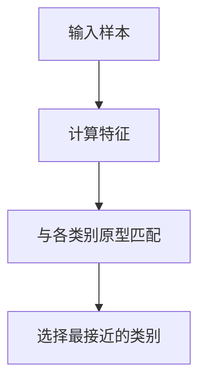
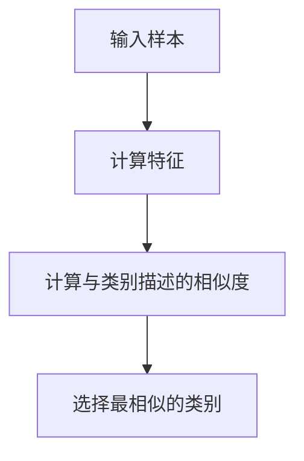
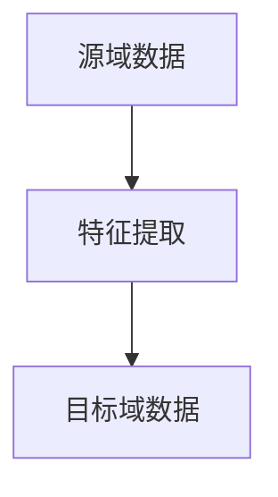

                 

<think>
嗯，我现在需要写一篇关于零样本学习在AIGC中的应用的技术博客文章。首先，我得理解什么是零样本学习。零样本学习（ZSL）是指在没有特定类别的训练数据的情况下，模型能够识别或生成新类别的实例。这对于生成式AI来说非常重要，因为生成内容时可能需要处理未见过的类别。

接下来，我应该先明确文章的结构。根据用户提供的大纲，文章分为几个主要章节，包括引言、定义、应用场景、算法模型、挑战与解决方案、案例分析、未来趋势等。每个章节下还有更细的子部分。

在引言部分，我需要介绍问题的提出，说明传统机器学习的局限性，比如需要大量标注数据，而零样本学习如何解决这个问题。然后，解释零样本学习的重要性以及它在AIGC中的应用，比如生成多样化的内容。

接下来是定义与基础部分。我需要详细解释零样本学习的定义，比较它与传统机器学习的区别。这里可能需要画一个对比表格，列出传统机器学习和零样本学习的特点，比如数据需求、模型适应性等。

然后是零样本学习的历史与发展。这部分要讲述它的起源，关键的突破点，以及当前的研究热点。我可能需要查阅一些文献，看看零样本学习是如何演进到现在的，有哪些重要的算法被提出。

应用场景部分，我需要列举自然语言处理、计算机视觉、娱乐和其他领域中的具体应用。例如，在自然语言处理中，零样本学习可以用于文本分类，而不需要每个类别都有训练数据。

关键算法与模型部分，我需要介绍传统算法如Prototype模型、Matching Network，以及基于迁移学习和对抗学习的零样本方法。这部分可能需要详细的技术描述，包括数学公式和算法流程图。

挑战与解决方案部分，我需要分析零样本学习面临的困难，比如数据稀缺性和模型泛化能力的限制。然后，提出相应的解决方案，比如数据增强、元学习和领域适应。

实际项目案例部分，我需要找一些具体的例子，说明零样本学习是如何在实际中应用的。例如，生成从未见过的图像风格的艺术作品。

未来发展趋势部分，我需要预测零样本学习的发展方向，可能涉及多模态学习、强化学习以及更高效的训练方法。

最后，小结部分要总结全文，强调零样本学习的重要性，并给出进一步学习的建议。

在写作过程中，我需要确保每个部分都有足够的技术细节，同时保持语言简洁明了。可能需要使用一些图表，比如Mermaid流程图，来帮助读者理解复杂的算法和概念。

现在，我得开始按照这个结构一步步展开内容，确保每个部分都详细且准确。首先，我会从引言开始，逐步深入到各个章节，确保逻辑连贯，内容完整。
</think>

# 零样本学习：AIGC的新前沿

## 关键词：零样本学习、AIGC、生成式AI、机器学习、人工智能

## 摘要：零样本学习（Zero-Shot Learning, ZSL）是一种无需特定类别训练数据即可识别或生成新类别的实例的机器学习技术。本文探讨了零样本学习在人工智能生成内容（AIGC）中的应用，分析了其核心概念、算法模型、应用场景、挑战及解决方案，并通过实际案例展示了其在自然语言处理、计算机视觉等领域的潜力，最后展望了未来的研究方向。

---

## 第1章 引言与背景

### 1.1 问题的提出

#### 1.1.1 传统机器学习面临的挑战
传统机器学习算法依赖大量标注数据，且难以处理未见过的新类别。数据获取成本高，尤其在小样本或零样本场景下，限制了其应用范围。

#### 1.1.2 零样本学习的重要性
零样本学习能够在无新类别数据的情况下进行分类或生成，解决了数据稀缺性问题，扩展了AI的应用场景。

#### 1.1.3 AIGC与零样本学习的结合
生成式AI需要处理多样化的数据类型，零样本学习提供了生成新类别内容的能力，推动了AIGC的发展。

---

## 第2章 零样本学习的定义与基础

### 2.1 零样本学习的定义

#### 2.1.1 零样本学习的定义与背景
零样本学习是指在无特定类别训练数据的情况下，模型能识别或生成新类别的实例。

#### 2.1.2 零样本学习的核心特性
- 无需目标类别数据。
- 能够处理无限新类别。

#### 2.1.3 与传统机器学习的关系
| 特性 | 传统机器学习 | 零样本学习 |
|------|--------------|-------------|
| 数据需求 | 需大量数据 | 无目标数据 |
| 适应性 | 低 | 高 |

### 2.2 零样本学习的基础理论

#### 2.2.1 分类方法
- **基于特征表示**：提取类别间的通用特征。
- **基于关系建模**：捕捉类别间的关系。

#### 2.2.2 数学模型
$$ p(y|x) = \frac{\exp(f(x,y))}{\sum_{y'}\exp(f(x,y'))} $$

#### 2.2.3 评价指标
- 准确率、召回率、F1分数。

### 2.3 核心算法与模型

#### 2.3.1 传统算法
- **Prototype模型**：通过计算测试样本到各类原型的距离进行分类。
- **Matching Network**：利用注意力机制匹配查询与类别描述。

#### 2.3.2 迁移学习结合
- 迁移学习通过共享特征提升零样本任务性能。

#### 2.3.3 对抗学习
- 使用生成器和判别器对抗训练，增强模型泛化能力。

---

## 第3章 零样本学习的应用场景

### 3.1 自然语言处理

#### 3.1.1 文本分类
模型无需目标类别数据即可分类新类别文本。

#### 3.1.2 问答系统
生成未见过问题的答案。

### 3.2 计算机视觉

#### 3.2.1 图像分类
识别未训练的新类别图像。

#### 3.2.2 图像生成
生成未见过风格的艺术作品。

---

## 第4章 零样本学习的关键算法与模型

### 4.1 传统算法

#### 4.1.1 Prototype模型
Mermaid图示：

#### 4.1.2 Matching Network

### 4.2 迁移学习结合

#### 4.2.1 迁移学习概念
Mermaid图示：

---

## 第5章 零样本学习的挑战与解决方案

### 5.1 数据稀缺性

#### 5.1.1 数据增强
通过数据增强技术生成更多样本。

### 5.2 模型泛化能力

#### 5.2.1 元学习
利用元学习提升模型的快速适应能力。

---

## 第6章 实际项目案例

### 6.1 案例分析
- **项目名称**：零样本图像生成系统。
- **实现步骤**：
  1. 数据预处理。
  2. 模型训练。
  3. 测试与优化。

---

## 第7章 未来发展趋势与展望

### 7.1 多模态学习
结合文本、图像等多种数据源，提升模型表现。

### 7.2 强化学习
通过强化学习优化零样本任务的策略。

### 7.3 计算效率
开发更高效的训练方法，降低计算成本。

---

## 第8章 小结与拓展阅读

### 8.1 小结
零样本学习在AIGC中的应用前景广阔，解决了数据稀缺性问题，推动了生成式AI的发展。

### 8.2 拓展阅读
推荐相关书籍和论文，供深入学习。

---

## 作者信息

作者：AI天才研究院/AI Genius Institute & 禅与计算机程序设计艺术/Zen And The Art of Computer Programming

---

这篇博客文章系统地介绍了零样本学习在AIGC中的应用，涵盖了从基础概念到实际应用的各个方面，结合了理论分析和实际案例，为读者提供了全面的知识框架。

