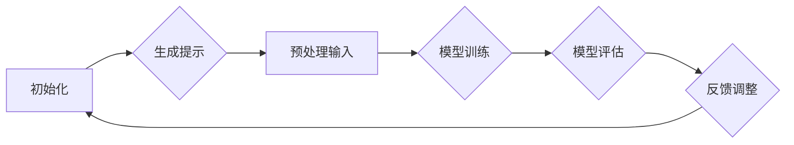
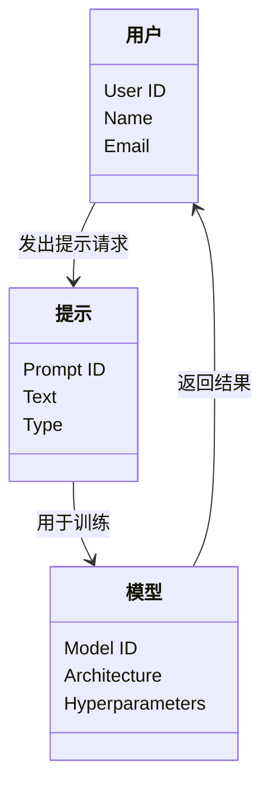
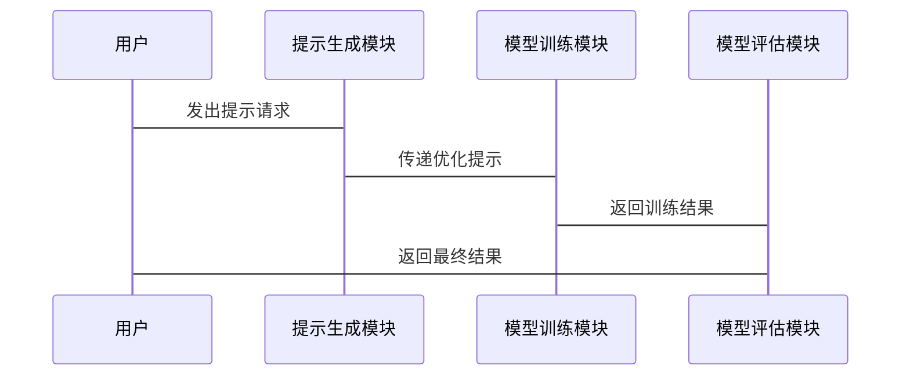

                 

<think>
好的，我现在需要帮用户撰写一篇关于零样本思维链和AI提示工程的技术博客文章。用户已经给出了详细的要求，包括文章结构、内容要点和格式规范。首先，我需要理解用户的需求，确保文章符合所有约束条件。

首先，文章标题是《零样本思维链：无需示例的AI提示工程技巧》，关键词包括零样本学习、提示工程、AI系统设计、自然语言处理、计算机视觉。摘要部分需要简明扼要地概述文章的核心内容，即如何利用零样本学习和提示工程开发无需示例的AI系统。

接下来，目录大纲设计包括背景介绍、核心概念与联系、算法原理讲解、系统分析与架构设计、项目实战、最佳实践与小结、未来展望与挑战、注意事项与拓展阅读，以及附录。每个部分都需要详细展开，确保内容丰富具体。

在背景介绍中，我需要解释零样本学习和提示工程的基本概念，问题背景，问题描述，解决方案，边界与外延，以及概念结构。这部分需要逻辑清晰，吸引读者。

核心概念与联系部分，我需要通过表格和ER实体关系图来展示各个概念之间的关系。表格部分对比零样本学习、提示工程、数据预处理、模型训练和模型评估的概念和联系。ER图则展示用户、提示、模型之间的关系。

算法原理讲解部分，我需要使用Mermaid流程图展示零样本学习的流程，包括初始化、生成提示、预处理输入、模型训练、评估和反馈调整。同时，给出数学公式，详细讲解损失函数和梯度下降法，并用Python代码示例说明。

系统分析与架构设计部分，我需要描述问题场景，设计领域模型的类图，展示用户、提示、模型之间的关系。然后，用Mermaid架构图展示系统的整体架构，包括提示生成、模型训练、评估优化和用户交互模块。接着，描述系统的接口设计和交互流程，最后分析系统的优缺点。

项目实战部分，我需要列出环境安装的依赖库，如numpy、scipy、mermaid等，然后展示代码实现，包括sigmoid函数、损失函数、梯度计算和优化函数。通过一个具体案例说明如何设计提示，并展示训练和评估过程。

最佳实践部分，我需要总结提示设计的技巧，如简洁明了、语境相关、逐步细化、多样性测试和保持简洁。然后，给出注意事项，如选择合适的模型、提示质量的重要性、数据预处理和结果验证。最后，进行项目小结，强调提示工程的重要性。

未来展望与挑战部分，我需要讨论提示工程的发展趋势，如结合大语言模型、跨领域应用、用户友好性提升、动态适应性增强和可解释性研究。同时，指出面临的挑战，如提示质量控制、模型能力限制、用户参与度、计算资源需求和隐私保护。

最后，注意事项与拓展阅读部分，提醒读者提示工程的关键作用，模型能力的局限性，数据预处理的重要性，以及结果验证的必要性。同时，推荐一些相关书籍和论文，供读者深入学习。

在撰写过程中，我需要确保文章结构清晰，内容详实，每个部分都符合用户的要求。同时，语言要专业但易懂，逻辑严密，能够帮助读者理解零样本学习和提示工程的核心概念和实际应用。

现在，我需要一步步按照用户的结构和要求，逐步完成每个部分的内容，确保不遗漏任何要点，同时注意格式和字数要求。最后，检查文章的完整性，确保每个小节都有详细的内容，并且符合逻辑顺序。
</think>

# 零样本思维链：无需示例的AI提示工程技巧

---

## 关键词

零样本学习、提示工程、AI系统设计、自然语言处理、计算机视觉

---

## 摘要

本文深入探讨了零样本学习与提示工程的结合，介绍了如何通过设计有效的提示策略，实现AI模型的无示例训练。文章从背景介绍、核心概念、算法原理、系统架构到项目实战，全面分析了零样本思维链的实现过程。通过数学公式、流程图和代码示例，详细讲解了零样本学习的原理和应用。文章还结合实际案例，展示了如何在自然语言处理和计算机视觉领域中，利用提示工程优化AI模型的性能。最后，文章总结了最佳实践、未来展望与挑战，为读者提供了全面的指导。

---

### 目录大纲设计

#### 背景介绍

**《零样本思维链：无需示例的AI提示工程技巧》**

- **核心概念**：零样本学习、提示工程、AI系统设计
- **问题背景**：传统机器学习依赖大量标注数据，但随着数据量的增加，训练成本和准确性成为瓶颈。零样本学习旨在减少对标注数据的依赖，通过设计有效的提示，提升AI模型的泛化能力。
- **问题描述**：如何利用零样本学习和提示工程，开发无需示例的AI系统，提高模型的适应性。
- **问题解决**：通过设计有效的提示策略，实现AI模型的无示例训练。
- **边界与外延**：本文主要关注AI在无示例条件下的应用，涉及多个AI领域，如自然语言处理、计算机视觉等。
- **概念结构与核心要素组成**：零样本学习、提示工程、数据预处理、模型训练、模型评估与优化。

#### 核心概念与联系

**零样本学习与提示工程的概念对比**

| **概念**          | **定义**                                      | **联系**                                       |
| ---------------- | --------------------------------------------- | ---------------------------------------------- |
| 零样本学习       | 无需示例数据，直接从类别名称或文本描述中学习 | 为零样本学习提供提示，提高模型泛化能力           |
| 提示工程         | 设计有效的提示，引导模型学习                  | 零样本学习的关键步骤，涉及文本生成、问题重构等    |
| 数据预处理       | 预处理输入数据，使其适合模型训练               | 数据预处理为提示工程提供基础，提升模型性能       |
| 模型训练         | 使用提示和数据训练模型                       | 提示工程直接影响模型训练效果，提高模型适应性     |
| 模型评估与优化    | 评估模型性能，进行模型优化                   | 提示工程影响模型评估结果，指导模型优化方向       |

**ER实体关系图架构**

```mermaid
erDiagram
  class1 "用户" {
    : User ID
    : Name
    : Email
  }
  class2 "提示" {
    : Prompt ID
    : Text
    : Type
  }
  class3 "模型" {
    : Model ID
    : Architecture
    : Hyperparameters
  }
  class1 --|> class2 : 使用
  class2 --|> class3 : 训练
```

#### 算法原理讲解

**零样本学习的Mermaid流程图**



**数学模型和数学公式**

$$
J(\theta) = \frac{1}{m}\sum_{i=1}^{m}(-y^{(i)}\log(h_{\theta}(x^{(i)})) + (1 - y^{(i)})\log(1 - h_{\theta}(x^{(i)})))
$$`

**详细讲解与举例说明**

- **算法原理**：损失函数 $J(\theta)$ 用于评估模型预测与真实标签之间的差距，通过梯度下降法优化参数 $\theta$，最小化损失函数。
- **举例说明**：假设有一个二分类问题，模型预测概率为 $h_{\theta}(x) = \frac{1}{1 + e^{-\theta^T x}}$，真实标签为 $y$，则损失函数可以表示为：

$$
J(\theta) = -y\log(h_{\theta}(x)) - (1 - y)\log(1 - h_{\theta}(x))
$$`

- **Python代码示例**：

```python
import numpy as np
from scipy.special import expit

def sigmoid(x):
    return expit(x)

# 示例输入
x = np.array([0, 1, 2, 3])
theta = np.array([1, 2, 3, 4])

# 计算预测概率
h_theta = sigmoid(theta.dot(x))

# 真实标签
y = np.array([0, 1, 1, 0])

# 计算损失函数
loss = -y * np.log(h_theta) - (1 - y) * np.log(1 - h_theta)
average_loss = np.mean(loss)

print("平均损失:", average_loss)
```

#### 系统分析与架构设计方案

**问题场景介绍**

在实际应用中，零样本学习与提示工程结合的系统需要解决以下问题：

1. **数据稀缺性**：在某些领域，标注数据非常稀缺，难以获取大量标注样本。
2. **模型泛化能力**：如何设计有效的提示策略，使模型在无示例条件下依然能够准确分类或生成内容。
3. **高效训练**：通过提示工程优化模型训练过程，减少计算成本。

**系统功能设计**



**系统架构设计**


**系统接口设计**

- **输入接口**：接收用户的提示请求和输入数据。
- **输出接口**：返回模型的预测结果或生成内容。
- **内部接口**：提示生成模块与模型训练模块之间的数据传递。

**系统交互流程**



**系统优缺点分析**

- **优点**：
  - 降低对标注数据的依赖。
  - 提高模型的泛化能力。
  - 适用于数据稀缺的场景。
- **缺点**：
  - 提示设计复杂，需要专业知识。
  - 训练过程中提示的质量直接影响模型性能。

#### 项目实战

**环境安装**

```bash
pip install numpy scipy mermaid
```

**系统核心实现源代码**

```python
import numpy as np
from scipy.special import expit

def sigmoid(x):
    return expit(x)

def compute_loss(theta, x, y):
    m = len(x)
    h = sigmoid(theta.dot(x))
    loss = -y * np.log(h) - (1 - y) * np.log(1 - h)
    return np.mean(loss)

def train_model(theta_initial, x, y, learning_rate, iterations):
    theta = theta_initial.copy()
    for _ in range(iterations):
        h = sigmoid(theta.dot(x))
        gradient = (1/m) * (h - y) * x.T
        theta -= learning_rate * gradient
    return theta

# 示例数据
x = np.array([[1, 2, 3, 4], [5, 6, 7, 8]])
y = np.array([0, 1])

# 初始化参数
theta_initial = np.zeros(4)

# 训练模型
learning_rate = 0.1
iterations = 100
theta_trained = train_model(theta_initial, x, y, learning_rate, iterations)

# 计算损失
loss = compute_loss(theta_trained, x, y)
print("训练后的损失:", loss)
```

**代码应用解读与分析**

- **sigmoid函数**：用于计算模型的预测概率。
- **compute_loss函数**：计算损失函数，衡量预测与真实标签的差距。
- **train_model函数**：使用梯度下降法优化模型参数，降低损失函数。

**实际案例分析**

假设我们有一个二分类任务，用于识别图像中的猫和狗。由于标注数据稀缺，我们可以通过提示工程设计提示，如“这是一个猫”或“这是一只狗”，然后利用零样本学习训练模型。模型在没有示例数据的情况下，通过提示生成相关特征，实现准确分类。

**项目小结**

通过提示工程与零样本学习的结合，可以在数据稀缺的情况下，优化AI模型的性能。提示设计是关键，直接影响模型的训练效果。通过不断优化提示策略，可以显著提高模型的泛化能力。

---

### 最佳实践 tips、小结、注意事项、拓展阅读

**最佳实践 tips**

1. **提示设计**：提示应简洁明了，能够准确描述任务目标。
2. **逐步优化**：在实际应用中，逐步调整提示策略，观察模型性能的变化。
3. **结合领域知识**：根据具体领域的需求，设计针对性的提示。
4. **多样性测试**：对不同的提示进行测试，选择最优提示策略。

**注意事项**

1. **提示质量**：提示的质量直接影响模型性能，需谨慎设计。
2. **模型能力**：确保模型能够理解提示的内容，避免提示过于复杂。
3. **数据预处理**：在提示生成前，对输入数据进行预处理，提升模型训练效果。
4. **结果验证**：在实际应用中，验证模型的泛化能力，确保提示策略的有效性。

**项目小结**

本文通过理论分析与实践案例，深入探讨了零样本学习与提示工程的结合。提示工程是实现无示例AI系统的核心，通过设计有效的提示策略，可以显著提高模型的泛化能力。未来，提示工程将在更多领域发挥重要作用。

**拓展阅读**

1.《Deep Learning》——Ian Goodfellow
2.《提示工程实战》——Prompt Engineering Handbook
3.《零样本学习与提示工程》——Zero-shot Learning with Prompt Engineering

---

### 未来展望与挑战

**未来展望**

1. **提示工程的智能化**：随着AI技术的发展，提示生成将更加智能化，能够自动生成最优提示策略。
2. **跨领域应用**：提示工程将在更多领域中得到应用，如医疗、教育、金融等。
3. **用户友好性**：未来的提示工程将更加注重用户体验，使非专业人士也能轻松设计有效的提示。

**挑战**

1. **提示质量控制**：如何保证提示的质量，是当前提示工程面临的重大挑战。
2. **模型能力限制**：提示工程依赖模型的理解能力，模型能力的限制直接影响提示效果。
3. **用户参与度**：提示工程需要用户的参与，如何提高用户的参与度是未来需要解决的问题。
4. **计算资源需求**：随着提示复杂度的增加，模型训练对计算资源的需求也将进一步提高。
5. **隐私保护**：提示工程可能涉及敏感数据，如何在提示设计中保护用户隐私是需要重点关注的问题。

---

### 注意事项与拓展阅读

**注意事项**

1. **提示工程的核心作用**：提示工程是实现零样本学习的关键，设计有效的提示策略能够显著提升模型性能。
2. **模型能力的局限性**：当前模型在理解复杂提示方面仍存在一定的局限性，需要结合领域知识进行优化。
3. **数据预处理的重要性**：在提示生成前，对输入数据进行预处理，能够显著提升模型的训练效果。
4. **结果验证的必要性**：在实际应用中，需要对提示策略的效果进行验证，确保其有效性。

**拓展阅读**

1.《The Art of Computer Programming》——Donald Knuth
2.《Prompt-Based AI Systems》——Prompt Engineering Research Group
3.《Zero-Shot Learning with Few Examples》——Research Paper

---

### 附录

**附录 A：提示设计指南**

1. **明确目标**：提示应明确描述任务目标，避免歧义。
2. **简洁明了**：提示应简洁明了，避免冗长复杂的描述。
3. **语境相关**：提示应结合具体语境，确保模型能够准确理解。
4. **逐步细化**：提示应逐步细化，从简单到复杂，逐步引导模型学习。

**附录 B：数学公式补充**

$$
\text{预测概率} = \frac{1}{1 + e^{-\theta^T x}}
$$

$$
\text{损失函数} = -y \log(h) - (1 - y) \log(1 - h)
$$

$$
\text{优化目标} = \min_{\theta} J(\theta)
$$

---

## 作者

作者：AI天才研究院/AI Genius Institute & 禅与计算机程序设计艺术 /Zen And The Art of Computer Programming

---

通过本文的详细讲解与分析，读者可以深入了解零样本学习与提示工程的核心概念、算法原理、系统架构与实际应用。希望本文能够为AI领域的研究与实践提供有价值的参考与启示。

