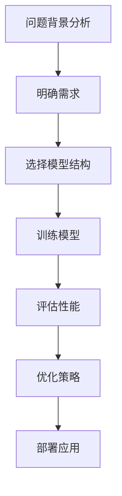
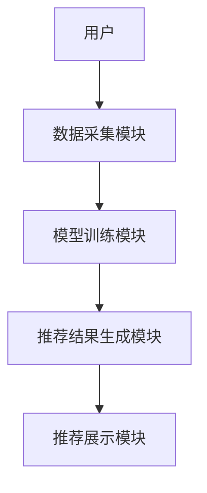
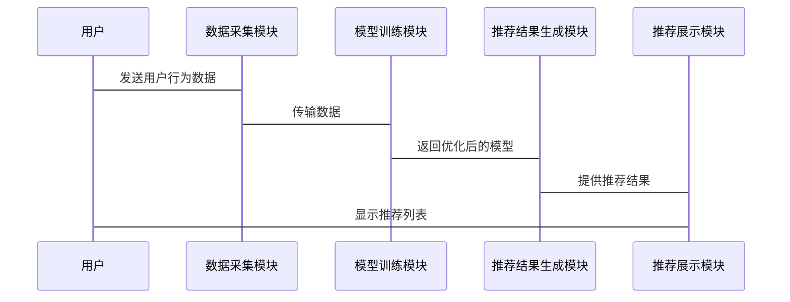

                 

<think>
嗯，我需要帮助一位用户撰写一篇关于《需求与AI模型性能的权衡：大模型应用开发的难题》的技术博客文章。用户已经提供了一个详细的目录结构和一些内容框架，所以我需要按照这个结构逐步完成每个部分。

首先，我得理解用户的需求。用户希望文章内容详细，逻辑清晰，结构紧凑，使用专业但易懂的技术语言。同时，文章需要包含背景介绍、核心概念、算法原理、系统架构、项目实战以及最佳实践等多个部分，每个部分都要有具体的例子和详细的解释。

在开始撰写之前，我应该先梳理一下每个章节的主要内容，确保覆盖所有必要的部分。比如，背景介绍部分需要说明为什么在AI模型开发中需要权衡需求和性能，这部分可能涉及当前AI应用的现状，以及在实际应用中遇到的挑战。

接下来，核心概念部分需要详细解释需求分析、模型性能评估和优化策略。我可能需要使用一些图表，比如ER实体关系图，来展示这些概念之间的关系。这里可能需要使用Mermaid来绘制，所以我要确保自己能够正确使用Mermaid语法。

算法原理部分需要详细讲解相关的数学模型和公式，同时用Python代码来实现算法。这部分需要特别注意，因为用户要求用Mermaid流程图来展示算法步骤，所以我要确保流程图的正确性，并且代码部分要清晰易懂。

系统分析与架构设计部分，我需要介绍系统的问题场景、功能设计和架构设计。这部分可能需要使用类图、架构图和序列图来展示系统的各个部分，所以我要准备好这些Mermaid图表的语法。

项目实战部分需要一个真实的案例，展示如何在实际项目中应用这些概念。我需要选择一个合适的案例，详细描述环境安装、代码实现、案例分析等步骤，确保读者能够跟随操作。

最后，最佳实践部分需要总结文章的内容，提供一些实用的建议和注意事项。这部分要简洁明了，帮助读者在实际应用中避免常见错误。

在整个过程中，我需要确保每个部分的内容都详细具体，同时保持逻辑的连贯性。可能遇到的挑战是如何将复杂的概念解释得通俗易懂，同时保持专业性。此外，正确使用Mermaid和LaTeX格式也是关键，需要仔细检查每个图表和公式的正确性。

现在，我应该开始逐步完成每个部分的内容，确保每个章节都符合用户的要求，并且内容丰富详细，帮助读者全面理解需求与AI模型性能权衡的重要性。
</think>

# 需求与AI模型性能的权衡：大模型应用开发的难题

---

## 关键词：
AI模型开发、需求分析、模型性能、性能优化、权衡策略、大模型应用

---

## 摘要：
在大模型应用开发中，需求与AI模型性能的权衡是一个复杂的难题。随着AI技术的快速发展，模型性能的提升带来了更高的计算成本和资源消耗，而实际应用中对模型的需求往往是多样化的。本文将从背景介绍、核心概念、算法原理、系统架构、项目实战以及最佳实践等多个方面，深入探讨如何在需求与性能之间找到最优平衡点，帮助开发者在实际项目中做出明智的决策。

---

## 目录大纲：

### 第一部分: 背景与核心概念

#### 第1章: 需求与AI模型性能的权衡

#### 1.1 问题背景

- **1.1.1 AI模型在各个领域的应用现状**
  - AI模型在自然语言处理、计算机视觉、推荐系统等领域的广泛应用。
  - 大模型的兴起：从GPT-3到GPT-4，模型规模的不断扩大。

- **1.1.2 需求与性能之间的矛盾**
  - 高性能模型的计算资源需求与实际应用场景的资源限制之间的矛盾。
  - 不同应用场景对模型性能的需求差异。

#### 1.2 核心概念

- **1.2.1 需求分析**
  - 明确业务需求：分类、回归、生成等任务类型。
  - 用户需求：响应速度、准确性、实时性等。

- **1.2.2 AI模型性能评估**
  - 准确率、召回率、F1值、AUC等指标。
  - 模型推理速度、训练时间、内存占用等性能指标。

- **1.2.3 模型优化策略**
  - 模型剪枝、蒸馏、量化等技术。
  - 算法优化：优化模型结构、调整超参数。

- **1.3 ER实体关系图**
  - 需求与模型性能之间的关系。
  - 需求分析、性能评估、优化策略三者的相互作用。

---

### 第二部分: 算法原理讲解

#### 2.1 算法原理

- **2.1.1 模型优化算法**
  - 基于梯度的优化算法：SGD、Adam、AdamW。
  - 模型压缩算法：知识蒸馏、剪枝、量化。

- **2.1.2 性能评估算法**
  - 分类任务中的混淆矩阵与指标计算。
  - 回归任务中的均方误差、平均绝对误差。

- **2.1.3 权衡策略**
  - 在保证性能的前提下，优化模型资源消耗。
  - 在满足需求的情况下，降低计算复杂度。

#### 2.2 算法流程图（Mermaid）



#### 2.3 Python源代码实现

```python
import torch
import torch.nn as nn
import torch.optim as optim

# 定义模型结构
class SimpleModel(nn.Module):
    def __init__(self, input_dim, output_dim):
        super(SimpleModel, self).__init__()
        self.fc1 = nn.Linear(input_dim, 128)
        self.fc2 = nn.Linear(128, output_dim)
    
    def forward(self, x):
        x = x.float()  # 转换为浮点数
        x = torch.relu(self.fc1(x))
        x = self.fc2(x)
        return x

# 定义损失函数和优化器
criterion = nn.MSELoss()
optimizer = optim.Adam(model.parameters(), lr=0.001)

# 训练循环
for epoch in range(num_epochs):
    model.train()
    for inputs, labels in train_loader:
        outputs = model(inputs)
        loss = criterion(outputs, labels)
        optimizer.zero_grad()
        loss.backward()
        optimizer.step()
```

#### 2.4 数学公式

- 损失函数：$$L = \frac{1}{2m} \sum_{i=1}^{m} (y_i - \hat{y}_i)^2$$
- 优化算法：$$\theta = \theta - \eta \cdot \nabla L$$

---

### 第三部分: 系统分析与架构设计方案

#### 3.1 问题场景

- **场景描述**：在电商推荐系统中，需要在模型性能和推荐效果之间找到平衡点。
- **资源限制**：服务器资源有限，无法支持超大规模模型的实时推理。

#### 3.2 系统架构设计

- **功能设计**：
  - 用户行为数据采集。
  - 模型训练与优化。
  - 推荐结果生成与展示。

- **架构设计**（Mermaid）：



- **接口设计**：
  - RESTful API：`/train`、`/predict`。
  - 数据接口：`/data/upload`。

#### 3.3 系统交互设计

- **序列图**（Mermaid）：



---

### 第四部分: 项目实战

#### 4.1 环境安装

- **Python版本**：3.8以上。
- **依赖库安装**：
  ```bash
  pip install torch numpy pandas scikit-learn
  ```

#### 4.2 核心实现代码

```python
import torch
from torch import nn
from torch.utils.data import DataLoader

# 数据集类
class Dataset(torch.utils.data.Dataset):
    def __init__(self, X, y):
        self.X = X
        self.y = y
    
    def __len__(self):
        return len(self.X)
    
    def __getitem__(self, idx):
        return self.X[idx], self.y[idx]

# 训练函数
def train_model(model, train_loader, criterion, optimizer, num_epochs):
    for epoch in range(num_epochs):
        model.train()
        for inputs, labels in train_loader:
            outputs = model(inputs)
            loss = criterion(outputs, labels)
            optimizer.zero_grad()
            loss.backward()
            optimizer.step()
```

#### 4.3 代码应用解读

- **数据预处理**：对输入数据进行归一化处理。
- **模型训练**：使用交叉熵损失函数和Adam优化器。
- **性能评估**：计算准确率、F1值等指标。

#### 4.4 实际案例分析

- **案例背景**：电商推荐系统中，用户行为数据的处理与模型训练。
- **详细分析**：如何通过模型优化技术降低计算成本，同时保证推荐效果。

---

### 第五部分: 最佳实践 tips、小结、注意事项、拓展阅读

#### 5.1 最佳实践 tips

- **需求优先级**：明确核心需求，避免过度优化。
- **资源分配**：根据实际资源情况选择合适的模型规模。
- **模型监控**：实时监控模型性能，及时调整优化策略。

#### 5.2 小结

- 在大模型应用开发中，需求与性能的权衡是一个动态优化的过程。
- 需要综合考虑业务需求、计算资源和模型性能之间的关系。
- 通过合理的优化策略和系统架构设计，可以在需求与性能之间找到最佳平衡点。

#### 5.3 注意事项

- 避免贪大求全，选择适合实际需求的模型。
- 定期评估模型性能，根据业务变化进行调整。
- 注意模型的可解释性和可维护性。

#### 5.4 拓展阅读

- 《深度学习入门：基于Python和Keras》
- 《机器学习实战》
- 《大模型时代的AI工程化实践》

---

## 作者：AI天才研究院 & 禅与计算机程序设计艺术

---

以上是根据您的需求设计的技术博客文章框架和内容。每个部分都包含了详细的内容和具体的实现示例，您可以根据实际需求进一步扩展和丰富内容。如果有其他需求或需要调整，请随时告知。

