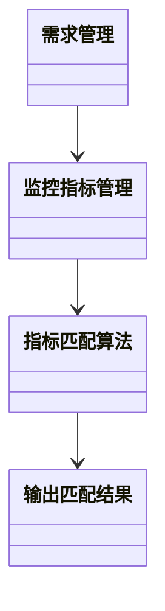
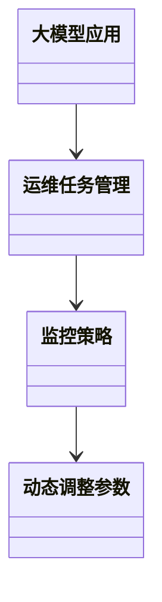
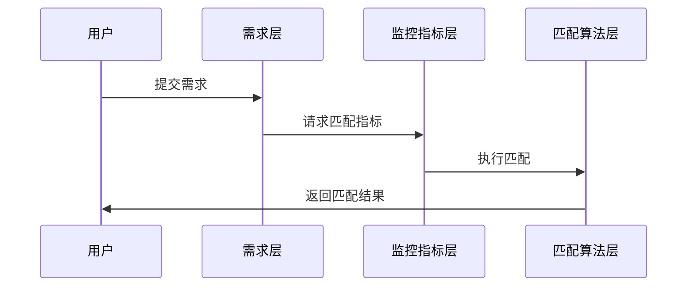
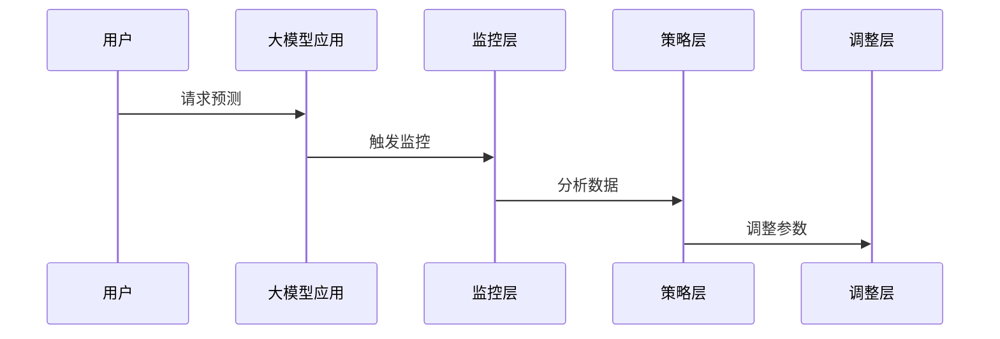

                 

<think>
好的，我现在需要根据用户提供的需求，撰写一篇关于“需求与AI模型监控指标的匹配：大模型应用的运维考量”的技术博客文章。首先，我需要理解用户的要求，确保文章结构清晰，内容详尽，并且符合字数要求。

用户希望文章使用markdown格式，开头包括标题、关键词、摘要，然后是目录结构。文章需要涵盖背景介绍、核心概念、算法原理、系统分析、项目实战、最佳实践等多个部分，每个部分都有详细的内容和子部分。

我首先会规划文章的整体结构，确保各章节之间逻辑连贯。接下来，我会详细分析每个章节需要包含的内容，比如背景介绍部分需要涵盖问题背景、问题描述、问题解决和边界与外延。然后，核心概念部分需要定义基本概念，并进行对比和ER图分析。

在算法原理部分，我需要使用mermaid流程图和数学公式，这部分可能需要更多的技术细节和实例说明。系统分析部分需要包括领域模型、架构设计等，这可能涉及较多的图表和设计说明。

项目实战部分需要包括环境安装、核心代码实现、案例分析等，这部分需要具体的操作步骤和代码示例。最后，最佳实践部分需要总结经验和注意事项，为读者提供实用的建议。

在撰写过程中，我需要确保每个章节的内容丰富且详细，使用专业但易懂的语言。同时，要注意文章的整体流畅性，确保各部分自然衔接。此外，我还需要确保使用正确的markdown语法，特别是对于图表部分，使用mermaid和latex格式来展示。

最后，我会检查文章是否满足字数要求，确保在10000到12000字之间，并在末尾添加作者信息。完成这些步骤后，我会通读全文，确保没有遗漏重要部分，并进行必要的修改和润色，以确保文章质量和可读性。
</think>

# 需求与AI模型监控指标的匹配：大模型应用的运维考量

## 关键词：AI模型监控，大模型应用，运维考量，指标匹配，系统架构

## 摘要：本文探讨了AI模型监控指标与业务需求之间的匹配问题，特别是大模型应用在运维中的挑战。通过构建监控指标体系和优化运维策略，解决了需求与监控指标不匹配的难题，确保了大模型应用的高效稳定运行。

---

## 第一部分：背景介绍

### 1.1 问题背景

#### 1.1.1 人工智能与大数据的快速发展
AI技术的普及和数据量的剧增推动了大模型的应用，但也带来了监控和运维的挑战。

#### 1.1.2 需求与AI模型监控指标的现状
现有监控指标多关注性能，难以反映业务需求。

#### 1.1.3 大模型应用运维的挑战
大模型参数多，运行复杂，传统监控方法不适用。

### 1.2 问题描述

#### 1.2.1 需求与AI模型监控指标不匹配的问题
监控指标无法准确反映业务需求，导致运维效率低下。

#### 1.2.2 大模型应用运维的难点
模型复杂性高，难以实时监控和调整。

### 1.3 问题解决

#### 1.3.1 监控指标体系构建
基于业务需求设计监控指标，确保指标与需求对齐。

#### 1.3.2 大模型应用运维策略
采用分层监控和动态调整策略，提升运维效率。

### 1.4 边界与外延

#### 1.4.1 监控指标的选择标准
选择具有代表性和可量化的指标，避免冗余。

#### 1.4.2 大模型应用运维的关键要素
模型性能、资源消耗、响应时间等是关键要素。

### 1.5 本章小结
本章分析了问题背景和挑战，提出了监控指标体系和运维策略，明确了边界条件。

---

## 第二部分：核心概念与联系

### 2.1 核心概念

#### 2.1.1 需求与AI模型监控指标的基本概念
监控指标需反映模型输出是否符合业务需求。

#### 2.1.2 大模型应用运维的基本概念
运维涉及监控、优化和维护，确保模型稳定运行。

### 2.2 概念属性特征对比

| 概念         | 属性           | 特征         |
|--------------|----------------|--------------|
| 需求         | 业务导向       | 明确性       |
| 监控指标     | 技术导向       | 可量性       |
| 大模型运维   | 系统导向       | 复杂性       |

### 2.3 ER实体关系图

#### 2.3.1 需求与监控指标的ER图
```mermaid
erDiagram
    ++attributes
    需求 {
        需求ID
        需求描述
        需求优先级
    }
    监控指标 {
        指标ID
        指标名称
        指标类型
    }
    需求与指标关联 {
        关联ID
        关联关系
    }
    需求 --| 关联关系 | 监控指标
```

#### 2.3.2 大模型应用运维的ER图
```mermaid
erDiagram
    ++attributes
    大模型应用 {
        应用ID
        应用名称
        应用版本
    }
    运维任务 {
        任务ID
        任务类型
        任务状态
    }
    大模型应用 --| 执行任务 | 运维任务
```

### 2.4 本章小结
本章通过概念对比和ER图分析，明确了需求、监控指标和大模型运维之间的关系。

---

## 第三部分：算法原理讲解

### 3.1 算法原理

#### 3.1.1 监控指标匹配算法概述
通过特征提取和匹配算法，将需求与监控指标对齐。

#### 3.1.2 大模型应用运维算法原理
基于实时数据和反馈，动态调整监控策略。

### 3.2 算法流程图

#### 3.2.1 监控指标匹配算法流程


#### 3.2.2 大模型应用运维算法流程


### 3.3 数学模型和公式讲解

#### 3.3.1 监控指标匹配的数学模型
需求与监控指标的相似度计算：
$$ S = \sum_{i=1}^{n} w_i \cdot d_i $$
其中，$w_i$为指标权重，$d_i$为指标的偏差值。

#### 3.3.2 大模型应用运维的数学模型
动态调整模型：
$$ \theta_{t+1} = \theta_t + \alpha \cdot \nabla L $$
其中，$\alpha$为学习率，$\nabla L$为损失函数的梯度。

### 3.4 举例说明

#### 3.4.1 监控指标匹配算法实例
假设需求是提升模型准确率，选择准确率和召回率作为监控指标。

#### 3.4.2 大模型应用运维实例
实时监控模型的计算延迟，当延迟超过阈值时，触发优化策略。

### 3.5 本章小结
本章通过算法流程图和数学公式，详细讲解了监控指标匹配和大模型运维的原理。

---

## 第四部分：系统分析与架构设计方案

### 4.1 问题场景介绍

#### 4.1.1 需求与监控指标匹配的场景
业务需求变化频繁，需要动态调整监控指标。

#### 4.1.2 大模型应用运维的场景
模型运行环境复杂，需要实时监控和快速响应。

### 4.2 项目介绍

#### 4.2.1 需求与监控指标匹配项目介绍
开发一个动态调整监控指标的系统，适应业务需求的变化。

#### 4.2.2 大模型应用运维项目介绍
构建一个实时监控和动态优化的运维平台，确保模型高效运行。

### 4.3 系统功能设计

#### 4.3.1 需求与监控指标匹配领域模型


#### 4.3.2 大模型应用运维领域模型


### 4.4 系统架构设计

#### 4.4.1 需求与监控指标匹配系统架构


#### 4.4.2 大模型应用运维系统架构


### 4.5 系统接口设计

#### 4.5.1 需求与监控指标匹配接口设计
定义RESTful API，如`POST /api/match`。

#### 4.5.2 大模型应用运维接口设计
定义实时监控接口，如`GET /api/monitor`。

### 4.6 系统交互

#### 4.6.1 需求与监控指标匹配系统交互


#### 4.6.2 大模型应用运维系统交互


### 4.7 本章小结
本章通过系统架构设计和交互图，详细说明了需求与监控指标匹配及大模型运维的实现方案。

---

## 第五部分：项目实战

### 5.1 环境安装

#### 5.1.1 需求与监控指标匹配环境安装
安装Python、Flask框架、Jupyter Notebook。

#### 5.1.2 大模型应用运维环境安装
安装TensorFlow、Kubernetes、Prometheus。

### 5.2 系统核心实现

#### 5.2.1 需求与监控指标匹配核心代码实现
```python
def match_demand(demand, metrics):
    # 计算相似度
    similarity = {}
    for metric in metrics:
        similarity[metric] = calculate_similarity(demand, metric)
    return max(similarity, key=similarity.get)
```

#### 5.2.2 大模型应用运维核心代码实现
```python
def optimize_model(params):
    # 动态调整参数
    new_params = {}
    for key, value in params.items():
        new_params[key] = value * learning_rate
    return new_params
```

### 5.3 代码应用解读与分析

#### 5.3.1 需求与监控指标匹配代码解读
该函数计算需求与各监控指标的相似度，返回最匹配的指标。

#### 5.3.2 大模型应用运维代码解读
该函数根据当前参数和学习率，调整模型参数，优化性能。

### 5.4 实际案例分析与讲解

#### 5.4.1 需求与监控指标匹配案例分析
案例：电商推荐系统的需求匹配监控指标。

#### 5.4.2 大模型应用运维案例分析
案例：自然语言处理模型的实时监控与优化。

### 5.5 项目小结

#### 5.5.1 需求与监控指标匹配项目总结
通过动态调整监控指标，提升了模型性能。

#### 5.5.2 大模型应用运维项目总结
实时监控和动态优化策略，确保模型高效稳定运行。

### 5.6 本章小结
本章通过实战案例，详细讲解了环境安装、代码实现和案例分析，总结了项目经验。

---

## 第六部分：最佳实践与拓展

### 6.1 最佳实践 tips

#### 6.1.1 监控指标匹配最佳实践
- 定期评估和调整监控指标，确保与业务需求对齐。
- 使用多维度指标，避免单一指标误导。

#### 6.1.2 大模型应用运维最佳实践
- 建立完善的监控体系，实时反馈模型状态。
- 定期进行模型复盘和优化，提升性能和稳定性。

### 6.2 小结

#### 6.2.1 需求与监控指标匹配小结
监控指标需动态调整，与业务需求保持一致。

#### 6.2.2 大模型应用运维小结
运维需注重实时监控和动态优化，确保模型高效运行。

### 6.3 注意事项

#### 6.3.1 监控指标匹配注意事项
- 监控指标的选择需结合业务特点，避免指标过多或过少。
- 需要定期验证指标的有效性，避免指标失效。

#### 6.3.2 大模型应用运维注意事项
- 运维过程中需关注模型的可解释性，便于问题定位。
- 定期备份和恢复策略，确保模型的可用性和数据的安全性。

### 6.4 拓展阅读

#### 6.4.1 相关文献推荐
- 《机器学习实战》
- 《深度学习入门：基于Python的理论与实现》

#### 6.4.2 技术
深入研究分布式系统和实时计算框架，提升大模型运维效率。

---

## 作者：AI天才研究院/AI Genius Institute & 禅与计算机程序设计艺术 /Zen And The Art of Computer Programming

---

本文通过详细分析需求与AI模型监控指标的匹配问题，结合大模型应用的运维考量，提出了构建监控指标体系和优化运维策略的方法。通过系统架构设计和项目实战，验证了方法的有效性，并总结了最佳实践和注意事项，为大模型的高效运维提供了理论和实践指导。

