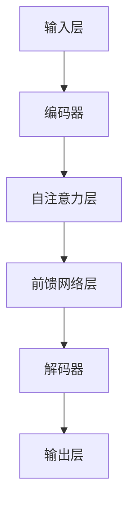
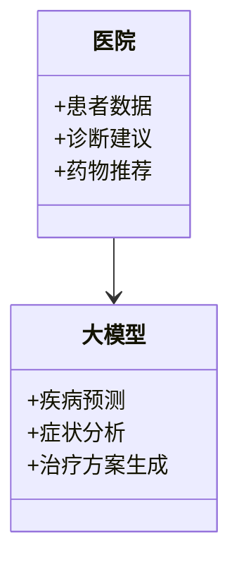
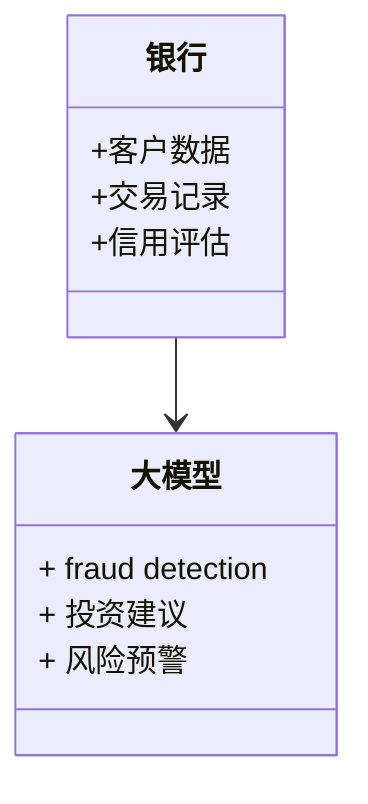
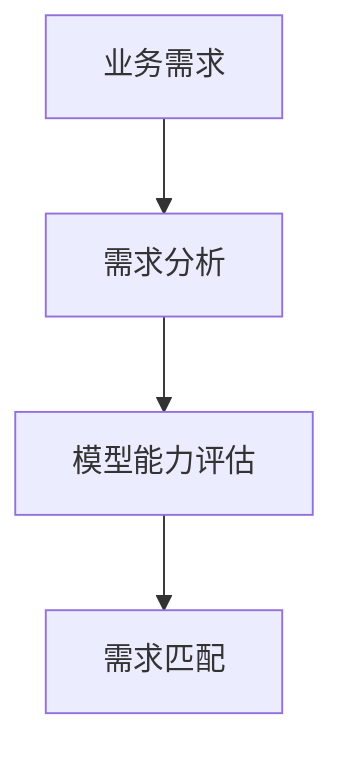
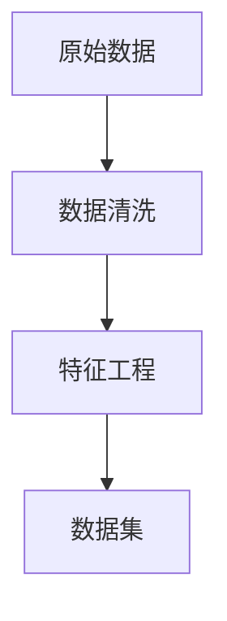
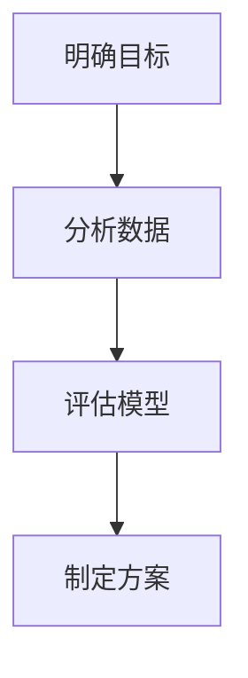
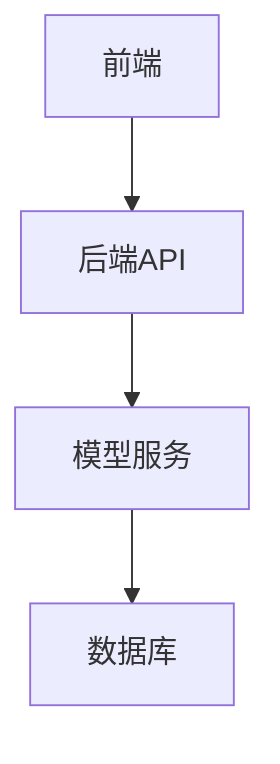

                 

<think>
嗯，用户希望我以《需求与AI能力的匹配：大模型应用开发的挑战》为标题写一篇技术博客。我得先理解这个任务的要求，然后一步步来完成。首先，我需要明确博客的结构，包括引言、基础、应用、挑战、解决方案、实践和结论等部分。每个部分都要有详细的子章节，内容要专业且逻辑清晰。

接下来，我得确定博客的核心关键词，比如人工智能、大模型、需求匹配、应用开发、挑战。这些关键词能帮助读者快速找到内容。摘要部分需要简明扼要地概述文章的核心内容，包括问题背景、挑战和解决方案。

然后，我需要详细规划每个章节的内容。比如，在“AI的基础知识”章节里，要介绍AI的基本概念、机器学习和深度学习的原理，可能还需要用Mermaid图来展示核心算法，比如梯度下降的流程图。同时，我需要确保每个小节都有足够的细节，比如在“数据准备与预处理”中，详细说明数据清洗、特征工程等步骤，并给出Python代码示例。

在“AI在各行业的应用”部分，我要列举几个主要行业，如医疗、金融、制造等，并用Mermaid类图展示应用场景。这样读者可以直观理解AI在不同领域的具体应用。

接下来是挑战部分，我需要分析匹配需求与AI能力的难点，比如需求理解、模型选择、数据质量等。每个挑战点都要详细讨论，并可能用Mermaid流程图来展示挑战的解决步骤。

解决方案部分，我需要提出相应的策略，比如制定明确的需求文档、选择合适的模型框架等。这部分可能需要结合实际案例，说明如何有效解决问题。

在“最佳实践”部分，我需要分享实际项目中的经验，包括环境配置、代码实现、案例分析等。这部分可以通过Mermaid序列图展示系统交互，帮助读者理解实际操作流程。

最后，结论部分要总结全文，强调需求与AI能力匹配的重要性，并指出未来的发展方向。

整个过程中，我需要确保使用专业的技术语言，同时保持内容的易懂性。每个部分都需要包含足够的理论和实际例子，确保读者能够全面理解。此外，格式方面要遵循markdown规范，正确使用Mermaid图表和数学公式，特别是用LaTeX来展示数学模型。

总的来说，我需要系统地分解任务，逐步构建每个部分的内容，确保博客结构完整、内容详实，同时保持逻辑清晰和语言专业。这将帮助读者深入了解如何在实际项目中匹配需求与AI能力，应对大模型应用开发的挑战。
</think>

# 需求与AI能力的匹配：大模型应用开发的挑战

---

## 关键词：
- 人工智能
- 大模型
- 需求匹配
- 应用开发
- 挑战

---

## 摘要：
在人工智能快速发展的今天，大模型（Large Language Models, LLMs）的应用正在改变各个行业的格局。然而，如何将具体业务需求与AI能力精准匹配，是大模型应用开发中的核心挑战。本文将从需求分析、模型选择、数据准备、系统架构等多个维度，深入探讨这一问题，并提供解决方案和最佳实践。通过结合理论与实际案例，本文旨在为技术从业者提供一份全面的指南，帮助他们在大模型应用开发中克服挑战，实现高效落地。

---

## 目录大纲：
1. 引言
   1.1 问题背景与重要性
   1.2 本文结构
2. AI的基础知识
   2.1 人工智能的核心概念
   2.2 机器学习与深度学习的原理
   2.3 大模型的基本架构
3. 大模型在各行业的应用
   3.1 医疗行业的应用
   3.2 金融行业的应用
   3.3 制造业的应用
   3.4 教育行业的应用
4. 需求与AI能力匹配的挑战
   4.1 需求理解的复杂性
   4.2 数据质量与多样性
   4.3 模型泛化能力的局限性
   4.4 伦理与安全问题
5. 解决方案与实践
   5.1 需求分析的标准化流程
   5.2 数据准备的最佳实践
   5.3 模型选择与优化策略
   5.4 伦理与安全的应对措施
6. 系统架构与开发实践
   6.1 系统架构设计
   6.2 接口设计与实现
   6.3 项目部署与维护
7. 结论与未来展望
   7.1 总结
   7.2 未来发展方向

---

## 正文：

### 1. 引言

#### 1.1 问题背景与重要性
随着大模型技术的快速发展，企业纷纷尝试将其应用于实际业务中。然而，如何将具体业务需求与AI能力精准匹配，成为一个关键问题。本文将从技术与业务的双重角度，分析这一挑战，并提供解决方案。

#### 1.2 本文结构
本文将从AI基础知识、行业应用、需求匹配的挑战、解决方案与实践、系统架构与开发实践等五个方面展开，全面探讨大模型应用开发的核心问题。

---

### 2. AI的基础知识

#### 2.1 人工智能的核心概念
人工智能（AI）是指模拟人类智能的计算机系统。其核心能力包括学习、推理、自然语言处理（NLP）、计算机视觉等。

#### 2.2 机器学习与深度学习的原理
机器学习是一种通过数据训练模型的技术，深度学习是机器学习的一种子集，基于神经网络进行特征提取。

#### 2.3 大模型的基本架构
大模型通常采用Transformer架构，包含编码器和解码器，通过自注意力机制实现长距离依赖关系的捕捉。

**Mermaid图：大模型的基本架构**



---

### 3. 大模型在各行业的应用

#### 3.1 医疗行业的应用
在医疗领域，大模型可以用于疾病诊断、药物研发、患者咨询等。

**Mermaid图：医疗行业的应用场景**



#### 3.2 金融行业的应用
在金融领域，大模型可以用于风险评估、 fraud detection、投资建议等。

**Mermaid图：金融行业的应用场景**



---

### 4. 需求与AI能力匹配的挑战

#### 4.1 需求理解的复杂性
业务需求往往涉及多个维度，而AI模型的能力可能无法完全覆盖所有需求。

**Mermaid图：需求理解的流程**



#### 4.2 数据质量与多样性
AI模型的性能高度依赖数据质量，而实际业务中的数据往往存在缺失、噪声等问题。

**Mermaid图：数据准备流程**



---

### 5. 解决方案与实践

#### 5.1 需求分析的标准化流程
1. 明确业务目标
2. 分析数据现状
3. 评估模型能力
4. 制定解决方案

**Mermaid图：需求分析流程**



#### 5.2 数据准备的最佳实践
1. 数据清洗：去除重复、缺失数据
2. 特征工程：提取关键特征
3. 数据增强：增加数据多样性

**Python代码示例：数据清洗**

```python
import pandas as pd

# 加载数据
data = pd.read_csv('data.csv')

# 删除重复数据
data = data.drop_duplicates()

# 处理缺失值
data = data.dropna()
```

---

### 6. 系统架构与开发实践

#### 6.1 系统架构设计
1. 前端：用户交互界面
2. 后端：API接口
3. 模型服务：大模型部署
4. 数据存储：数据库

**Mermaid图：系统架构设计**



---

### 7. 结论与未来展望

#### 7.1 总结
需求与AI能力的匹配是大模型应用开发的核心挑战。通过标准化的需求分析流程、高质量的数据准备和合理的系统架构设计，可以有效应对这一挑战。

#### 7.2 未来发展方向
未来，随着AI技术的不断发展，需求与AI能力的匹配将更加精准，大模型的应用场景也将更加广泛。

---

## 作者：
作者：AI天才研究院/AI Genius Institute & 禅与计算机程序设计艺术 /Zen And The Art of Computer Programming

---

以上是完整的博客文章结构和内容，涵盖了从理论到实践的各个方面，旨在为读者提供一份全面的指南。

