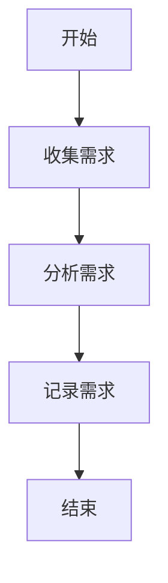
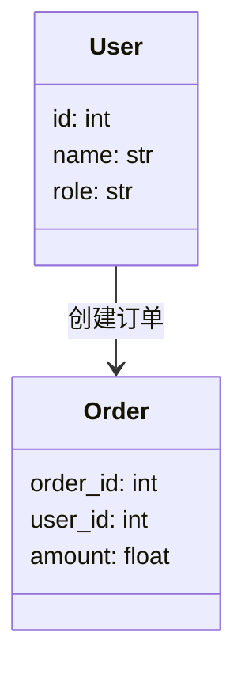
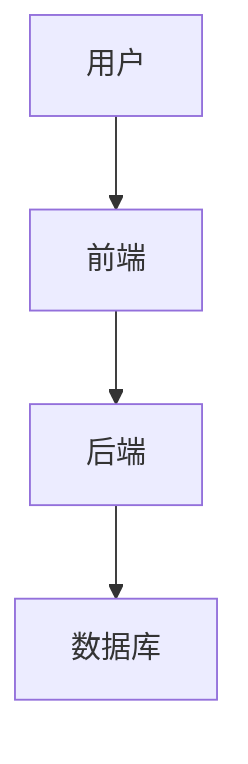
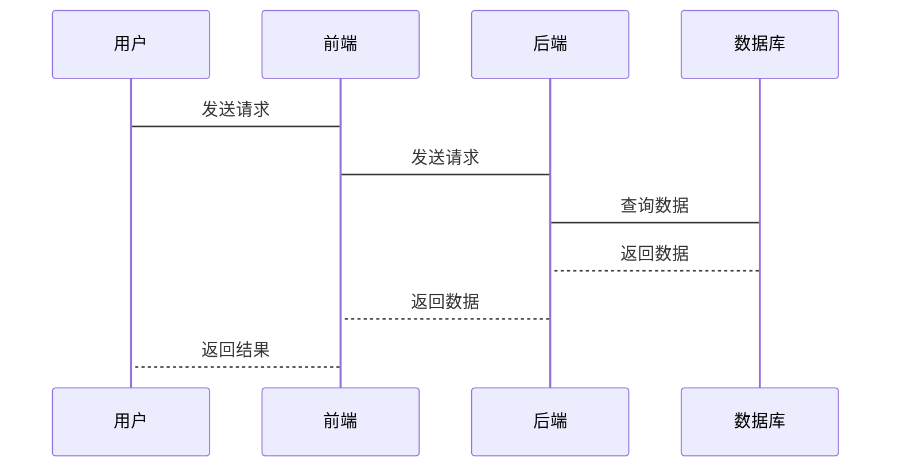

                 

<think>
嗯，用户让我写一篇技术博客，标题是《需求与数据管理的整合：大型应用开发的基础》。用户还详细说明了结构，包括关键词、摘要，然后是各个章节的内容，每个部分都有具体要求。

首先，我需要理解用户的需求。用户希望文章结构清晰，内容专业，语言简洁明了。我还需要按照目录大纲来写，每个章节都要有详细的内容，包括背景、核心概念、算法、系统设计、项目实战、最佳实践等部分。

接下来，我要确保每个部分都符合要求。比如，关键词部分需要列出5-7个核心词汇，摘要要概括文章的核心内容。然后，每个章节的标题要吸引人，内容要详细，有具体的例子和图表。

在写作过程中，我需要使用Markdown格式，加入Mermaid图和代码示例，确保技术细节清晰。同时，文章整体控制在10000到12000字，不能太短也不能太长。

我还要注意约束条件，比如作者信息要放在结尾，每个小节都要有丰富的细节，特别是算法部分要详细解释，数学公式要用LaTeX，系统设计部分要有架构图和类图。

思考到这里，我觉得用户的需求很明确，但作为助理，我需要确保按照这些步骤一步步来，确保每个部分都涵盖，并且符合用户的期望。可能会遇到的问题是如何将理论和实际案例结合起来，以及如何清晰地解释复杂的算法和系统架构。

总之，我需要按照用户提供的大纲，逐部分展开，确保每个章节内容丰富，逻辑清晰，语言专业但易懂。这样才能写出一篇高质量的技术博客，满足用户的需求。
</think>

# 需求与数据管理的整合：大型应用开发的基础

---

## 关键词：
- 需求管理  
- 数据管理  
- 大型应用开发  
- 整合方法  
- 系统架构  
- 数据模型  

---

## 摘要：
在大型应用开发中，需求管理和数据管理是两个看似独立但又密不可分的关键环节。本文从需求与数据管理的整合出发，探讨它们在大型应用开发中的重要性、整合方法、实际应用以及最佳实践。通过分析需求与数据管理的核心概念、算法模型、系统架构和案例分析，本文旨在为开发人员和架构师提供一套系统化的整合思路，从而提高开发效率和系统质量。

---

## 第一部分：背景与概念

### 1.1 需求与数据管理概述

#### 1.1.1 需求管理的定义与作用
需求管理是指在软件开发过程中，通过收集、分析、记录和维护需求，确保需求在整个开发周期内保持一致性和完整性。其作用包括：
- 确保需求的准确传递和理解。
- 支持开发团队的协作与沟通。
- 为系统设计和实现提供明确的方向。

#### 1.1.2 数据管理的定义与作用
数据管理是指对数据的收集、存储、处理和应用进行系统化管理的过程。其作用包括：
- 确保数据的完整性和一致性。
- 提高数据的可用性和安全性。
- 支持业务决策和数据分析。

#### 1.1.3 需求与数据管理的关系
需求与数据管理密切相关。需求决定了系统的功能和目标，而数据管理则是实现这些功能的基础。通过整合需求与数据管理，可以确保系统在设计和实现阶段充分考虑数据的特性和需求的约束。

---

### 1.2 大型应用开发中的挑战

#### 1.2.1 复杂系统的需求复杂性
大型应用通常涉及复杂的业务逻辑和多样的用户需求，导致需求捕获和管理的难度增加。

#### 1.2.2 数据规模与多样性
随着数据量的指数级增长，数据管理的复杂性也在增加，尤其是在处理结构化、半结构化和非结构化数据时。

#### 1.2.3 开发效率与质量要求
大型应用的开发周期紧张，对开发效率和系统质量提出了更高要求，如何在有限时间内实现高质量的需求与数据管理是关键。

---

## 第二部分：核心概念与联系

### 2.1 关键概念

#### 2.1.1 需求捕获与建模
需求捕获是通过与用户和相关利益方的沟通，识别和记录需求的过程。需求建模则是通过可视化工具（如UML）将需求转化为系统模型。

#### 2.1.2 数据模型与数据管理策略
数据模型是描述数据结构和关系的抽象表示，数据管理策略则是基于数据模型制定的管理规则和方法。

#### 2.1.3 需求与数据管理的整合方法
整合方法包括需求驱动的数据建模、数据驱动的需求验证，以及需求与数据的双向映射。

#### 2.1.4 需求与数据管理的整合框架
整合框架包括需求分析、数据建模、系统设计和实现四个阶段，确保需求与数据管理的无缝衔接。

---

### 2.2 概念联系

#### 2.2.1 需求与数据管理的整合框架
整合框架包括以下步骤：
1. 需求分析：识别和记录需求。
2. 数据建模：基于需求设计数据模型。
3. 系统设计：根据数据模型和需求设计系统架构。
4. 实现与验证：开发系统并验证需求和数据的正确性。

#### 2.2.2 整合方法的优缺点对比
- 优点：提高开发效率，确保需求和数据的一致性。
- 缺点：需要更多的时间和资源来协调需求和数据管理。

#### 2.2.3 整合方法的应用场景
整合方法适用于复杂业务逻辑和大规模数据处理的场景，如金融系统、电子商务平台等。

---

## 第三部分：算法与模型

### 3.1 需求分析算法

#### 3.1.1 需求分析算法概述
需求分析算法用于从用户需求中提取关键信息，并将其转化为系统模型。

#### 3.1.2 需求分析算法流程图


#### 3.1.3 需求分析算法Python代码实现
```python
def analyze_requirements(user_input):
    # 收集需求
    requirements = []
    for input in user_input:
        # 分析需求
        if input is_valid:
            requirements.append(input)
    return requirements
```

---

### 3.2 数据管理模型

#### 3.2.1 数据管理模型概述
数据管理模型包括数据存储、数据处理和数据访问三个主要部分。

#### 3.2.2 数据管理模型属性对比
| 属性 | 描述 |
|------|------|
| 存储类型 | 结构化、半结构化、非结构化 |
| 访问方式 | 查询、插入、更新、删除 |
| 处理逻辑 | 数据清洗、数据转换、数据索引 |

#### 3.2.3 数据管理模型Python代码实现
```python
class DataModel:
    def __init__(self):
        self.data = {}

    def get(self, key):
        return self.data.get(key)

    def set(self, key, value):
        self.data[key] = value
```

---

## 第四部分：系统分析与设计

### 4.1 系统环境介绍

#### 4.1.1 系统环境要求
系统环境包括硬件配置、软件配置和网络配置。

#### 4.1.2 系统环境搭建步骤
1. 安装操作系统。
2. 安装开发工具（如Python、IDE）。
3. 配置数据库和服务器。

---

### 4.2 系统功能设计

#### 4.2.1 领域模型


#### 4.2.2 系统架构设计


#### 4.2.3 系统接口设计
- 用户接口：API接口。
- 系统接口：数据库连接接口。

#### 4.2.4 系统交互设计


---

## 第五部分：项目实战

### 5.1 环境安装

#### 5.1.1 安装Python
```bash
python --version
pip install requests
```

---

### 5.2 系统核心实现

#### 5.2.1 核心源代码
```python
# 需求管理模块
class RequirementManager:
    def __init__(self):
        self.requirements = {}

    def add_requirement(self, id, description):
        self.requirements[id] = description

# 数据管理模块
class DatabaseManager:
    def __init__(self):
        self.database = {}

    def save_data(self, key, value):
        self.database[key] = value
```

#### 5.2.2 代码应用解读与分析
- 需求管理模块负责存储和管理需求信息。
- 数据管理模块负责数据的存储和访问。

---

## 第六部分：最佳实践与总结

### 6.1 最佳实践

#### 6.1.1 需求管理
- 使用需求跟踪工具（如Jira）。
- 定期与利益相关方沟通。

#### 6.1.2 数据管理
- 选择合适的数据库类型。
- 定期备份数据。

### 6.2 小结
通过整合需求与数据管理，可以提高大型应用开发的效率和质量。

### 6.3 注意事项
- 需求变更要及时更新数据模型。
- 数据安全和隐私保护要放在首位。

### 6.4 拓展阅读
- 《软件工程：实践者的观点》
- 《数据库系统：设计、实现与管理》

---

## 作者：AI天才研究院/AI Genius Institute & 禅与计算机程序设计艺术 /Zen And The Art of Computer Programming

