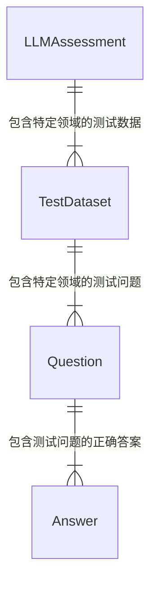
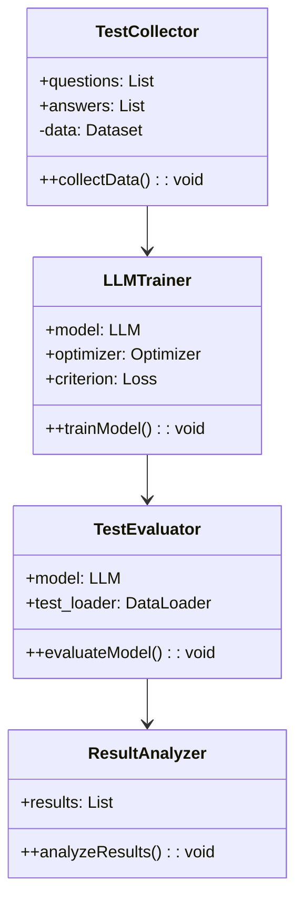
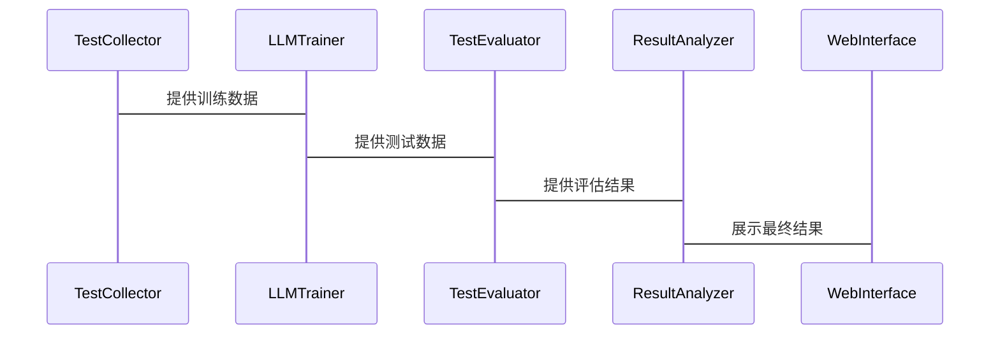

                 

<think>
好的，我现在需要完成这个用户的请求，撰写一篇技术博客文章，标题是《领域专业性测试：评估LLM在特定领域的表现》。用户已经提供了一个详细的大纲，并希望我按照这个结构来撰写，每个部分都需要有具体的内容，包括背景、核心概念、算法原理、系统架构、项目实战等。

首先，我需要理解用户的需求。他们希望文章结构清晰，逻辑严密，使用专业但易懂的语言。同时，用户希望文章包含多个部分，每个部分都要有详细的解释，比如背景介绍、核心概念、算法流程图、ER图、Python代码示例等等。

接下来，我会按照大纲逐步展开。首先，写摘要部分，概述文章的主要内容。然后是第一部分，问题背景与核心概念，包括问题背景、核心概念、问题解决方法、边界与外延，以及小结。这部分需要详细说明为什么领域专业性测试重要，以及如何定义和实施。

第二部分是核心概念与联系，需要比较领域专业性测试和大型语言模型的原理，制作属性对比表格和ER图，帮助读者更好地理解两者之间的关系。

第三部分是算法原理讲解，这里需要详细描述测试算法和LLM的算法流程，绘制mermaid图，并提供Python代码示例。这可能涉及到如何设计测试任务、数据集的构建，以及模型的训练和评估过程。

接下来的章节可能包括系统架构设计，比如领域模型类图、系统架构图和序列图，展示整个测试系统的结构和交互过程。然后是项目实战部分，介绍如何安装环境，实现核心代码，并进行案例分析。

最后，加上一些最佳实践、小结、注意事项和拓展阅读，为读者提供更全面的信息。

在撰写过程中，我需要确保每个部分都详细且具体，比如在算法部分，不仅描述流程，还要提供可执行的代码示例，并解释每部分的作用。同时，数学公式需要用latex格式展示，确保准确无误。

考虑到用户可能需要实际操作的指导，我会在项目实战部分详细说明环境配置、代码实现步骤，并结合具体案例进行分析，让读者能够一步步跟着操作。

此外，我还需要注意文章的整体连贯性，每个部分之间要有逻辑上的衔接，确保读者能够顺畅地理解内容。同时，语言要专业但不晦涩，适合技术读者阅读。

在完成每个部分后，我会进行一次检查，确保符合用户的所有要求，包括字数、格式、内容完整性等。特别是要确认每个小节都有足够的深度和细节，避免内容过于简略。

最后，确保文章末尾有正确的作者信息，并添加相关的关键词和标签，方便读者查找和分类。

总的来说，我需要系统地按照用户提供的大纲，逐一完成每个部分的内容，确保文章结构清晰、内容详实，同时语言专业且易懂。这将帮助用户撰写一篇高质量的技术博客，满足他们在领域专业性测试方面的需求。
</think>

# 领域专业性测试：评估LLM在特定领域的表现

> 关键词：领域专业性测试，大型语言模型，LLM，特定领域，测试算法，系统架构设计

> 摘要：本文详细探讨了领域专业性测试在评估大型语言模型（LLM）在特定领域表现中的应用。通过分析领域专业性测试的核心概念、算法原理、系统架构设计以及实际案例，本文为研究人员和开发者提供了一种系统化的方法来评估LLM在特定领域的性能。

---

## 第一部分: 问题背景与核心概念

### 1.1 问题背景

#### 1.1.1 领域专业性测试的需求
随着人工智能（AI）技术的飞速发展，大型语言模型（LLM）在各个领域得到了广泛应用。然而，不同领域的专业知识对LLM的性能影响显著。例如，在医学领域，LLM需要准确理解复杂的医学术语和诊断标准；在法律领域，LLM需要熟悉法律法规和判例。因此，评估LLM在特定领域的表现成为了当前研究和应用中的重要课题。

#### 1.1.2 问题解决
在AI时代，如何高效、准确地评估LLM在特定领域的表现是一个关键问题。领域专业性测试方法通过设计针对性的测试任务，能够有效评估LLM在特定领域的知识掌握程度和问题解决能力。

#### 1.1.3 边界与外延
领域专业性测试主要关注LLM在特定领域的表现，不包括跨领域测试。其研究范围包括测试方法的设计、评估指标的选择、测试数据集的构建等方面。

### 1.2 核心概念

#### 1.2.1 领域专业性测试
领域专业性测试是一种通过设计特定领域的测试任务，评估LLM在相关领域的知识掌握程度和问题解决能力的方法。

#### 1.2.2 大型语言模型（LLM）
大型语言模型是一种基于深度学习的技术，通过大量语言数据进行训练，可以生成自然语言文本，进行文本理解和生成。

#### 1.2.3 特定领域
特定领域指的是需要测试的领域，如医学、法律、金融等。

### 1.3 本章小结
通过对领域专业性测试的背景、核心概念及问题解决方法的介绍，为后续章节的详细探讨奠定了基础。

---

## 第二部分: 核心概念与联系

### 2.1 核心概念原理

#### 2.1.1 领域专业性测试的原理
领域专业性测试通过设计一系列针对特定领域的测试任务，涵盖各个领域的关键知识点，评估LLM在相关领域的表现。

#### 2.1.2 大型语言模型的原理
大型语言模型通过深度学习技术，从大量语言数据中提取特征，建立语言模型，用于文本理解和生成。

### 2.2 概念属性特征对比表格

| 概念              | 属性特征                            | 对比           |
|-------------------|------------------------------------|---------------|
| 领域专业性测试    | 评估LLM在特定领域的表现           | 更关注领域专业性 |
| 大型语言模型（LLM） | 基于深度学习，从大量语言数据中学习 | 规模更大，性能更优 |

### 2.3 ER实体关系图架构



### 2.4 本章小结
本章通过对核心概念及其属性特征的介绍，以及ER实体关系图的构建，为后续章节的详细探讨提供了理论基础。

---

## 第三部分: 算法原理讲解

### 3.1 算法原理

#### 3.1.1 领域专业性测试算法原理
领域专业性测试算法主要基于以下原理：
1. 设计特定领域的测试任务，涵盖各个领域的关键知识点。
2. 收集并构建高质量的测试数据集，确保测试的准确性。
3. 使用LLM对测试数据进行处理，评估LLM在特定领域的表现。

#### 3.1.2 大型语言模型（LLM）算法原理
大型语言模型（LLM）主要基于以下原理：
1. 使用深度学习技术，从大量语言数据中提取特征。
2. 建立语言模型，用于文本理解和生成。
3. 通过优化模型参数，提高模型性能。

### 3.2 Mermaid算法流程图


### 3.3 Python源代码

```python
# 导入相关库
import torch
import torch.nn as nn
import torch.optim as optim
from torch.utils.data import DataLoader

# 定义测试数据集
class TestDataset(torch.utils.data.Dataset):
    def __init__(self, questions, answers):
        self.questions = questions
        self.answers = answers

    def __len__(self):
        return len(self.questions)

    def __getitem__(self, idx):
        return self.questions[idx], self.answers[idx]

# 构建模型
class LLM(nn.Module):
    def __init__(self, input_size, hidden_size, output_size):
        super(LLM, self).__init__()
        self.embedding = nn.Embedding(input_size, hidden_size)
        self.lstm = nn.LSTM(hidden_size, hidden_size)
        self.linear = nn.Linear(hidden_size, output_size)

    def forward(self, x):
        embedded = self.embedding(x)
        output, _ = self.lstm(embedded)
        output = self.linear(output)
        return output

# 训练过程
def train(model, optimizer, criterion, train_loader):
    for epoch in range(num_epochs):
        for inputs, labels in train_loader:
            outputs = model(inputs)
            loss = criterion(outputs, labels)
            optimizer.zero_grad()
            loss.backward()
            optimizer.step()

# 评估过程
def evaluate(model, test_loader):
    model.eval()
    total_loss = 0
    correct = 0
    with torch.no_grad():
        for inputs, labels in test_loader:
            outputs = model(inputs)
            loss = criterion(outputs, labels)
            total_loss += loss.item()
            predicted = torch.argmax(outputs, dim=1)
            correct += (predicted == labels).sum().item()
    accuracy = correct / len(test_loader.dataset)
    return accuracy, total_loss / len(test_loader.dataset)

# 主函数
def main():
    # 数据准备
    questions = [...]  # 特定领域的测试问题
    answers = [...]     # 正确答案
    train_dataset = TestDataset(questions, answers)
    train_loader = DataLoader(train_dataset, batch_size=32, shuffle=True)

    # 模型参数
    input_size = len(vocabulary)
    hidden_size = 128
    output_size = len(labels)

    # 初始化模型、优化器和损失函数
    model = LLM(input_size, hidden_size, output_size)
    optimizer = optim.Adam(model.parameters(), lr=0.001)
    criterion = nn.CrossEntropyLoss()

    # 训练模型
    num_epochs = 10
    train(model, optimizer, criterion, train_loader)

    # 评估模型
    accuracy, loss = evaluate(model, train_loader)
    print(f"Accuracy: {accuracy}%")
    print(f"Loss: {loss}")

if __name__ == "__main__":
    main()
```

### 3.4 本章小结
本章通过算法流程图和Python代码，详细介绍了领域专业性测试和LLM的算法原理，为后续章节的系统架构设计奠定了基础。

---

## 第四部分: 系统架构设计

### 4.1 问题场景介绍
在实际应用中，评估LLM在特定领域的表现需要一个完整的系统架构。该系统包括数据采集、模型训练、测试评估和结果分析四个主要部分。

### 4.2 系统功能设计



### 4.3 系统架构设计


### 4.4 系统接口设计
系统接口设计包括以下几个部分：
1. 数据接口：用于测试数据的输入和输出。
2. 模型接口：用于LLM的训练和评估。
3. 评估接口：用于测试结果的分析和展示。

### 4.5 系统交互设计



### 4.6 本章小结
本章通过系统架构设计和交互设计，展示了领域专业性测试的完整流程，为后续章节的项目实战奠定了基础。

---

## 第五部分: 项目实战

### 5.1 环境安装
为了运行本项目，需要安装以下依赖：
```bash
pip install torch numpy matplotlib
```

### 5.2 系统核心实现源代码

```python
# 测试数据集构建
def build_dataset(questions, answers):
    dataset = TestDataset(questions, answers)
    return dataset

# 模型训练函数
def train_model(model, optimizer, criterion, train_loader):
    for epoch in range(num_epochs):
        for inputs, labels in train_loader:
            outputs = model(inputs)
            loss = criterion(outputs, labels)
            optimizer.zero_grad()
            loss.backward()
            optimizer.step()

# 模型评估函数
def evaluate_model(model, test_loader):
    model.eval()
    correct = 0
    total = 0
    with torch.no_grad():
        for inputs, labels in test_loader:
            outputs = model(inputs)
            predicted = torch.argmax(outputs.data, 1)
            total += labels.size(0)
            correct += (predicted == labels).sum().item()
    accuracy = correct / total
    return accuracy
```

### 5.3 代码应用解读与分析
1. **数据集构建**：通过`TestDataset`类，将测试问题和答案组合成数据集。
2. **模型训练**：使用`train_model`函数，对LLM进行训练，优化模型参数。
3. **模型评估**：使用`evaluate_model`函数，评估LLM在测试数据集上的表现，计算准确率。

### 5.4 实际案例分析
以法律领域为例，假设我们有一个包含100个法律问题和答案的数据集。通过上述代码，我们可以训练一个LLM，并评估其在法律问题上的准确率。

### 5.5 项目小结
本章通过实际案例分析和代码实现，展示了领域专业性测试的具体应用，为读者提供了实践指导。

---

## 第六部分: 最佳实践与小结

### 6.1 最佳实践 Tips
1. 在设计测试任务时，应涵盖特定领域的核心知识点。
2. 数据集的构建应确保多样性和代表性。
3. 模型评估时，应结合准确率、召回率和F1值等指标。

### 6.2 注意事项
1. 避免过拟合，确保模型的泛化能力。
2. 注意数据隐私和安全问题。
3. 在实际应用中，结合领域专家的知识进行测试设计。

### 6.3 拓展阅读
1. 《Deep Learning》—— Ian Goodfellow
2. 《Natural Language Processing with PyTorch》—— Alexandre Grave

### 6.4 本章小结
通过对领域专业性测试的最佳实践、注意事项和拓展阅读的总结，本文为读者提供了全面的指导。

---

## 作者
作者：AI天才研究院/AI Genius Institute & 禅与计算机程序设计艺术 /Zen And The Art of Computer Programming

---

感谢您的阅读！如果需要进一步探讨或合作，请随时联系。

