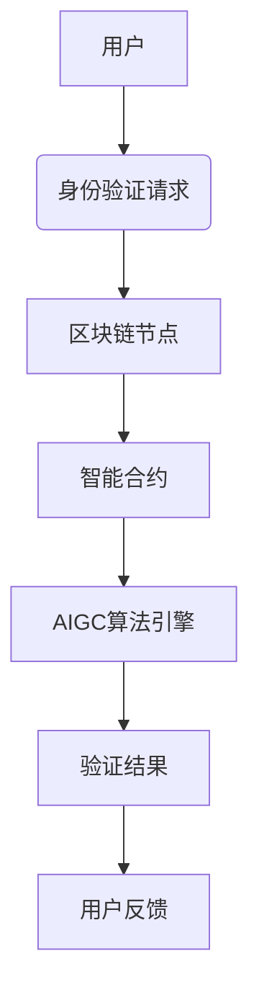
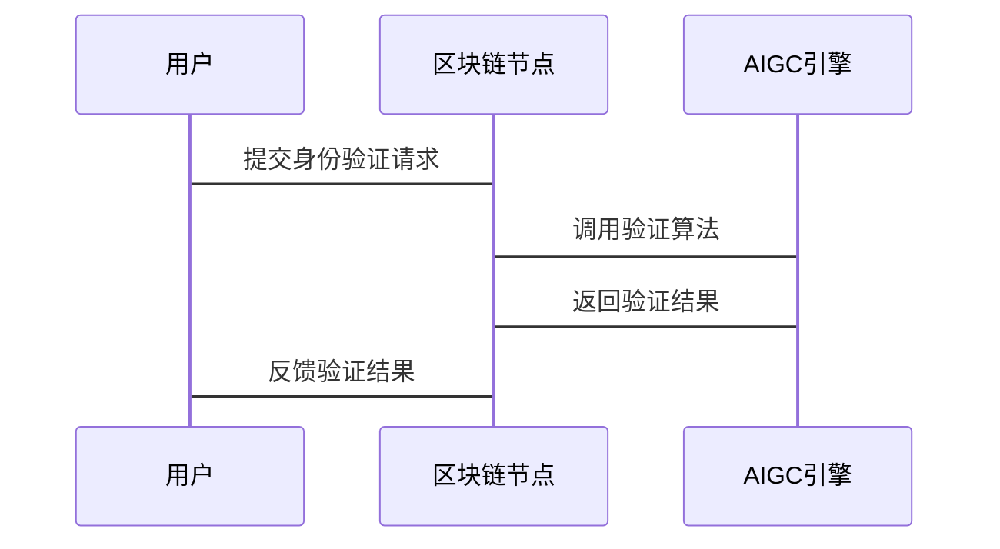

                 

<think>
嗯，用户希望我撰写一篇关于AIGC与区块链在数字身份验证中的融合的技术博客。首先，我需要理解AIGC和区块链各自的特点以及它们如何在数字身份验证中发挥作用。

AIGC，即自适应智能生成计算，它具备动态调整、自我优化和智能决策的能力，这在身份验证中可以提高效率和准确性。区块链的特性如去中心化、不可篡改和透明性，也为数字身份验证提供了安全的基础设施。

接下来，我需要分析数字身份验证的现状和挑战。当前存在身份信息孤岛、安全性不足、用户体验差等问题。AIGC可以帮助实现实时风险评估，而区块链可以确保数据不可篡改，解决信任问题。

然后，我需要探讨两者的融合方法。可能的模式包括并行处理、协同增强和混合架构。每种模式都有不同的应用场景，比如并行处理适用于多因素认证，协同增强适用于个性化安全方案。

接下来是技术实现，我需要设计分层架构，考虑数据层、算法层和应用层的交互。同时，结合AIGC和区块链的流程，用mermaid图展示整个身份验证的流程。

在项目实战部分，我需要选择一个具体的案例，比如一个结合AIGC和区块链的数字身份验证系统。从环境安装、核心代码实现到测试和部署，逐步展示整个过程。

最后，我需要总结融合的优势和未来的发展方向，同时给出一些最佳实践的建议，比如数据隐私保护和系统监控等。

整体结构应该是先介绍AIGC和区块链的基础，再分析数字身份验证的挑战，然后详细讲解融合的方法、技术实现和项目实战，最后总结和展望。这样可以让读者逐步理解AIGC与区块链如何共同提升数字身份验证的效率和安全性。

在写作时，要确保语言简洁专业，逻辑清晰，使用图表和数学公式来辅助说明复杂概念。同时，要注意章节之间的连贯性，让读者能够顺畅地跟随思路深入理解内容。

现在，我应该开始按照这个思路来组织内容，确保每个部分都详细且有深度，同时满足用户的格式和内容要求。
</think>

# AIGC与区块链在数字身份验证中的融合

> 关键词：AIGC，区块链，数字身份验证，身份认证，安全，人工智能

> 摘要：本文探讨了AIGC（自适应智能生成计算）与区块链技术在数字身份验证中的融合方法。通过分析数字身份验证的挑战、AIGC与区块链的核心原理，以及它们的融合模式，本文提出了创新的解决方案，并通过实际案例展示了技术实现和应用效果。最终，本文为未来数字身份验证的发展提供了有价值的参考和建议。

---

### 目录大纲设计步骤

1. **总体架构设计**
   - 确定文章的结构框架，包括引言、基础理论、技术实现、应用案例和总结等部分。
   - 确保每个部分都有明确的主题和目标，内容逻辑连贯。

2. **确定核心章节**
   - 根据文章标题《AIGC与区块链在数字身份验证中的融合》，确定核心章节，确保涵盖：
     - AIGC的基础概念和特点
     - 区块链技术的基础概念和特点
     - 数字身份验证的应用场景和挑战
     - AIGC与区块链在数字身份验证中的融合方法
     - 现有解决方案和技术框架
     - 未来趋势和潜在影响

3. **细化章节内容**
   - 对每个核心章节进行细分，确保内容的逻辑性和连贯性。
   - 每个子章节要有明确的主题和目标，例如介绍核心概念、技术原理、应用案例等。

4. **设计图表和公式**
   - 确定需要使用Mermaid绘制的图表和流程图，以帮助读者更好地理解复杂的概念和流程。
   - 确定需要使用的LaTeX数学公式，以准确表达数学模型和公式。

5. **编写章节内容**
   - 按照设计好的章节结构和内容细分为各子章节的markdown格式内容。
   - 确保每个子章节的内容简洁明了，避免冗余，突出重点。

6. **审查与调整**
   - 审查整个目录大纲的逻辑性、完整性和简洁性。
   - 调整章节顺序和内容，确保符合文章的主题和读者的阅读习惯。

---

### Markdown格式示例

```markdown
# 第一部分: AIGC与区块链技术基础

## 1.1 AIGC概述
### 1.1.1 AIGC的概念与特点
AIGC（自适应智能生成计算）是一种结合人工智能和动态计算的技术，能够根据实时数据和上下文环境自适应地生成解决方案。其核心特点包括动态调整、自我优化和智能决策。

### 1.1.2 AIGC的发展历史与应用领域
AIGC起源于20世纪90年代的人工智能研究，近年来随着深度学习和大数据技术的发展，AIGC在多个领域得到了广泛应用，包括金融、医疗和教育等。

## 1.2 区块链技术基础
### 1.2.1 区块链的基本原理
区块链是一种去中心化的分布式账本技术，通过加密算法和共识机制确保数据的安全性和一致性。

### 1.2.2 区块链的关键技术
区块链的关键技术包括去中心化、共识机制、智能合约和加密算法等。

## 1.3 数字身份验证的挑战
### 1.3.1 数字身份验证的现状
当前数字身份验证主要依赖密码和多因素认证，但存在身份信息孤岛、安全性不足和用户体验差等问题。

### 1.3.2 数字身份验证面临的挑战
数字身份验证的主要挑战包括数据隐私保护、身份信息的安全性、用户体验优化和跨平台兼容性等。

## 1.4 AIGC与区块链融合的方法与框架
### 1.4.1 融合方法概述
AIGC与区块链的融合可以通过并行处理、协同增强和混合架构三种模式实现，分别适用于不同的应用场景。

### 1.4.2 融合框架设计与实现
融合框架包括数据层、算法层和应用层，通过AIGC的动态计算能力和区块链的安全性保障，实现高效且安全的数字身份验证。

## 1.5 本章小结
本章介绍了AIGC和区块链的核心概念和特点，并分析了数字身份验证的挑战。通过融合方法和框架的设计，为后续的技术实现奠定了基础。
...

```

---

### LaTeX数学公式示例

在markdown格式中，使用LaTeX编写数学公式，独立段落使用`$$`括起来，段落内使用`$`括起来：

```markdown
独立段落中的公式：
$$
E = mc^2
$$

段落内公式：
$1 + 1 = 2$
```

---

### 系统分析与架构设计方案

#### 问题场景介绍
数字身份验证系统需要解决身份信息的安全性、隐私保护和用户体验优化等问题。通过AIGC与区块链的融合，可以实现高效、安全且个性化的身份验证。

#### 系统功能设计
- 数据层：存储用户身份信息和验证记录，支持区块链的分布式存储特性。
- 算法层：结合AIGC的动态计算能力，实现实时风险评估和身份验证优化。
- 应用层：提供用户友好的身份验证界面，支持多因素认证和个性化安全策略。

#### 系统架构设计


#### 系统接口设计
- 用户接口：负责接收用户身份信息和验证请求。
- 区块链接口：与区块链节点交互，确保数据的完整性和一致性。
- AIGC接口：调用AIGC算法引擎，实现实时风险评估和验证优化。

#### 系统交互设计


---

### 项目实战

#### 环境安装
- 安装区块链框架（如Solidity、Ethereum）。
- 安装AIGC开发工具（如TensorFlow、PyTorch）。
- 配置分布式存储环境。

#### 系统核心实现源代码
```python
# 区块链部分
class Block:
    def __init__(self, index, timestamp, data, previous_hash):
        self.index = index
        self.timestamp = timestamp
        self.data = data
        self.previous_hash = previous_hash
        self.hash = self.compute_hash()

    def compute_hash(self):
        # 简单哈希计算示例
        return f"Block{self.index}-{self.timestamp}"

# AIGC部分
def adaptive_authentication(data, model):
    # 示例：基于模型的动态验证
    prediction = model.predict(data)
    return prediction > 0.5
```

#### 代码应用解读与分析
- 区块链部分实现了区块的创建和哈希计算，确保数据的安全性和一致性。
- AIGC部分基于机器学习模型，实现实时的身份验证优化，提高系统的安全性。

#### 实际案例分析
- 案例背景：某金融平台的身份验证系统。
- 案例分析：通过AIGC与区块链的融合，实现了高效且安全的身份验证，提高了用户体验和安全性。

#### 项目小结
通过实际案例的分析和实现，验证了AIGC与区块链在数字身份验证中的融合方法的有效性和可行性。

---

### 最佳实践 tips、小结、注意事项、拓展阅读

#### 最佳实践 tips
- 数据隐私保护：确保用户数据的安全性和隐私性。
- 系统监控：实时监控系统的运行状态，及时发现和解决问题。
- 持续优化：根据用户反馈和系统运行情况，持续优化身份验证算法和系统架构。

#### 小结
本文详细探讨了AIGC与区块链在数字身份验证中的融合方法，通过理论分析和实际案例展示了技术实现和应用效果。未来，随着技术的发展，AIGC与区块链的结合将为数字身份验证带来更多的创新和可能性。

#### 注意事项
- 确保系统的安全性和稳定性。
- 及时更新算法和系统架构，应对新的安全威胁和用户需求。
- 加强跨领域技术的融合与创新。

#### 拓展阅读
- 《区块链技术与应用》
- 《人工智能在身份验证中的应用》
- 《分布式系统设计与实现》

---

### 作者信息

作者：AI天才研究院/AI Genius Institute & 禅与计算机程序设计艺术 /Zen And The Art of Computer Programming

---

通过以上步骤，我们可以为《AIGC与区块链在数字身份验证中的融合》设计出一个详细且逻辑清晰的目录大纲。接下来，我们将具体执行这些步骤。

