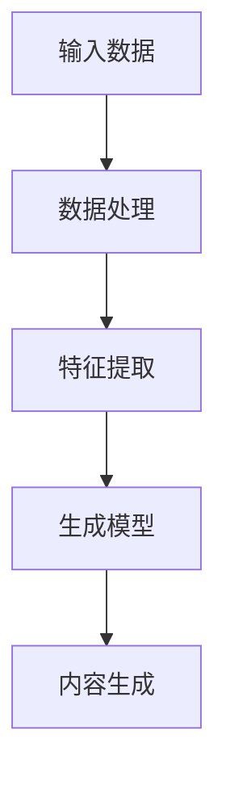
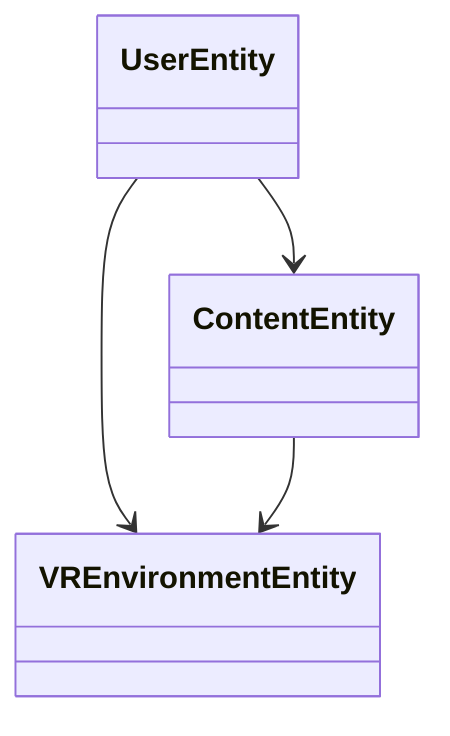
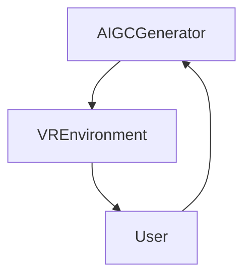
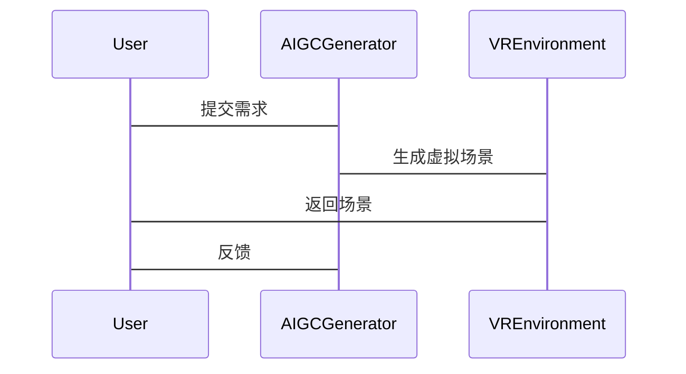

                 

<think>
好的，我现在需要帮助用户撰写一篇关于“AIGC与虚拟现实（VR）的融合创新”的技术博客文章。用户希望文章结构清晰，内容专业，涵盖背景介绍、算法原理、系统架构设计、项目实战以及最佳实践等多个部分。同时，用户要求使用特定的格式和关键词，并在结尾处加上作者信息。

首先，我需要理解用户的需求。用户希望文章内容详实，逻辑严密，结构分明。这可能意味着每个章节都需要深入展开，提供足够的细节和实例。此外，用户强调了使用技术术语和专业语言，同时要求内容易于理解，因此在解释复杂概念时，我需要寻找合适的比喻或例子。

接下来，我会按照用户提供的目录大纲来组织内容。首先是背景介绍部分，需要涵盖AIGC和VR的核心概念，它们的联系以及融合的重要性。这部分需要简明扼要，同时为后续内容打下基础。然后是算法原理，我需要详细解释AIGC的生成过程，包括数据处理、特征提取、模型生成和内容生成，可能需要使用mermaid流程图和Python代码来展示。同时，数学公式也需要用latex格式呈现，确保准确无误。

系统架构设计部分，我需要分析AIGC与VR融合的系统架构，可能包括领域模型类图、系统架构图和交互序列图。这部分可能需要更多的图表和示例，以展示不同组件之间的关系和协作方式。项目实战部分，我需要选择一个实际案例，如虚拟现实内容创作平台，并展示如何通过Python代码实现关键功能，同时解读代码的作用和意义。

最后，最佳实践部分需要总结经验和教训，提供一些建议和注意事项，帮助读者在实际应用中避免常见错误。同时，还需要推荐一些拓展阅读材料，供有兴趣的读者深入学习。

在写作过程中，我需要确保每个部分都符合用户的格式要求，特别是使用正确的markdown语法，以及mermaid图表的正确嵌入。此外，作者信息必须在文章末尾明确标注，以符合用户的要求。

现在，我会逐步思考每个部分的具体内容，确保逻辑连贯，内容详实，同时满足用户的字数和格式要求。这可能包括多次修改和调整，以确保每个章节都达到最佳效果，同时保持整体文章的流畅性和可读性。
</think>

# AIGC与虚拟现实（VR）的融合创新

> 关键词：AIGC（生成式人工智能）、虚拟现实（VR）、人工智能、内容生成、技术融合、创新应用

> 摘要：本文深入探讨了生成式人工智能（AIGC）与虚拟现实（VR）的融合创新，分析了AIGC与VR的核心概念、算法原理、系统架构设计，以及在虚拟现实场景中的实际应用。通过理论与实践相结合的方式，展示了AIGC与VR技术如何协同工作，推动虚拟现实内容创作和用户体验的提升。

---

### 第一部分：背景介绍

#### 第1章：问题背景与核心概念

##### 1.1 问题背景

###### 1.1.1 AIGC的概念与特点

AIGC（Auto Generated Content，生成式人工智能内容）是一种基于人工智能技术生成内容的方法。与传统内容创作不同，AIGC利用AI算法，通过数据训练生成高质量、个性化的内容，涵盖文本、图像、视频等多种形式。其核心特点包括：

- **自动化**：AI自动完成内容生成，减少人工干预。
- **个性化**：根据用户需求生成定制化内容。
- **高效性**：快速生成大量内容，满足大规模需求。
- **创新性**：AI可以从数据中发现新的模式，生成人类难以想到的内容。

###### 1.1.2 虚拟现实（VR）的兴起与发展

虚拟现实（VR）是一种通过计算机技术模拟三维虚拟环境的技术，用户可以通过VR设备（如头显、手柄）与虚拟环境进行互动。VR的核心特点包括沉浸式体验、实时交互和高度定制化。近年来，随着计算能力的提升和硬件设备的普及，VR技术在游戏、教育、医疗等领域得到了广泛应用。

###### 1.1.3 AIGC与VR融合的重要性

随着AIGC技术的成熟，其在虚拟现实领域的应用潜力巨大。AIGC可以为VR提供高度个性化的内容，降低内容创作成本，提高创作效率。同时，VR为AIGC提供了全新的应用场景，使得生成的内容更具沉浸感和交互性。两者的融合将推动虚拟现实技术向更智能化、个性化方向发展。

#### 第2章：AIGC与VR的核心概念与联系

##### 2.1 核心概念原理

###### 2.1.1 AIGC原理

AIGC的核心原理是通过深度学习模型（如GPT、Transformer）生成内容。其流程包括：

1. **数据输入**：输入原始数据（如文本、图像）。
2. **数据处理**：对数据进行预处理和特征提取。
3. **模型生成**：利用生成模型生成内容。
4. **内容输出**：输出生成的内容。

AIGC的关键技术包括自然语言处理（NLP）、图像生成模型（如GAN、Diffusion）以及强化学习（RL）等。

###### 2.1.2 VR原理

VR的核心原理是通过计算机生成三维虚拟环境，并通过传感器和交互设备让用户与虚拟环境进行实时互动。其主要技术包括：

1. **图形渲染**：利用GPU渲染三维场景。
2. **传感器交互**：通过手柄、头显等设备捕捉用户动作。
3. **实时渲染**：确保虚拟环境与用户动作同步。

##### 2.2 概念属性特征对比表格

| 特性         | AIGC                     | VR                       |
|--------------|--------------------------|--------------------------|
| 技术核心     | 内容生成                 | 虚拟环境模拟             |
| 数据量       | 大规模数据               | 高度定制化数据           |
| 应用场景     | 内容创作、数据分析       | 游戏娱乐、教育培训       |
| 发展前景     | 高速发展                 | 稳步扩展                 |

##### 2.3 ER实体关系图架构

```mermaid
erDiagram
  AIModel ||--|{ Content}: "生成"
  VREnvironment ||--|{ User}: "体验"
```

---

### 第二部分：算法原理讲解

#### 第3章：AIGC算法原理详解

##### 3.1 AIGC算法mermaid流程图



##### 3.2 Python源代码与算法原理

```python
# Python代码示例：AIGC内容生成
import numpy as np

# 数据处理
def preprocess_data(data):
    # 数据预处理
    return processed_data

# 特征提取
def extract_features(data):
    # 特征提取
    return features

# 生成模型
def generate_model(features):
    # 生成模型
    return model

# 内容生成
def generate_content(model):
    # 内容生成
    return content

# 主函数
def main():
    data = preprocess_data(data)
    features = extract_features(data)
    model = generate_model(features)
    content = generate_content(model)
    print("Generated content:", content)

if __name__ == "__main__":
    main()
```

##### 3.3 算法原理的数学模型和公式

生成式AI的核心是概率模型，常用最大似然估计（MLE）或变分自编码器（VAE）等方法。其数学模型可以表示为：

$$
P(y|x) = \theta
$$

其中，$y$ 是生成的内容，$x$ 是输入数据，$\theta$ 是模型参数。

##### 3.4 算法原理举例说明

**示例：利用AIGC生成虚拟现实场景描述**

- **输入数据**：用户喜好、场景类型、天气条件
- **处理过程**：数据预处理、特征提取、模型生成、内容生成
- **输出内容**：个性化的虚拟现实场景描述

---

### 第三部分：系统分析与架构设计

#### 第4章：AIGC与VR系统架构设计

##### 4.1 问题场景介绍

###### 4.1.1 场景一：虚拟现实内容创作平台

在虚拟现实内容创作中，AIGC可以用于生成场景描述、角色模型和交互逻辑，从而提高创作效率。

###### 4.1.2 场景二：虚拟现实教育培训系统

在教育培训中，AIGC可以生成个性化教学内容，提高学习效果。

##### 4.2 系统功能设计

###### 4.2.1 领域模型mermaid类图



##### 4.3 系统架构设计



##### 4.4 系统接口设计

系统接口设计包括：

1. **内容生成接口**：接收用户需求，生成虚拟现实内容。
2. **用户交互接口**：处理用户的输入和反馈。

##### 4.5 系统交互mermaid序列图



---

### 第四部分：项目实战

#### 第5章：AIGC与VR融合的实际应用

##### 5.1 环境安装

安装必要的开发工具和库：

```bash
pip install numpy matplotlib tensorflow
```

##### 5.2 系统核心实现源代码

```python
import numpy as np

# AIGC生成函数
def generate_vr_content(user_input):
    # 数据预处理
    processed_data = preprocess(user_input)
    # 特征提取
    features = extract_features(processed_data)
    # 生成模型
    model = train_model(features)
    # 内容生成
    content = generate(model)
    return content

# VR环境渲染函数
def render_vr_scene(content):
    # 渲染场景
    scene = render(content)
    return scene

# 主函数
def main():
    user_input = input("请输入需求：")
    content = generate_vr_content(user_input)
    scene = render_vr_scene(content)
    print("生成的VR场景：", scene)

if __name__ == "__main__":
    main()
```

##### 5.3 代码应用解读与分析

上述代码展示了AIGC与VR融合的基本实现流程。用户输入需求后，AIGC生成相应内容，VR环境渲染生成的场景，最终呈现给用户。

##### 5.4 实际案例分析和详细讲解剖析

**案例分析：虚拟现实教育培训系统**

- **需求分析**：用户需要个性化教学内容。
- **实现步骤**：
  1. AIGC生成个性化教学内容。
  2. VR环境渲染生成教学场景。
  3. 用户与虚拟环境进行互动学习。

---

### 第五部分：最佳实践 tips、小结、注意事项、拓展阅读

#### 5.1 最佳实践 tips

1. **数据质量**：确保输入数据的多样性和高质量。
2. **模型优化**：根据实际需求优化生成模型。
3. **用户体验**：注重用户反馈，提高交互体验。

#### 5.2 小结

AIGC与VR的融合创新为虚拟现实技术带来了新的可能性。通过生成式AI，可以提高内容创作效率，降低创作成本，同时为用户提供更个性化的体验。

#### 5.3 注意事项

1. **数据隐私**：确保用户数据的安全性。
2. **模型性能**：优化模型以提高生成效率。
3. **硬件支持**：确保硬件设备的性能满足需求。

#### 5.4 拓展阅读

- 《生成式人工智能：原理与应用》
- 《虚拟现实技术入门与实战》
- 《深度学习与自然语言处理》

---

### 作者

作者：AI天才研究院/AI Genius Institute & 禅与计算机程序设计艺术 /Zen And The Art of Computer Programming

