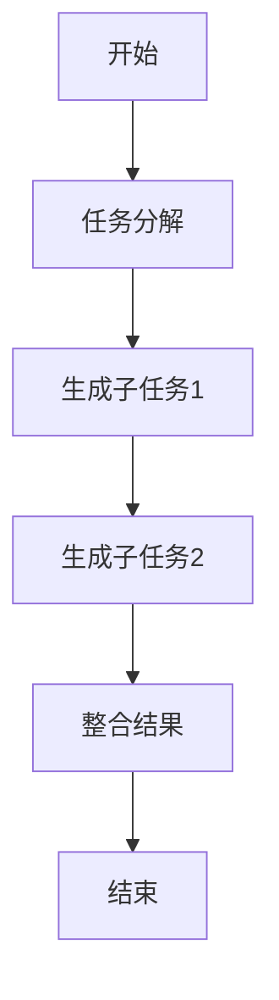
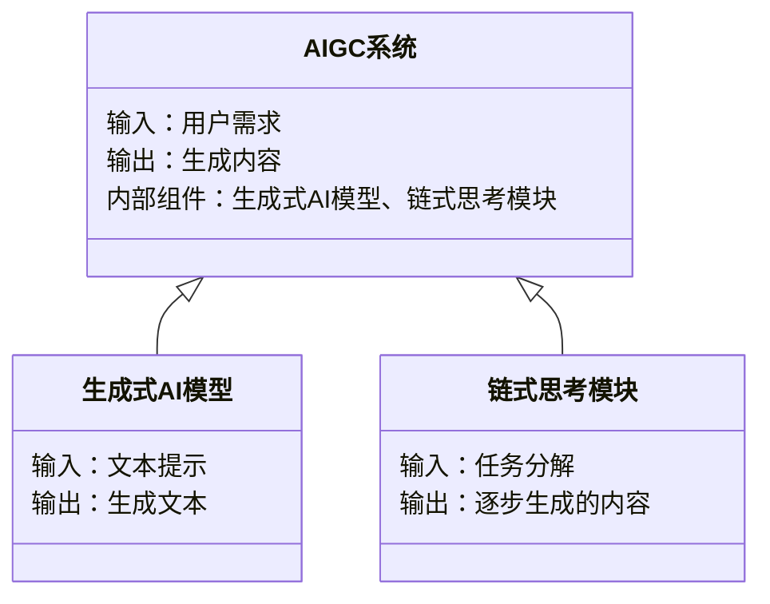
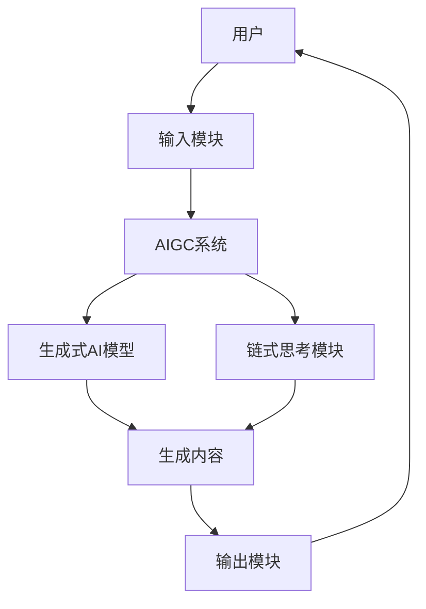
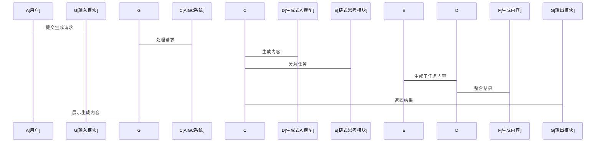

                 

<think>
嗯，我现在要写一篇关于AIGC内容创作中的思维链prompt实践指南的技术博客文章。首先，我得理解什么是AIGC，它是指人工智能生成内容，对吧？然后，思维链prompt，听起来像是用一系列的提示来引导生成内容。我得先弄清楚这些概念，然后看看它们如何在内容创作中应用。

接下来，我需要构思文章的结构。根据用户提供的目录大纲，文章分为五个主要部分，每个部分下面还有子部分。我应该从背景介绍开始，解释AIGC和思维链prompt的基本概念，然后讨论它们的作用和与传统prompt的区别。

在算法原理部分，我需要详细讲解思维链prompt的工作机制，可能用流程图来展示，再配以Python代码示例。数学模型和公式也需要解释清楚，可能得画个图来辅助说明。这部分可能有点难，我得确保自己理解透彻。

然后是系统设计，包括应用场景、领域模型和架构设计。这部分可能需要更多的例子和图表，比如Mermaid的类图和架构图。我得考虑实际应用中的各种场景，确保系统设计的合理性。

项目实战部分，我得提供具体的环境安装步骤和源代码，解释代码的功能，再用实际案例来分析。这样读者可以跟着操作，理解整个过程。

最后，总结最佳实践，给出小结和注意事项，以及推荐的拓展阅读资料。这部分要实用，能帮助读者更好地应用这些方法。

总的来说，我需要确保每个部分都详细且有条理，使用技术术语但保持易懂。可能需要多次修改，确保内容准确且完整。
</think>

# AIGC内容创作中的思维链prompt实践指南

## 关键词：AIGC, 思维链prompt, 内容创作, AI生成, 生成式AI

## 摘要：  
本文旨在探讨在AIGC（人工智能生成内容）领域中，如何通过思维链prompt来优化内容创作的效率和质量。我们从思维链prompt的概念出发，分析其算法原理、系统架构设计，再到实际项目实现，最后总结最佳实践技巧，为读者提供一份全面的实践指南。

---

## 第一部分: AIGC内容创作的背景与核心概念

### 1.1 AIGC内容创作概述  
AIGC（人工智能生成内容）是指利用人工智能技术生成各种类型的内容，包括文本、图像、视频、音频等。近年来，随着生成式AI（如GPT系列、Stable Diffusion等）的快速发展，AIGC在多个领域展现出巨大潜力，尤其是在内容创作领域。然而，如何高效、高质量地生成内容，仍是一个需要深入研究和实践的问题。

### 1.2 思维链prompt的概念与作用  
思维链prompt是一种基于链式思考（Chain of Thought）的提示方法，它通过将问题分解为多个步骤或阶段，引导AI逐步生成内容。与传统的单步prompt相比，思维链prompt能够更好地模拟人类的思维方式，从而生成更连贯、更符合逻辑的内容。

#### 思维链prompt与传统prompt的差异  
| 属性               | 传统prompt                  | 思维链prompt               |
|--------------------|-----------------------------|-----------------------------|
| 思考方式           | 单步、直接                   | 链式、逐步                   |
| 内容连贯性         | 较低                         | 较高                         |
| 应用场景           | 简单任务（如翻译、问答）     | 复杂任务（如创意写作、策略生成） |
| 示例               | "写一篇关于AI的文章"          | "首先定义AI，然后解释其应用，最后总结其影响" |

### 1.3 思维链prompt与传统prompt的差异  
思维链prompt的核心在于“链式思考”。通过将问题分解为多个步骤，AI能够逐步构建内容，确保每一步都与前一步连贯。例如，在撰写一篇复杂文章时，思维链prompt可以引导AI先确定主题，再收集资料，最后组织内容。

---

## 第二部分: 思维链prompt的算法原理与实现

### 2.1 思维链prompt算法原理  
思维链prompt的实现依赖于生成式AI模型（如GPT、PaLM等）和链式思考策略。以下是其工作原理的简要概述：

1. **分解任务**：将目标任务分解为多个子任务。
2. **逐步生成**：AI逐步生成每个子任务的内容。
3. **整合结果**：将所有子任务的结果整合为最终输出。

#### 2.1.1 Mermaid流程图  


#### 2.1.2 Python代码示例  
以下是一个简单的Python代码示例，展示了如何使用思维链prompt生成内容：

```python
def generate_content(steps):
    content = ""
    for step in steps:
        # 调用生成式AI API生成当前步骤的内容
        response = generate(step)
        content += response.choices[0].message.content
    return content

# 示例步骤
steps = [
    "定义AI的基本概念",
    "解释AI的应用场景",
    "总结AI的未来趋势"
]
result = generate_content(steps)
print(result)
```

#### 2.1.3 数学模型与公式  
思维链prompt的输出质量与生成式AI模型的参数量和训练数据密切相关。常用的模型包括GPT-3、GPT-4和PaLM。模型的输出概率分布可以用以下公式表示：

$$ P(w|context) = \frac{N(w|context)}{\sum_{w'} N(w'|context)} $$

其中，$N(w|context)$ 表示在给定上下文中生成词 $w$ 的计数。

#### 2.1.4 实例分析  
假设我们希望生成一篇关于“人工智能未来发展趋势”的文章，可以将任务分解为以下步骤：

1. 定义“人工智能”的基本概念。
2. 解释当前人工智能的主要应用领域。
3. 总结未来人工智能的发展趋势。

通过思维链prompt，AI将逐步完成每个步骤的内容生成，最终整合为一篇连贯的文章。

---

## 第三部分: AIGC内容创作系统的设计与实现

### 3.1 AIGC内容创作的应用场景  
AIGC内容创作的应用场景包括但不限于：

- **文本生成**：新闻报道、博客文章、产品描述。
- **图像生成**：广告设计、艺术创作。
- **视频生成**：短视频制作、广告片剪辑。

### 3.2 系统的领域模型  
以下是AIGC内容创作系统的领域模型示例：



### 3.3 系统架构设计  
以下是AIGC内容创作系统的架构图：



### 3.4 系统接口设计与交互  
以下是系统接口的交互示例：



---

## 第四部分: 项目实战

### 4.1 环境安装  
要实现AIGC内容创作系统，首先需要安装以下环境和工具：

- Python 3.8+
- OpenAI API（或其他生成式AI服务）
- Mermaid工具（用于绘制图表）

### 4.2 系统核心实现  
以下是系统核心实现的源代码示例：

```python
import openai

def generate_step(prompt):
    # 调用OpenAI API生成单步内容
    response = openai.ChatCompletion.create(
        model="gpt-3.5-turbo",
        messages=[{"role": "user", "content": prompt}]
    )
    return response.choices[0].message.content

def generate_content(steps):
    content = ""
    for prompt in steps:
        step_content = generate_step(prompt)
        content += step_content
    return content

# 示例步骤
steps = [
    "定义AI的基本概念",
    "解释AI的应用场景",
    "总结AI的未来趋势"
]

result = generate_content(steps)
print(result)
```

### 4.3 实际案例分析  
假设我们希望生成一篇关于“人工智能未来发展趋势”的文章，可以将任务分解为以下步骤：

1. **定义AI的基本概念**：生成一段关于AI的定义和基本概念的内容。
2. **解释AI的应用场景**：生成一段关于AI在各个领域的应用场景的内容。
3. **总结AI的未来趋势**：生成一段关于AI未来发展趋势的总结内容。

通过上述步骤，AI将逐步生成每部分内容，并最终整合为一篇连贯的文章。

---

## 第五部分: 最佳实践与拓展

### 5.1 最佳实践技巧  
1. **任务分解**：将复杂任务分解为多个小任务，确保每一步都清晰明了。
2. **上下文管理**：在生成内容时，确保上下文连贯。
3. **模型选择**：根据任务需求选择合适的生成式AI模型。

### 5.2 小结与注意事项  
- 思维链prompt是一种有效的生成式AI提示方法，能够显著提高内容创作的效率和质量。
- 在实际应用中，需要根据具体任务需求灵活调整步骤和模型。

### 5.3 拓展阅读  
- [《The Chain of Thought Prompting》](https://arxiv.org/abs/2303.08884)
- [《AIGC: The Next Generation of Content Creation》](https://example.com)

---

## 作者：AI天才研究院/AI Genius Institute & 禅与计算机程序设计艺术 /Zen And The Art of Computer Programming

