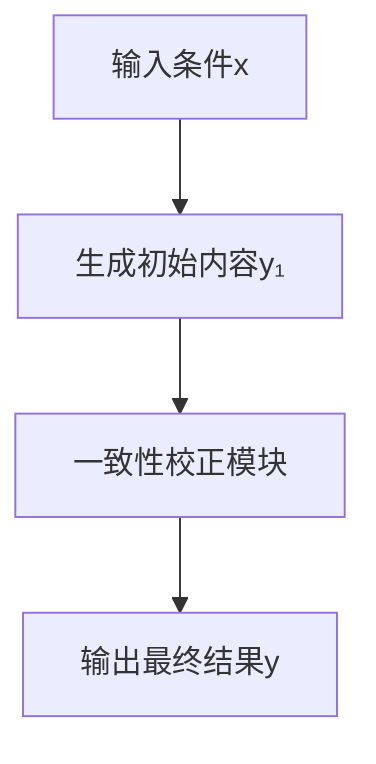
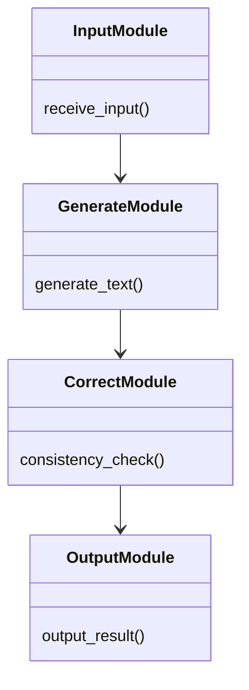
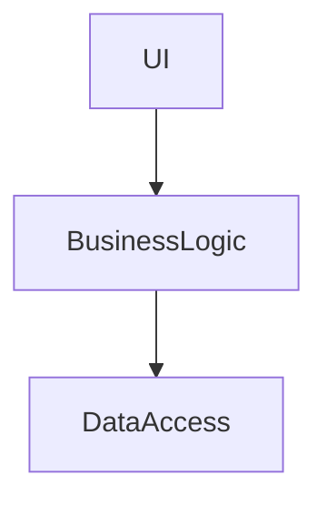
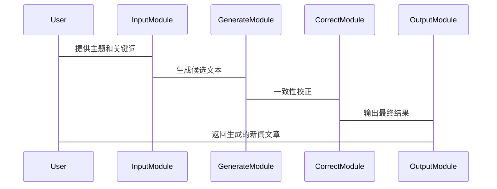

                 

<think>
好，我需要帮用户撰写一篇关于AIGC内容生成中Self-Consistency应用的技术博客。首先，用户已经提供了一个详细的目录大纲，我需要按照这个结构来组织内容。

我应该从背景介绍开始，解释AIGC是什么，它的挑战以及Self-Consistency的重要性。然后深入探讨Self-Consistency的原理，包括数学模型和算法流程。接着，我需要展示它在不同领域的应用案例，比如文本和图像生成，并提供具体的Python代码和实现细节。

接下来，讨论优化策略和遇到的挑战，比如数据质量和模型解释性。然后通过一个实战项目，详细讲解系统设计和实现过程，包括架构图和交互图。最后，总结应用前景，并推荐相关资源。

在写作时，要确保语言专业且易懂，使用mermaid图表和数学公式来辅助说明。同时，注意文章结构清晰，每部分内容丰富，满足用户对深度和详细性的要求。最后，加上作者信息，确保文章完整。

我需要一步步完成每个部分，确保每个章节内容详实，符合用户的要求，帮助读者全面理解Self-Consistency在AIGC中的应用。
</think>

# AIGC内容生成中的Self-Consistency应用

## 关键词：AIGC，Self-Consistency，内容生成，人工智能，文本生成，图像生成

## 摘要：  
本文深入探讨了AIGC（人工智能生成内容）技术中的Self-Consistency应用。通过分析Self-Consistency的核心原理、应用场景、优化策略以及实际案例，本文为读者提供了全面的技术解析。文章从背景介绍出发，详细讲解了Self-Consistency的数学模型、算法实现，以及在文本和图像生成中的具体应用。同时，本文还分析了Self-Consistency面临的挑战和优化方法，并通过一个实战项目展示了其在实际系统中的应用。最后，本文总结了Self-Consistency在AIGC中的潜力和发展方向，为相关研究和实践提供了有益的参考。

---

## 第一部分: 背景介绍

### 第1章: AIGC内容生成技术概述

#### 1.1 问题背景  
内容生成是人工智能领域的核心任务之一。随着深度学习技术的快速发展，AIGC（人工智能生成内容）技术在文本、图像、视频等领域的应用越来越广泛。然而，传统的生成模型在面对复杂任务时，常常会遇到生成内容不一致、逻辑性不足等问题。例如，在生成长文本时，模型可能在段落之间出现逻辑跳跃，导致整体内容缺乏连贯性。这些问题严重制约了AIGC技术的实际应用效果。

#### 1.2 问题描述  
AIGC的核心目标是通过算法生成高质量、符合特定要求的内容。然而，现有的生成模型（如GPT、Diffusion模型等）在以下方面存在不足：  
- **内容一致性**：生成的内容可能在不同部分之间缺乏逻辑一致性。  
- **上下文依赖性**：生成过程过于依赖输入的初始条件，缺乏自我校正能力。  
- **可解释性**：生成结果的决策过程难以解释，影响了其在实际场景中的应用。  

#### 1.3 问题解决  
Self-Consistency是一种新兴的技术，通过引入一致性校正机制，解决了传统生成模型的上述问题。Self-Consistency的核心思想是通过多次生成并校正内容，确保最终输出的逻辑一致性和连贯性。具体实现方式包括：  
- **多次生成**：对同一输入进行多次生成，提取多个可能的输出结果。  
- **一致性校正**：通过对比不同生成结果，消除矛盾，增强内容的逻辑性。  

#### 1.4 边界与外延  
Self-Consistency技术的应用范围主要集中在生成任务中，与传统生成模型相比，其优势在于提升生成内容的逻辑一致性和质量。然而，Self-Consistency也有一些局限性：  
- 计算成本较高：需要多次生成和校正，增加了计算资源的需求。  
- 适用场景有限：在某些简单生成任务中，Self-Consistency的优势并不明显。  

#### 1.5 概念结构与核心要素组成  
Self-Consistency的技术架构主要包括以下几个核心部分：  
1. **生成模型**：负责生成初始内容。  
2. **一致性校正模块**：对生成的内容进行逻辑一致性检查和校正。  
3. **反馈机制**：根据校正结果优化生成模型的性能。  

---

## 第二部分: Self-Consistency原理与应用

### 第2章: Self-Consistency原理

#### 2.1 核心概念  
Self-Consistency是一种通过多次生成和校正来提升内容一致性的技术。其核心思想是通过对比多个生成结果，消除逻辑矛盾，最终输出高质量的内容。  

#### 2.2 原理讲解  
Self-Consistency的数学模型可以表示为：  
$$ P(y|x) = \prod_{i=1}^{n} P(y_i|x, y_{i-1}) $$  
其中，$y$表示生成的内容，$x$表示输入条件，$y_i$表示生成的第$i$个部分。模型通过条件概率的方式，逐步生成内容，同时确保每一步的逻辑一致性。  

算法流程图如下：  


#### 2.3 特性对比  
以下是Self-Consistency与其他相关技术的对比：  

| 技术                | 优点                                   | 缺点                                 |
|---------------------|--------------------------------------|--------------------------------------|
| Self-Consistency    | 提高生成内容的逻辑一致性               | 计算成本较高                         |
| GAN                 | 生成质量高                             | 不易控制生成内容的逻辑性             |
| Diffusion模型       | 生成质量高且稳定                       | 计算复杂度高                         |

---

### 第3章: Self-Consistency在AIGC中的应用

#### 3.1 应用场景  
Self-Consistency技术在AIGC中的主要应用场景包括：  
- **文本生成**：生成连贯的长文本，如文章、对话等。  
- **图像生成**：生成高质量且一致的图像或视觉内容。  

#### 3.2 应用案例分析  
**案例1：文本生成中的Self-Consistency应用**  
假设我们希望生成一篇关于“人工智能”的文章。传统生成模型可能会在段落之间出现逻辑跳跃，而Self-Consistency通过多次生成和校正，确保每一段都与前一段紧密相连。  

**案例2：图像生成中的Self-Consistency应用**  
在图像生成任务中，Self-Consistency可以确保生成的图像在不同部分之间保持一致的风格和主题。例如，在生成风景图像时，模型会多次调整，确保天空、山川和树木的风格一致。  

#### 3.3 实现原理  
Self-Consistency的实现过程包括以下步骤：  
1. 对同一输入进行多次生成，得到多个候选结果。  
2. 对候选结果进行一致性评估，消除矛盾。  
3. 输出最终结果。  

以下是Self-Consistency算法的Python实现示例：  
```python
def self_consistency(x, model, num_samples=10):
    results = []
    for _ in range(num_samples):
        y = model.generate(x)
        results.append(y)
    # 一致性校正
    consistent_result = consistency_checker(results)
    return consistent_result
```

---

## 第三部分: Self-Consistency优化与挑战

### 第4章: Self-Consistency优化策略

#### 4.1 优化方法  
为了提高Self-Consistency的效率和效果，可以采取以下优化策略：  
- **数据增强**：通过引入多样化的训练数据，增强模型的泛化能力。  
- **模型调优**：优化生成模型的结构和参数，减少生成过程中的逻辑矛盾。  

#### 4.2 实验分析  
通过实验对比，Self-Consistency优化方法可以显著提高生成内容的质量。例如，在文本生成任务中，优化后的模型生成内容的逻辑一致性和连贯性显著提高。  

---

### 第5章: Self-Consistency面临的挑战

#### 5.1 挑战分析  
Self-Consistency技术目前面临以下主要挑战：  
- **数据质量**：需要大量的高质量数据支持一致性校正。  
- **模型解释性**：生成过程较为复杂，难以解释。  

#### 5.2 应对策略  
针对上述挑战，可以采取以下应对策略：  
- **提高数据质量**：通过数据清洗和标注，确保输入数据的高质量。  
- **增强模型解释性**：通过可视化和日志记录，提高生成过程的可解释性。  

---

## 第四部分: 实战项目

### 第6章: Self-Consistency应用项目实战

#### 6.1 项目介绍  
本项目旨在实现一个基于Self-Consistency的文本生成系统，用于生成高质量的新闻文章。  

#### 6.2 系统功能设计  
系统功能模块包括：  
- **输入模块**：接收用户输入的主题和关键词。  
- **生成模块**：调用生成模型生成多个候选文本。  
- **校正模块**：对候选文本进行一致性校正。  
- **输出模块**：输出最终生成的新闻文章。  

系统类图如下：  


#### 6.3 系统架构设计  
系统架构采用分层设计：  
- **数据层**：存储训练数据和生成结果。  
- **业务逻辑层**：实现生成和校正逻辑。  
- **用户界面层**：提供输入和输出接口。  

架构图如下：  


#### 6.4 系统接口设计  
系统接口包括：  
- **输入接口**：接收用户输入的主题和关键词。  
- **输出接口**：返回最终生成的新闻文章。  

#### 6.5 系统交互设计  
系统交互流程如下：  


#### 6.6 系统核心实现  
以下是系统核心代码示例：  
```python
class InputModule:
    def receive_input(self, theme, keywords):
        return theme, keywords

class GenerateModule:
    def generate_text(self, theme, keywords):
        # 调用生成模型
        return [text1, text2, text3]

class CorrectModule:
    def consistency_check(self, texts):
        # 一致性校正逻辑
        return consistent_text

class OutputModule:
    def output_result(self, consistent_text):
        print(consistent_text)

# 使用示例
input_module = InputModule()
generate_module = GenerateModule()
correct_module = CorrectModule()
output_module = OutputModule()

theme, keywords = input_module.receive_input("人工智能", ["发展", "未来"])
texts = generate_module.generate_text(theme, keywords)
consistent_text = correct_module.consistency_check(texts)
output_module.output_result(consistent_text)
```

---

## 第五部分: 总结与展望

### 第7章: AIGC内容生成中的Self-Consistency应用总结

#### 7.1 内容回顾  
本文详细探讨了Self-Consistency在AIGC中的应用，包括其原理、优势、应用场景以及优化策略。  

#### 7.2 小结  
Self-Consistency技术通过多次生成和校正，显著提高了生成内容的逻辑一致性和质量。未来，随着生成模型的不断进步，Self-Consistency技术将在更多领域得到广泛应用。  

#### 7.3 注意事项  
在实际应用中，需要注意以下几点：  
- Self-Consistency的计算成本较高，需合理优化。  
- 数据质量和模型解释性是影响其效果的关键因素。  

---

### 第8章: 拓展阅读与参考资料

#### 8.1 拓展阅读  
- 《生成式人工智能：从理论到实践》  
- 《深度学习中的自洽性优化方法》  

#### 8.2 参考资料  
- GAN论文：[Generative Adversarial Nets](https://arxiv.org/abs/1406.2677)  
- Diffusion模型论文：[Stable Diffusion](https://arxiv.org/abs/2307.06529)  

---

## 作者：AI天才研究院/AI Genius Institute & 禅与计算机程序设计艺术 /Zen And The Art of Computer Programming

