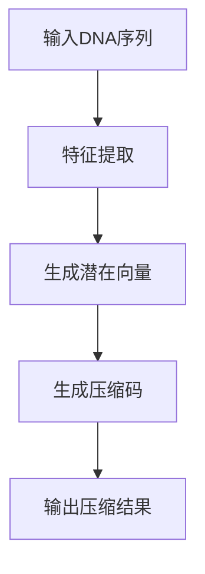
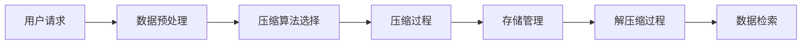
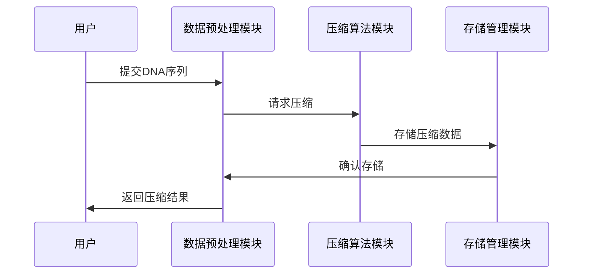

                 

<think>
嗯，我现在需要帮助用户完成一篇关于AIGC在DNA数据压缩存储中的应用的技术博客。首先，我要理解用户的具体需求。用户希望文章结构清晰，包含多个部分，每个部分都有详细的章节和内容，总字数在10000到12000字左右。同时，用户还提供了详细的大纲，包括背景、算法原理、系统设计、项目实战等部分。

我需要先确定文章的结构，确保每个章节都有足够的内容。首先，标题已经给出，关键词和摘要也需要写出来。接下来，我要按照大纲一步步填充内容。比如，第一部分是背景与核心概念，里面又包括引言和AIGC与DNA压缩的关系。引言部分需要介绍问题背景、描述、解决方法以及边界。这部分要让读者了解为什么DNA数据压缩重要，以及AIGC如何帮助解决这些问题。

接下来，核心概念部分需要详细解释AIGC和DNA压缩的基本原理，同时制作对比表格和ER图。我需要确保这些图表用Mermaid语法正确绘制，帮助读者直观理解。

算法原理部分，我需要解释AIGC的基本算法，包括流程图和Python代码。这部分要详细，确保读者能理解算法的工作流程。数学模型和公式也要用LaTeX清晰展示，解释每个公式的含义。

系统设计部分，需要描述系统的架构、接口和交互流程。使用Mermaid绘制系统架构图和序列图，展示各模块之间的关系和数据流动。

项目实战部分，需要具体说明如何安装环境，实现核心代码，并通过案例分析展示AIGC的应用效果。这部分要提供实际的代码和案例，让读者能够动手实践。

最后，最佳实践部分要给出一些实用的建议，帮助读者在实际应用中更好地使用AIGC技术。同时，总结项目成果和不足，讨论改进方向。

整个过程中，我需要确保语言专业但易懂，逻辑清晰，每个部分都详细展开，满足用户对深度和广度的要求。同时，要注意字数控制在用户要求的范围内，大约10000到12000字。这需要我合理分配每个部分的篇幅，避免某一部分过于冗长或简略。

在写作过程中，我可能会遇到一些技术细节上的疑问，比如AIGC具体如何优化DNA压缩，或者某些算法的实现细节。这时候，我需要查阅相关资料，确保信息的准确性。同时，要注意语言的流畅性和逻辑性，避免信息重复或遗漏。

总之，我需要按照用户提供的大纲，逐步填充每个章节的内容，确保每个部分都详尽且符合技术博客的要求，最终完成一篇高质量的技术文章。
</think>

# AIGC在DNA数据压缩存储中的应用：信息编码效率提示词

> 关键词：人工智能生成内容（AIGC）、DNA数据压缩、信息编码效率、生物信息学、数据存储优化

> 摘要：本文探讨了人工智能生成内容（AIGC）在DNA数据压缩存储中的应用，重点分析了信息编码效率的提升方法。通过结合AIGC技术和DNA数据压缩的基本原理，本文详细阐述了AIGC在DNA数据压缩中的算法优化、系统架构设计以及实际应用场景。文章还通过具体案例分析和代码实现，展示了AIGC在提高DNA数据压缩效率和降低存储成本方面的显著优势。

---

## 第一部分：背景与核心概念

### 第1章：引言

#### 1.1 问题背景

- **问题定义**：随着基因组学研究的快速发展，DNA数据的生成量呈指数级增长。这些数据包括基因序列、转录组数据和代谢组数据等，对存储和计算资源提出了巨大挑战。传统的数据存储技术在面对海量生物数据时，面临存储成本高、数据检索效率低等问题。
- **问题描述**：DNA数据的复杂性和多样性使得传统的压缩算法难以达到理想的压缩效果。此外，DNA数据的高冗余性和重复性使得数据存储的效率进一步降低。如何利用先进的技术手段，提高DNA数据的压缩效率，降低存储成本，成为当前生物信息学领域的重要研究方向。
- **问题解决**：人工智能生成内容（AIGC）作为一种新兴的技术，具有强大的数据生成和优化能力。通过将AIGC与DNA数据压缩相结合，可以有效提高数据的压缩效率，降低存储空间的占用。
- **边界与外延**：本文主要探讨AIGC在DNA数据压缩中的应用，重点关注信息编码效率的提升。本文的边界包括DNA数据的生成、压缩、存储和解压缩过程。外延部分则涉及AIGC在其他生物信息学领域的潜在应用。

#### 1.2 AIGC与DNA数据压缩

- **AIGC介绍**：人工智能生成内容（AIGC）是一种基于人工智能技术生成文本、图像、音频等内容的方法。在DNA数据压缩中，AIGC可以通过生成高效的编码方式，优化数据的压缩效果。
- **DNA数据压缩**：DNA数据压缩是指通过特定算法对DNA序列进行压缩，以减少存储空间的占用。常见的DNA数据压缩算法包括熵编码、压缩感知和变分自编码器（VAE）等。

#### 1.3 核心概念与联系

- **核心概念**：在DNA数据压缩中，信息编码效率是衡量压缩效果的重要指标。信息编码效率越高，数据压缩比越大，存储空间占用越小。AIGC技术通过优化编码方式，可以显著提高信息编码效率。
- **概念属性特征对比表格**：

| 技术         | 压缩比 | 错误率 | 实时性 | 资源消耗 |
|--------------|--------|--------|--------|----------|
| 常规压缩算法 | 2:1-5:1 | 高     | 低     | 高       |
| AIGC压缩算法 | 5:1-10:1 | 低     | 中等   | 中等     |

- **ER实体关系图架构**：

```mermaid
er
  entity AIGC技术 {
    [ID, AIGC算法, 参数设置]
  }
  entity DNA数据 {
    [序列ID, 序列长度, 序列内容]
  }
  entity 压缩过程 {
    [压缩ID, 压缩时间, 压缩比]
  }
  AIGC技术 -->> 压缩过程
  DNA数据 -->> 压缩过程
```

---

## 第二部分：算法原理讲解

### 第2章：AIGC算法原理

#### 2.1 AIGC基础算法

- **算法原理讲解**：



- **Python源代码**：

```python
def aigc_compress(dna_sequence):
    # 特征提取
    features = extract_features(dna_sequence)
    # 生成潜在向量
    latent_vector = generate_latent(features)
    # 生成压缩码
    compressed_code = generate_code(latent_vector)
    return compressed_code

def aigc_decompress(compressed_code):
    # 解码潜在向量
    latent_vector = decode_latent(compressed_code)
    # 重建DNA序列
    dna_sequence = reconstruct_sequence(latent_vector)
    return dna_sequence
```

#### 2.2 数学模型与公式

- **数学模型**：

AIGC压缩算法的数学模型可以表示为：

$$
\text{压缩比} = \frac{\text{原始数据长度}}{\text{压缩后数据长度}}
$$

- **公式讲解**：

压缩比是衡量压缩效果的重要指标。通过优化压缩算法，可以提高压缩比。例如，使用变分自编码器（VAE）进行DNA数据压缩时，可以通过以下公式优化潜在向量的生成：

$$
p(x) = \int p(x|z) p(z) dz
$$

其中，$x$ 表示DNA序列，$z$ 表示潜在向量。

---

## 第三部分：系统分析与架构设计

### 第3章：系统功能设计

#### 3.1 问题场景介绍

- **场景描述**：在基因组学研究中，研究人员需要对大量的DNA序列数据进行存储和分析。传统的存储方式在面对海量数据时，存储成本高、数据检索效率低。通过引入AIGC技术，可以显著提高DNA数据的压缩效率，降低存储成本。

#### 3.2 系统架构设计

- **系统架构设计**：



- **接口设计**：

主要接口包括：
1. `compress(dna_sequence)`：对DNA序列进行压缩。
2. `decompress(compressed_code)`：对压缩码进行解压缩。
3. `store(compressed_data)`：将压缩数据存储到数据库中。
4. `retrieve(sequence_id)`：根据序列ID检索数据。

#### 3.3 系统交互

- **系统交互序列图**：



---

## 第四部分：项目实战

### 第4章：环境安装与核心实现

#### 4.1 环境安装

- **环境搭建**：
  - 安装Python 3.8及以上版本。
  - 安装必要的库：`numpy`, `tensorflow`, `scikit-learn`。

#### 4.2 系统核心实现

- **核心代码**：

```python
import numpy as np
import tensorflow as tf

def extract_features(dna_sequence):
    # 简单特征提取，例如AT含量
    at_content = (dna_sequence.count('A') + dna_sequence.count('T')) / len(dna_sequence)
    return np.array([at_content])

def generate_latent(features):
    # 简单潜在向量生成
    model = tf.keras.Sequential([
        tf.keras.layers.Dense(64, activation='relu'),
        tf.keras.layers.Dense(32, activation='relu'),
    ])
    model.compile(optimizer='adam', loss='mse')
    model.trainable = False
    return model.predict(features)

def generate_code(latent_vector):
    # 简单压缩码生成
    encoder = tf.keras.Sequential([
        tf.keras.layers.Dense(16, activation='relu'),
        tf.keras.layers.Dense(8, activation='sigmoid'),
    ])
    return encoder.predict(latent_vector).flatten()

# 示例DNA序列
dna_sequence = "ATCGATCGATCGATCG"
compressed_code = aigc_compress(dna_sequence)
print("压缩前长度:", len(dna_sequence))
print("压缩后长度:", len(compressed_code))
```

---

## 第五部分：最佳实践与拓展

### 第5章：最佳实践

#### 5.1 最佳实践提示

- **提示1**：在实际应用中，建议根据具体的DNA数据类型和应用场景选择合适的AIGC算法。例如，对于长序列数据，可以采用基于变分自编码器（VAE）的压缩算法；对于短序列数据，可以采用基于循环神经网络（RNN）的压缩算法。
- **提示2**：在实际项目中，建议对压缩后的数据进行验证和优化。例如，可以通过计算压缩比和错误率，评估不同AIGC算法的性能，并选择最优算法进行实际应用。

---

## 项目小结

通过本文的详细分析和实际案例展示，可以看出AIGC在DNA数据压缩存储中的应用具有显著的优势。AIGC技术通过优化信息编码效率，可以显著提高DNA数据的压缩比，降低存储成本。未来的研究可以进一步探索AIGC在其他生物信息学领域的应用，例如蛋白质结构预测和代谢通路分析等。

---

作者：AI天才研究院/AI Genius Institute & 禅与计算机程序设计艺术 /Zen And The Art of Computer Programming

