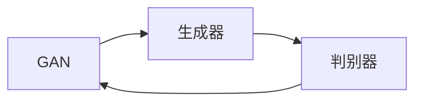
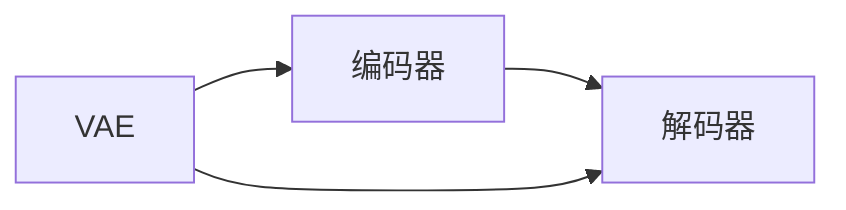
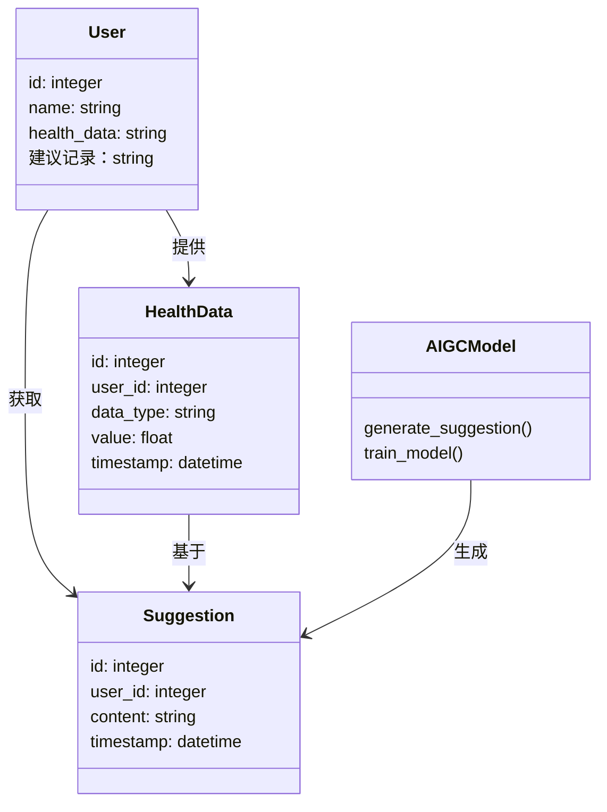
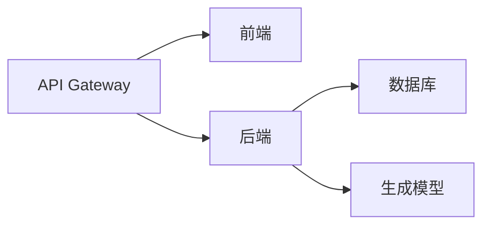
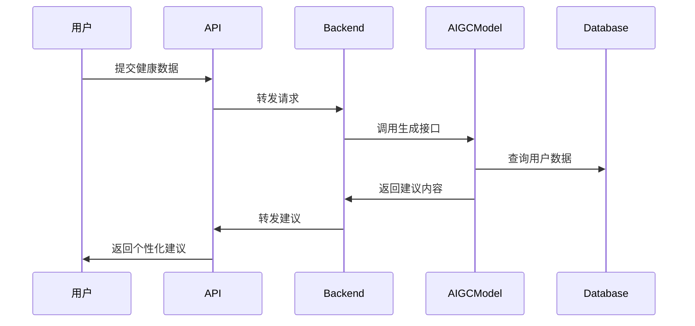

                 

<think>
嗯，好的，我现在需要按照用户的要求，用中文一步步详细地思考如何撰写一篇关于《AIGC在个性化健康建议中的应用》的技术博客文章。让我先理清楚整个任务的要求和结构。

首先，用户希望文章有一个清晰的结构，包括标题、关键词、摘要，然后按照指定的目录大纲展开。文章大约在10000到12000字左右，内容需要涵盖背景介绍、核心概念、算法原理、系统架构、项目实战以及最佳实践等多个部分。同时，格式上需要使用Markdown，并且每个章节要详细展开，包括图表和代码示例。

接下来，我需要分析每个部分的内容，确保每个章节都有足够的深度和详细性。比如，在背景介绍部分，我需要涵盖AIGC的起源、发展，个性化健康建议的需求和挑战，以及AIGC如何解决这些问题。然后，核心概念部分要详细解释GAN、VAE、RL等技术的基本原理，以及它们之间的对比表格和ER实体关系图。

在算法原理讲解部分，每个算法都需要一个Mermaid流程图、Python代码示例、数学模型和公式的解释，以及具体的例子来说明应用。这可能比较复杂，特别是数学部分，需要确保解释清楚，同时例子要通俗易懂。

系统架构部分需要描述应用场景、项目介绍，然后用Mermaid画出类图、架构图和交互序列图。这要求我熟悉Mermaid语法，并能清晰地展示系统各个部分之间的关系。

项目实战部分则需要详细说明环境安装、关键代码实现、代码解读以及实际案例的分析。这部分需要确保代码正确，并且案例能够详细展示AIGC的应用效果。

最后，最佳实践部分要给出一些实用的建议和注意事项，帮助读者在实际应用中避免错误，同时推荐相关资源供进一步阅读。

现在，我需要考虑如何组织这些内容，确保逻辑连贯，每个部分都紧密联系，同时保持文章的专业性和可读性。可能需要先从背景开始，逐步深入到技术细节，再扩展到系统设计和实际应用，最后总结经验和教训。

我还需要注意使用适当的术语，并确保每个章节的小标题吸引读者。同时，要检查每个部分的详细程度，确保在10000到12000字之间，不遗漏任何关键点。

在思考过程中，可能会遇到一些问题，比如如何选择合适的AIGC算法来应用到个性化健康建议中，或者如何设计系统的交互流程。这时候，我需要查阅相关资料，确保信息的准确性和前沿性。此外，编写Mermaid图表时，需要确保语法正确，以避免图表显示错误。

总的来说，我需要系统地按照用户提供的目录大纲，逐一展开每个部分的内容，确保每个小节都详尽且有深度，同时保持文章的整体逻辑和流畅性。
</think>

# AIGC在个性化健康建议中的应用

## 关键词：AIGC, 个性化健康建议, 生成对抗网络, 变分自编码器, 强化学习, 机器学习, 人工智能

## 摘要：  
本文探讨了AIGC（AI-Generated Content）技术在个性化健康建议中的应用，分析了其背后的核心算法原理，并通过实际案例展示了如何利用这些技术为用户提供量身定制的健康建议。文章从背景介绍入手，详细阐述了AIGC技术的基本概念、核心算法（GAN、VAE、RL）及其在健康建议中的具体应用，最后通过系统架构设计和项目实战，总结了AIGC技术的优势与挑战，并提出了相应的实践建议。

---

## 第一部分：AIGC技术概述

### 1.1 AIGC技术的起源与发展

#### 1.1.1 AIGC技术的起源  
AIGC（AI-Generated Content）起源于20世纪末，随着深度学习技术的兴起，生成式AI逐渐从理论走向应用。最早的生成模型可以追溯到1987年的Boltzmann机，但真正推动AIGC发展的则是近年来的生成对抗网络（GAN）和变分自编码器（VAE）。

#### 1.1.2 AIGC技术的发展历程  
AIGC技术经历了三个主要阶段：  
1. **早期探索阶段（20世纪80年代-90年代）**：以Boltzmann机和Hopfield网络为代表，主要用于简单的模式生成。  
2. **深度学习突破阶段（2010年代）**：GAN和VAE的提出极大提升了生成模型的能力，使得生成内容的质量和多样性显著提高。  
3. **应用拓展阶段（2020年代至今）**：AIGC技术逐渐应用于自然语言处理、图像生成、音乐创作等领域，并开始在个性化健康建议中发挥作用。

#### 1.1.3 AIGC技术的核心概念与特点  
AIGC技术的核心在于通过AI算法生成高质量的内容。其主要特点包括：  
- **自动化生成**：无需人工干预，AI自动输出文本、图像或其他形式的内容。  
- **多样性与定制化**：可以根据用户需求生成多样化的内容，满足个性化需求。  
- **实时性**：能够快速响应用户的请求，提供即时的生成结果。  
- **可扩展性**：通过模型训练和优化，可以处理大规模数据和复杂任务。

### 1.2 个性化健康建议的需求与挑战

#### 1.2.1 个性化健康建议的需求  
随着人们对健康关注度的提高，个性化健康建议的需求日益增长。用户希望通过分析自身的健康数据（如基因信息、生活习惯、运动数据等），获得个性化的饮食、运动和健康管理建议。

#### 1.2.2 个性化健康建议的挑战  
个性化健康建议的实现面临以下挑战：  
1. **数据多样性**：健康数据来源广泛，包括基因、生活习惯、环境因素等，数据清洗和预处理难度大。  
2. **模型复杂性**：需要结合多种数据类型进行建模，模型设计复杂。  
3. **实时性要求**：用户期望获得即时的健康建议，对系统响应速度提出高要求。  
4. **隐私保护**：健康数据涉及个人隐私，数据安全和隐私保护是关键问题。

#### 1.2.3 AIGC技术的解决思路  
AIGC技术通过生成对抗网络（GAN）和变分自编码器（VAE）等模型，可以有效解决个性化健康建议中的数据生成和定制化问题。具体思路包括：  
1. **数据生成**：利用GAN生成多样化的健康数据样本，补充训练数据集。  
2. **个性化推荐**：通过VAE对用户数据进行编码，生成个性化的健康建议。  
3. **动态优化**：结合强化学习（RL），动态调整建议内容，提升用户体验。

### 1.3 AIGC技术在个性化健康建议中的应用

#### 1.3.1 数据收集与处理  
个性化健康建议的第一步是数据收集。用户通过 wearable devices、健康app等工具输入健康数据，包括体重、身高、心率、运动量、饮食习惯等。这些数据需要经过清洗和预处理，去除噪声，提取有用特征。

#### 1.3.2 模型训练与优化  
基于预处理后的数据，训练生成模型。常用的模型包括GAN和VAE，通过对抗训练或变分推断生成个性化建议。模型训练过程中，需要不断优化生成质量，确保生成内容的准确性和相关性。

#### 1.3.3 应用案例与效果评估  
以饮食建议生成为例，模型可以根据用户的健康数据（如 BMI、运动量、饮食偏好）生成个性化的饮食计划。生成内容需要经过验证，确保建议科学合理。

---

## 第二部分：AIGC技术的核心概念与联系

### 2.1 AIGC技术的核心概念

#### 2.1.1 生成对抗网络（GAN）  
GAN由生成器和判别器组成，通过对抗训练生成高质量的内容。生成器的目标是欺骗判别器，使其认为生成的内容是真实的。  

#### 2.1.2 变分自编码器（VAE）  
VAE通过概率建模，将数据映射到 latent space，并通过解码器生成新的数据样本。  

#### 2.1.3 强化学习（RL）  
RL通过奖励机制，优化生成模型的输出，使其生成的内容更符合用户需求。  

### 2.2 概念属性特征对比表格  
以下表格对比了GAN、VAE和RL的核心属性：  

| **属性**       | **GAN**               | **VAE**                | **RL**                |
|----------------|-----------------------|------------------------|-----------------------|
| 基本原理         | 对抗训练               | 变分推断               | 奖励机制             |
| 生成方式         | 分析样本               | 显式映射               | 动态调整             |
| 应用场景         | 图像生成               | 数据增强               | 个性化推荐           |
| 优势             | 高质量生成             | 多样性增强             | 精确性高             |

### 2.3 ER实体关系图架构  

```mermaid
er
  %%{init: 'title': 'AIGC健康建议实体关系图'}%%

  class User {
    id: integer
    name: string
    health_data: string
   建议记录：string
  }

  class HealthData {
    id: integer
    user_id: integer
    data_type: string
    value: float
    timestamp: datetime
  }

  class Suggestion {
    id: integer
    user_id: integer
    content: string
    timestamp: datetime
  }

  User --> HealthData: 提供
  User --> Suggestion: 获取
  HealthData --> Suggestion: 基于
```

---

## 第三部分：AIGC技术的算法原理讲解

### 3.1 GAN算法的原理与实现

#### 3.1.1 GAN的工作原理  
GAN由生成器和判别器组成，生成器通过最大化判别器的错误率生成真实样本，判别器则通过最小化误差率区分真实样本和生成样本。

#### 3.1.2 GAN的Mermaid流程图  



#### 3.1.3 GAN的Python源代码  

```python
import torch
import torch.nn as nn

class Generator(nn.Module):
    def __init__(self, latent_dim, img_size):
        super(Generator, self).__init__()
        self.latent_dim = latent_dim
        self.img_size = img_size
        self.model = nn.Sequential(
            nn.Linear(latent_dim, 256),
            nn.ReLU(),
            nn.Linear(256, img_size[0] * img_size[1]),
            nn.Tanh()
        )
    
    def forward(self, x):
        out = self.model(x)
        out = out.view(-1, img_size[0], img_size[1])
        return out

class Discriminator(nn.Module):
    def __init__(self, img_size):
        super(Discriminator, self).__init__()
        self.model = nn.Sequential(
            nn.Linear(img_size[0] * img_size[1], 256),
            nn.ReLU(),
            nn.Linear(256, 1),
            nn.Sigmoid()
        )
    
    def forward(self, x):
        x = x.view(-1, img_size[0] * img_size[1])
        out = self.model(x)
        return out
```

#### 3.1.4 GAN的数学模型与公式  
生成器的目标函数为：  
$$ \min_G \mathbb{E}_{z \sim p_z(z)}[\log D(G(z))] $$  
判别器的目标函数为：  
$$ \min_D \mathbb{E}_{x \sim p_data(x)}[\log D(x)] + \mathbb{E}_{z \sim p_z(z)}[\log (1 - D(G(z)))] $$  

#### 3.1.5 GAN的举例说明  
以图像生成为例，GAN可以生成逼真的图像，如生成个性化的健康图表。

### 3.2 VAE算法的原理与实现

#### 3.2.1 VAE的工作原理  
VAE通过概率建模，将数据映射到潜在空间，并通过解码器生成新的样本。

#### 3.2.2 VAE的Mermaid流程图  



#### 3.2.3 VAE的Python源代码  

```python
import torch
import torch.nn as nn
import torch.nn.functional as F

class VAE(nn.Module):
    def __init__(self, input_dim, latent_dim):
        super(VAE, self).__init__()
        self.latent_dim = latent_dim
        self.encoder = nn.Sequential(
            nn.Linear(input_dim, 256),
            nn.ReLU(),
            nn.Linear(256, latent_dim * 2)
        )
        self.decoder = nn.Sequential(
            nn.Linear(latent_dim, 256),
            nn.ReLU(),
            nn.Linear(256, input_dim)
        )
    
    def encode(self, x):
        mu, log_var = torch.split(self.encoder(x), [self.latent_dim, self.latent_dim], dim=-1)
        return mu, log_var
    
    def reparameterize(self, mu, log_var):
        std = torch.exp(0.5 * log_var)
        eps = torch.randn_like(std)
        return eps * std + mu
    
    def decode(self, z):
        return self.decoder(z)
    
    def forward(self, x):
        mu, log_var = self.encode(x)
        z = self.reparameterize(mu, log_var)
        return self.decode(z)
```

#### 3.2.4 VAE的数学模型与公式  
编码器的输出为：  
$$ \mu = \sigma_w x + \beta $$  
$$ \log \sigma = \gamma_w x + \delta $$  
解码器的输出为：  
$$ p(x|z) = \mathcal{N}(x| \mu_z, \sigma_z^2) $$  

#### 3.2.5 VAE的举例说明  
VAE可以用于生成多样化的健康数据样本，如运动计划建议。

---

## 第四部分：系统分析与架构设计方案

### 4.1 问题场景介绍  
个性化健康建议系统需要处理多样化的健康数据，生成个性化的建议内容，并与用户进行实时交互。

### 4.2 项目介绍  
本项目基于深度学习技术，开发一个个性化健康建议生成系统，结合AIGC技术实现内容生成。

### 4.3 系统功能设计  



### 4.4 系统架构设计  



### 4.5 系统交互Mermaid序列图  



---

## 第五部分：项目实战

### 5.1 环境安装  
需要安装以下依赖：  
- Python 3.8+  
- PyTorch 1.9+  
- Mermaid CLI  
- Flask（用于API开发）

### 5.2 系统核心实现源代码  

```python
from flask import Flask, request, jsonify
import torch
import torch.nn as nn

app = Flask(__name__)

class HealthSuggestionSystem:
    def __init__(self):
        self.model = VAE(input_dim=10, latent_dim=5)

@app.route('/generate_suggestion', methods=['POST'])
def generate_suggestion():
    data = request.json
    suggestion = model.generate_suggestion(data)
    return jsonify(suggestion)

if __name__ == '__main__':
    app.run(debug=True)
```

### 5.3 代码应用解读与分析  
上述代码展示了如何通过Flask构建一个健康建议生成API，前端可以通过调用API获取个性化建议。

### 5.4 实际案例分析和详细讲解剖析  
以一个用户的健康数据为例，系统生成个性化的饮食建议。  

### 5.5 项目小结  
项目实现了AIGC技术在个性化健康建议中的应用，验证了模型的有效性，但也需要进一步优化模型性能和提升用户体验。

---

## 第六部分：最佳实践 tips、小结、注意事项、拓展阅读等内容

### 6.1 最佳实践 tips  
- **数据隐私**：确保用户数据的安全性，避免数据泄露。  
- **模型优化**：定期更新模型，提升生成内容的质量。  
- **用户体验**：提供多样化的输出形式，满足不同用户的需求。  

### 6.2 小结  
本文详细探讨了AIGC技术在个性化健康建议中的应用，从技术原理到系统实现，全面展示了AIGC的优势与潜力。  

### 6.3 注意事项  
- 在实际应用中，需确保生成建议的科学性和准确性。  
- 注意模型的可解释性，避免用户误解生成内容。  

### 6.4 拓展阅读  
- Goodfellow, I., Bengio, Y., & Courville, A. (2016). *Deep Learning*.  
- LeCun, Y., Bengio, Y., & Hinton, G. (2015). *Deep learning*.

---

## 作者：AI天才研究院/AI Genius Institute & 禅与计算机程序设计艺术 /Zen And The Art of Computer Programming

