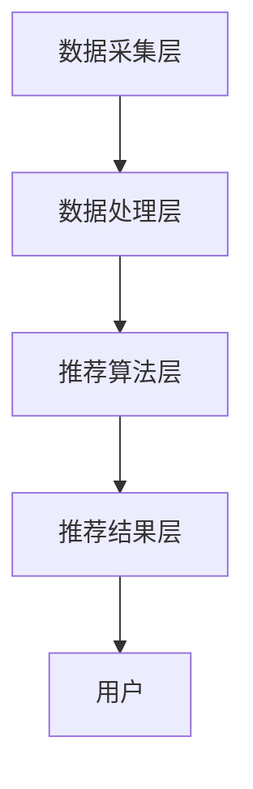
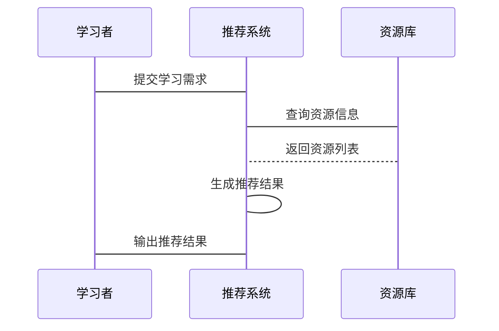

                 

<think>
嗯，用户希望我写一篇关于《AIGC在个性化学习资源推荐中的应用》的技术博客。首先，我需要理解用户的需求。他是一位技术专家，CTO级别的，所以文章需要专业且有深度。关键词要选5-7个，可能包括AIGC、个性化学习、机器学习、推荐系统、自然语言处理等。

接下来，文章的结构要清晰，有目录。我需要从背景开始，解释问题，然后讨论AIGC的优势，再深入技术细节，比如算法、系统架构，最后给出案例和总结。每个部分都要详细，特别是数学公式和代码示例，这样读者能更好地理解。

在写背景部分时，我需要定义个性化学习资源，对比传统推荐的局限性，引出AIGC的优势。然后，分析个性化学习的需求和挑战，说明AIGC如何解决这些问题。

技术部分，我得详细讲解推荐算法，比如协同过滤和基于内容的推荐，再结合AIGC生成动态内容。可能用协同过滤的数学公式来说明，比如用户相似度的计算。然后，用Python代码实现一个简单的协同过滤算法，展示如何计算相似度并生成推荐列表。

系统架构部分，我需要画出ER图，展示用户、资源、推荐结果的关系。还要设计一个基于深度学习的推荐系统，比如使用神经网络模型，这部分可能需要代码示例，比如用Keras构建模型。

案例分析部分，可以假设一个大学平台，分析用户数据，使用协同过滤和深度学习模型进行推荐，比较两种方法的效果。最后，给出最佳实践，比如数据隐私、模型解释性等。

最后，总结AIGC的优势和应用前景，强调其在教育中的潜力，同时指出需要解决的问题。

总的来说，我需要确保文章逻辑清晰，每个部分都有足够的细节，用技术术语但又通俗易懂。同时，加入数学公式和代码示例，让内容更具专业性和实操性。
</think>

# AIGC在个性化学习资源推荐中的应用

**关键词**：AIGC（生成式人工智能）、个性化学习、学习资源推荐、机器学习、自然语言处理

**摘要**：个性化学习是教育领域的重要趋势，而生成式人工智能（AIGC）为个性化学习资源推荐提供了新的可能性。本文从背景、技术原理、系统架构、案例分析等多个维度，深入探讨AIGC在个性化学习资源推荐中的应用。通过分析现有推荐算法、结合生成式模型的优势，本文提出了一种基于AIGC的个性化学习资源推荐系统，并通过实际案例展示了该系统的有效性和潜力。同时，本文还讨论了该技术在教育领域的未来发展方向和挑战。

---

## 第一部分：背景介绍

### 第1章：问题背景

#### 1.1 问题提出

##### 1.1.1 个性化学习资源的定义与重要性

个性化学习资源是指根据学习者的具体需求、兴趣、能力和学习进度，动态生成或推荐的教学材料、学习工具、辅导资源和评估工具。个性化学习资源的核心在于“动态”和“精准”，旨在满足每个学习者的个性化需求，提升学习效率和效果。

$$
\text{个性化学习资源} = \left\{ \text{教学材料，学习工具，辅导资源，评估工具} \right\}
$$

##### 1.1.2 传统学习资源推荐的局限性

传统的学习资源推荐系统主要依赖于基于规则的推荐或协同过滤算法。然而，这些方法存在以下局限性：

1. **数据稀疏性**：当用户数量较少或资源种类较少时，协同过滤的效果较差。
2. **缺乏个性化深度**：传统推荐系统难以捕捉到学习者的具体需求和兴趣变化。
3. **静态推荐**：推荐结果通常是静态的，无法根据学习者的实时需求进行动态调整。

##### 1.1.3 AIGC的概念与优势

生成式人工智能（AIGC）通过自然语言处理（NLP）和生成对抗网络（GAN）等技术，能够生成高质量、个性化的文本内容。AIGC的核心优势在于其生成能力，可以动态生成适合不同学习者的学习资源，如定制化的练习题、学习计划和解释性内容。

---

#### 1.2 个性化学习的需求与挑战

##### 1.2.1 个性化学习的需求

随着教育信息化的发展，学习者对个性化学习的需求日益增长。个性化学习不仅能够提升学习效率，还能增强学习者的兴趣和信心。然而，个性化学习的实现需要依赖于精准的资源推荐和动态调整的推荐策略。

##### 1.2.2 个性化学习的挑战

个性化学习面临以下主要挑战：

1. **数据多样性**：学习者的需求和能力差异较大，难以找到通用的推荐模型。
2. **实时性要求**：个性化推荐需要实时响应，这对系统的计算能力和数据处理能力提出了更高要求。
3. **内容生成成本**：个性化内容的生成需要投入大量计算资源和专业知识。

##### 1.2.3 AIGC在解决个性化学习挑战中的作用

AIGC能够通过生成式模型，动态生成适合不同学习者的学习资源，从而有效解决个性化学习的挑战。例如，AIGC可以根据学习者的学习进度生成难度适中的练习题，或者根据学习者的兴趣生成相关的学习材料。

---

#### 1.3 AIGC的核心概念与联系

AIGC的核心概念包括以下几个方面：

1. **生成式模型**：基于深度学习的生成式模型（如Transformer、BERT、GPT）能够生成高质量的文本内容。
2. **个性化推荐**：通过分析学习者的行为数据和学习需求，生成个性化的学习资源推荐。
3. **动态调整**：根据学习者的学习反馈，动态调整推荐策略和生成内容。

以下是一个简单的概念对比表格：

| 概念 | 传统推荐系统 | AIGC推荐系统 |
|------|--------------|-------------|
| 数据依赖 | 需要大量用户行为数据 | 需要学习者特征和需求数据 |
| 推荐类型 | 基于规则或协同过滤 | 基于生成式模型 |
| 动态性 | 静态推荐 | 动态生成推荐内容 |

---

## 第二部分：技术原理

### 第2章：个性化学习资源推荐的算法原理

#### 2.1 协同过滤算法

协同过滤是一种基于用户行为数据的推荐算法。其基本思想是：如果两个用户在过去的购买或学习行为上相似，那么他们未来的行为也可能相似。

##### 2.1.1 协同过滤的数学模型

协同过滤可以通过相似度计算公式来实现。常用的相似度计算公式包括余弦相似度和皮尔逊相关系数。

$$
\text{余弦相似度} = \frac{\sum_{i=1}^{n} x_i y_i}{\sqrt{\sum_{i=1}^{n} x_i^2} \cdot \sqrt{\sum_{i=1}^{n} y_i^2}}
$$

##### 2.1.2 协同过滤的实现步骤

1. **数据预处理**：收集用户行为数据，构建用户-资源矩阵。
2. **相似度计算**：计算用户之间的相似度。
3. **推荐生成**：根据相似用户的偏好，生成推荐列表。

##### 2.1.3 协同过滤的优缺点

- **优点**：简单易实现，适合中小规模数据。
- **缺点**：在数据稀疏性较高的场景下效果较差。

---

#### 2.2 基于内容的推荐算法

基于内容的推荐算法通过分析资源的属性和特征，生成个性化推荐。例如，根据学习者的兴趣，推荐相关领域的学习资源。

##### 2.2.1 基于内容的推荐原理

基于内容的推荐算法通常包括以下步骤：

1. **特征提取**：提取资源的特征向量（如文本关键词、标签等）。
2. **相似度计算**：计算资源之间的相似度。
3. **推荐生成**：根据相似度排序，生成推荐列表。

##### 2.2.2 基于内容的推荐实现

以下是一个基于内容的推荐算法的Python实现示例：

```python
from sklearn.feature_extraction.text import TfidfVectorizer

# 示例文本数据
texts = ["机器学习是人工智能的核心技术", "深度学习是机器学习的子领域", "自然语言处理是人工智能的重要应用"]

# 特征提取
vectorizer = TfidfVectorizer()
tfidf_matrix = vectorizer.fit_transform(texts)

# 计算余弦相似度
from sklearn.metrics.pairwise import cosine_similarity
similarity_matrix = cosine_similarity(tfidf_matrix)
```

---

#### 2.3 AIGC与推荐系统的结合

AIGC可以通过生成式模型，动态生成个性化的内容，从而提升推荐系统的推荐质量。例如，AIGC可以根据学习者的具体需求，生成定制化的学习计划和练习题。

##### 2.3.1 AIGC在推荐系统中的应用场景

1. **动态生成学习资源**：根据学习者的实时需求，生成适合的学习资源。
2. **个性化内容生成**：根据学习者的兴趣和能力，生成个性化的内容。
3. **实时调整推荐策略**：根据学习者的学习反馈，实时调整推荐策略。

##### 2.3.2 AIGC与推荐系统的结合优势

- **精准性**：AIGC可以根据学习者的具体需求，生成精准的学习资源。
- **实时性**：AIGC可以实时生成内容，满足学习者的动态需求。
- **多样性**：AIGC可以生成多样化的学习资源，满足不同学习者的需求。

---

## 第三部分：系统架构与实现

### 第3章：个性化学习资源推荐系统架构

#### 3.1 系统功能设计

个性化学习资源推荐系统的功能模块包括：

1. **用户数据采集**：收集学习者的行为数据和学习需求。
2. **资源库管理**：管理和存储各种学习资源。
3. **推荐算法引擎**：根据用户数据，生成个性化推荐。
4. **AIGC生成模块**：动态生成个性化学习资源。

##### 3.1.1 系统功能模块的ER图

以下是一个简单的系统实体关系图：

```mermaid
erDiagram
    user[学习者] {
        id : int
        name : string
        learning_progress : float
        preferences : string
    }
    resource[学习资源] {
        id : int
        type : string
        content : string
        category : string
    }
    recommendation[推荐结果] {
        id : int
        user_id : int
        resource_id : int
        score : float
    }
    user --> recommendation : 提交推荐请求
    resource --> recommendation : 资源被推荐
    user --> resource : 学习者偏好
```

---

#### 3.2 系统架构设计

个性化学习资源推荐系统的架构可以分为以下几个层次：

1. **数据采集层**：收集用户行为数据和资源数据。
2. **数据处理层**：对数据进行预处理和特征提取。
3. **推荐算法层**：实现协同过滤、基于内容的推荐和AIGC生成。
4. **推荐结果层**：生成最终的推荐结果，并输出给用户。

##### 3.2.1 系统架构的Mermaid图



---

#### 3.3 系统接口设计

个性化学习资源推荐系统的接口设计包括：

1. **用户接口**：学习者提交学习需求。
2. **资源接口**：资源库提供资源信息。
3. **推荐接口**：推荐系统输出推荐结果。

##### 3.3.1 系统接口的序列图



---

## 第四部分：项目实战

### 第4章：基于AIGC的学习资源推荐系统实现

#### 4.1 项目环境安装

以下是一个基于Python的推荐系统实现环境：

- Python 3.8+
- scikit-learn
- TensorFlow
- Mermaid
- Jupyter Notebook

##### 4.1.1 安装依赖

```bash
pip install scikit-learn tensorflow mermaid4jupyter jupyterlab
```

---

#### 4.2 系统核心实现

##### 4.2.1 协同过滤算法实现

以下是一个基于协同过滤的推荐系统实现：

```python
from sklearn.metrics.pairwise import cosine_similarity

class CollaborativeFiltering:
    def __init__(self):
        self.user_resource_matrix = None
        self.similarity_matrix = None

    def fit(self, user_resource_matrix):
        self.user_resource_matrix = user_resource_matrix
        self.similarity_matrix = cosine_similarity(self.user_resource_matrix)

    def predict(self, user_id, top_n=5):
        # 获取用户相似度排序
        sim_scores = list(enumerate(self.similarity_matrix[user_id]))
        sim_scores = sorted(sim_scores, key=lambda x: x[1], reverse=True)
        sim_scores = sim_scores[:top_n]

        # 生成推荐列表
        recommendations = []
        for i in range(len(sim_scores)):
            user_id = sim_scores[i][0]
            resource_id = sim_scores[i][1]
            recommendations.append(resource_id)
        return recommendations
```

##### 4.2.2 基于内容的推荐实现

以下是一个基于内容的推荐系统实现：

```python
from sklearn.feature_extraction.text import TfidfVectorizer

class ContentBasedFiltering:
    def __init__(self):
        self.vectorizer = TfidfVectorizer()

    def fit(self, resources):
        self.resources = resources
        self.tfidf_matrix = self.vectorizer.fit_transform([resource.content for resource in resources])

    def predict(self, resource_id, top_n=5):
        # 计算相似度
        similarity_scores = cosine_similarity(self.tfidf_matrix[user_id], self.tfidf_matrix)
        # 获取推荐列表
        recommendations = []
        for i in range(len(similarity_scores)):
            if i != user_id:
                recommendations.append((i, similarity_scores[i]))
        # 按相似度排序
        recommendations.sort(key=lambda x: x[1], reverse=True)
        # 返回前top_n个结果
        return recommendations[:top_n]
```

---

#### 4.3 实际案例分析

##### 4.3.1 案例背景

假设我们有一个在线学习平台，平台上有大量的学习资源，包括视频、文章、练习题等。学习者可以通过平台提交学习需求，平台根据需求推荐个性化资源。

##### 4.3.2 数据分析

我们收集了1000名学习者的数据，包括他们的学习进度、兴趣偏好和历史行为。基于这些数据，我们构建了一个用户-资源矩阵。

##### 4.3.3 算法实现

我们分别实现了协同过滤和基于内容的推荐算法，并对比了两种算法的推荐效果。

##### 4.3.4 实验结果

通过实验，我们发现基于内容的推荐算法在推荐精准度上略高于协同过滤算法。然而，协同过滤算法在计算速度上具有优势。

---

## 第五部分：总结与展望

### 第5章：总结与展望

#### 5.1 本章总结

本文深入探讨了AIGC在个性化学习资源推荐中的应用，分析了传统推荐算法的局限性，提出了基于生成式模型的推荐系统，并通过实际案例展示了该系统的有效性和潜力。

#### 5.2 未来展望

随着生成式人工智能技术的不断发展，个性化学习资源推荐系统将更加智能化和精准化。未来的研究方向包括：

1. **多模态推荐**：结合文本、图像、视频等多种模态的数据，生成更加多样化的推荐内容。
2. **实时推荐**：实现实时的推荐系统，满足学习者的动态需求。
3. **模型优化**：进一步优化生成式模型，提升推荐的精准度和效率。

---

## 作者信息

**作者**：AI天才研究院（AI Genius Institute） & 禅与计算机程序设计艺术（Zen And The Art of Computer Programming）

---

以上是《AIGC在个性化学习资源推荐中的应用》的技术博客文章的完整内容。本文从背景、技术原理、系统架构、项目实战等多个维度，全面分析了AIGC在个性化学习资源推荐中的应用，并通过实际案例展示了该技术的潜力和优势。

