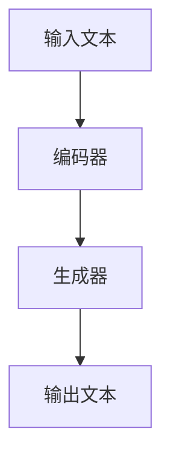
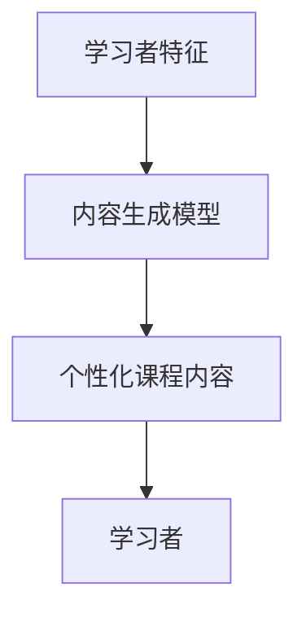
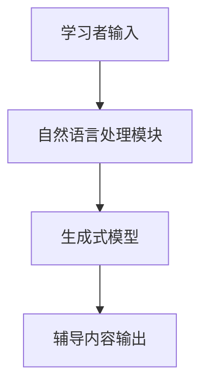
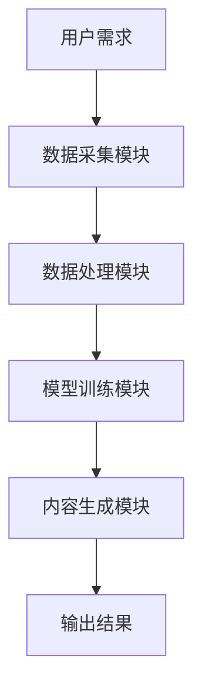
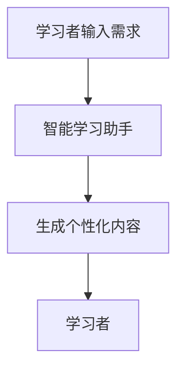
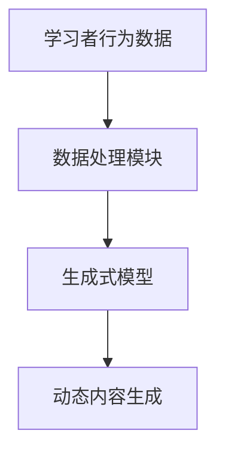

                 

<think>
好的，我现在需要帮助用户撰写一篇关于《AIGC在个性化教育内容生成中的应用》的技术博客文章。首先，我要理清用户的请求。用户希望我以一个世界级专家的身份，撰写一篇结构清晰、内容详实的技术博客，涵盖AIGC在教育中的应用，从基础到技术实现，再到案例分析。

我首先注意到，用户提供的目录大纲已经分成了八个章节，每个章节都有子部分。这意味着文章需要逻辑严谨，每章都要深入探讨相关主题。我应该按照这个结构来逐步展开，确保每部分内容充实。

接下来，我要考虑用户可能的深层需求。用户不仅需要文章结构，还需要每个章节的具体内容，包括技术细节、算法实现、案例分析等。这意味着我需要在每个章节中详细解释相关概念，并提供代码示例和图表来辅助说明。

在开始写作之前，我需要确保自己理解AIGC的定义和其在教育中的应用。个性化教育需要根据学生的特点生成定制内容，这涉及到自然语言处理和生成模型，如GPT。我需要解释这些技术的基本原理，并展示它们如何应用于教育场景。

对于技术实现部分，我需要详细描述系统架构，包括数据采集、模型训练、内容生成等模块。可能需要使用Mermaid图来展示系统的模块和接口设计，以及系统的交互流程。同时，提供Python代码示例，展示如何实现一个简单的教育内容生成器。

在案例分析部分，我应该选择具体的教育场景，如智能学习助手和自适应学习平台，分析它们的成功之处和面临的挑战。这有助于读者理解AIGC的实际应用效果和潜在问题。

最后，我需要总结AIGC在教育中的未来趋势，同时指出当前存在的挑战，如数据隐私、模型偏差等问题，并提出可能的解决方案。这不仅展示技术的潜力，也提醒读者需要注意的问题。

在整个写作过程中，我需要确保语言专业且易懂，使用Markdown格式，并在适当的地方插入图表和代码示例。同时，结尾要加上作者信息，以符合用户的要求。

现在，我开始逐步撰写每个章节，确保每部分内容完整，逻辑连贯，符合用户设定的结构和深度要求。通过这种系统性的思考，我可以产出一篇高质量的技术博客，满足用户的需求。
</think>

# AIGC在个性化教育内容生成中的应用

## 关键词：
- AIGC (AI-Generated Content)
- 个性化教育
- 自然语言处理
- 教育技术
- AI算法

## 摘要：
随着人工智能技术的快速发展，AIGC（AI-Generated Content，人工智能生成内容）在教育领域的应用逐渐成为研究热点。本文系统地探讨了AIGC在个性化教育内容生成中的应用，从技术原理到实际案例，从系统架构到未来展望，全面分析了AIGC在教育领域的潜力与挑战。文章首先介绍了AIGC的核心概念与技术原理，随后结合具体应用场景，详细阐述了AIGC在个性化教育内容生成中的实现方法，并通过实际案例分析了其在教育中的实际应用效果。最后，本文总结了AIGC在个性化教育中的未来发展趋势，并提出了相应的建议。

---

# 第一部分: AIGC基础与教育应用概述

## 第1章: AIGC概述

### 1.1 AIGC的定义与特点

AIGC（AI-Generated Content）是指通过人工智能技术生成的文字、图像、视频等内容。其核心在于利用自然语言处理（NLP）和生成模型（如GPT、BERT等）来模拟人类的创作过程。AIGC具有以下特点：
- **自动化**：能够自动生成内容，减少人工干预。
- **个性化**：可以根据用户需求生成定制化的内容。
- **高效性**：相比传统内容生成方式，AIGC效率更高。
- **可扩展性**：可以快速生成大量内容，满足大规模需求。

### 1.2 AIGC在教育领域的应用价值

在教育领域，AIGC的应用价值主要体现在以下几个方面：
- **个性化学习内容生成**：根据学生的学习需求、兴趣和能力生成个性化的内容。
- **智能化教学辅助**：帮助教师快速生成教学材料，提升教学效率。
- **动态内容更新**：根据学习者的反馈动态调整内容，提供实时的学习支持。

---

## 第2章: 个性化教育内容需求分析

### 2.1 个性化教育的需求背景

个性化教育的核心在于因材施教，即根据每个学生的特点和需求，提供定制化的学习方案。然而，传统教育模式往往难以满足这种需求，主要因为：
- **教师资源有限**：教师无法为每个学生提供一对一的个性化教学。
- **内容单一化**：教材和教学内容通常是统一的，难以满足学生的个性化需求。
- **学习者需求多样**：学生的学习能力、兴趣和背景各不相同，需要差异化的内容。

### 2.2 用户需求分析模型

为了更好地理解个性化教育内容的需求，我们需要构建一个用户需求分析模型。模型的核心要素包括：
- **学习者特征**：包括学习者的年龄、学习目标、兴趣爱好、学习能力等。
- **内容类型**：包括教材、练习题、视频、音频等。
- **学习场景**：包括课堂教学、在线学习、自主学习等。

以下是一个简单的用户需求分析模型的ER图：

```mermaid
erDiagram
    user {
        id
        name
        age
        learning_goal
        interest
        learning_ability
    }
    content {
        id
        type
        difficulty_level
        subject
        format
    }
    scenario {
        id
        type
        time
        location
    }
    user -|> content : "需要"
    user -|> scenario : "场景"
```

---

## 第3章: AIGC技术原理

### 3.1 自然语言处理基础

自然语言处理（NLP）是AIGC的核心技术之一。NLP的目标是让计算机能够理解和生成人类语言。主要技术包括：
- **分词**：将文本分割成有意义的词语。
- **句法分析**：分析句子的语法结构。
- **语义理解**：理解文本的含义。

### 3.2 AIGC算法原理

AIGC的核心算法主要包括生成式模型和判别式模型。以下是一个生成式模型的流程图：



生成式模型（如GPT）通过概率生成的方式，根据上下文生成合适的文本。其数学模型可以表示为：
$$ P(y|x) = \text{模型生成的概率分布} $$
其中，$x$ 是输入文本，$y$ 是输出文本。

---

## 第4章: AIGC在教育内容生成中的应用

### 4.1 个性化课程内容生成

个性化课程内容生成是AIGC在教育中的重要应用之一。以下是一个课程内容生成的流程图：



### 4.2 在线辅导与互动生成

在线辅导系统可以利用AIGC生成实时的辅导内容。以下是一个在线辅导系统的架构图：



---

## 第5章: AIGC技术实现

### 5.1 系统架构设计

以下是AIGC系统的架构设计：



### 5.2 实现步骤与关键技术

实现AIGC系统的关键技术包括：
1. 数据采集与预处理
2. 模型训练与优化
3. 内容生成与输出

---

## 第6章: AIGC案例分析

### 6.1 案例一：智能学习助手

智能学习助手是一个基于AIGC的教育工具，能够为学习者提供个性化的学习建议和内容生成。以下是其实现流程：



### 6.2 案例二：自适应学习平台

自适应学习平台根据学习者的行为数据动态生成学习内容。以下是其实现流程：



---

## 第7章: AIGC应用展望

### 7.1 AIGC在个性化教育中的未来趋势

未来，AIGC在个性化教育中的应用将更加广泛，主要体现在以下几个方面：
1. 更加智能化的内容生成
2. 更加个性化的学习体验
3. 更加高效的教育管理

### 7.2 存在的挑战与解决方案

尽管AIGC在教育中的应用潜力巨大，但仍面临以下挑战：
- **数据隐私问题**：如何保护学习者的隐私数据。
- **模型偏差问题**：生成内容可能存在的偏见和不准确性。

解决方案包括：
1. 建立严格的数据隐私保护机制。
2. 加强模型的训练和优化，减少偏差。

---

## 第8章: 最佳实践与总结

### 8.1 最佳实践分享

在实际应用中，建议采取以下最佳实践：
1. 确保数据的多样性和代表性。
2. 定期更新模型以保持生成内容的质量。
3. 提供用户反馈机制以优化生成内容。

### 8.2 小结与展望

通过本文的分析，我们可以看到AIGC在个性化教育内容生成中的巨大潜力。随着技术的不断进步，AIGC将为教育领域带来更多的创新和变革。然而，我们也需要关注技术带来的挑战，并积极寻求解决方案。

---

# 作者：AI天才研究院 & 禅与计算机程序设计艺术

