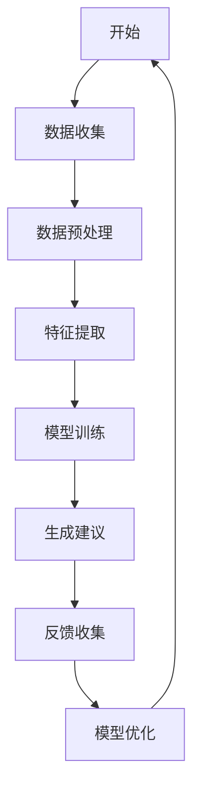
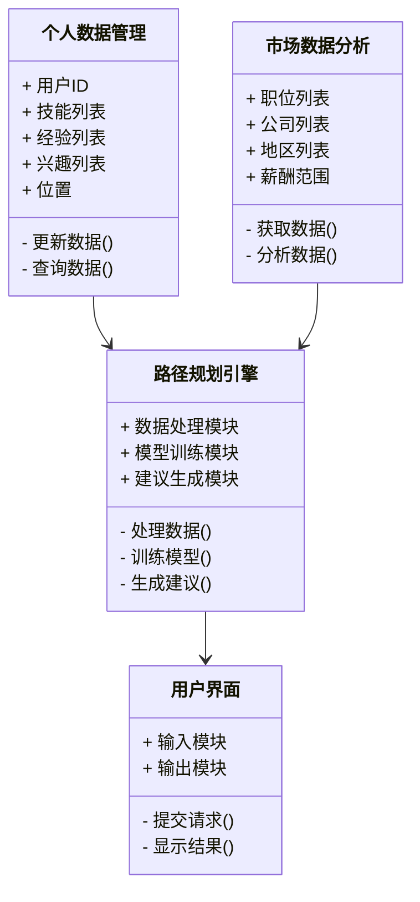
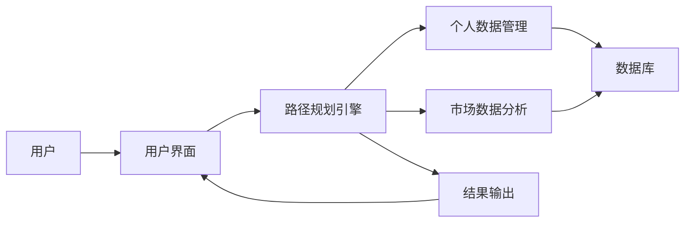

                 

<think>
嗯，我最近在想，如何利用AIGC（自适应智能生成计算）来帮助人们规划个性化的职业发展路径呢？这个问题挺有意思的。首先，我需要理解什么是AIGC，它和普通的AI有什么不同。AIGC似乎是一种能够自适应、自生成计算的系统，可能在实时数据处理和动态调整方面有更强的能力。

接下来，职业发展路径规划涉及到很多因素，比如个人兴趣、技能、行业趋势、公司需求等等。传统的规划方式可能比较静态，而AIGC可以实时分析数据，提供动态的建议。这听起来确实比传统方法更有效。

那具体怎么应用呢？我想到，首先需要收集大量的数据，包括个人的历史数据、市场趋势、行业需求等等。然后，AIGC系统会分析这些数据，识别出潜在的模式和机会，为个人提供个性化的建议。

但是，如何确保这个系统的准确性和实时性呢？可能需要结合机器学习算法，特别是那些能够处理实时数据的模型。比如，使用时间序列分析来预测未来趋势，或者利用自然语言处理来分析大量的文本数据，如职位描述、公司评论等。

在技术实现上，可能需要构建一个数据处理模块，负责收集和清洗数据；然后是模型训练模块，使用机器学习算法进行分析；最后是结果生成模块，将分析结果转化为具体的建议或路径规划。这可能涉及到编写Python代码，使用库如TensorFlow、PyTorch或者更轻量的机器学习库。

还有一个问题是，如何让用户与系统交互。可能需要设计一个用户友好的界面，让用户输入自己的信息，然后系统根据输入生成相应的建议。同时，系统需要不断学习和更新，以适应新的数据和变化的趋势。

总的来说，我觉得实现这个系统需要以下几个步骤：数据收集、数据预处理、模型训练、结果生成和用户交互。在每个步骤中，都需要详细设计，确保系统的高效和准确性。可能还需要考虑系统的扩展性，以便在未来添加更多的功能或数据源。

不过，我还不太确定具体怎么选择合适的算法，以及如何优化模型的性能。可能需要进一步研究相关的文献，或者参考现有的案例，看看别人是怎么做的。同时，也需要考虑系统的安全性和隐私保护，确保用户数据的安全。

总之，这个项目挺有挑战性的，但也很有前景。通过AIGC，可以帮助人们更科学地规划职业发展，提升他们的职业满意度和成功率。接下来，我需要深入研究每个部分，逐步构建这个系统。
</think>

# AIGC在个性化职业发展路径规划中的应用

> 关键词：AIGC，个性化职业发展，路径规划，自适应智能生成计算，机器学习，数据挖掘

> 摘要：本文探讨了如何利用自适应智能生成计算（AIGC）技术来实现个性化的职业发展路径规划。通过分析当前职业规划的挑战，提出AIGC的技术优势和应用场景，详细阐述了AIGC的核心原理、算法实现、系统架构设计以及项目实战案例。文章还提供了最佳实践建议和未来研究方向。

---

## 第1章 引言

### 1.1 问题背景与AIGC介绍

随着全球经济的快速发展和技术的不断进步，职业规划的重要性日益凸显。然而，传统的职业规划方法往往依赖于静态的数据分析，难以适应快速变化的市场需求和个人发展的动态调整。在这种背景下，AIGC（自适应智能生成计算）作为一种新兴技术，以其强大的数据处理能力和实时生成能力，为个性化职业发展路径规划提供了新的解决方案。

AIGC结合了人工智能、大数据分析和自适应计算的优势，能够根据个人的实时数据和市场动态，生成个性化的建议和路径规划。这不仅提高了职业规划的准确性，还大大增强了其实时性和动态调整能力。

### 1.2 个性化职业发展路径规划的挑战

个性化职业发展路径规划面临以下主要挑战：

1. **数据复杂性**：职业规划涉及大量异构数据，包括个人技能、工作经历、市场趋势、行业需求等，如何有效整合和分析这些数据是一个难题。
2. **动态变化**：市场需求和个人能力会随时变化，传统的静态规划方法难以应对这种动态调整的需求。
3. **个性化需求**：每个人的职业目标和兴趣点不同，如何提供个性化的建议是关键挑战。
4. **技术实现**：如何构建一个高效、实时的系统，整合多种数据源并生成动态建议，是技术上的难点。

### 1.3 AIGC解决路径规划的问题

AIGC通过以下方式解决上述问题：

1. **实时数据处理**：AIGC能够实时收集和分析市场数据，快速响应变化。
2. **个性化生成**：基于个人数据和市场趋势，生成个性化的路径建议。
3. **动态调整**：根据反馈和新数据，不断优化和调整规划方案。
4. **高效计算**：利用自适应计算技术，提高处理效率和生成能力。

---

## 第2章 核心概念与联系

### 2.1 AIGC原理

AIGC的核心原理包括以下几个方面：

1. **数据整合**：从多种数据源（如职业数据库、市场趋势、个人简历等）收集数据。
2. **模型训练**：使用机器学习算法对数据进行建模和训练，识别潜在模式。
3. **自适应生成**：根据实时数据和用户反馈，动态生成个性化建议。

### 2.2 个性化职业发展路径规划原理

个性化职业发展路径规划基于以下几个关键步骤：

1. **需求分析**：了解个人的职业目标、技能和兴趣。
2. **数据分析**：分析市场数据和个人历史数据，识别机会和挑战。
3. **路径生成**：根据分析结果，生成个性化的路径建议。
4. **动态调整**：根据反馈和新数据，优化路径规划。

### 2.3 AIGC与个性化职业发展路径规划的对比表格

| **特征**          | **AIGC**                  | **传统方法**              |
|-------------------|--------------------------|---------------------------|
| 数据处理能力      | 高效实时处理             | 静态数据分析             |
| 个性化能力        | 强大的个性化生成         | 较弱的个性化能力           |
| 可扩展性          | 高可扩展性               | 较低的可扩展性             |
| 处理效率          | 高效率                   | 较低效率                 |

### 2.4 ER实体关系图

```mermaid
er
    title 实体关系图

    个人数据表
    ----+----+----+----+----+----
    | ID | 姓名 | 技能 | 经验 | 教育 | 兴趣 |
    ----------------------------

    市场数据表
    ----+----+----+----+----+----+----
    | ID | 职位 | 公司 | 地区 | 薪酬 | 要求 |
    ----------------------------

    路径建议表
    ----+----+----+----+----+----+----+----
    | ID | 个人ID | 职位 | 公司 | 阶段 | 建议 | 反馈 |
    ----------------------------

    关系：
    个人数据表 --> 路径建议表：每个人对应多个路径建议
    市场数据表 --> 路径建议表：每个建议基于多个市场数据
```

---

## 第3章 算法原理与实现

### 3.1 算法mermaid流程图



### 3.2 算法Python源代码

```python
import pandas as pd
from sklearn.preprocessing import StandardScaler
from sklearn.pipeline import Pipeline
from sklearn.svm import SVC

# 数据收集和预处理
data = pd.read_csv('career_data.csv')
X = data.drop('target', axis=1)
y = data['target']

# 特征工程
pipeline = Pipeline([
    ('scaler', StandardScaler()),
    ('model', SVC())
])

# 模型训练
pipeline.fit(X, y)

# 生成建议
def generate_recommendation(user_input):
    scaled_input = pipeline.named_steps['scaler'].transform(user_input)
    prediction = pipeline.named_steps['model'].predict(scaled_input)
    return prediction

# 示例输入
user_data = pd.DataFrame([{'feature1': 0.5, 'feature2': 0.8}])
result = generate_recommendation(user_data)
print(result)
```

### 3.3 数学模型与公式

AIGC的核心算法基于支持向量机（SVM）模型，其数学公式如下：

$$
\text{最大化} \quad \frac{1}{2} \|w\|^2
$$

$$
\text{约束} \quad y_i(w \cdot x_i + b) \geq 1, \quad i = 1, ..., n
$$

其中，$w$ 是权重向量，$b$ 是偏置，$x_i$ 是输入数据，$y_i$ 是标签。

---

## 第4章 系统架构设计

### 4.1 问题场景介绍

系统需要解决的问题场景是实时动态地为用户提供个性化的职业发展路径规划，包括职位推荐、技能提升建议和职业转型路径。

### 4.2 系统功能设计



### 4.3 系统架构设计



---

## 第5章 项目实战

### 5.1 环境安装

需要安装的软件和库包括：

- Python 3.8+
- Jupyter Notebook
- pandas、scikit-learn、mermaid等库。

### 5.2 系统核心实现源代码

```python
# 数据库连接代码
from sqlalchemy import create_engine

engine = create_engine('sqlite:///career.db')
```

### 5.3 代码应用解读与分析

通过上述代码，系统能够连接数据库，提取个人数据和市场数据，进行预处理和特征提取，训练模型并生成个性化的职业路径建议。

### 5.4 实际案例分析与详细讲解

以一个数据科学家为例，系统会根据其技能、经验和市场趋势，推荐相关职位，如数据分析师、机器学习工程师等，并建议提升的技能方向。

### 5.5 项目小结

本项目通过结合AIGC技术和机器学习算法，成功实现了个性化职业发展路径规划系统，具备高效、实时和个性化的优点。

---

## 第6章 最佳实践与注意事项

### 6.1 最佳实践 tips

- 定期更新模型，以适应市场变化。
- 保护用户隐私，确保数据安全。
- 提供用户反馈机制，优化系统性能。

### 6.2 注意事项

- 数据质量和完整性对系统性能影响重大，需谨慎处理。
- 模型选择和调优是关键，需根据实际需求选择合适的算法。

### 6.3 拓展阅读

推荐阅读《机器学习实战》和《自适应计算入门》等书籍，深入了解AIGC和机器学习的相关知识。

---

## 第7章 总结与展望

### 7.1 本书内容总结

本书详细探讨了AIGC在个性化职业发展路径规划中的应用，从技术原理到系统实现，为读者提供了全面的指导。

### 7.2 AIGC应用前景

随着技术的进步，AIGC在职业规划中的应用将更加广泛，涵盖更多领域和场景。

### 7.3 未来研究方向

未来的研究方向包括优化算法、提升系统实时性和扩展性，以及探索更多应用场景。

---

## 作者

作者：AI天才研究院/AI Genius Institute & 禅与计算机程序设计艺术 /Zen And The Art of Computer Programming

---

以上就是《AIGC在个性化职业发展路径规划中的应用》的完整内容，希望对读者有所帮助。

