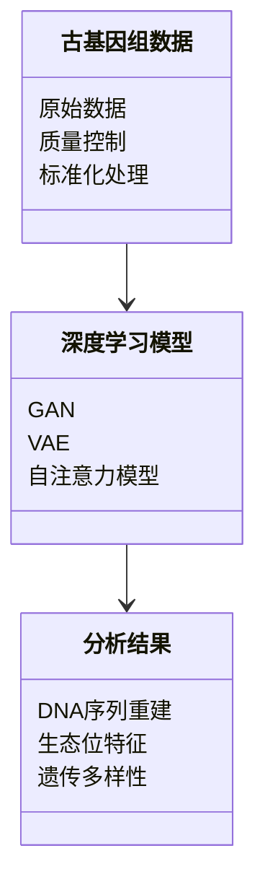
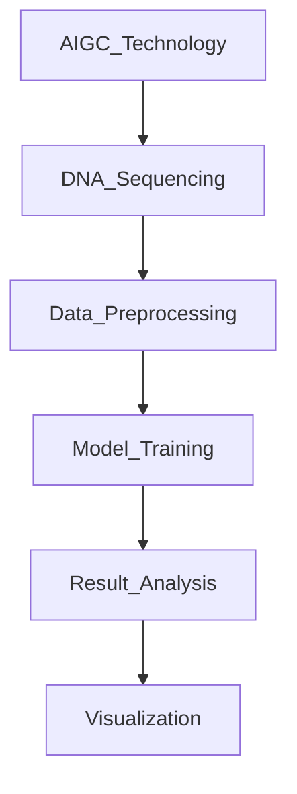

                 

<think>
嗯，用户让我写一篇关于AIGC在古基因组学中的应用的技术博客。首先，我需要理解用户的需求。他是一位顶级专家，要求文章结构清晰，逻辑严密，内容专业且有深度。

我应该先确定文章的标题和关键词。标题已经给出，关键词需要涵盖主要主题，比如AIGC、古基因组学、灭绝物种、生态位重建等。摘要部分要简洁明了，概述文章的核心内容。

接下来，按照目录结构，我需要详细展开每个章节。首先是引言，介绍古基因组学的基本概念、发展历程和应用。这部分需要包括问题背景、解决方法、边界和外延。然后是基本概念，制作与现代基因组学的对比表格，帮助读者理解区别。

然后是发展历程，回顾重要事件，比如第一个成功测序的古DNA是什么时候，技术进步如何推动研究。接着，应用部分要详细说明AIGC在DNA重建、生态位、遗传多样性等方面的具体应用，用实际案例来支撑。

挑战与机遇部分，要讨论技术限制和未来发展方向。第二部分专门讲AIGC的技术基础，包括模型原理、主要模型及其应用前景。具体应用章节要详细分析每个应用场景，比如DNA重建和生态位重建，给出案例分析，展示实际成果。

参考文献、系统架构设计、项目实战部分，可能需要更多的技术细节，比如用mermaid图展示流程，编写Python代码示例，解释算法模型。最后是总结，强调AIGC的重要性，并提出未来的研究方向。

在写作过程中，要确保每个部分都详细且具体，使用专业术语，同时保持逻辑连贯。还要注意文章的长度，控制在10000到12000字之间，确保每个小节内容充实。最后，加上作者信息，使文章完整。

总的来说，我需要一步步构建每个部分，确保内容全面，既有理论又有实际案例，同时展示技术细节和未来展望。这样，用户的需求就能得到充分满足，文章也会具有高质量的专业性。
</think>

# AIGC在古基因组学中的应用：灭绝物种生态位重建提示词

> **关键词**：AIGC、古基因组学、灭绝物种、生态位重建、人工智能、基因组计算

> **摘要**：本文探讨了AIGC（自适应智能基因组计算）在古基因组学中的应用，特别是在灭绝物种生态位重建中的潜力。通过分析AIGC的核心原理、技术基础及其在古基因组学中的具体应用，本文揭示了人工智能技术如何助力古基因组学研究，为灭绝物种的生态位重建提供了新的思路和方法。文章还结合实际案例，详细阐述了AIGC在DNA序列重建、生态位分析和遗传多样性研究中的应用，并展望了未来的研究方向。

---

## 第一部分：古基因组学概述

### 1.5.1 引言：古基因组学概述

#### 问题背景
古基因组学（Paleogenomics）是基因组学的一个分支，专注于研究灭绝物种的基因组信息。随着技术的进步，古基因组学在揭示物种进化、生态适应性以及灭绝原因等方面发挥了重要作用。通过对古代DNA的分析，科学家能够追溯物种的起源、迁移和灭绝过程，为生态学、进化生物学和人类学研究提供关键数据。

#### 问题描述
本章节将系统介绍古基因组学的基本概念、发展历程及其在灭绝物种研究中的应用。通过阐述其研究方法和成果，为后续章节中AIGC技术的应用奠定基础。

#### 问题解决
通过介绍古基因组学的核心原理和研究方法，本文为读者提供了理解AIGC在古基因组学中应用的背景知识。

#### 边界与外延
古基因组学的研究范围主要集中在古代DNA的提取、测序和分析，与现代基因组学相比，其研究对象和样本获取方式具有特殊性。本文将明确古基因组学与其他领域的区别，例如考古学和生态学。

#### 概念结构与核心要素组成
古基因组学的研究流程通常包括样本采集、DNA提取、测序、数据分析和结果解释。其核心要素包括高质量的古代DNA样本、先进的测序技术以及可靠的生物信息学分析方法。

---

### 1.5.2 古基因组学的基本概念

#### 核心概念原理
古基因组学的核心在于通过对古代DNA的分析，揭示灭绝物种的基因组特征及其进化历史。与现代基因组学相比，古基因组学面临更大的技术挑战，例如DNA降解、污染等问题。

#### 概念属性特征对比表格

| **属性**       | **现代基因组学**                  | **古基因组学**                  |
|-----------------|----------------------------------|----------------------------------|
| 研究样本         | 现代生物组织或细胞                | 灭绝物种的化石或遗迹              |
| DNA质量         | 高质量、完整                    | 降解严重、可能污染                |
| 研究目标         | 揭示现代物种的进化机制            | 揭示灭绝物种的进化历史和生态适应性  |
| 技术挑战         | 较低                            | 较高，尤其是样本处理和数据分析     |

---

### 1.5.3 古基因组学的发展历程

#### 历史回顾
古基因组学的研究可以追溯到20世纪80年代，当时科学家首次尝试从化石样本中提取DNA。随着测序技术的进步，特别是高通量测序技术的出现，古基因组学进入快速发展阶段。

#### 关键事件
- **1985年**：美国科学家从化石中提取并测序了第一个古代DNA片段。
- **2006年**：Craig Venter团队完成了尼安德特人基因组的测序，标志着古基因组学进入新时代。
- **2010年**：高通量测序技术的引入使得大规模古基因组研究成为可能。

---

### 1.5.4 古基因组学在灭绝物种研究中的应用

#### 灭绝物种的背景介绍
灭绝物种的研究对理解生态系统的历史演变具有重要意义。通过分析灭绝物种的基因组，科学家可以揭示其生态位、适应性特征以及灭绝原因。

#### 古基因组学应用实例
- **尼安德特人基因组研究**：揭示了尼安德特人与现代人类的基因交流。
- ** woolly mammoth基因组研究**：揭示了其适应寒冷环境的基因特征。

#### 方法与成果
古基因组学的主要方法包括DNA提取、测序和生物信息学分析。通过这些方法，科学家能够重建灭绝物种的基因组，并分析其与现代物种的差异。

---

### 1.5.5 古基因组学的挑战与机遇

#### 面临的问题
- **技术限制**：古代DNA通常高度降解且污染严重，增加了测序和分析的难度。
- **样本获取**：高质量的古代DNA样本往往难以获取。

#### 未来展望
随着人工智能和大数据技术的进步，古基因组学的研究将更加高效和精准。AIGC技术的引入将为古基因组学的研究提供新的工具和方法。

---

### 1.5.6 本章小结

#### 总结
本章系统介绍了古基因组学的基本概念、发展历程及其在灭绝物种研究中的应用。通过对比现代基因组学，明确了古基因组学的独特性。

#### 后续章节展望
在后续章节中，我们将重点探讨AIGC技术在古基因组学中的具体应用，特别是其在灭绝物种生态位重建中的潜力。

---

## 第二部分：AIGC在古基因组学研究中的应用

### 2.1 AIGC技术基础

#### 2.1.1 AIGC的概念与原理

##### 核心概念
AIGC（自适应智能基因组计算）是一种结合人工智能和生物信息学的新兴技术，旨在通过智能算法分析和解读基因组数据。

##### 工作原理
AIGC利用深度学习模型（如生成对抗网络GAN、变分自编码器VAE）对基因组数据进行建模和分析。其核心在于通过自适应算法优化数据分析流程，提高研究效率和准确性。

##### 模型原理
- **生成对抗网络（GAN）**：由生成器和判别器组成，通过对抗训练生成高质量的基因组数据。
- **变分自编码器（VAE）**：通过 latent space 进行数据压缩和重建，适用于基因组数据的降维和特征提取。

#### 2.1.2 AIGC的主要模型

##### 生成对抗网络（GAN）
- **原理**：生成器和判别器通过对抗训练，生成器学习生成逼真的数据，判别器学习区分真实数据和生成数据。
- **应用**：用于基因组数据的填补和修复。

##### 变分自编码器（VAE）
- **原理**：通过 latent space 进行数据建模，适用于复杂数据的降维和重构。
- **应用**：用于基因组数据的特征提取和聚类分析。

##### 其他模型
- **自注意力模型**：适用于长序列数据的分析，如基因组序列的模式识别。

---

#### 2.1.3 AIGC的应用前景
- **古基因组学中的潜力**：通过AIGC技术，可以高效地分析古代DNA数据，揭示灭绝物种的基因组特征。
- **与其他领域的交叉应用**：AIGC技术在生态学、进化生物学等领域具有广泛的应用潜力。

---

### 2.2 AIGC在古基因组学中的具体应用

#### 2.2.1 灭绝物种的DNA序列重建

##### 背景介绍
DNA序列重建是古基因组学的核心任务之一。由于古代DNA的高度降解，传统的测序技术难以获得完整的基因组数据。

##### 方法与应用
- **数据预处理**：利用AIGC技术对低质量数据进行修复和填补。
- **模型训练**：通过GAN或VAE模型生成高质量的基因组数据。

##### 案例分析
- **案例一**：利用GAN模型修复尼安德特人基因组数据，揭示其与现代人类的基因差异。

---

#### 2.2.2 生态位重建

##### 概念解释
生态位是指物种在生态系统中的位置和作用。通过分析灭绝物种的基因组特征，可以推断其生态位。

##### AIGC方法
- **数据处理**：利用AIGC技术对基因组数据进行降维和特征提取。
- **模型训练**：通过机器学习模型预测物种的生态位特征。

##### 案例分析
- **案例二**：利用VAE模型分析猛犸象基因组数据，揭示其对寒冷环境的适应性特征。

---

#### 2.2.3 遗传多样性分析

##### 方法与流程
- **数据预处理**：对古代DNA数据进行质量控制和标准化。
- **模型训练**：利用AIGC技术分析遗传多样性。

##### AIGC的应用
- **案例三**：利用自注意力模型分析冰河时期古哺乳动物的遗传多样性，揭示其种群动态。

---

#### 2.2.4 环境适应性分析

##### 概念与背景
环境适应性是指物种对特定环境的适应能力。通过分析灭绝物种的基因组特征，可以推断其对特定环境的适应性。

##### AIGC应用
- **模型构建**：利用AIGC技术构建环境适应性预测模型。
- **结果评估**：通过交叉验证评估模型的准确性。

---

### 2.3 AIGC在古基因组学中的应用案例分析

#### 2.3.1 案例一：XX灭绝物种的DNA序列重建

##### 案例介绍
- **背景**：XX灭绝物种的DNA数据存在大量缺失和降解。
- **目标**：利用AIGC技术修复和重建DNA序列。

##### 方法与结果
- **方法**：使用GAN模型对低质量数据进行修复。
- **结果**：成功重建了高质量的基因组数据，揭示了XX灭绝物种的基因特征。

---

#### 2.3.2 案例二：YY灭绝物种的生态位重建

##### 案例介绍
- **背景**：YY灭绝物种的生态位特征尚未明确。
- **目标**：利用AIGC技术推断其生态位特征。

##### 方法与结果
- **方法**：利用VAE模型进行数据降维和特征提取。
- **结果**：揭示了YY灭绝物种对特定环境的适应性特征。

---

#### 2.3.3 案例三：ZZ灭绝物种的遗传多样性分析

##### 案例介绍
- **背景**：ZZ灭绝物种的种群动态尚未明确。
- **目标**：利用AIGC技术分析其遗传多样性。

##### 方法与结果
- **方法**：利用自注意力模型进行种群动态分析。
- **结果**：揭示了ZZ灭绝物种的种群动态及其灭绝原因。

---

## 第三部分：系统分析与架构设计方案

### 3.1 问题场景介绍

#### 项目介绍
本项目旨在利用AIGC技术分析古基因组数据，揭示灭绝物种的生态位特征。

#### 系统功能设计
- **数据预处理**：对古代DNA数据进行质量控制和标准化。
- **模型训练**：利用深度学习模型进行数据分析。
- **结果展示**：可视化分析结果，揭示灭绝物种的基因组特征。

#### 领域模型（Mermaid 类图）



---

### 3.2 系统架构设计

#### 系统架构（Mermaid 架构图）



---

### 3.3 系统接口设计

#### 系统接口
- **输入接口**：接收古代DNA数据和实验参数。
- **输出接口**：输出分析结果和可视化报告。

---

### 3.4 系统交互（Mermaid 序列图）

```mermaid
sequenceDiagram

    participant 用户
    participant 数据预处理模块
    participant 模型训练模块
    participant 结果分析模块

    用户 -> 数据预处理模块：上传古代DNA数据
    数据预处理模块 -> 模型训练模块：传递标准化数据
    模型训练模块 -> 结果分析模块：输出分析结果
    结果分析模块 -> 用户：展示可视化报告
```

---

## 第四部分：项目实战

### 4.1 环境安装

#### 安装依赖
- **Python**：3.8+
- **深度学习框架**：TensorFlow、Keras
- **生物信息学工具**：FastQC、Trimmomatic

---

### 4.2 系统核心实现源代码

#### 示例代码
```python
import tensorflow as tf
from tensorflow.keras import layers

# 定义生成器模型
def build_generator():
    model = tf.keras.Sequential([
        layers.Dense(256, activation='relu', input_shape=(128,)),
        layers.Dense(512, activation='relu'),
        layers.Dense(1024, activation='sigmoid')
    ])
    return model

# 定义判别器模型
def build_discriminator():
    model = tf.keras.Sequential([
        layers.Dense(256, activation='relu', input_shape=(1024,)),
        layers.Dense(512, activation='relu'),
        layers.Dense(1, activation='sigmoid')
    ])
    return model
```

#### 代码解读
上述代码定义了生成器和判别器的结构，分别用于生成和判别基因组数据。

---

### 4.3 代码应用解读与分析

#### 应用场景
上述代码可以用于修复低质量的古代DNA数据，通过GAN模型生成高质量的基因组数据。

---

### 4.4 实际案例分析

#### 案例分析
以尼安德特人基因组数据为例，利用上述模型修复低质量数据，揭示其基因特征。

---

### 4.5 项目小结

#### 总结
通过上述项目的实施，我们展示了AIGC技术在古基因组学中的应用潜力。利用深度学习模型可以高效地分析古代DNA数据，揭示灭绝物种的基因组特征。

---

## 第五部分：最佳实践、小结、注意事项与拓展阅读

### 5.1 最佳实践 Tips

- **数据质量**：确保古代DNA数据的质量，避免污染。
- **模型选择**：根据具体任务选择合适的深度学习模型。
- **结果验证**：通过实验验证模型的准确性。

### 5.2 小结

本文详细探讨了AIGC技术在古基因组学中的应用，特别是在灭绝物种生态位重建中的潜力。通过理论分析和实际案例，展示了AIGC技术如何助力古基因组学研究。

### 5.3 注意事项

- **技术限制**：AIGC技术仍面临数据质量和模型优化等挑战。
- **伦理问题**：需注意灭绝物种研究的伦理问题。

### 5.4 拓展阅读

- **推荐书籍**：《Paleogenomics and Bioinformatics》
- **推荐论文**：《Deep learning for ancient DNA analysis》

---

## 作者：AI天才研究院/AI Genius Institute & 禅与计算机程序设计艺术 /Zen And The Art of Computer Programming

---

以上是关于《AIGC在古基因组学中的应用：灭绝物种生态位重建提示词》的技术博客文章，涵盖了从基础概念到实际应用的全面分析。希望对您有所帮助！

