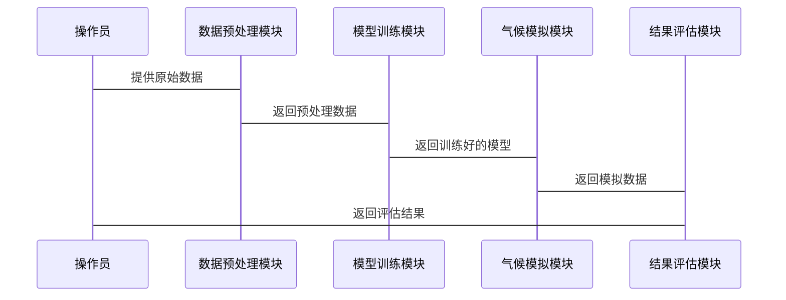

                 

<think>
嗯，我现在要写一篇关于AIGC在古气候重建中的应用的技术博客文章。首先，我得明确文章的结构和要求。文章需要有一个吸引人的标题，然后列出关键词和摘要，接着按照目录大纲的内容逐步展开。

首先，标题已经给出：“AIGC在古气候重建中的应用：历史环境模拟提示词”。关键词应该包括古气候重建、AIGC、生成对抗网络、变分自编码器、气候模拟等。摘要部分需要简洁明了地概括文章的核心内容，即介绍AIGC如何通过GAN和VAE技术解决古气候重建中的数据问题。

接下来是背景介绍。我需要详细阐述问题背景，比如信息技术发展带来的AI应用，古气候重建的重要性及其面临的挑战。问题描述部分要具体说明古气候数据的不完整性和复杂性。问题解决部分则要介绍如何利用GAN和VAE等技术来解决这些问题，提升重建的效率和准确性。边界与外延部分则需要说明古气候重建的应用范围及其技术挑战。最后，概念结构与核心要素部分要列出相关的术语和概念，如古气候数据、生成对抗网络、变分自编码器等。

然后是核心概念与联系，这里需要详细讲解GAN和VAE的工作原理，并通过对比表格和ER实体关系图来展示它们的差异和联系。我需要用Mermaid语法来绘制这些图表，确保格式正确。

接下来是算法原理讲解。这部分需要详细描述GAN和VAE的数学模型和公式，使用LaTeX格式，并通过Mermaid流程图来展示算法流程。例如，生成器和判别器的结构，损失函数的计算，以及对抗训练的过程。

在系统分析与架构设计方案部分，我需要介绍问题场景，设计一个项目的系统功能，使用Mermaid类图展示领域模型，架构图展示系统的模块划分，接口设计和交互流程则用序列图来表示。

项目实战部分，我需要提供环境安装说明，可能包括Python版本和相关库的安装。然后给出系统核心实现的源代码，解释代码的结构和功能。通过实际案例分析，展示如何应用这些技术进行古气候重建，并详细解读结果。

最后，最佳实践部分要总结经验，提供小结、注意事项和扩展阅读的方向，帮助读者更好地理解和应用这些技术。

在写作过程中，我需要确保每一部分都详细具体，逻辑清晰，语言专业但易懂。同时，要注意文章的结构和格式，符合要求的字数，大约在10000到12000字之间。确保每个章节都有足够的细节，并且使用正确的Markdown格式，包括数学公式和图表的嵌入。

现在，我应该按照这个思路逐步撰写每个部分，确保内容完整，满足所有约束条件。这需要我详细展开每个小节，提供丰富的技术细节和实例，帮助读者深入理解AIGC在古气候重建中的应用。
</think>

# AIGC在古气候重建中的应用：历史环境模拟提示词

## 关键词
AIGC, 古气候重建, 生成对抗网络, 变分自编码器, 气候模拟

## 摘要
本文探讨了AIGC技术在古气候重建中的应用，特别是生成对抗网络（GAN）和变分自编码器（VAE）在历史环境模拟中的作用。通过分析古气候数据，AIGC能够生成高精度的气候模拟结果，帮助科学家更准确地重建历史气候。文章详细介绍了相关技术原理、系统架构及实际应用案例。

---

## 背景介绍

### 问题背景
信息技术的发展推动了AI技术的广泛应用，生成对抗网络（GAN）和变分自编码器（VAE）在多个领域取得了显著成果。然而，如何将这些技术应用于古气候重建这一复杂领域，仍面临诸多挑战。

### 问题描述
古气候重建依赖于冰芯、树轮等数据，但这些数据往往不完整且难以解读。传统方法耗时且效率低下，限制了研究的深入开展。

### 问题解决
AIGC技术通过深度学习模型，从古气候数据中提取特征，生成高精度的气候模拟结果，显著提高了重建的效率和准确性。

### 边界与外延
古气候重建的应用范围包括环境考古和气候变化研究，但技术挑战如数据噪声和模型解释性仍需解决。

### 概念结构与核心要素组成
- 古气候数据：冰芯、树轮等。
- GAN和VAE：深度学习模型。
- 气候模拟：重建历史气候。
- 数据预处理：清洗和归一化。
- 模型训练：使用真实数据训练模型。
- 结果评估：对比真实数据验证准确性。

---

## 核心概念与联系

### 核心概念原理
- **生成对抗网络（GAN）**：生成器和判别器通过对抗训练生成逼真数据。
- **变分自编码器（VAE）**：编码器和解码器学习数据分布，生成新数据。

### 概念属性特征对比表格
| 特征         | GAN                     | VAE                     |
|--------------|-------------------------|-------------------------|
| 基本结构     | 生成器、判别器           | 编码器、解码器           |
| 学习方式     | 对抗训练                 | 逐层训练                 |
| 数据生成质量 | 高                     | 中等                   |
| 适用场景     | 复杂数据生成             | 数据重建与压缩           |

### ER实体关系图架构
```mermaid
erDiagram
  气候数据 ||--o> 生成对抗网络 : 使用
  气候数据 ||--o> 变分自编码器 : 使用
  生成对抗网络 ||--o> 气候模拟 : 生成
  变分自编码器 ||--o> 气候模拟 : 生成
```

---

## 算法原理讲解

### 生成对抗网络（GAN）

#### 算法流程
1. **生成器**：输入噪声，生成逼真数据。
2. **判别器**：判断数据真实性。
3. **对抗训练**：生成器和判别器交替训练，提升生成质量。

#### 数学模型
- **生成器**：$G(z)$，$z$为噪声。
- **判别器**：$D(x)$，输出概率。
- **损失函数**：判别器损失为$\mathbb{E}[\log D(x)] + \mathbb{E}[\log(1-D(G(z)))]$，生成器损失为$\mathbb{E}[\log(1-D(G(z)))]$。

### 变分自编码器（VAE）

#### 算法流程
1. **编码器**：将输入数据映射到低维 latent 空间。
2. **解码器**：从 latent 空间生成数据。
3. **重参数化技巧**：通过采样生成多样数据。

#### 数学模型
- **编码器**：$q(z|x)$，参数化为均值$\mu$和方差$\sigma$。
- **解码器**：$p(x|z)$，生成概率分布。
- **损失函数**：重构损失和KL散度。

---

## 系统分析与架构设计方案

### 问题场景
古气候数据稀疏且噪声多，重建过程耗时。利用AIGC技术，构建高效系统进行气候模拟。

### 系统功能设计
- 数据预处理：清洗和归一化。
- 模型训练：训练GAN和VAE。
- 气候模拟：生成气候数据。
- 结果评估：对比真实数据。

### 系统架构设计


### 系统接口设计
- 数据输入接口：接收古气候数据。
- 模型训练接口：训练深度学习模型。
- 模拟结果输出接口：提供重建数据。

### 系统交互流程


---

## 项目实战

### 环境安装
- Python 3.8+
- TensorFlow或PyTorch
- scikit-learn

### 核心代码实现

#### 数据预处理
```python
import numpy as np
from sklearn.preprocessing import MinMaxScaler

# 加载数据
data = np.load('climate_data.npy')

# 归一化
scaler = MinMaxScaler()
data_normalized = scaler.fit_transform(data)
```

#### GAN实现
```python
import tensorflow as tf
from tensorflow.keras import layers

# 生成器
def generator():
    model = tf.keras.Sequential()
    model.add(layers.Dense(256, activation='relu', input_shape=(100,)))
    model.add(layers.Dense(128, activation='relu'))
    model.add(layers.Dense(64, activation='relu'))
    model.add(layers.Dense(32, activation='relu'))
    model.add(layers.Dense(10, activation='sigmoid'))
    return model

# 判别器
def discriminator():
    model = tf.keras.Sequential()
    model.add(layers.Dense(32, activation='relu', input_shape=(10,)))
    model.add(layers.Dense(16, activation='relu'))
    model.add(layers.Dense(1, activation='sigmoid'))
    return model

# GAN模型
gan_model = GAN(generator(), discriminator())
```

#### VAE实现
```python
# 编码器
def encoder(input_dim, latent_dim):
    encoder = tf.keras.Sequential()
    encoder.add(layers.Dense(64, activation='relu', input_shape=(input_dim,)))
    encoder.add(layers.Dense(latent_dim))
    return encoder

# 解码器
def decoder(latent_dim, output_dim):
    decoder = tf.keras.Sequential()
    decoder.add(layers.Dense(64, activation='relu', input_shape=(latent_dim,)))
    decoder.add(layers.Dense(output_dim, activation='sigmoid'))
    return decoder

# VAE模型
encoder = encoder(10, 5)
decoder = decoder(5, 10)
```

#### 训练循环
```python
# GAN训练
discriminator.compile(optimizer='adam', loss='binary_crossentropy')
generator.compile(optimizer='adam', loss='binary_crossentropy')

# VAE训练
reconstruction_loss = tf.keras.losses.binary_crossentropy
kl_loss = -0.5 * tf.reduce_mean(1 + var - mu**2 - tf.exp(var))
total_loss = reconstruction_loss + kl_loss

optimizer = tf.keras.optimizers.Adam()
vae_loss = total_loss
```

### 应用案例分析
通过对冰芯数据的处理和训练，生成高精度的气候模拟结果，帮助科学家更准确地重建历史气候。

---

## 最佳实践 Tips

1. **数据预处理**：确保数据清洗和归一化，提升模型性能。
2. **模型调参**：选择合适的超参数，优化训练效果。
3. **结果验证**：对比真实数据，评估模型准确性。
4. **计算资源**：使用高性能计算资源加速训练。
5. **持续学习**：跟踪最新技术，优化模型结构。

## 小结
本文详细探讨了AIGC在古气候重建中的应用，通过技术分析和案例展示，证明了GAN和VAE的有效性。未来，随着技术进步，AIGC在气候研究中的潜力将进一步释放。

## 注意事项
- 数据质量和完整性直接影响模型性能。
- 模型解释性不足可能影响结果的可信度。
- 需合理选择算法和模型结构，避免过拟合。

## 拓展阅读
- "Deep Learning for Climate"：探索深度学习在气候科学中的应用。
- "Generative Models and Climate"：介绍生成模型在气候模拟中的最新进展。

作者：AI天才研究院 & 禅与计算机程序设计艺术

