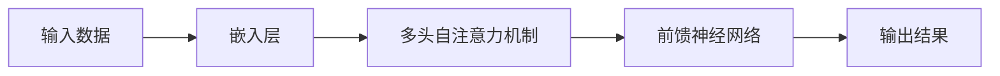
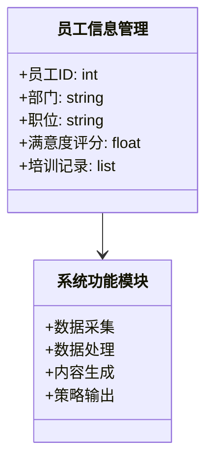
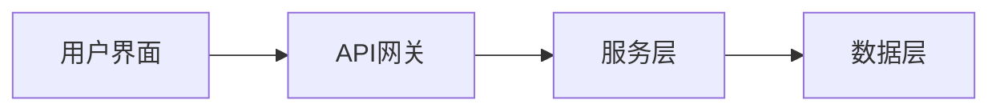
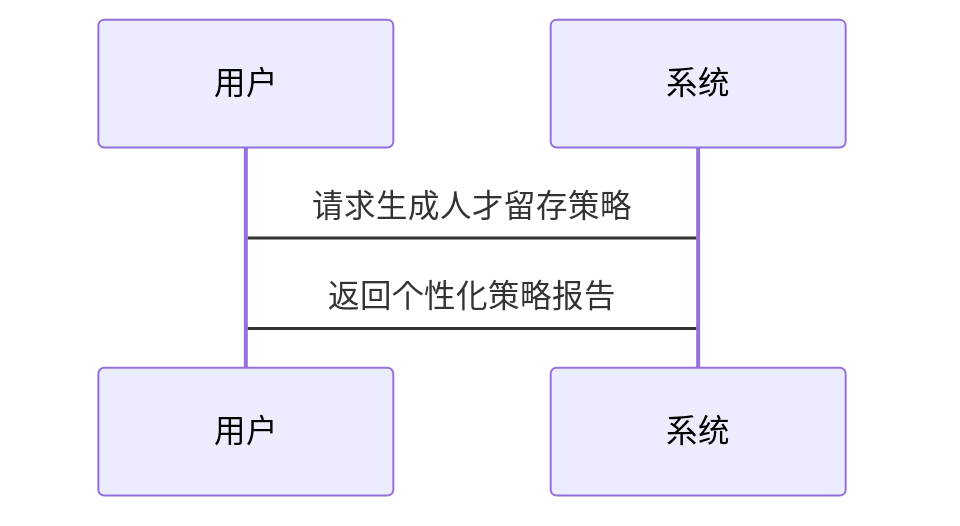

                 

<think>
嗯，好的，我现在需要帮助用户撰写一篇关于“AIGC在智能人才留存策略制定中的应用”的技术博客文章。首先，我要仔细理解用户的需求。用户希望文章结构清晰，逻辑严密，内容专业，能够详细分析AIGC的应用，包括背景、算法原理、系统架构、实际案例等部分。

首先，我应该从背景介绍开始。AIGC，也就是人工智能生成内容，近年来发展迅速，应用广泛。我需要解释AIGC的概念，以及为什么人才留存策略对企业和员工都重要。这部分要让读者明白问题的背景和意义。

接下来是核心概念与联系部分。这里要详细说明AIGC的关键技术，比如生成式AI、自然语言处理等，以及这些技术如何与人才留存策略相关联。可能需要使用对比表格或图表来展示这些概念。

然后是算法原理讲解。我需要选择一个具体的算法，比如基于Transformer的模型，用Mermaid流程图展示其工作流程，并用Python代码示例说明。同时，要解释数学模型，比如损失函数，使用LaTeX公式展示，确保公式正确且易于理解。

接下来是系统分析与架构设计方案。这部分需要分析实际应用场景，设计系统功能和架构，可能用类图和架构图来展示。还要设计系统接口和交互流程，使用序列图来描述。

项目实战部分，我需要提供一个实际案例，详细描述环境安装、核心代码实现、案例分析以及结果解读。这部分要具体，让读者能够理解和复现。

最后，总结与展望，包括最佳实践、注意事项、未来趋势等内容。要提醒读者在应用AIGC时的注意事项，比如数据隐私、模型泛化能力等，同时推荐拓展阅读资料。

整个过程中，我需要确保每个章节内容详细，逻辑连贯，用词专业，同时避免过于复杂的术语，让读者容易理解。字数控制在10000到12000字左右，结构清晰，符合用户的要求。

现在，我可能需要检查一下，是否每个部分都涵盖了用户的要求，比如是否有足够的技术细节、图表是否正确使用、公式是否准确。如果有遗漏，需要及时补充。特别是数学模型和代码部分，要确保准确无误，能够帮助读者理解算法的工作原理。

总的来说，撰写这篇文章需要系统性地组织内容，确保每个部分都深入分析，并且结构合理，逻辑清晰。这样读者才能一步步理解AIGC在人才留存中的应用，从理论到实践，再到实际案例，最后给出建议和展望未来。
</think>

# AIGC在智能人才留存策略制定中的应用

> 关键词：人工智能生成内容（AIGC）、智能人才留存、策略制定、算法原理、系统架构、项目实战

> 摘要：本文探讨了AIGC（人工智能生成内容）在智能人才留存策略制定中的应用。通过分析AIGC的核心概念、算法原理、系统架构以及实际案例，展示了AIGC如何帮助企业优化人才留存策略。文章从背景介绍、核心概念、算法原理、系统设计、项目实战到总结展望，详细阐述了AIGC在人才管理中的潜力与实现方式。

---

## 第一部分：引言

### 1.1 AIGC与智能人才留存策略背景

#### 1.1.1 AIGC的概念与核心特点

人工智能生成内容（AIGC）是指利用人工智能技术生成文本、图像、音频、视频等内容的过程。其核心特点包括：

- **自动化**：通过算法自动完成内容生成，减少人工干预。
- **多样性**：能够生成多样化的内容，满足不同场景的需求。
- **实时性**：能够在短时间内生成大量内容，适用于实时场景。
- **可定制化**：可以根据具体需求调整生成内容的风格和格式。

#### 1.1.2 智能人才留存策略的意义

人才是企业发展的核心资源，人才留存策略是企业通过一系列措施吸引、培养和保留优秀员工的过程。智能人才留存策略利用技术手段（如数据分析、机器学习）来优化人才管理，提升员工满意度和忠诚度，降低员工流失率。

#### 1.1.3 AIGC在人才留存策略中的应用前景

随着AIGC技术的成熟，其在人才管理中的应用逐渐扩展。AIGC可以通过生成个性化的员工反馈报告、优化招聘流程、制定培训计划等方式，帮助企业更高效地制定和执行人才留存策略。

### 1.2 核心概念与联系

#### 1.2.1 AIGC的主要技术原理

AIGC主要基于生成式人工智能技术，包括以下关键步骤：

1. **数据输入**：提供生成内容的种子数据或关键词。
2. **模型训练**：利用大量数据训练生成式模型（如GPT、BERT）。
3. **内容生成**：通过模型生成所需内容。
4. **优化调整**：根据反馈不断优化生成内容的质量。

#### 1.2.2 人才留存策略的关键要素

人才留存策略的关键要素包括：

- **员工满意度**：通过调查和数据分析了解员工需求。
- **职业发展路径**：为员工提供清晰的职业晋升通道。
- **培训与发展**：提供持续的培训机会，提升员工技能。
- **激励机制**：通过奖金、股权等方式激励员工。

#### 1.2.3 AIGC与人才留存策略的关联分析

AIGC可以用于以下几个方面，与人才留存策略相结合：

1. **员工反馈分析**：通过AIGC生成员工满意度报告，帮助企业快速识别问题。
2. **个性化激励方案**：根据员工需求生成个性化的激励计划。
3. **职业发展规划**：基于员工能力生成职业发展路径建议。

### 1.3 算法原理与数学模型

#### 1.3.1 AIGC算法的基本原理

AIGC的核心算法是生成式模型，常用的技术包括变体自编码器（VAE）、生成对抗网络（GAN）和Transformer模型。以下以Transformer模型为例，介绍其基本原理。

#### 1.3.1.1 Mermaid流程图展示



#### 1.3.1.2 Python代码示例

```python
import torch
import torch.nn as nn

class Transformer(nn.Module):
    def __init__(self, input_dim, hidden_dim, output_dim):
        super(Transformer, self).__init__()
        self.embedding = nn.Embedding(input_dim, hidden_dim)
        self.transformer = nn.Transformer(hidden_dim, hidden_dim, num_layers=2)
        self.fc = nn.Linear(hidden_dim, output_dim)

    def forward(self, x):
        x = self.embedding(x)
        x = self.transformer(x)
        x = self.fc(x)
        return x

model = Transformer(input_dim=100, hidden_dim=512, output_dim=10)
```

#### 1.3.2 相关数学模型与公式

AIGC模型的损失函数通常采用交叉熵损失：

$$
L = -\sum_{i=1}^{n} y_i \log(p_i) + (1 - y_i) \log(1 - p_i)
$$

其中，\( y_i \) 是真实标签，\( p_i \) 是模型生成的概率。

---

## 第二部分：AIGC在人才留存策略中的应用

### 2.1 系统分析与架构设计

#### 2.1.1 问题场景介绍

企业希望通过AIGC技术优化人才留存策略，但现有系统存在以下问题：

1. **数据分散**：员工信息分布在多个系统中，难以统一管理。
2. **缺乏个性化**：现有的人才留存策略缺乏个性化，难以满足不同员工的需求。
3. **效率低下**：手动制定策略耗时耗力，效率低下。

#### 2.1.2 系统功能设计（领域模型）



#### 2.1.3 系统架构设计



#### 2.1.4 系统接口设计与交互



### 2.2 项目实战

#### 2.2.1 环境安装与配置

安装必要的库：

```bash
pip install torch transformers mermaid4jupyter
```

#### 2.2.2 系统核心实现

```python
import torch
from transformers import AutoTokenizer, AutoModelForCausalLM

# 初始化模型和tokenizer
model_name = "gpt2"
tokenizer = AutoTokenizer.from_pretrained(model_name)
model = AutoModelForCausalLM.from_pretrained(model_name)

# 定义生成函数
def generate_text(prompt, max_length=50):
    inputs = tokenizer.encode(prompt, return_tensors="pt")
    outputs = model.generate(inputs, max_length=max_length, do_sample=True)
    return tokenizer.decode(outputs[0], skip_special_tokens=True)

# 示例生成
prompt = "建议如何提升员工满意度："
result = generate_text(prompt)
print(result)
```

#### 2.2.3 实际案例分析与讲解

假设某公司希望生成一份员工满意度提升的报告，运行上述代码后，生成以下内容：

```
建议如何提升员工满意度：
1. 提供个性化的职业发展路径。
2. 定期进行员工满意度调查。
3. 建立奖励机制，激励员工表现。
4. 提供灵活的工作时间安排。
```

---

## 第三部分：结论与展望

### 3.1 本书小结

本文详细探讨了AIGC在智能人才留存策略制定中的应用，从技术原理到实际案例，展示了AIGC如何帮助企业优化人才管理。

### 3.2 未来发展趋势与挑战

- **趋势**：AIGC技术将更加智能化，生成内容的质量和多样性将进一步提升。
- **挑战**：数据隐私、模型泛化能力、算法透明性等问题仍需解决。

### 3.3 总结与展望

AIGC作为人工智能领域的新兴技术，为企业优化人才留存策略提供了新的可能性。未来，随着技术的进步，AIGC将在人才管理中发挥更大的作用。

---

作者：AI天才研究院/AI Genius Institute & 禅与计算机程序设计艺术 /Zen And The Art of Computer Programming

