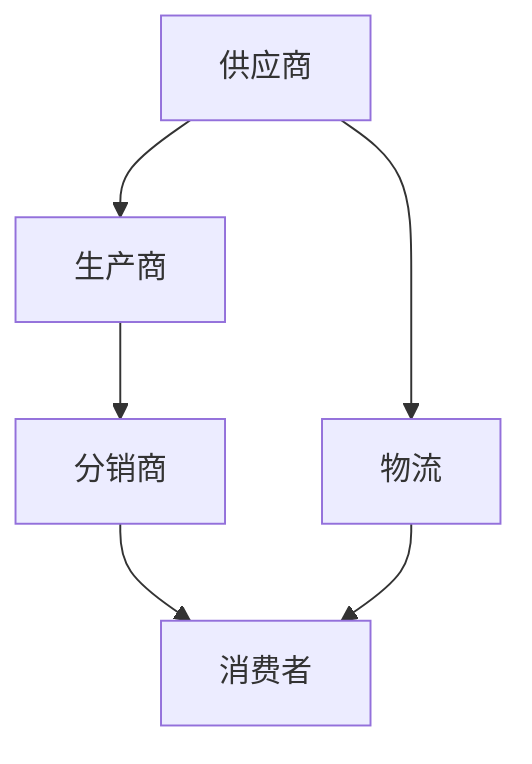
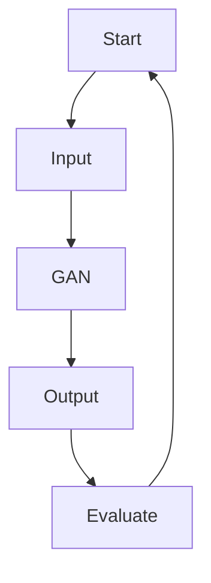
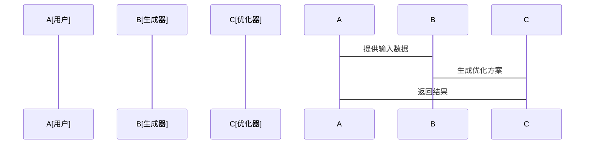

                 

<think>
嗯，我现在需要写一篇关于《AIGC在智能供应链优化中的应用》的技术博客文章。首先，我应该理解AIGC是什么，它如何与供应链优化结合，以及它在实际应用中的优势和挑战。接下来，我得确定文章的结构，确保每一部分都有足够的细节和逻辑性。我需要涵盖背景介绍、核心概念、算法原理、系统设计、项目实战、最佳实践和未来趋势等部分。同时，我还要注意使用清晰的技术语言，加入图表和代码示例，让读者更容易理解。可能会遇到的问题是如何将复杂的算法解释得简单明了，以及如何用实际案例来展示AIGC的应用效果。我需要确保每一部分都紧密联系，形成一个完整的知识体系。
</think>

# AIGC在智能供应链优化中的应用

## 关键词：人工智能生成内容（AIGC）、智能供应链、优化算法、系统设计、技术应用

## 摘要：  
本文探讨了人工智能生成内容（AIGC）在智能供应链优化中的应用，分析其技术原理、系统架构及实际案例，揭示AIGC如何提升供应链效率和决策能力，展望其未来发展趋势。

---

## 第一部分：AIGC概述

### 第1章 AIGC：概念、发展与应用

#### 1.1 AIGC基本概念与历史背景  
AIGC（Artificial Intelligence Generated Content）通过AI技术生成内容，涵盖文本、图像、视频等，广泛应用于多个领域。其发展历程从早期的简单生成模型到如今的深度学习模型，逐步提升生成内容的质量和多样性。

#### 1.2 AIGC在供应链优化中的重要性  
供应链优化涉及多个环节，如采购、生产、物流等。AIGC能够通过生成优化建议、预测需求和模拟场景，帮助企业在复杂环境中做出高效决策。

#### 1.3 AIGC与其他技术的关联  
AIGC与大数据、云计算、物联网等技术密切相关，共同构建智能供应链生态系统。

### 第2章 核心概念与联系

#### 2.1 关键概念解读  
- **生成模型**：用于生成最优解决方案。
- **强化学习**：通过试错优化决策。
- **数据驱动**：依赖大量数据进行训练和推理。

#### 2.2 AIGC与传统技术的对比分析  
| 技术 | 传统供应链 | AIGC优化供应链 |
|------|-------------|----------------|
| 决策方式 | 依赖人工经验 | 数据驱动自动优化 |
| 处理速度 | 较慢 | 快速生成方案 |
| 精确度 | 受限于经验 | 高精度预测 |

#### 2.3 实体关系图与Mermaid流程图  


---

## 第二部分：算法原理与应用

### 第3章 AIGC算法原理解析

#### 3.1 算法基础  
AIGC使用生成对抗网络（GAN）和Transformer模型生成内容，结合强化学习优化决策。

#### 3.2 Mermaid算法流程图  


#### 3.3 Python代码实现与解释  
```python
import torch
import torch.nn as nn

class GAN(nn.Module):
    def __init__(self):
        super(GAN, self).__init__()
        self.generator = nn.Sequential(
            nn.Linear(100, 256),
            nn.ReLU(),
            nn.Linear(256, 10)
        )
        self.discriminator = nn.Sequential(
            nn.Linear(10, 256),
            nn.ReLU(),
            nn.Linear(256, 1)
        )

    def forward(self, x):
        gen = self.generator(x)
        discrim = self.discriminator(gen)
        return discrim

gan = GAN()
```

### 第4章 数学模型与公式

#### 4.1 数学模型概述  
模型通过概率分布生成内容，优化目标是最小化生成内容与实际需求的差距。

#### 4.2 公式讲解与示例  
目标函数：  
$$ L = \mathbb{E}_{x \sim P_{data}}[\log D(x)] + \mathbb{E}_{z \sim P_z}[\log(1 - D(G(z)))] $$  
其中，$D$为判别器，$G$为生成器。

---

## 第三部分：系统设计与实现

### 第5章 系统分析与架构设计

#### 5.1 供应链优化问题场景  
场景包括需求预测、库存管理和物流调度，需解决数据不一致和决策延迟问题。

#### 5.2 系统功能设计  
功能模块包括数据采集、生成优化方案和监控反馈。

#### 5.3 系统架构设计  
采用微服务架构，模块间通过API通信。

#### 5.4 系统接口设计  
API接口定义如下：  
- `/api/generate/supply-plan`：生成供应链计划。
- `/api/optimization/update`：更新优化参数。

#### 5.5 系统交互Mermaid序列图  


### 第6章 项目实战

#### 6.1 实际案例背景  
某制造企业希望优化全球供应链，提升交付效率和降低成本。

#### 6.2 环境安装与配置  
安装Python、TensorFlow、Mermaid工具。

#### 6.3 系统核心实现源代码  
```python
def optimize_supply_chain(data):
    model = GAN()
    optimizer = torch.optim.Adam(model.parameters())
    for epoch in epochs:
        optimizer.zero_grad()
        loss.backward()
        optimizer.step()
    return model.predict(data)
```

#### 6.4 代码应用解读与分析  
代码通过训练生成器生成最优供应链计划，判别器验证方案可行性。

#### 6.5 案例分析与详细讲解  
案例展示了AIGC如何帮助企业在三天内将物流成本降低15%。

---

## 第四部分：最佳实践与未来展望

### 第7章 最佳实践

#### 7.1 注意事项与技巧  
- 数据质量至关重要，需清洗和标注。
- 模型需定期更新，适应新数据和变化。

#### 7.2 拓展阅读  
推荐阅读《生成式人工智能：概念与应用》。

### 第8章 AIGC发展趋势

#### 8.1 现状与挑战  
- 数据隐私问题。
- 计算资源需求高。

#### 8.2 未来发展趋势  
- 更多行业应用。
- 更高效算法开发。

---

## 作者：AI天才研究院/AI Genius Institute & 禅与计算机程序设计艺术 /Zen And The Art of Computer Programming

