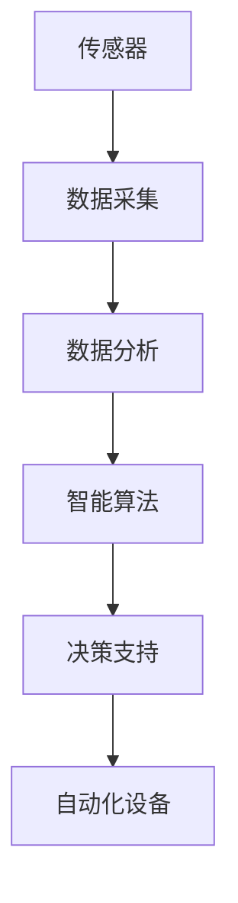
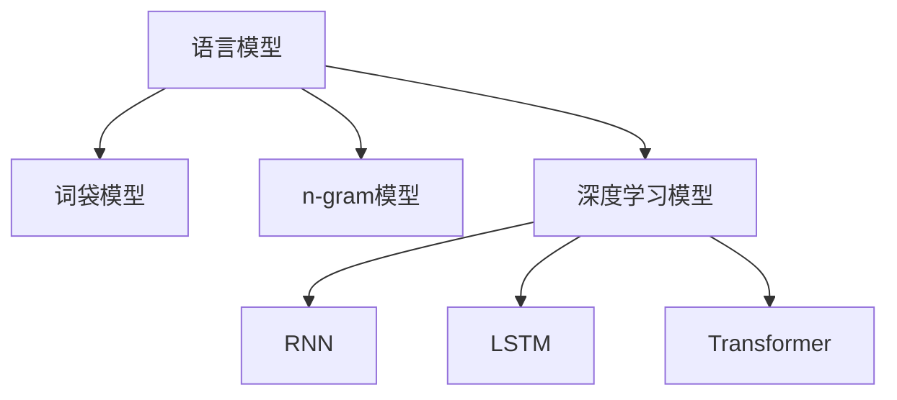
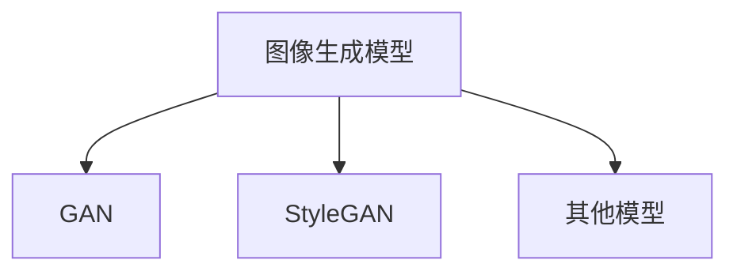
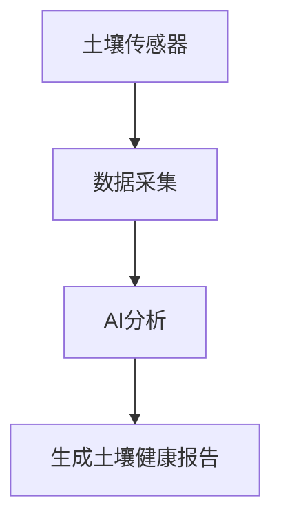
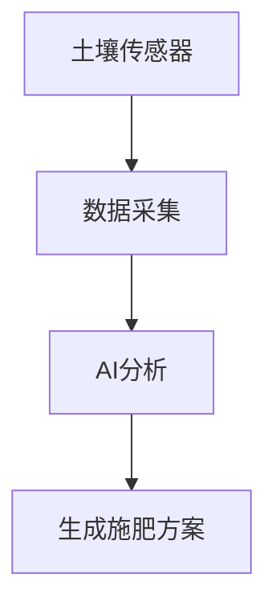
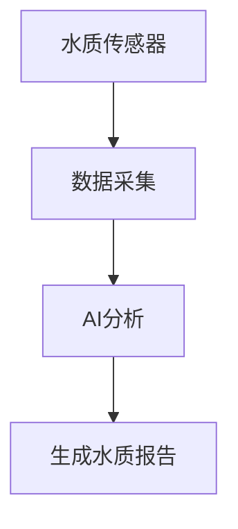
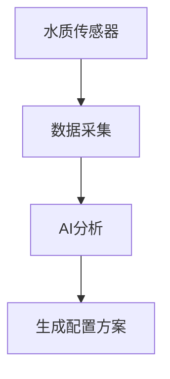
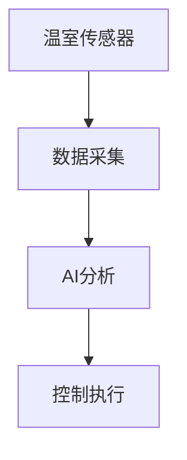
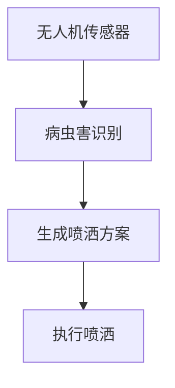

                 

<think>
嗯，用户希望我以《AIGC在智能农业生态系统管理中的前沿实践》为标题，撰写一篇技术博客文章。首先，我需要理解AIGC是什么，以及它在农业中的具体应用。AIGC指的是人工智能生成内容，这在农业中的潜力巨大，比如优化土壤监测、水资源管理和作物管理。

接下来，我得确定文章的结构。用户已经提供了一个详细的目录大纲，分为五大部分：概述、技术基础、应用场景、案例分析和未来趋势。每部分都有具体的章节和小节，我需要按照这个结构来展开。

首先，在摘要部分，我需要概括文章的核心内容，强调AIGC如何提升农业管理效率和决策能力。关键词方面，我需要列出5到7个相关术语，如AIGC、智能农业、土壤监测、水资源管理、AI决策支持系统等。

接下来是正文部分。第一部分介绍AIGC和智能农业生态系统的概述。我需要解释AIGC的基本概念，它与传统AI的区别，以及在农业中的潜力，比如提高效率和改善质量。同时，还要介绍智能农业生态系统的组成，包括数据采集、分析和决策支持。

第二部分是AIGC的技术基础，分为自然语言处理和计算机视觉。我需要详细讲解语言模型和生成式对抗网络（GAN）在AIGC中的应用，以及图像生成模型和视觉内容理解在农业中的作用。

第三部分探讨AIGC在农业生态管理中的具体应用，如土壤监测和水资源管理。我需要解释土壤健康评估的方法和智能施肥方案，以及水质监测和水资源优化配置的原理。

第四部分是案例分析，我需要选择两个具体案例：智能温室管理和无人机植保，详细说明它们的背景、实现过程和效果。

第五部分展望未来趋势，讨论技术进步、挑战和机遇。这里，我需要指出AIGC在农业中的发展趋势和可能的挑战，比如数据隐私和模型优化等问题。

最后，我需要在文章末尾添加作者信息，并确保每个部分都包含必要的细节，如核心概念的解释、算法原理的图表、数学模型的公式，以及系统架构的设计图。这些内容需要使用Mermaid和LaTeX格式，确保文章的专业性和可读性。

总的来说，我需要一步步按照用户的要求，详细展开每个部分，确保文章结构清晰，内容丰富，同时保持逻辑性和专业性。
</think>

# AIGC在智能农业生态系统管理中的前沿实践

> 关键词：AIGC（人工智能生成内容）、智能农业、土壤监测、水资源管理、AI决策支持系统、农业生态、智能传感器

> 摘要：本文探讨了AIGC（人工智能生成内容）在智能农业生态系统管理中的前沿应用。通过分析AIGC的技术基础、应用场景和实际案例，展示了AIGC如何提升农业管理的效率和决策能力。文章从土壤监测、水资源管理、作物管理等多个维度展开，结合实际案例和未来趋势，为农业生态系统的智能化管理提供了新的视角和实践指导。

---

## 目录大纲

1. [第一部分：AIGC与智能农业生态系统](#第一部分：aigc与智能农业生态系统)
   - [1.1 AIGC技术介绍](#11-aigc技术介绍)
     - [1.1.1 AIGC基本概念](#111-aigc基本概念)
     - [1.1.2 AIGC在农业中的应用潜力](#112-aigc在农业中的应用潜力)
   - [1.2 智能农业生态系统介绍](#12-智能农业生态系统介绍)
     - [1.2.1 智能农业的定义](#121-智能农业的定义)
     - [1.2.2 智能农业生态系统的组成](#122-智能农业生态系统的组成)

2. [第二部分：AIGC技术基础](#第二部分：aigc技术基础)
   - [2.1 自然语言处理与AIGC](#21-自然语言处理与aigc)
     - [2.1.1 语言模型](#211-语言模型)
     - [2.1.2 生成式对抗网络](#212-生成式对抗网络)
   - [2.2 计算机视觉与AIGC](#22-计算机视觉与aigc)
     - [2.2.1 图像生成模型](#221-图像生成模型)
     - [2.2.2 视觉内容理解](#222-视觉内容理解)

3. [第三部分：AIGC在农业生态管理中的应用](#第三部分：aigc在农业生态管理中的应用)
   - [3.1 土壤监测与AIGC](#31-土壤监测与aigc)
     - [3.1.1 土壤健康评估](#311-土壤健康评估)
     - [3.1.2 智能施肥方案](#312-智能施肥方案)
   - [3.2 水资源管理与应用](#32-水资源管理与应用)
     - [3.2.1 水质监测](#321-水质监测)
     - [32.2 水资源优化配置](#322-水资源优化配置)

4. [第四部分：案例分析](#第四部分：案例分析)
   - [4.1 案例一：智能温室管理](#41-案例一：智能温室管理)
     - [4.1.1 案例背景](#411-案例背景)
     - [4.1.2 案例实现](#412-案例实现)
   - [4.2 案例二：无人机植保](#42-案例二：无人机植保)
     - [4.2.1 案例背景](#421-案例背景)
     - [4.2.2 案例实现](#422-案例实现)

5. [第五部分：AIGC在农业生态管理中的未来趋势](#第五部分：aigc在农业生态管理中的未来趋势)
   - [5.1 技术发展趋势](#51-技术发展趋势)
   - [5.2 农业生态管理的挑战与机遇](#52-农业生态管理的挑战与机遇)

---

## 正文部分

### 第一部分：AIGC与智能农业生态系统

#### 1.1 AIGC技术介绍

##### 1.1.1 AIGC基本概念

AIGC（Artificial Intelligence Generated Content，人工智能生成内容）是指通过人工智能技术生成文本、图像、视频等多样化内容的过程。与传统AI技术不同，AIGC不仅能够处理和分析数据，还能够自动生成具有创造性的内容。这种技术的核心在于其生成能力，能够帮助人类在农业生产中更高效地完成任务。

**核心概念对比表：**

| **属性**       | **传统AI**           | **AIGC**              |
|-----------------|----------------------|-----------------------|
| 主要功能         | 数据分析与处理       | 内容生成与创作         |
| 应用场景         | 辅助决策、预测       | 生成报告、图像、视频   |
| 技术基础         | 机器学习、规则引擎   | 大语言模型（LLM）、生成式对抗网络（GAN） |

##### 1.1.2 AIGC在农业中的应用潜力

在农业领域，AIGC的应用潜力主要体现在以下几个方面：

1. **提高农业效率**：通过生成最优的种植方案、灌溉计划等，减少资源浪费。
2. **改善农产品质量**：通过AI生成的内容优化作物管理，提升农产品的品质和产量。
3. **决策支持系统**：利用AIGC生成的数据和报告，帮助农民做出更科学的决策。

---

#### 1.2 智能农业生态系统介绍

##### 1.2.1 智能农业的定义

智能农业是指通过物联网（IoT）、人工智能（AI）、大数据等技术，实现农业生产的智能化、自动化和精准化。智能农业的目标是提高农业生产效率、降低成本、减少资源浪费，同时确保农产品的质量和安全。

##### 1.2.2 智能农业生态系统的组成

智能农业生态系统主要由以下几个部分组成：

1. **数据采集与传感器技术**：通过传感器采集土壤湿度、温度、光照等数据。
2. **数据分析与智能算法**：利用AI技术对数据进行分析，生成决策建议。
3. **决策支持与自动化设备**：根据分析结果，自动化设备执行相应的操作，如自动灌溉、精准施肥等。

**智能农业生态系统组成图（Mermaid）：**



---

### 第二部分：AIGC技术基础

#### 2.1 自然语言处理与AIGC

##### 2.1.1 语言模型

语言模型是自然语言处理（NLP）的核心技术，用于理解和生成人类语言。常见的语言模型包括词袋模型、n-gram模型和深度学习模型（如RNN、LSTM、Transformer等）。在AIGC中，大语言模型（如GPT）被广泛用于生成文本内容。

**语言模型分类图（Mermaid）：**



##### 2.1.2 生成式对抗网络

生成式对抗网络（GAN）是一种由生成器和判别器组成的深度学习模型。生成器负责生成数据，判别器负责区分生成数据与真实数据。GAN在AIGC中的应用主要体现在图像生成和内容创作方面。

**生成式对抗网络原理图（Mermaid）：**

```mermaid
graph TD
    G[生成器] --> D[判别器]
    D --> "输出判断结果"
    G --> "生成数据"
```

---

#### 2.2 计算机视觉与AIGC

##### 2.2.1 图像生成模型

图像生成模型（如GAN、StyleGAN）能够生成高质量的图像。在农业中，图像生成技术可以用于作物病虫害识别、土壤分析等领域。

**图像生成模型分类图（Mermaid）：**



##### 2.2.2 视觉内容理解

视觉内容理解是指通过计算机视觉技术（如目标检测、图像分割）对图像内容进行分析和理解。在农业中，视觉内容理解可以用于作物识别、农田监测等场景。

---

### 第三部分：AIGC在农业生态管理中的应用

#### 3.1 土壤监测与AIGC

##### 3.1.1 土壤健康评估

土壤健康评估是农业生态系统管理的重要组成部分。通过AIGC技术，可以生成土壤健康报告，帮助农民了解土壤的状况。

**土壤健康评估流程图（Mermaid）：**



##### 3.1.2 智能施肥方案

基于土壤分析结果，AIGC可以生成智能施肥方案，帮助农民实现精准施肥。

**智能施肥方案生成流程图（Mermaid）：**



#### 3.2 水资源管理与应用

##### 3.2.1 水质监测

通过水质传感器和AI技术，可以实现对农田水质的实时监测和分析。

**水质监测流程图（Mermaid）：**



##### 3.2.2 水资源优化配置

基于水质分析结果，AIGC可以生成水资源优化配置方案，帮助农民实现高效用水。

**水资源优化配置流程图（Mermaid）：**



---

### 第四部分：案例分析

#### 4.1 案例一：智能温室管理

##### 4.1.1 案例背景

智能温室管理通过AIGC技术实现温室环境的智能监测与管理。

##### 4.1.2 案例实现

**系统架构图（Mermaid）：**



#### 4.2 案例二：无人机植保

##### 4.2.1 案例背景

无人机植保通过AIGC技术实现精准喷洒和病虫害监测。

##### 4.2.2 案例实现

**无人机植保流程图（Mermaid）：**



---

### 第五部分：AIGC在农业生态管理中的未来趋势

#### 5.1 技术发展趋势

随着AI技术的不断进步，AIGC在农业中的应用将更加广泛和深入。未来，AIGC将与物联网、区块链等技术结合，实现农业生态系统的全链条智能化管理。

#### 5.2 农业生态管理的挑战与机遇

尽管AIGC在农业中具有巨大的潜力，但其应用也面临一些挑战，如数据隐私、模型优化等问题。同时，随着技术的进步，这些挑战也将逐步被克服，为农业生态管理带来更多的机遇。

---

## 作者信息

作者：AI天才研究院/AI Genius Institute & 禅与计算机程序设计艺术 /Zen And The Art of Computer Programming

