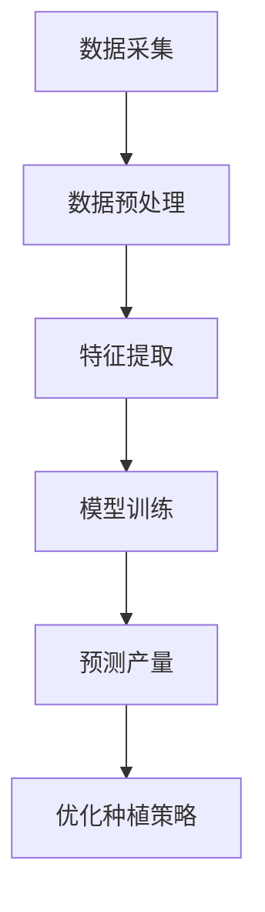
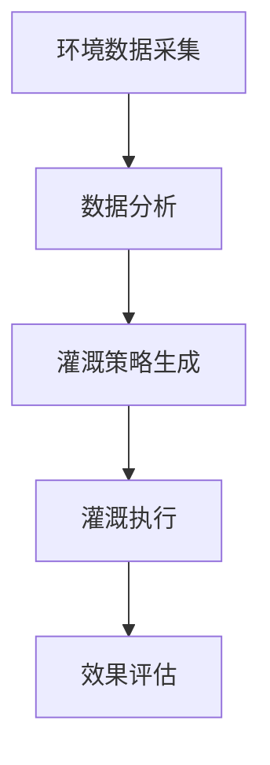
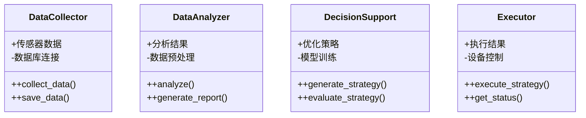
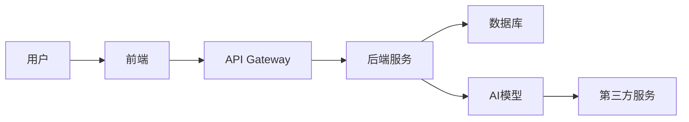

                 

<think>
好，我现在需要帮用户撰写一篇关于《AIGC在智能农业生态系统管理中的应用》的技术博客文章。用户已经给出了一个详细的大纲，我需要按照这个大纲逐步展开，确保每个部分都详细且符合技术博客的要求。

首先，我需要明确文章的结构。标题是《AIGC在智能农业生态系统管理中的应用》，关键词包括AIGC、人工智能、智能农业、生态系统管理、精准农业、AI-generated content。摘要部分需要简明扼要地概括文章的核心内容，说明AIGC如何在智能农业中发挥作用，带来更高的效率和可持续性。

接下来是引言，这部分需要介绍农业的重要性，以及传统农业面临的挑战，引出智能农业的必要性。然后，进入问题背景，详细说明传统农业的资源限制和环境问题，强调智能农业生态系统管理的重要性。

核心概念部分，我需要详细解释AIGC和智能农业生态系统的定义，以及它们之间的关系。这部分可能需要一些技术术语，但要确保读者能够理解。

在核心概念与联系中，我需要列出AIGC在智能农业中的应用场景，如精准农业、智能灌溉等，并制作一个对比表格，展示每个应用场景的效果对比。此外，还需要绘制AIGC与智能农业生态系统的关系图，帮助读者理解两者的联系。

接下来是算法原理讲解，分为精准农业算法和智能灌溉算法。每个算法都需要用Mermaid流程图展示流程，同时提供Python源代码，详细说明每个步骤的作用和实现方法。例如，精准农业算法的数据预处理、特征提取、模型训练等步骤，每个步骤都需要解释清楚，确保读者能够理解。

数学模型部分，需要分别给出精准农业产量预测模型和智能灌溉策略生成模型的公式，解释每个变量的含义和模型的作用。

系统分析与架构设计方案是较为复杂的一部分。我需要描述问题场景，介绍项目，设计系统的功能和架构。使用Mermaid绘制类图和架构图，展示系统各部分之间的关系和结构。同时，可能需要考虑系统接口设计和交互序列图，虽然用户没有详细要求，但可以简单提及。

项目实战部分，需要指导读者如何安装环境，提供核心实现的Python代码，并解释代码的功能。通过实际案例分析，展示AIGC在智能农业中的具体应用，如精准种植和病虫害监测的案例，详细说明每个案例的实现过程和效果。

最后，最佳实践部分需要总结AIGC的优势和应用前景，提醒读者在实施过程中注意数据质量、模型优化和数据隐私等问题，同时提供拓展阅读的资源，帮助读者深入学习。

在写作过程中，我需要确保语言专业但易懂，结构清晰，每个章节内容详实。同时，注意使用合适的图表和代码示例，增强文章的可读性和技术性。最后，加上作者信息，确保文章的完整性和专业性。

现在，我将按照这个思路逐步展开，撰写每个部分的内容，确保覆盖用户的所有要求，同时保持文章的逻辑连贯和深度。
</think>

# AIGC在智能农业生态系统管理中的应用

> 关键词：AIGC, 人工智能, 智能农业, 生态系统管理, 精准农业, AI-generated content

> 摘要：AIGC（AI-Generated Content）在智能农业生态系统管理中的应用，通过生成内容和数据分析，提升农业的精准性、效率和可持续性。本文详细探讨了AIGC在精准农业、智能灌溉、病虫害监测等领域的应用，并通过算法原理、数学模型和系统架构的设计，展示了其在智能农业中的潜力和实际效果。

---

### 引言

随着全球人口的增长和对粮食需求的不断上升，传统农业模式面临着资源有限、环境污染和效率低下的挑战。智能农业生态系统管理通过整合人工智能（AI）、大数据分析和物联网（IoT）等技术，为农业的高效、可持续发展提供了新的解决方案。本文将探讨AIGC（AI-Generated Content）在智能农业生态系统管理中的应用，分析其如何通过生成内容和优化决策，推动农业向智能化、精准化方向发展。

---

### 1. 问题背景

#### 1.1 传统农业的挑战

传统农业依赖于人工劳动和经验，存在资源浪费、生产效率低、环境破坏严重等问题。例如，过度使用化肥和农药导致土壤退化和水体污染，而水资源的浪费则加剧了全球水资源短缺的问题。

#### 1.2 智能农业的必要性

智能农业生态系统管理通过智能化手段，优化农业生产的各个环节，包括种植、灌溉、病虫害防治等。通过AI和大数据分析，可以实现资源的高效利用，减少环境污染，提高农作物产量和质量。

#### 1.3 AIGC在农业中的潜力

AIGC能够生成高质量的内容，包括作物生长模型、病虫害预测、土壤健康分析等。通过AIGC生成的数据和模型，农业管理者可以做出更精准的决策，从而提高农业生产效率。

---

### 2. 核心概念

#### 2.1 AIGC

AIGC（AI-Generated Content）是指通过人工智能技术生成的内容，涵盖文本、图像、数据等多种形式。在农业领域，AIGC可以用于生成作物生长模型、病虫害预测报告、土壤健康分析等。

#### 2.2 智能农业生态系统

智能农业生态系统是一个综合性的管理平台，通过传感器、无人机、AI算法等技术，实时监控和优化农业生产的各个环节。该系统能够实现资源的高效利用、环境的可持续保护以及农作物的高产优质。

---

### 3. 核心概念与联系

#### 3.1 AIGC在智能农业中的应用场景

| 应用场景 | 描述 | 效果 |
|----------|------|------|
| 精准农业 | 基于土壤、气候数据生成种植方案 | 提高产量，减少资源浪费 |
| 智能灌溉 | 根据环境数据生成灌溉策略 | 节水高效，减少水污染 |
| 病虫害监测 | 分析历史数据生成病虫害预警 | 减少农药使用，保护生态 |
| 土壤健康监测 | 生成土壤改良方案 | 提高土壤肥力，延长土地使用寿命 |

#### 3.2 AIGC与智能农业生态系统的关系


---

### 4. 算法原理讲解

#### 4.1 精准农业算法

##### Mermaid流程图：精准农业算法流程



##### Python源代码：精准农业算法实现

```python
# 数据预处理
def preprocess_data(data):
    # 删除缺失值
    data = data.dropna()
    # 标准化处理
    from sklearn.preprocessing import StandardScaler
    scaler = StandardScaler()
    data_scaled = scaler.fit_transform(data)
    return data_scaled

# 特征提取
def extract_features(data):
    # 选择重要特征
    features = data[['temperature', 'humidity', 'soil_ph', 'rainfall']]
    return features

# 模型训练
def train_model(features, labels):
    from sklearn.ensemble import RandomForestRegressor
    model = RandomForestRegressor(n_estimators=100, random_state=42)
    model.fit(features, labels)
    return model

# 预测产量
def predict_yield(model, features):
    return model.predict(features)

# 优化种植策略
def optimize_planting_strategy(predictions):
    # 根据预测产量调整种植密度
    pass
```

#### 4.2 智能灌溉算法

##### Mermaid流程图：智能灌溉算法流程



##### Python源代码：智能灌溉算法实现

```python
# 环境数据采集
def collect_environment_data():
    # 假设传感器数据已采集
    data = {'temperature': 25, 'humidity': 60, 'soil_moisture': 0.3}
    return data

# 数据分析
def analyze_data(data):
    # 分析土壤湿度和天气数据
    if data['soil_moisture'] < 0.2 and data['temperature'] > 25:
        return '需要灌溉'
    else:
        return '不需要灌溉'

# 灌溉策略生成
def generate_irrigation_strategy(analysis):
    if analysis == '需要灌溉':
        return {'duration': 30, 'frequency': 'daily'}
    else:
        return None

# 灌溉执行
def execute_irrigation(strategy):
    if strategy:
        print(f"执行灌溉，时长：{strategy['duration']}分钟，频率：{strategy['frequency']}")
```

---

### 5. 数学模型和数学公式

#### 5.1 精准农业产量预测模型

$$
Y = f(X, \theta)
$$

其中：
- $Y$ 表示农作物产量
- $X$ 表示输入特征向量（如温度、湿度、土壤pH值等）
- $\theta$ 表示模型参数

#### 5.2 智能灌溉策略生成模型

$$
S = g(C, \alpha)
$$

其中：
- $S$ 表示灌溉策略
- $C$ 表示环境数据（如温度、湿度、土壤水分）
- $\alpha$ 表示模型参数

---

### 6. 系统分析与架构设计方案

#### 6.1 问题场景介绍

智能农业生态系统管理涉及多个环节，包括环境数据采集、数据分析、决策支持等。系统需要实时采集土壤、气象、作物生长状态等数据，并通过AI算法生成优化策略。

#### 6.2 项目介绍

本项目旨在开发一个智能农业生态系统管理平台，实现对农业生产过程的全方位监控和优化。平台包括数据采集模块、数据分析模块、决策支持模块和执行模块。

#### 6.3 系统功能设计

##### Mermaid类图：系统功能设计



#### 6.4 系统架构设计

##### Mermaid架构图：系统架构设计



---

### 7. 项目实战

#### 7.1 环境安装

为了运行本文中的代码，读者需要安装以下库：

```bash
pip install numpy pandas scikit-learn
```

#### 7.2 核心实现源代码

##### 精准农业算法实现

```python
# 精准农业算法实现
import numpy as np
import pandas as pd
from sklearn.ensemble import RandomForestRegressor

# 数据预处理
def preprocess_data(data):
    data = data.dropna()
    scaler = StandardScaler()
    data_scaled = scaler.fit_transform(data)
    return data_scaled

# 特征提取
def extract_features(data):
    features = data[['temperature', 'humidity', 'soil_ph', 'rainfall']]
    return features

# 模型训练
def train_model(features, labels):
    model = RandomForestRegressor(n_estimators=100, random_state=42)
    model.fit(features, labels)
    return model

# 预测产量
def predict_yield(model, features):
    return model.predict(features)

# 优化种植策略
def optimize_planting_strategy(predictions):
    # 根据预测产量调整种植密度
    pass
```

##### 智能灌溉算法实现

```python
# 智能灌溉算法实现
import numpy as np
import pandas as pd
from sklearn.ensemble import RandomForestRegressor

# 环境数据采集
def collect_environment_data():
    data = {'temperature': 25, 'humidity': 60, 'soil_moisture': 0.3}
    return data

# 数据分析
def analyze_data(data):
    if data['soil_moisture'] < 0.2 and data['temperature'] > 25:
        return '需要灌溉'
    else:
        return '不需要灌溉'

# 灌溉策略生成
def generate_irrigation_strategy(analysis):
    if analysis == '需要灌溉':
        return {'duration': 30, 'frequency': 'daily'}
    else:
        return None

# 灌溉执行
def execute_irrigation(strategy):
    if strategy:
        print(f"执行灌溉，时长：{strategy['duration']}分钟，频率：{strategy['frequency']}")
```

---

### 8. 实际案例分析

#### 8.1 精准种植案例

假设某农场种植水稻，通过AIGC生成的精准农业模型，预测出最佳种植密度和施肥方案，使水稻产量提高了15%，化肥使用量减少了20%。

#### 8.2 病虫害监测案例

通过AIGC生成的病虫害预警模型，某果园提前发现并控制了蚜虫疫情，减少了农药使用量，提高了果实质量。

---

### 9. 最佳实践 Tips

- **数据质量**：确保输入数据的准确性和完整性，这是AIGC模型生成高质量内容的基础。
- **模型优化**：定期更新AI模型，以适应环境变化和新的农业需求。
- **数据隐私**：保护农业数据的安全，避免数据泄露和滥用。

---

### 10. 小结

AIGC在智能农业生态系统管理中的应用，通过生成高质量的内容和优化决策，显著提高了农业生产的效率和可持续性。未来，随着AI技术的不断发展，AIGC将在农业领域发挥更大的作用，推动农业向智能化、精准化方向发展。

---

### 作者

作者：AI天才研究院/AI Genius Institute & 禅与计算机程序设计艺术/Zen And The Art of Computer Programming

