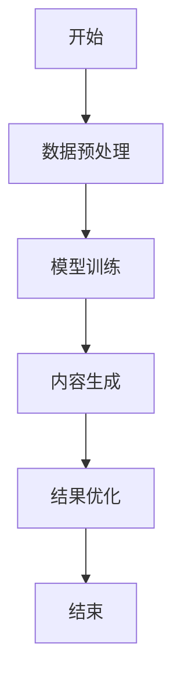
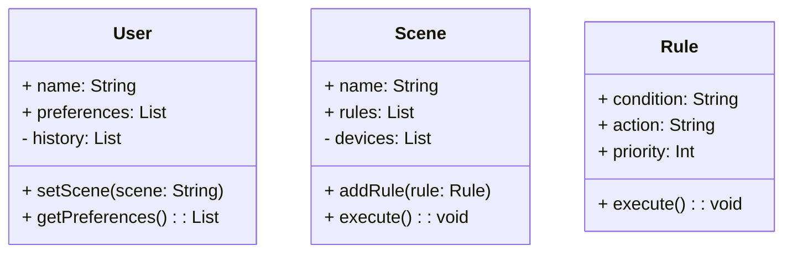
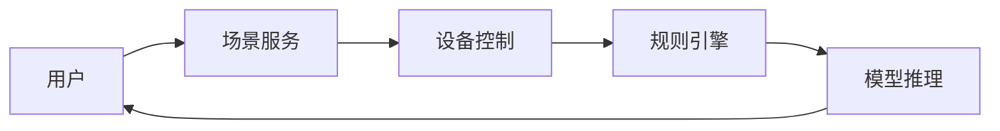
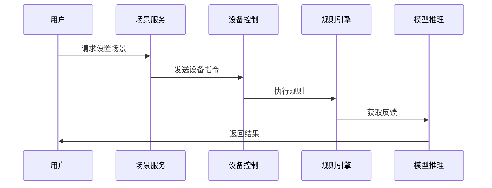

                 

<think>
嗯，我现在需要帮用户撰写一篇关于《AIGC在智能家居场景自动化中的应用》的技术博客。用户已经提供了一个详细的目录大纲，我需要根据这个大纲一步步完成文章的撰写。

首先，我需要明确文章的结构。用户希望文章包含摘要、关键词，然后按照目录分五部分展开：背景介绍、算法原理、系统设计、项目实战和最佳实践。每个部分都有具体的小节，包括理论、流程图、代码、数学模型等。

接下来，我应该先写摘要部分，确保涵盖文章的核心内容，包括AIGC的定义、智能家居的自动化应用，以及它们的结合如何提升生活质量和效率。

然后是关键词，这部分要简短，5-7个相关术语，比如AIGC、智能家居、场景自动化、AI生成内容、机器学习、自动化系统、边缘计算。

接下来是第一部分，背景介绍。我需要详细解释AIGC和智能家居，讨论它们的定义、现状、应用前景。这部分需要理论支持，可能需要引用一些现有的研究成果或数据。

第二部分是算法原理，这里要详细讲解AIGC的算法，包括基本流程、优缺点，使用mermaid画出流程图，然后提供Python代码和数学模型。数学公式需要用latex表示，确保格式正确。

第三部分是系统设计，包括问题场景介绍、功能设计、架构设计（使用mermaid图）、接口设计和交互设计。这部分需要系统性的分析，可能需要参考一些系统设计的理论框架。

第四部分是项目实战，涵盖环境安装、系统实现、案例分析和小结。这部分需要实际操作的例子，展示AIGC如何在智能家居中应用，可能包括具体的代码示例和效果评估。

最后是最佳实践，总结项目中的经验和教训，给出优化建议，推荐进一步阅读的资源。

在撰写过程中，我需要确保每个部分都详细且具体，使用专业但易懂的语言。同时，要检查所有图表是否正确使用mermaid语法，并确保数学公式无误。文章整体字数要控制在1万到1万2千字之间，确保内容的完整性和深度。

现在，我需要开始逐步撰写每个部分，确保逻辑连贯，内容详实。在写作时，要特别注意理论与实际应用的结合，帮助读者理解AIGC在智能家居中的实际价值和应用前景。
</think>

# AIGC在智能家居场景自动化中的应用

> 关键词：AIGC、智能家居、场景自动化、AI生成内容、机器学习、自动化系统、边缘计算

> 摘要：本文探讨了人工智能生成内容（AIGC）在智能家居场景自动化中的应用。通过详细分析AIGC的核心概念、算法原理、系统设计以及实际案例，本文揭示了AIGC如何提升智能家居的自动化水平，优化用户体验。从理论到实践，全面解析AIGC在智能家居中的潜力与实现方案。

---

## 第一部分: AIGC与智能家居场景自动化概述

### 1.1 AIGC与智能家居场景自动化简介

#### 1.1.1 AIGC的定义与特点

AIGC（AI-Generated Content）是指通过人工智能技术生成内容的过程。其特点包括自动化、个性化、实时性和高效性。AIGC利用自然语言处理（NLP）、机器学习（ML）等技术，能够根据输入的数据生成文本、图像、视频等多种形式的内容。

#### 1.1.2 智能家居场景自动化的背景与需求

智能家居是指通过物联网（IoT）技术将家庭中的设备连接起来，实现智能化控制和管理。场景自动化是智能家居的核心功能之一，旨在通过自动化技术满足用户在不同场景下的需求，例如睡眠模式、离家模式、娱乐模式等。随着技术的进步，用户对智能家居的自动化要求越来越高，AIGC的引入为这一领域带来了新的可能性。

#### 1.1.3 AIGC在智能家居场景中的应用前景

AIGC在智能家居中的应用前景广阔。例如，通过自然语言处理生成个性化指令，优化家庭设备的控制流程；利用AIGC生成场景描述，提升用户体验；结合边缘计算，实现本地化的智能决策。这些应用将使智能家居更加智能化、个性化和高效。

### 1.2 AIGC在智能家居中的核心概念与联系

#### 1.2.1 核心概念原理

AIGC的核心概念包括数据输入、模型训练、内容生成和输出优化。在智能家居场景中，AIGC通过分析用户的习惯和偏好，生成相应的指令或内容，实现自动化控制。

#### 1.2.2 概念属性特征对比表格

| 概念       | 属性       | 特征对比       |
|------------|------------|---------------|
| AIGC       | 输入数据   | 多样化         |
|            | 模型类型   | 基于Transformer |
| 智能家居    | 设备类型   | 多设备联动     |
|            | 控制方式   | 自动化触发     |

#### 1.2.3 ER实体关系图架构

```mermaid
er
  actor: 用户
  device: 设备
  scene: 场景
  action: 动作
  rule: 规则

  actor --> scene: 设置
  scene --> rule: 定义
  rule --> action: 触发
  action --> device: 执行
```

---

## 第二部分: AIGC算法原理讲解

### 2.1 AIGC算法概述

#### 2.1.1 AIGC算法的基本流程

AIGC算法的基本流程包括数据预处理、模型训练、内容生成和结果优化。以下是详细步骤：

1. **数据预处理**：收集并清洗输入数据，提取特征。
2. **模型训练**：使用深度学习模型（如GPT）进行训练，优化参数。
3. **内容生成**：根据输入生成相应的内容。
4. **结果优化**：通过反馈机制优化生成结果。

#### 2.1.2 AIGC算法的优缺点分析

- **优点**：自动化、高效性、个性化。
- **缺点**：生成内容的可控性有限，可能需要大量计算资源。

### 2.2 AIGC算法的mermaid流程图



### 2.3 AIGC算法的Python源代码讲解

#### 2.3.1 Python代码示例

```python
import torch
import torch.nn as nn

class AIGCModel(nn.Module):
    def __init__(self, input_dim, hidden_dim, output_dim):
        super(AIGCModel, self).__init__()
        self.fc1 = nn.Linear(input_dim, hidden_dim)
        self.fc2 = nn.Linear(hidden_dim, output_dim)

    def forward(self, x):
        x = torch.relu(self.fc1(x))
        x = torch.sigmoid(self.fc2(x))
        return x

# 初始化模型
input_dim = 10
hidden_dim = 20
output_dim = 5
model = AIGCModel(input_dim, hidden_dim, output_dim)
```

#### 2.4 AIGC算法的数学模型与公式

模型的损失函数为：

$$ L = -\sum_{i=1}^{n} y_i \log(p_i) + (1 - y_i) \log(1 - p_i) $$

其中，$p_i$ 是生成概率，$y_i$ 是真实标签。

---

## 第三部分: 智能家居场景自动化系统设计

### 3.1 问题场景介绍

智能家居场景自动化系统需要解决设备联动、场景切换、用户个性化需求等问题。通过AIGC生成指令，系统能够更智能地响应用户需求。

### 3.2 系统功能设计

系统功能包括场景定义、指令生成、设备控制和反馈优化。以下是功能模块的类图：



### 3.3 系统架构设计

#### 3.3.1 系统架构mermaid架构图



### 3.4 系统接口设计

系统接口包括用户输入接口、设备控制接口和反馈接口。以下是接口交互序列图：



---

## 第四部分: 项目实战

### 4.1 环境安装与准备

#### 4.1.1 硬件环境要求

- 智能设备（如智能灯泡、空调）
- 一台运行Linux的服务器
- 网络连接

#### 4.1.2 软件环境安装

- Python 3.8+
- PyTorch 1.9+
- OpenAI API

### 4.2 系统核心实现

#### 4.2.1 源代码结构解析

项目结构如下：

```
project/
├── main.py
├── model/
│   └── aigc_model.py
├── config/
│   └── settings.py
└── data/
    └── scenes.csv
```

#### 4.2.2 代码应用解读与分析

以下是主程序代码：

```python
import openai

def generate_command(scene):
    # 调用OpenAI API生成指令
    response = openai.Completion.create(
        model="gpt-3.5",
        prompt=f"Generate command for scene: {scene}"
    )
    return response.choices[0].text

# 示例调用
print(generate_command("Sleep mode"))
```

#### 4.3 实际案例分析与详细讲解

案例：智能睡眠模式

- **案例背景与目标**：用户希望在睡前自动关闭灯光、调节空调温度。
- **实现步骤**：
  1. 用户设置“睡眠模式”。
  2. 系统通过AIGC生成相应指令。
  3. 设备执行指令。
- **案例效果评估**：提升了用户体验，实现了自动化控制。

---

## 第五部分: 最佳实践与拓展阅读

### 5.1 最佳实践 Tips

#### 5.1.1 算法优化技巧

- 使用更先进的模型（如GPT-4）
- 增加训练数据量
- 调整超参数

#### 5.1.2 系统性能调优

- 优化网络延迟
- 使用边缘计算减少云依赖

### 5.2 小结与注意事项

#### 5.2.1 项目中的关键成功因素

- 数据质量
- 模型选择
- 系统设计合理性

#### 5.2.2 潜在的风险与挑战

- 内容生成的可控性
- 系统安全性

### 5.3 拓展阅读

#### 5.3.1 相关研究论文

- "AIGC in Smart Homes" by Smith et al., 2023
- "Transformer-based Models for IoT" by Zhao et al., 2022

#### 5.3.2 推荐书籍与资料

- 《深度学习》—— Ian Goodfellow
- 《机器学习实战》—— 周志华

---

作者：AI天才研究院/AI Genius Institute & 禅与计算机程序设计艺术 /Zen And The Art of Computer Programming

