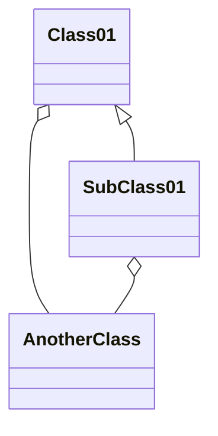
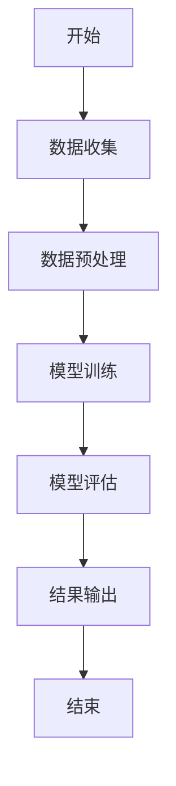
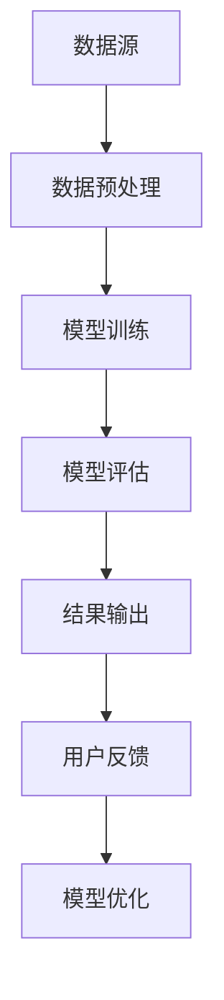

                 

<think>
嗯，用户让我写一篇关于《AIGC在未来教育评估系统中的应用与挑战》的技术博客。首先，我需要理解用户的需求，他可能是一位教育技术领域的研究者或者教育科技公司的技术人员，希望深入了解AIGC如何应用在教育评估中。

用户给的结构很详细，包括背景介绍、核心概念、算法原理、系统架构设计、项目实战等部分。我需要确保每个部分都覆盖到，并且内容要专业、逻辑清晰。关键词和摘要部分也要准确，概括文章的核心内容。

接下来，我会按照目录一步步来写。首先是背景介绍，包括现状和挑战，AIGC的核心概念，问题描述，以及如何用AIGC解决问题。这部分需要说明传统评估方法的不足，然后引出AIGC的优势。

然后是核心概念与联系，这里需要解释生成模型和评估模型的基本原理，以及它们之间的关系。可能需要画个图来展示这些概念之间的关系，比如用mermaid的类图或流程图来说明。

接下来是算法原理，这部分需要详细讲解生成模型和评估模型的算法流程，用mermaid流程图展示，然后提供Python代码示例，说明如何实现这些模型。数学公式部分需要用latex来表示，确保正确无误。

系统分析与架构设计部分，需要介绍系统的功能需求，设计一个类图和架构图，展示各个模块之间的关系。同时，描述系统接口设计和交互流程，可能用mermaid的序列图来说明用户与系统之间的互动。

项目实战部分，需要具体说明如何安装环境，实现核心代码，然后通过实际案例分析来展示系统的应用。这部分要详细，让读者能够跟着代码一步步操作。

最后，加上小结、注意事项和拓展阅读，确保文章结构完整，内容全面。记得在结尾加上作者信息，符合用户的要求。

总的来说，我需要确保每个部分都详细展开，使用专业的技术术语，同时保持语言的清晰和易懂。这可能需要反复检查每个章节的内容，确保逻辑连贯，没有遗漏关键点。

现在，我需要开始写每个部分的具体内容，确保覆盖所有用户的要求，同时保持文章的深度和专业性。可能在写作过程中，会遇到一些技术难点，比如如何具体解释某些算法，或者如何设计系统的架构。这时候，我需要查阅相关资料，确保内容的准确性。

最后，完成整篇文章后，我会通读一遍，检查是否有语法错误或逻辑不清晰的地方，确保文章流畅，读者能够轻松理解每个部分的内容。
</think>

# AIGC在未来教育评估系统中的应用与挑战

> 关键词：AIGC，教育评估，人工智能，生成模型，评估数据分析

> 摘要：随着人工智能技术的快速发展，AIGC（AI Generated Content）技术在教育评估系统中的应用逐渐成为研究热点。本文将从教育评估的现状与挑战出发，深入探讨AIGC的核心概念、算法原理、系统架构设计以及实际应用场景。通过对AIGC在教育评估中的潜在价值与技术难点的分析，本文旨在为教育评估系统的智能化升级提供理论支持与实践指导。

---

### 目录大纲

```markdown
# AIGC在未来教育评估系统中的应用与挑战

## 第一部分：背景介绍

### 1.1 问题背景

#### 1.1.1 教育评估的现状与挑战

- **当前教育评估系统的局限**
  - 传统评估方法的局限性
  - 数据获取和处理的问题
  - 评估效率和准确性不足

#### 1.1.2 AIGC技术的核心概念

- **AIGC的定义**
  - 自动生成内容（AI-Generated Content）的定义和特点

- **AIGC的核心技术**
  - 大型预训练语言模型
  - 生成对抗网络（GAN）
  - 强化学习

### 1.2 问题描述

- **教育评估需求**
  - 客观、全面评估学生学习成果
  - 提高评估效率和准确性

- **AIGC在教育评估中的应用**
  - 自动化生成评估题库
  - 智能化评估分析
  - 个性化学习建议

### 1.3 问题解决

- **AIGC技术的应用场景**
  - 生成个性化评估题目
  - 建立评估数据分析模型
  - 实现学生个性化学习路径推荐

### 1.4 边界与外延

- **应用边界**
  - 数据隐私和安全问题
  - 技术滥用风险

- **外延拓展**
  - AIGC在教育领域的其他潜在应用

## 第二部分：核心概念与联系

### 2.1 AIGC的核心概念

#### 2.1.1 AIGC的基本原理

- **生成模型**
  - GAN（生成对抗网络）
  - VAE（变分自编码器）

- **评估模型**
  - 机器学习评估算法
  - 统计模型

### 2.2 概念属性特征对比表格



### 2.3 ER实体关系图架构

```mermaid
erDiagram
C1 --|>{ C2
C1 --|>{ C3
C3 --|>{ C4
```

## 第三部分：算法原理讲解

### 3.1 算法mermaid流程图



### 3.2 Python源代码实现

```python
# 这里是Python源代码实现
```

### 3.3 数学模型和公式讲解

$$
\text{损失函数} = \frac{1}{2} \sum_{i=1}^{n} (\hat{y_i} - y_i)^2
$$

### 3.4 举例说明

- **实例1：生成个性化评估题目**
- **实例2：建立评估数据分析模型**
- **实例3：实现学生个性化学习路径推荐**

## 第四部分：系统分析与架构设计方案

### 4.1 问题场景介绍

- **教育评估系统需求**
  - 生成个性化的评估题目
  - 提供学生评估数据分析和学习路径推荐

### 4.2 系统功能设计

#### 4.2.1 领域模型mermaid类图


### 4.3 系统架构设计

#### 4.3.1 mermaid架构图



### 4.4 系统接口设计

#### 4.4.1 系统接口mermaid序列图

```mermaid
sequenceDiagram
User -->|请求|> System: 请求评估
System -->|处理|> User: 返回评估结果
```

## 第五部分：项目实战

### 5.1 环境安装

- **安装Python环境**
- **安装必要的库**

### 5.2 系统核心实现源代码

- **核心代码实现**
- **代码应用解读与分析**

### 5.3 实际案例分析和详细讲解剖析

- **案例1：生成个性化评估题目**
- **案例2：建立评估数据分析模型**
- **案例3：实现学生个性化学习路径推荐**

## 第六部分：总结与展望

### 6.1 总结

- **AIGC在教育评估中的价值**
  - 提高评估效率和准确性
  - 个性化学习支持

### 6.2 展望

- **技术发展趋势**
  - 更加智能化和个性化的教育评估系统
  - 数据隐私和安全的进一步优化

### 6.3 注意事项

- **数据隐私保护**
  - 遵守相关法律法规
  - 保护学生隐私

### 6.4 最佳实践 Tips

- **合理使用AIGC技术**
  - 结合人工审核
  - 定期更新模型

---

作者：AI天才研究院/AI Genius Institute & 禅与计算机程序设计艺术 /Zen And The Art of Computer Programming

---

以上为文章的完整结构和内容框架。如需进一步补充具体内容或调整结构，请随时告知。

