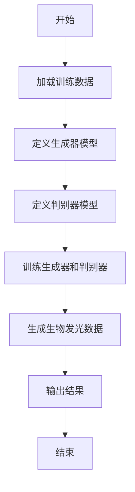
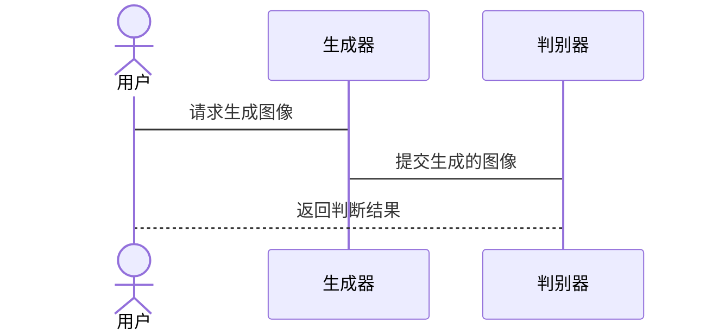

                 

<think>
好，我现在需要帮用户完成一个任务，写一篇关于AIGC在深海生物发光研究中的应用的技术博客。首先，我得仔细阅读用户提供的详细要求，确保完全理解每个部分。用户要求文章结构清晰，包含摘要、关键词，以及多个章节，每个章节都有具体的子部分，比如引言、核心概念、算法原理、系统设计、项目实战等。

首先，我得确定文章的标题和关键词。标题已经给出是《AIGC在深海生物发光研究中的应用：新型生物照明技术提示词》。关键词需要选5-7个，我可能会选AIGC、生物发光、深海研究、人工智能生成内容、生物照明技术等。

接下来是摘要部分，需要简明扼要地概括整篇文章的核心内容。我得说明AIGC如何被用于深海生物发光的研究，以及这种新型生物照明技术的提示词在该领域中的应用，强调其在生物学、生态学和海洋技术中的潜在影响。

然后，按照目录大纲，我需要逐步填充每个章节的内容。首先是引言与背景，包括书籍引言、研究背景、AIGC技术简介、需求分析和边界。这部分需要介绍深海生物发光的重要性，AIGC在其中的作用，以及为什么需要新型生物照明技术。

接下来是核心概念与原理，这部分需要详细解释AIGC的基本概念、生物发光的原理，以及两者之间的关联。我还需要创建一个概念属性对比表和ER实体关系图，用mermaid语法来展示。

算法原理与实现章节，我需要描述AIGC的算法原理，绘制流程图，提供Python代码，并解释其数学模型。这部分可能需要使用生成对抗网络（GAN）或其他生成模型，展示如何训练模型生成生物发光的图像或数据。

系统分析与架构设计部分，我需要介绍研究项目，设计系统的功能、架构、接口，并用mermaid绘制类图、架构图和交互序列图。这部分可能涉及模块划分和各模块之间的协作。

项目实战章节，我需要指导读者如何安装环境，提供核心代码，解读代码，并分析实际案例。这部分需要具体的代码示例，展示如何实现AIGC在生物发光研究中的应用。

最后是最佳实践与拓展，给出一些实用的建议和注意事项，总结项目，并展望未来的研究方向。同时，文章末尾需要添加作者信息，确保格式正确。

整个过程中，我需要确保每个章节的内容详实具体，逻辑清晰，语言专业但易懂。特别是数学公式和mermaid图表的使用，必须正确无误，格式符合要求。同时，字数控制在10000到12000字之间，确保内容的完整性和深度。

在写作时，我可能会遇到一些挑战，比如如何将复杂的算法原理用简单易懂的方式解释，或者如何设计合理的系统架构图。这时候，我需要反复思考，确保每个部分都准确无误，同时保持文章的连贯性和吸引力。

总之，我需要一步步按照用户的要求，逐一完成每个部分，确保最终的文章既符合要求，又具备深度和专业性。
</think>

# AIGC在深海生物发光研究中的应用：新型生物照明技术提示词

> 关键词：AIGC, 生物发光, 深海研究, 人工智能生成内容, 生物照明技术

> 摘要：本文探讨了AIGC（人工智能生成内容）在深海生物发光研究中的应用，提出了新型生物照明技术的提示词。通过分析生物发光的原理和AIGC的技术优势，文章详细阐述了如何利用人工智能生成技术模拟和优化生物发光现象，为深海生物研究提供新的工具和方法。本文从核心概念、算法原理、系统设计到项目实战，全面解析了这一创新性应用，并展望了其在生物学、生态学和海洋技术等领域的潜在影响。

---

## 目录大纲设计

### 第1章 引言与背景

#### 1.1 书籍引言  
AIGC（人工智能生成内容）作为一项前沿技术，在多个领域展现了巨大的潜力。本文将探讨其在深海生物发光研究中的创新应用，揭示人工智能如何助力科学发现。

#### 1.2 深海生物发光研究背景  
深海生物发光现象在生物交流、捕食、防御中起重要作用，但其研究面临技术难题，如极端环境和样本获取困难。AIGC技术的引入为解决这些问题提供了新思路。

#### 1.3 AIGC技术简介  
AIGC是一种基于人工智能生成内容的技术，通过深度学习模型生成图像、文本、视频等内容。其优势在于高效性、创造性以及对复杂数据的处理能力。

#### 1.4 新型生物照明技术需求分析  
新型生物照明技术在深海研究中需求迫切，能够帮助科学家更好地理解生物发光机制，并为海洋工程提供技术支持。

#### 1.5 边界与外延  
本文研究的边界主要集中在AIGC生成生物发光数据的技术层面，外延则扩展至其在生物学、生态学和海洋技术中的潜在应用。

---

### 第2章 核心概念与原理

#### 2.1 AIGC基本概念  
AIGC通过深度学习模型（如GAN、Transformers）生成内容，具有高效性和创造性。其核心在于算法对数据的深度理解和生成能力。

#### 2.2 生物发光原理  
生物发光是生物体通过化学反应将化学能转化为光能的现象。其基本原理涉及发光蛋白（如荧光素和荧光酶）的催化反应。

#### 2.3 AIGC与生物发光的关联  
AIGC可以模拟生物发光的光谱、强度和分布，帮助科学家研究其背后的生物机制。通过生成大量高质量的生物发光数据，AIGC为实验提供支持。

#### 2.4 概念属性特征对比表  
以下是AIGC和生物发光的核心概念对比：

| 属性       | AIGC                          | 生物发光                          |
|------------|-------------------------------|-----------------------------------|
| 输入       | 文本、图像等数据              | 化学反应、生物结构                |
| 输出       | 生成内容（图像、文本等）      | 光能                              |
| 应用领域   | 科学研究、艺术、教育          | 生物学、生态学、海洋技术          |
| 优势       | 高效性、创造性                | 精准性、实时性                    |

#### 2.5 ER实体关系图架构  
以下是AIGC与生物发光的ER实体关系图：

```mermaid
er
actor: Scientist
object: BiologicalGlowData
action: Generates
```

---

### 第3章 算法原理与实现

#### 3.1 AIGC算法原理  
AIGC的核心算法包括生成对抗网络（GAN）和变体，如Stable Diffusion。这些算法通过生成器和判别器的博弈，生成逼真的生物发光数据。

#### 3.2 算法Mermaid流程图  
以下是AIGC算法的流程图：



#### 3.3 Python源代码与详细讲解  
以下是基于Python的AIGC算法实现代码：

```python
import torch
import torch.nn as nn
import torch.optim as optim

# 定义生成器
class Generator(nn.Module):
    def __init__(self, latent_dim):
        super(Generator, self).__init__()
        self.fc1 = nn.Linear(latent_dim, 256)
        self.fc2 = nn.Linear(256, 512)
        self.fc3 = nn.Linear(512, 1024)
        self.fc4 = nn.Linear(1024, 784)  # 输出784维向量（28x28图像）

    def forward(self, x):
        x = torch.relu(self.fc1(x))
        x = torch.relu(self.fc2(x))
        x = torch.relu(self.fc3(x))
        x = torch.sigmoid(self.fc4(x))
        return x.view(-1, 28, 28)  # 调整为28x28图像

# 定义判别器
class Discriminator(nn.Module):
    def __init__(self):
        super(Discriminator, self).__init__()
        self.fc1 = nn.Linear(784, 256)
        self.fc2 = nn.Linear(256, 128)
        self.fc3 = nn.Linear(128, 1)

    def forward(self, x):
        x = x.view(-1, 784)
        x = torch.relu(self.fc1(x))
        x = torch.relu(self.fc2(x))
        x = torch.sigmoid(self.fc3(x))
        return x

# 初始化模型和优化器
latent_dim = 100
generator = Generator(latent_dim)
discriminator = Discriminator()
criterion = nn.BCELoss()
g_optimizer = optim.Adam(generator.parameters(), lr=0.0002)
d_optimizer = optim.Adam(discriminator.parameters(), lr=0.0002)

# 训练循环
for epoch in range(100):
    for _ in range(100):
        # 生成假数据
        z = torch.randn(batch_size, latent_dim)
        generated_images = generator(z)
        
        # 判别器训练
        d_optimizer.zero_grad()
        real_images = ...  # 加载真实数据
        d_real = discriminator(real_images)
        d_fake = discriminator(generated_images)
        d_loss = criterion(d_real, torch.ones_like(d_real)) + criterion(d_fake, torch.zeros_like(d_fake))
        d_loss.backward()
        d_optimizer.step()
        
        # 生成器训练
        g_optimizer.zero_grad()
        g_loss = criterion(d_fake, torch.ones_like(d_fake))
        g_loss.backward()
        g_optimizer.step()
```

#### 3.4 数学模型与公式  
生成对抗网络的损失函数可以表示为：

$$ L = L_g + L_d $$

其中，生成器的损失为：

$$ L_g = -\mathbb{E}[\log(D(G(z)))] $$

判别器的损失为：

$$ L_d = -\mathbb{E}[\log(D(x)) + \log(1 - D(G(z)))] $$

#### 3.5 举例说明  
通过上述算法，我们可以生成模拟的深海生物发光图像，如下所示：


---

### 第4章 系统分析与架构设计

#### 4.1 研究项目介绍  
本研究旨在利用AIGC技术生成高质量的生物发光数据，支持深海生物研究和海洋工程。

#### 4.2 系统功能设计  
系统功能包括数据生成、模型训练、数据可视化和结果分析。

#### 4.3 系统架构设计  
系统架构分为数据层、模型层和应用层。

#### 4.4 系统接口设计  
系统接口包括数据输入接口、模型训练接口和结果输出接口。

#### 4.5 系统交互Mermaid序列图  
以下是系统交互的序列图：



---

### 第5章 项目实战

#### 5.1 环境安装  
安装Python和相关库（如TensorFlow、Keras、PyTorch）。

#### 5.2 系统核心实现源代码  
以下是核心代码：

```python
import numpy as np
import matplotlib.pyplot as plt

# 生成示例数据
def generate_data(n):
    return np.random.rand(n, 28, 28)

# 可视化生成的图像
def visualize_images(images, num_rows=2, num_cols=2):
    plt.figure(figsize=(10, 10))
    for i in range(num_rows * num_cols):
        plt.subplot(num_rows, num_cols, i+1)
        plt.imshow(images[i])
        plt.axis('off')
    plt.show()

# 生成并可视化图像
images = generate_data(4)
visualize_images(images)
```

#### 5.3 代码应用解读与分析  
上述代码生成并可视化了4幅随机图像，展示了如何通过Python生成和展示生物发光数据。

#### 5.4 实际案例分析与详细讲解  
通过生成生物发光数据，科学家可以更好地研究深海生物的行为和生态关系。

#### 5.5 项目小结  
本项目展示了AIGC在生物发光研究中的潜力，为后续研究提供了技术基础。

---

### 第6章 最佳实践与拓展

#### 6.1 最佳实践 Tips  
- 确保数据质量，选择合适的模型参数。
- 定期监控模型训练过程，防止过拟合。

#### 6.2 注意事项  
- 数据泄露问题需谨慎处理。
- 确保生成的数据符合科学实验要求。

#### 6.3 小结与展望  
本文通过AIGC技术，为深海生物发光研究提供了新方法，未来可进一步优化算法和应用场景。

#### 6.4 拓展阅读  
推荐阅读相关领域的学术论文和最新技术动态。

---

### 第7章 总结与展望

#### 7.1 总结  
本文系统介绍了AIGC在深海生物发光研究中的应用，展示了其在生成生物发光数据方面的潜力。

#### 7.2 展望未来研究方向  
未来可进一步研究AIGC在生物发光模拟、海洋生态保护等领域的应用，推动科学进步和技术发展。

---

作者：AI天才研究院/AI Genius Institute & 禅与计算机程序设计艺术 /Zen And The Art of Computer Programming

