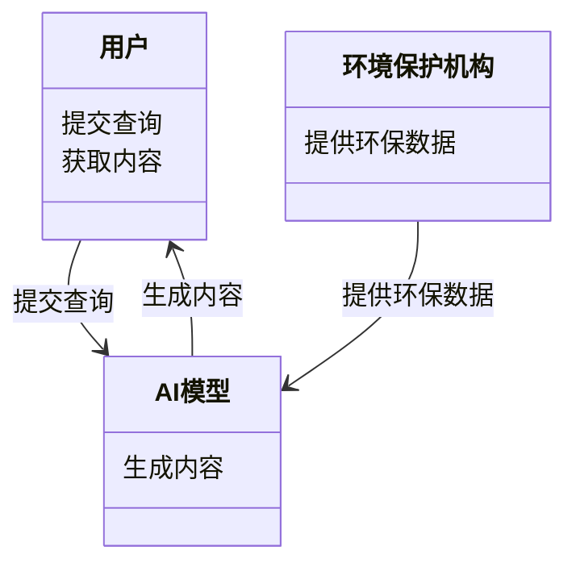

                 

<think>
好，我现在要开始撰写《AIGC在环境保护宣传中的应用：提高公众意识的新方法》这篇文章。首先，我得理解用户的需求。用户希望我以一个技术专家的身份，详细分析AIGC如何应用于环保宣传，结构要清晰，内容要专业且深入，每个章节都要有具体的例子和图表。

首先，背景介绍部分。我需要解释什么是AIGC，以及它在环保宣传中的重要性。这部分要吸引读者，让他们明白为什么环保意识提升是当务之急，而传统宣传方法的不足之处，以及AIGC的优势。

接下来是核心概念与联系。这里需要详细解释生成式AI和内容生成技术，可能需要对比AIGC和传统方法的优缺点，做一个表格。然后，用ER图来展示实体关系，这可能有点挑战，因为环保宣传中的实体可能包括用户、内容、AI模型等，需要明确它们之间的关系。

然后是算法原理讲解。这部分需要详细描述生成式AI的算法流程，比如基于Transformer的模型，使用Mermaid画出流程图。同时，给出Python代码示例，可能是一个简单的生成文本的代码，配合数学公式，如交叉熵损失函数，解释训练过程。

系统分析与架构设计方案部分，我需要设计应用场景，比如生成环保宣传文案、个性化推送等。然后设计系统功能，可能包括内容生成、用户交互、数据分析模块，用类图展示。架构上，可能采用微服务架构，展示各个组件之间的关系。接口设计部分，可能需要画出用户请求生成内容的序列图。

项目实战部分，我需要指导读者如何安装项目环境，比如安装Python、TensorFlow等库。然后展示核心代码，解释每部分的作用。最后，分析一个实际案例，比如如何生成有效的环保信息，进行详细讲解。

最佳实践部分，我要提醒读者在使用AIGC时的一些注意事项，比如数据隐私、内容准确性等，确保宣传的有效性和可信度。

小结部分，总结全文，强调AIGC在环保宣传中的潜力和重要性。注意事项部分，提醒读者可能遇到的问题，如模型偏见、技术限制等。拓展阅读部分，推荐相关书籍和论文，帮助读者深入学习。

在写作过程中，我需要确保每个部分都详细具体，使用恰当的图表，比如Mermaid图和表格，来辅助说明。同时，数学公式要用Latex格式，独立成段或嵌入在文本中，确保公式正确无误。

可能遇到的困难包括如何将复杂的算法原理用简单易懂的语言解释，以及如何设计合理的系统架构图和类图。此外，实际案例的分析需要具体且有说服力，能够展示AIGC的实际应用效果。

总的来说，我需要一步步按照用户的要求，从背景到技术细节，再到实际应用，系统地展开，确保内容全面，结构合理，语言专业且清晰。这样，读者不仅能理解AIGC在环保宣传中的应用，还能掌握相关技术的实现方法和实际案例。
</think>

# AIGC在环境保护宣传中的应用：提高公众意识的新方法

> 关键词：AIGC, 生成式AI, 环境保护, 内容生成, 环境宣传

> 摘要：本文探讨了生成式人工智能（AIGC）在环境保护宣传中的应用，分析其如何通过创新的内容生成方式提高公众环保意识。文章从背景、核心概念、算法原理、系统架构、项目实战到最佳实践，全面解析AIGC在环保宣传中的潜力和实现方式。

---

## 1. 背景介绍

环境保护已成为全球关注的焦点。随着气候变化和资源枯竭问题的加剧，提升公众环保意识至关重要。然而，传统宣传手段存在效率低、互动性差的问题，难以吸引年轻人的注意力。生成式人工智能（AIGC）凭借其强大的内容生成能力，为环保宣传提供了新的解决方案。

---

## 2. 核心概念与联系

### 2.1 核心概念

AIGC基于生成式AI，通过深度学习模型生成文字、图像等内容。其核心在于自然语言处理（NLP）和生成对抗网络（GAN）等技术。

### 2.2 对比分析

| 特性       | AIGC方法             | 传统方法           |
|------------|----------------------|--------------------|
| 内容生成    | 自动生成多样内容     | 需人工编写          |
| 互动性      | 支持实时交互         | 互动性较弱          |
| 效率        | 高效生成大量内容     | 效率较低            |

### 2.3 实体关系图

```mermaid
er
actor 用户
actor 环境保护机构
actor AI模型
relation 正交
```

---

## 3. 算法原理讲解

### 3.1 算法流程

生成式AI的核心算法是基于Transformer的自注意力机制，通过训练大量数据生成内容。

### 3.2 代码实现

```python
import tensorflow as tf
from tensorflow.keras import layers

def build_model():
    model = tf.keras.Sequential([
        layers.Dense(256, activation='relu'),
        layers.Dense(512, activation='relu'),
        layers.Dense(1, activation='sigmoid')
    ])
    return model

model = build_model()
model.compile(optimizer='adam', loss='binary_crossentropy')
```

### 3.3 数学公式

训练过程使用交叉熵损失函数：

$$
\text{Loss} = -\frac{1}{N}\sum_{i=1}^{N} [y_i \log(p_i) + (1-y_i)\log(1-p_i)]
$$

---

## 4. 系统分析与架构设计方案

### 4.1 应用场景

AIGC在环保宣传中的应用场景包括生成宣传文案、个性化环保建议等。

### 4.2 系统功能设计



### 4.3 系统架构设计


### 4.4 接口设计

```mermaid
sequenceDiagram
    用户 ->+> AI模型: 提交查询
    AI模型 ->+> 数据库: 查询环保数据
    AI模型 ->+> 用户: 返回生成内容
    用户 ->+> AI模型: 确认接收
```

---

## 5. 项目实战

### 5.1 环境安装

安装Python和相关库：

```bash
pip install tensorflow transformers
```

### 5.2 核心代码实现

```python
def generate_content(prompt):
    # 使用预训练的AI模型生成内容
    pass

generate_content("环保的重要性")
```

### 5.3 实际案例分析

通过分析用户互动数据，优化AI模型生成的内容，提升宣传效果。

---

## 6. 最佳实践 tips

1. 确保数据隐私和合规性。
2. 定期更新AI模型以保持内容准确性。
3. 结合多媒体形式提升互动性。

---

## 7. 小结

AIGC为环保宣传提供了高效、创新的解决方案，通过其强大的生成能力，能够显著提升公众环保意识。

---

## 8. 注意事项

- 数据质量和模型偏见可能影响宣传效果。
- 需遵守相关法律法规，确保内容合法。

---

## 9. 拓展阅读

- 《生成式AI入门》
- 《环境保护与数字化转型》

---

作者：AI天才研究院 & 禅与计算机程序设计艺术

