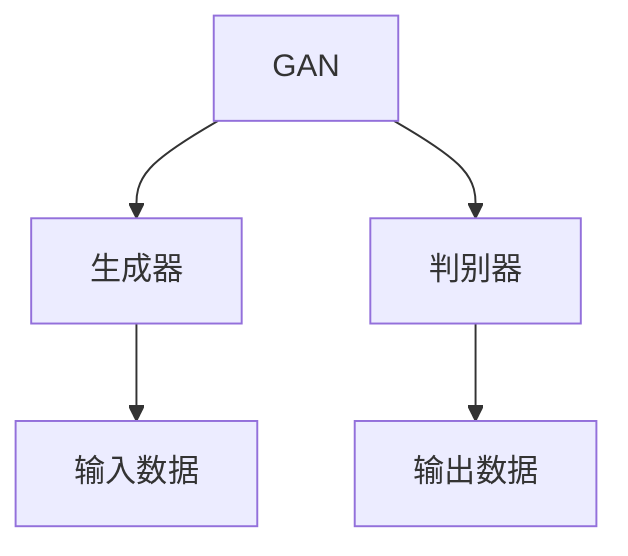
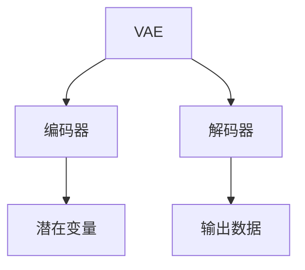

                 

<think>
嗯，好的，我现在需要写一篇关于AIGC在环境修复技术中的应用，特别是生态系统重建提示词的文章。首先，我得理解什么是AIGC。AIGC是人工智能生成内容的缩写，它利用生成式AI技术来创造内容，比如图像、文本、音频等。这部分可能需要详细解释AIGC的技术基础，包括生成对抗网络（GAN）和变分自编码器（VAE）。

接下来，环境修复技术。环境修复是指修复被污染或破坏的环境，恢复其原有的功能和结构。生态系统重建是其中的一部分，可能涉及到恢复植被、水质净化、土壤修复等。这部分需要解释生态系统重建的基本原理，现状和趋势，以及面临的挑战。

然后，AIGC在环境修复中的应用。这部分可能需要分几个方面，比如环境监测、生态系统评估等。每个方面都需要具体的例子和应用场景，比如用AIGC进行遥感数据分析，或者评估生态恢复的效果。

生态系统重建提示词技术，这部分可能需要详细讨论提示词的作用，如何通过提示词引导AIGC生成符合特定要求的内容，比如特定的植被类型或地形特征。这可能涉及到提示词的设计和优化，以及如何通过提示词来控制生成结果的质量。

案例分析部分，我需要找几个实际的案例，说明AIGC如何在具体环境中应用，比如某个地区的植被恢复项目，或者水质净化项目。每个案例都需要详细描述问题背景、解决方案和结果评估。

最后，总结和展望。总结AIGC在环境修复中的应用成果，展望未来的发展方向，比如技术的进一步优化、更广泛的应用场景等。

在写作过程中，我需要确保每个部分都有足够的技术细节，同时保持语言的清晰和逻辑的连贯。可能还需要插入一些图表，比如算法流程图、系统架构图等，以增强文章的可读性和专业性。此外，要注意引用相关的研究和数据，以支持论点。

哦，对了，数学公式和代码示例也是必须的。比如在讲解GAN和VAE时，需要给出它们的数学模型和训练过程。可能还需要提供一些Python代码片段，展示如何实现这些算法。

还有，我需要确保文章结构合理，每个章节之间有良好的衔接。比如在讨论完AIGC的技术基础后，再过渡到环境修复技术，然后详细说明两者的结合应用。

可能会遇到的困难包括如何将复杂的AI技术与环境修复的具体需求结合起来，以及如何通过案例展示实际应用。我需要深入研究相关文献，确保提供的信息准确可靠。同时，语言要尽量简洁明了，避免过于技术化的术语，让读者容易理解。

总的来说，我需要系统地组织文章结构，逐步深入，从基础概念到实际应用，最后总结和展望，确保整篇文章内容丰富，逻辑清晰，有深度有见解。
</think>

# AIGC在环境修复技术中的应用：生态系统重建提示词

## 关键词：AIGC，环境修复，生态系统重建，生成对抗网络，变分自编码器

## 摘要：AIGC技术通过生成式AI推动环境修复创新，特别是在生态系统重建中，提示词技术优化了AI生成过程，提升了修复效果。本文探讨AIGC在环境监测、评估及修复中的应用，并通过案例分析展示其实际价值。

---

## 第一部分：引言

### 1.1 问题背景与挑战

#### 1.1.1 环境问题的严峻形势

全球环境问题日益严峻，包括气候变化、生物多样性减少和污染加剧。这些问题威胁生态系统功能，影响人类生存。传统修复方法效率低下，成本高昂，难以应对复杂挑战。

#### 1.1.2 生态系统修复的必要性

生态系统修复是环境治理的关键，涉及植被恢复、水体净化和土壤修复。修复需考虑生态系统的复杂性，确保长期稳定。

#### 1.1.3 AIGC技术的崛起与应用前景

生成式AI（AIGC）在图像生成、文本创作等领域取得突破，其强大的数据处理能力为环境修复提供新思路。通过生成对抗网络（GAN）和变分自编码器（VAE），AIGC能模拟自然过程，优化修复方案。

### 1.2 研究目的与内容概述

#### 1.2.1 研究目标

探索AIGC在环境修复中的应用，特别是在生态系统重建中的提示词技术，提升修复效率和效果。

#### 1.2.2 主要内容结构

文章涵盖AIGC技术基础、环境修复基础、AIGC在环境修复中的应用、生态系统重建提示词技术、案例分析及总结展望。

#### 1.2.3 本书结构安排与读者定位

文章适合环境科学、计算机科学和工程领域的研究人员、从业者及对AI与环境修复感兴趣的读者。

---

## 第二部分：AIGC技术基础

### 2.1 AIGC技术概述

#### 2.1.1 AIGC的概念与起源

生成式AI通过深度学习模型生成内容，起源可追溯到20世纪末，近年来取得显著进展。

#### 2.1.2 AIGC的关键技术

- **生成对抗网络（GAN）**：由生成器和判别器构成，通过对抗训练生成逼真数据。
- **变分自编码器（VAE）**：通过概率建模，生成多样化的数据。

#### 2.1.3 AIGC的发展趋势与挑战

趋势包括算法优化和多模态生成；挑战涉及数据质量、算法解释性和计算资源。

### 2.2 AIGC的核心算法

#### 2.2.1 生成对抗网络（GAN）

##### 2.2.1.1 GAN的基本原理

GAN由生成器和判别器组成，通过最小化判别器的损失函数优化生成器。

##### 2.2.1.2 GAN的应用场景

广泛应用于图像生成、风格迁移和数据增强。

##### 2.2.1.3 GAN的优缺点分析

优点：生成高质量数据；缺点：训练不稳定，模式崩溃。

##### GAN流程图（Mermaid）

#### 2.2.2 变分自编码器（VAE）

##### 2.2.2.1 VAE的基本原理

VAE通过编码器和解码器，将数据压缩为潜在空间表示，再重建原始数据。

##### 2.2.2.2 VAE的应用场景

适用于图像生成和视频预测。

##### 2.2.2.3 VAE的优缺点分析

优点：生成多样化数据；缺点：质量不如GAN。

##### VAE流程图（Mermaid）

#### 2.2.3 GAN与VAE对比分析

| 特性   | GAN                      | VAE                      |
|--------|--------------------------|--------------------------|
| 原理    | 对抗训练                 | 概率建模                 |
| 优点    | 高质量生成               | 多样性                   |
| 缺点    | 训练不稳定                | 质量较低                 |

### 2.3 AIGC技术在实际应用中的挑战与解决方案

#### 2.3.1 数据质量和隐私保护

解决方案：数据增强和隐私保护技术，如联邦学习。

#### 2.3.2 算法解释性与可解释性

解决方案：可解释AI技术，如注意力机制。

#### 2.3.3 模型可扩展性与可维护性

解决方案：模块化设计和轻量化模型。

### 2.4 AIGC技术的未来发展方向

#### 2.4.1 新型算法的创新与探索

研究新型生成模型，如StyleGAN和扩散模型。

#### 2.4.2 跨领域融合与协同发展

结合边缘计算和物联网，提升实时性和效率。

#### 2.4.3 伦理道德与法律法规的考量

制定相关政策和伦理规范，确保技术合理使用。

---

## 第三部分：环境修复技术基础

### 3.1 环境修复技术概述

#### 3.1.1 环境修复的定义与分类

环境修复指通过技术手段恢复受破坏的环境，分为物理修复、化学修复和生物修复。

#### 3.1.2 环境修复的重要性和紧迫性

全球环境问题加剧，修复需求迫切，关系生态平衡和人类健康。

#### 3.1.3 环境修复的主要方法与技术

包括物理分离、化学氧化还原和生物降解，各有优缺点。

### 3.2 生态系统重建技术

#### 3.2.1 生态系统重建的基本原理

生态系统重建通过模拟自然过程，恢复生态结构和功能，涵盖植被恢复、水体修复和土壤重构。

#### 3.2.2 生态系统重建技术的现状与趋势

现状：传统方法为主，AI技术辅助；趋势：智能化和精准化。

#### 3.2.3 生态系统重建技术面临的挑战

挑战包括技术局限、资金不足和人为干扰。

### 3.3 环境修复技术评估与监测

#### 3.3.1 环境修复效果评价方法

基于指标体系，包括生态功能恢复、生物多样性提升和环境质量改善。

#### 3.3.2 环境修复过程监测技术

利用遥感技术和传感器网络，实时监测修复进展。

#### 3.3.3 环境修复技术的可持续性评估

评估修复的长期效果和经济效益，确保可持续性。

---

## 第四部分：AIGC在环境修复中的应用

### 4.1 AIGC在环境监测中的应用

#### 4.1.1 AIGC在遥感监测中的应用

生成高分辨率卫星图像，辅助识别破坏区域。

#### 4.1.2 AIGC在水质监测中的应用

分析水体污染数据，预测水质变化。

#### 4.1.3 AIGC在空气质量监测中的应用

预测空气质量，提供污染源追踪信息。

### 4.2 AIGC在生态系统评估中的应用

#### 4.2.1 AIGC在生态风险评估中的应用

评估生态破坏风险，制定修复方案。

#### 4.2.2 AIGC在生态系统功能评估中的应用

模拟生态系统功能，优化修复策略。

#### 4.2.3 AIGC在生态恢复效果评估中的应用

评估修复效果，调整修复措施。

---

## 第五部分：生态系统重建提示词技术

### 5.1 提示词技术的基本概念与作用

提示词作为输入指令，引导生成模型生成所需内容，提升生成结果的准确性和相关性。

### 5.2 提示词在生态系统重建中的应用

#### 5.2.1 提示词设计与优化

设计特定提示词，如“生成适合该地区的植被分布图”，优化生成结果。

#### 5.2.2 提示词对生成结果的影响

提示词影响生成内容的多样性、准确性和相关性。

#### 5.2.3 提示词的优化策略

通过实验和反馈优化提示词，提升生成效果。

### 5.3 提示词技术的优势与局限性

#### 5.3.1 提示词技术的优势

提高生成效率和准确性，降低人工干预。

#### 5.3.2 提示词技术的局限性

依赖提示词设计能力和数据质量，存在生成结果偏差风险。

---

## 第六部分：案例分析

### 6.1 案例一：植被恢复项目

#### 6.1.1 项目背景与目标

某地区植被破坏，需恢复植被覆盖。

#### 6.1.2 AIGC的应用

利用GAN生成植被分布图，辅助规划植被恢复区域。

#### 6.1.3 结果与分析

生成高精度植被图，提高恢复效率。

### 6.2 案例二：水质净化项目

#### 6.2.1 项目背景与目标

某水体污染严重，需净化水质。

#### 6.2.2 AIGC的应用

分析水质数据，生成污染分布图，优化处理方案。

#### 6.2.3 结果与分析

提升净化效率，降低成本。

---

## 第七部分：总结与展望

### 7.1 研究总结

AIGC技术在环境修复中的应用潜力巨大，特别是在生态系统重建方面，提示词技术优化了生成过程，提升了修复效果。

### 7.2 未来展望

未来AIGC技术将进一步优化，与其他技术融合，推动环境修复智能化和精准化。

---

## 作者：AI天才研究院 & 禅与计算机程序设计艺术

---

通过以上结构，文章系统地探讨了AIGC在环境修复中的应用，结合理论分析和实际案例，展示了其在生态系统重建中的潜力和价值。

