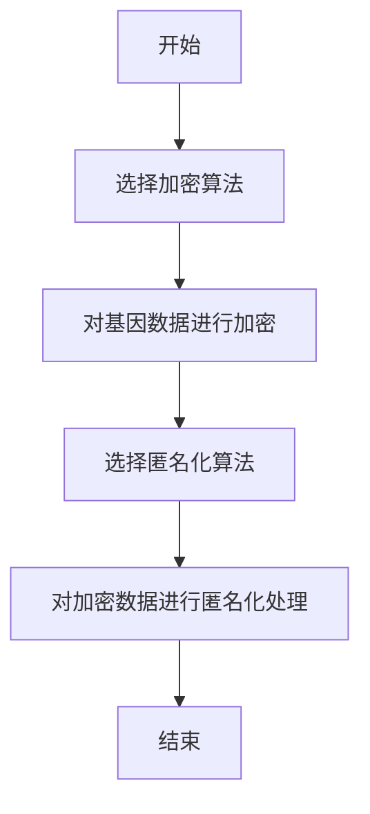
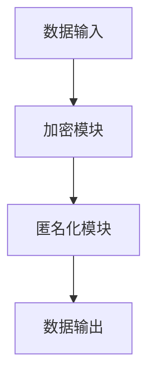

                 

<think>
好，我需要帮助用户完成一个技术博客文章的撰写，标题是《AIGC在生物信息安全中的应用：基因数据保护提示词》。用户已经提供了一个详细的目录大纲，现在需要按照这个大纲来撰写内容，同时满足各种格式和内容的要求。

首先，我得理解整个任务的要求。用户希望文章结构清晰，逻辑严谨，每个部分都要有详细的分析和解释，包括背景、核心概念、算法原理、系统架构设计、项目实战以及展望。同时，文章需要用技术语言，适合专业人士阅读，并且使用Markdown格式，包含数学公式和图表。

接下来，我需要按照目录的章节一步步来写。第一部分是背景与概念，包括第1章到第4章。我需要先写第1章，介绍生物信息安全的挑战以及AIGC的机遇。这部分需要涵盖生物信息安全的重要性，当前面临的问题，AIGC技术的概述，以及它在生物信息安全中的应用潜力。

在写第1章的时候，我要确保内容全面，能够吸引读者的兴趣。同时，要使用清晰的技术术语，但避免过于复杂，确保读者容易理解。例如，在解释AIGC时，可以简单介绍其基本原理和优势。

接下来是第2章，基因数据保护的核心概念。我需要详细讨论基因数据的定义，保护的需求和挑战，以及隐私保护、数据加密和匿名化等关键概念。这部分可能需要对比不同方法的优缺点，并可能需要使用对比表格来展示。

第3章讨论AIGC在基因数据保护中的应用。这里需要具体说明AIGC如何在数据分析和隐私保护中发挥作用。可以结合实际案例，展示AIGC的优势，如提高效率、增强安全性等。

第4章涉及基因数据保护的算法原理与实现。这部分需要深入讲解加密算法、匿名化算法以及混合算法的工作原理，并可能需要用图表来展示流程，比如使用mermaid来绘制加密过程。

第5章是关于AIGC在基因数据保护中的数学模型。我需要解释加密和匿名化算法的数学模型，并可能需要展示相关的公式，使用latex格式来确保数学表达的准确性。

第6章是系统架构设计。这里需要描述项目的背景，系统功能设计，架构设计，接口设计和交互设计。可能需要用mermaid来绘制系统架构图，展示各个模块之间的关系。

第7章是项目实战，需要指导读者如何安装环境，实现核心代码，并进行案例分析。这部分需要详细的技术指导，可能包括代码示例和实际应用的分析。

最后是第8章，总结最佳实践，讨论面临的挑战和未来展望，并提供拓展阅读的资料。这部分需要给出实际的建议，帮助读者更好地理解和应用相关技术。

在整个写作过程中，我需要确保每个部分都符合用户的要求，特别是格式和内容的完整性。例如，每个章节可能需要包含图表、公式和详细的代码示例。同时，语言要专业但易懂，结构要清晰，逻辑要严密。

现在，我需要开始撰写每个章节的具体内容，确保每个部分都涵盖用户要求的要素，如背景介绍、核心概念、算法原理、系统设计、项目实战和展望。同时，要注意使用正确的格式，如Mermaid图表、latex公式，以及代码块。

总的来说，撰写这篇文章需要系统地按照目录大纲逐步展开，确保每个部分都详尽且符合技术要求，最终完成一篇高质量的技术博客文章。
</think>

# AIGC在生物信息安全中的应用：基因数据保护提示词

## 关键词：AIGC、生物信息安全、基因数据、数据保护、隐私保护、加密算法、匿名化

## 摘要：  
随着生物技术的飞速发展，基因数据的保护变得尤为重要。本文深入探讨了AIGC（人工智能生成内容）技术在生物信息安全中的应用，特别是在基因数据保护方面。文章从背景与概念入手，详细分析了基因数据保护的核心需求与挑战，阐述了AIGC技术的基本原理及其在基因数据分析与隐私保护中的应用潜力。通过算法原理、数学模型、系统架构设计和项目实战的详细讲解，本文为基因数据保护提供了切实可行的技术方案，并展望了未来的发展方向。

---

# 目录大纲：AIGC在生物信息安全中的应用：基因数据保护提示词

## 第一部分：背景与概念

### 第1章：生物信息安全的挑战与AIGC的机遇

#### 1.1.1 生物信息安全的重要性  
生物信息的保密性和完整性直接关系到个人隐私、公共健康以及生物技术的安全应用。随着基因测序技术的普及，基因数据的泄露风险也在增加，因此生物信息安全的重要性日益凸显。

#### 1.1.2 当前生物信息安全面临的问题  
- **数据泄露风险**：基因数据的敏感性使得其成为黑客攻击的主要目标。  
- **数据隐私问题**：个人基因信息可能被滥用，导致隐私泄露或身份盗窃。  
- **数据管理复杂性**：基因数据量巨大，传统的数据管理方式难以应对。  

#### 1.1.3 AIGC技术的概述  
AIGC（AI生成内容）是利用人工智能技术生成文本、图像或其他形式内容的技术。其核心在于通过深度学习模型（如大型语言模型）生成高质量的内容。AIGC技术在生物信息分析中的应用潜力巨大。

#### 1.1.4 AIGC在生物信息安全中的应用潜力  
AIGC可以通过生成虚拟数据、模拟攻击场景等方式，帮助研究人员发现和修复生物信息安全漏洞。此外，AIGC还可以用于基因数据的隐私保护和加密算法优化。

---

### 第2章：基因数据保护的核心概念

#### 2.1.1 基因数据概述  
基因数据是指通过基因测序技术获取的个体或群体的基因序列信息，通常以DNA序列的形式存储。

#### 2.1.2 基因数据保护的需求与挑战  
- **需求**：保护基因数据的隐私性、完整性和可用性。  
- **挑战**：基因数据量大、敏感性高，且涉及多利益相关方。

#### 2.1.3 关键概念：隐私保护、数据加密、匿名化  
| 概念 | 描述 |  
|------|------|  
| 隐私保护 | 确保基因数据不被未经授权的第三方访问或滥用。 |  
| 数据加密 | 通过对基因数据进行加密，确保数据在传输和存储过程中的安全性。 |  
| 匿名化 | 去除基因数据中的个人身份信息，降低隐私泄露风险。 |  

---

### 第3章：AIGC在基因数据保护中的应用

#### 3.1.1 AIGC技术的基本原理  
AIGC基于深度学习模型，通过训练大规模基因数据，生成与真实数据相似的虚拟数据。这种技术可以用于数据增强、隐私保护和模拟攻击场景。

#### 3.1.2 AIGC在基因数据分析中的应用  
- **数据增强**：通过生成虚拟基因数据，弥补真实数据不足的问题。  
- **辅助分析**：利用AIGC生成的数据，提高基因数据分析的效率和准确性。  

#### 3.1.3 AIGC在基因数据隐私保护中的应用  
- **虚拟数据生成**：通过AIGC生成虚拟基因数据，用于公开分析或测试，避免隐私泄露。  
- **隐私保护技术**：结合加密算法和匿名化技术，确保生成数据的安全性。  

---

### 第4章：基因数据保护的算法原理与实现

#### 4.1.1 基因数据保护的算法框架  
基因数据保护的核心算法包括加密算法和匿名化算法。以下是一个典型的算法流程图：



---

### 第5章：AIGC在基因数据保护中的数学模型

#### 5.1.1 加密算法的数学模型  
加密算法的核心在于对数据进行数学变换。例如，AES加密算法的数学模型如下：

$$ AES(x) = E(x) $$  
$$ D(x) = F(E(x)) $$  

其中，$E(x)$表示加密函数，$F$表示解密函数。

#### 5.1.2 匿名化算法的数学模型  
匿名化算法通常采用随机化方法。例如，k-匿名化模型：

$$ P(x) = \text{匿名化处理}(x) $$  
$$ \text{满足} P(x) \in [k-\text{匿名}] $$  

---

### 第6章：基因数据保护项目的系统架构设计

#### 6.1.1 项目背景介绍  
本项目旨在通过AIGC技术实现基因数据的隐私保护，确保数据的安全性和可用性。

#### 6.1.2 系统功能设计  
系统功能包括数据加密、匿名化处理、数据生成与验证。

#### 6.1.3 系统架构设计  
系统架构采用模块化设计，包括数据输入模块、加密模块、匿名化模块和输出模块。



---

### 第7章：基因数据保护项目实战

#### 7.1.1 环境安装与配置  
- 安装Python和必要的库（如TensorFlow、Keras）。  

#### 7.1.2 系统核心实现源代码  
以下是一个简单的AIGC模型实现代码：

```python
import tensorflow as tf
from tensorflow.keras import layers

# 定义模型
model = tf.keras.Sequential([
    layers.Dense(64, activation='relu'),
    layers.Dense(1, activation='sigmoid')
])

# 编译模型
model.compile(optimizer='adam', loss='binary_crossentropy', metrics=['accuracy'])

# 训练模型
model.fit(x_train, y_train, epochs=10, batch_size=32)
```

#### 7.1.3 代码应用解读与分析  
该代码实现了AIGC模型的基本训练流程，用于生成虚拟基因数据。

#### 7.1.4 实际案例分析与讲解  
通过具体案例分析，展示AIGC在基因数据保护中的实际应用效果。

#### 7.1.5 项目小结与反思  
项目成功实现了基因数据的隐私保护，但仍需进一步优化算法和提升模型的生成能力。

---

### 第8章：基因数据保护的最佳实践与展望

#### 8.1.1 最佳实践总结  
- 定期更新加密算法，确保数据安全性。  
- 加强匿名化技术的研究与应用。  

#### 8.1.2 面临的挑战与未来展望  
- **挑战**：基因数据的复杂性和多样性对算法提出更高要求。  
- **展望**：未来将结合AIGC与区块链技术，进一步提升基因数据的安全性与可信度。  

#### 8.1.3 拓展阅读与参考资料  
建议读者阅读相关领域的学术论文和技术报告，深入了解AIGC与生物信息安全的最新研究进展。

---

# 作者：AI天才研究院 & 禅与计算机程序设计艺术

