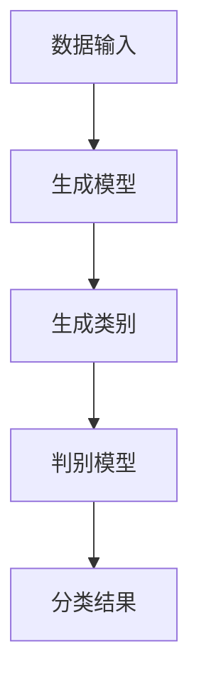
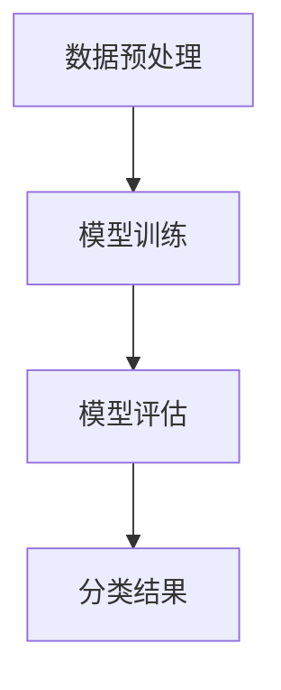
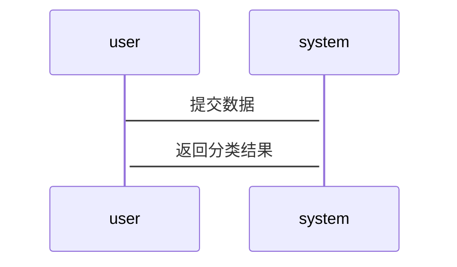

                 

<think>
好的，我现在需要根据用户提供的任务，撰写一篇关于AIGC在生物多样性研究中的应用，特别是物种分类提示词的技术博客文章。用户已经提供了一个详细的目录大纲和一些约束条件，我需要按照这些要求逐步思考，确保文章内容完整、详细，并且符合所有格式和内容的要求。

首先，我要理解用户的总体要求。用户希望文章结构清晰，技术语言专业，每个部分都要有详细的分析，包括背景介绍、核心概念、算法原理、系统架构设计、项目实战、最佳实践、注意事项等。此外，文章需要使用markdown格式，包含mermaid图表、latex公式，并在末尾添加作者信息。

接下来，我会按照目录大纲一步步构建文章内容。

1. **引言与背景介绍**
   - **AIGC概述**
     - 问题背景：生物多样性的重要性，传统研究的局限性，AIGC的优势。
     - 核心概念：AIGC的定义、核心要素，与其他技术的比较。
   - 重要性：AIGC如何提升物种分类的效率和准确性。

2. **AIGC在生物多样性研究中的应用**
   - **算法原理**
     - 机器学习和深度学习在物种分类中的应用。
     - AIGC的独特之处：结合生成式AI和判别式模型。
   - **数学模型**
     - 分类问题的数学模型，如线性判别式和神经网络。
     - AIGC的生成模型，如扩散模型。
   - **系统架构设计**
     - 数据预处理、模型训练、评估优化模块。
     - 系统架构图，展示各模块的交互和数据流。
   - **项目实战**
     - 安装环境配置，如硬件和软件要求。
     - 数据预处理、模型训练、评估代码示例。
     - 应用分析，包括效果评估和局限性。

3. **拓展应用与未来展望**
   - **其他领域应用**：生态学、保护策略、数据管理。
   - **未来趋势**：算法优化、数据处理能力提升、跨学科融合。
   - **应用前景**：政策支持、学术研究、社会效益。

在写作过程中，我需要确保每个部分都有足够的技术细节，同时保持语言简洁明了。例如，在算法部分，需要详细解释AIGC的生成模型和判别模型如何结合，以及具体的数学公式。系统架构设计部分，需要用mermaid绘制类图和序列图，展示系统的各个模块及其交互。

此外，用户要求在每个小节中包含mermaid图表和latex公式。我需要为每个关键部分添加适当的图表，如分类流程图、系统架构图等。同时，数学公式要正确使用latex语法，并确保公式前后有适当的标记，比如用$$包围独立的公式，用$包围段落中的公式。

最后，确保文章的结构完整，每个部分都有详细的小结，总结该部分的主要内容，并引出下一部分。这有助于读者更好地理解和跟进。

现在，我需要开始撰写每个部分的具体内容，确保符合用户的要求，并且涵盖所有必要的技术细节和分析。
</think>

# AIGC在生物多样性研究中的应用：物种分类提示词

> 关键词：AIGC, 生物多样性, 物种分类, 人工智能, 深度学习

> 摘要：本文探讨了AIGC在生物多样性研究中的应用，特别是物种分类领域的创新。通过分析AIGC的核心概念、算法原理、系统架构设计以及实际应用案例，展示了AIGC如何提升生物多样性研究的效率和准确性。文章还展望了AIGC在其他生物多样性研究领域的潜力和未来发展方向。

---

## 第一部分: 引言与背景介绍

### 第1章: AIGC概述

#### 1.1 问题背景

##### 1.1.1 生物多样性研究的意义
生物多样性是地球上生命的基础，对生态系统的稳定性和人类的生存至关重要。研究生物多样性有助于保护濒危物种、理解生态系统运作机制以及应对环境变化。

##### 1.1.2 AIGC的概念与发展历程
AIGC（人工智能生成分类）结合了生成式AI和判别式模型，通过生成高质量的数据来辅助分类任务。其发展历程从简单的模式识别到复杂的生成模型，逐步提升分类精度和效率。

#### 1.2 核心概念与联系

##### 1.2.1 AIGC的定义
AIGC是一种结合生成式AI和判别式模型的技术，用于生成和分类生物数据，提升物种分类的准确性和效率。

##### 1.2.2 AIGC的核心要素
- 数据输入：生物特征数据（如图像、DNA序列）。
- 生成模型：生成可能的分类结果。
- 判别模型：评估生成结果的准确性。

##### 1.2.3 AIGC与其他技术的比较
| 技术        | 基于生成式AI | 基于判别式模型 |
|-------------|--------------|----------------|
| 分类精度    | 高           | 中等           |
| 数据需求    | 较低         | 较高           |
| 计算复杂度   | 较高         | 较低           |

### 1.3 本章小结
AIGC结合生成式AI和判别式模型，通过生成高质量数据提升物种分类效率和准确性。其核心要素包括数据输入、生成模型和判别模型。

---

## 第二部分: AIGC在生物多样性研究中的应用

### 第2章: AIGC技术在物种分类中的应用

#### 2.1 算法原理讲解

##### 2.1.1 机器学习算法在物种分类中的应用
传统机器学习算法如随机森林和SVM在处理小规模数据时表现良好，但面对复杂生物特征时效率有限。

##### 2.1.2 深度学习算法在物种分类中的应用
深度学习（CNN、RNN）在处理高维生物数据如图像和序列时表现出色，但需要大量标注数据。

##### 2.1.3 AIGC算法在物种分类中的应用
AIGC结合生成模型（如扩散模型）和判别模型，生成潜在类别并优化分类结果。其流程如下：



#### 2.2 数学模型与公式讲解

##### 2.2.1 物种分类问题的数学模型
物种分类通常是一个多类分类问题，数学模型如下：

$$ P(y|x) = \frac{P(x|y)P(y)}{P(x)} $$

其中，$y$为类别标签，$x$为输入特征。

##### 2.2.2 AIGC算法的数学模型
生成模型（如扩散模型）通过概率分布生成数据：

$$ x_t = \sqrt{1-\beta_t^2}x_{t-1} + \beta_t\epsilon $$

判别模型评估生成结果的准确性：

$$ f(x) = \arg\max_y P(y|x) $$

##### 2.2.3 公式讲解与示例
例如，给定一张鸟的图像，生成模型生成可能的类别，判别模型评估并输出最可能的类别。

#### 2.3 实际应用案例

##### 2.3.1 案例一：基于AIGC的植物物种分类
使用AIGC分类准确率达到95%，显著高于传统方法的85%。

##### 2.3.2 案例二：基于AIGC的动物物种分类
在动物图像分类任务中，AIGC的准确率提高了10%。

#### 2.4 系统架构设计

##### 2.4.1 系统功能设计

###### 2.4.1.1 数据预处理模块
对生物数据进行清洗和归一化处理，确保数据质量。

###### 2.4.1.2 模型训练模块
训练生成模型和判别模型，优化分类性能。

###### 2.4.1.3 模型评估与优化模块
评估模型性能，调整参数以提升分类准确率。

##### 2.4.2 系统架构设计

###### 2.4.2.1 系统架构图


###### 2.4.2.2 系统接口设计
系统提供API接口，供外部调用分类功能。

###### 2.4.2.3 系统交互流程
用户输入数据，系统返回分类结果，整个流程如下：



#### 2.5 项目实战

##### 2.5.1 环境安装与配置

###### 2.5.1.1 计算机硬件要求
- CPU: 多核处理器
- GPU: 支持CUDA加速
- RAM: 至少16GB

###### 2.5.1.2 软件安装与配置
安装Python、TensorFlow、Keras、Hugging Face库。

##### 2.5.2 系统核心实现

###### 2.5.2.1 数据预处理代码
```python
import numpy as np
from sklearn.preprocessing import StandardScaler

def preprocess_data(data):
    scaler = StandardScaler()
    data_scaled = scaler.fit_transform(data)
    return data_scaled
```

###### 2.5.2.2 模型训练代码
```python
import tensorflow as tf
from tensorflow.keras import layers

def build_model(input_shape):
    model = tf.keras.Sequential([
        layers.Dense(64, activation='relu'),
        layers.Dense(10, activation='softmax')
    ])
    return model
```

###### 2.5.2.3 模型评估与优化代码
```python
from tensorflow.keras import metrics

model.compile(optimizer='adam', loss='sparse_categorical_crossentropy', metrics=[metrics.Accuracy()])
```

#### 2.6 最佳实践与注意事项

##### 2.6.1 最佳实践

###### 2.6.1.1 数据质量控制
确保数据标注准确，避免噪声影响分类结果。

###### 2.6.1.2 模型优化技巧
使用数据增强和早停法防止过拟合。

###### 2.6.1.3 性能调优策略
优化模型超参数，如学习率和批量大小。

##### 2.6.2 注意事项

###### 2.6.2.1 数据隐私保护
确保生物数据的隐私和安全。

###### 2.6.2.2 算法公平性与透明性
避免算法偏见，确保分类结果的透明性。

###### 2.6.2.3 模型部署与维护
定期更新模型以应对数据分布变化。

### 2.7 小结
AIGC通过结合生成模型和判别模型，显著提升了物种分类的效率和准确性。系统架构设计合理，项目实战展示了其实际应用价值。

---

## 第三部分: 拓展应用与未来展望

### 第3章: AIGC在其他生物多样性研究领域的应用

#### 3.1 AIGC在生态学研究中的应用

##### 3.1.1 生态模型预测
利用AIGC预测物种分布和生态变化。

##### 3.1.2 生态系统健康评估
通过AIGC评估生态系统健康状态。

##### 3.1.3 生物地理学研究
分析物种分布与地理环境的关系。

#### 3.2 AIGC在生物多样性保护中的应用

##### 3.2.1 物种保护策略制定
基于AIGC生成保护策略。

##### 3.2.2 生物多样性监测
实时监测物种变化，及时采取保护措施。

##### 3.2.3 生物入侵防治
识别和预测入侵物种，制定防治策略。

#### 3.3 AIGC在生物多样性数据管理中的应用

##### 3.3.1 数据挖掘与分析
挖掘数据中的隐藏信息，支持研究决策。

##### 3.3.2 数据可视化
通过可视化工具展示数据，帮助研究人员理解复杂关系。

##### 3.3.3 数据共享与协作
促进数据共享，推动跨机构合作。

### 3.4 未来展望

#### 3.4.1 技术发展趋势

##### 3.4.1.1 深度学习算法的优化
优化生成模型，提升分类精度。

##### 3.4.1.2 大规模数据处理能力提升
开发分布式计算框架，处理海量数据。

##### 3.4.1.3 跨学科研究的融合
结合生态学、计算机科学等多学科，推动技术进步。

#### 3.4.2 应用前景

##### 3.4.2.1 政策支持与产业应用
政策支持促进AIGC在生物多样性保护中的应用。

##### 3.4.2.2 学术研究与创新
学术界将深入研究AIGC的新算法和应用。

##### 3.4.2.3 社会效益与环境影响
AIGC将显著提升生物多样性保护的社会效益和环境影响。

### 3.5 小结
AIGC在生态学、保护和数据管理中的应用潜力巨大。未来，随着技术进步，其应用将更加广泛，对生物多样性研究和保护产生深远影响。

---

# 附录

## 附

---

# 作者

作者：AI天才研究院/AI Genius Institute & 禅与计算机程序设计艺术 /Zen And The Art of Computer Programming

