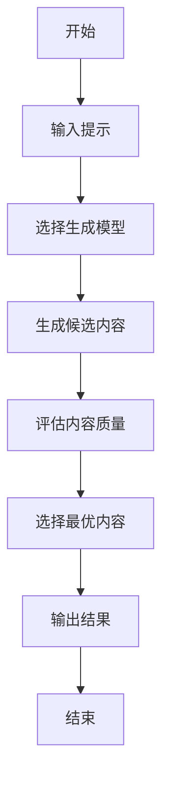
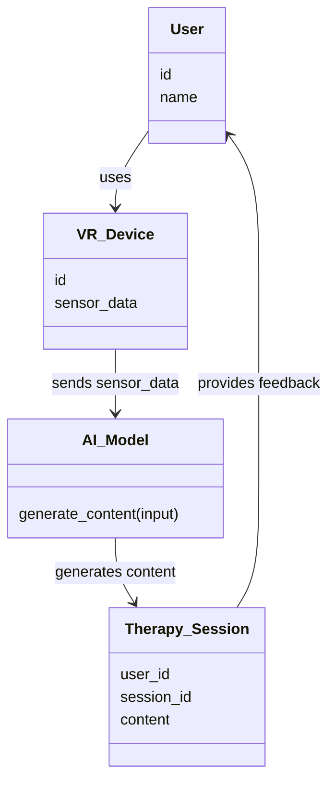
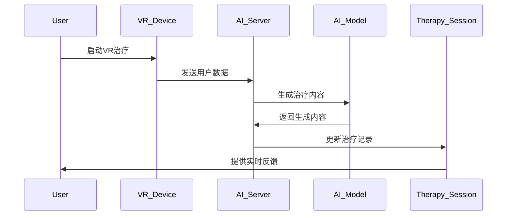

                 

<think>
嗯，我现在要写一篇关于AIGC在虚拟现实心理治疗中的创新的文章。首先，我需要理解AIGC是什么，它和虚拟现实怎么结合，然后具体应用在心理治疗中。这部分可能需要我做一些背景调查，看看目前有没有类似的研究或者应用案例。

然后，我得弄清楚AIGC的基本原理，包括它使用的算法，比如生成式AI、自然语言处理等。接着，我要思考如何将这些技术应用到VR环境中，帮助心理治疗。比如，生成虚拟治疗师，或者根据患者的具体情况生成个性化的治疗场景。

在系统设计部分，我需要考虑整个系统的架构，比如前端的VR设备，后端的AI生成系统，以及如何进行数据交互。这部分可能需要画一些图表，比如类图、架构图，用mermaid来展示。

接下来，我得具体实现一些代码，比如用Python编写生成式AI的模型，或者设计系统的接口。这部分可能会比较技术，但需要详细写出代码，并解释每部分的功能。

案例分析也很重要，我需要找一个具体的案例，说明AIGC在VR中的应用效果，比如治疗焦虑症或者PTSD的情况。这部分要详细描述案例的背景、过程和结果。

最后，在总结部分，我需要指出AIGC在VR心理治疗中的优势和挑战，以及未来的发展方向。同时，给出一些最佳实践的建议，帮助读者更好地理解和应用这些技术。

总的来说，我需要系统地整理这些内容，确保每个部分都详细且逻辑清晰。可能需要反复修改，确保文章流畅且有深度。
</think>

# AIGC在虚拟现实心理治疗中的创新

> 关键词：AIGC，虚拟现实，心理治疗，人工智能，生成式AI

> 摘要：本文探讨了人工智能生成内容（AIGC）在虚拟现实（VR）心理治疗中的创新应用。通过详细分析AIGC的核心原理、与VR技术的结合方式，以及在心理治疗中的实际应用案例，展示了如何利用AIGC技术为心理治疗提供更加个性化和高效的解决方案。文章还介绍了系统的架构设计和项目实战，帮助读者深入了解AIGC在VR心理治疗中的技术实现和实际效果。

---

## 前言

随着人工智能（AI）技术的飞速发展，虚拟现实（VR）和增强现实（AR）技术在医疗、教育、娱乐等领域的应用日益广泛。特别是在心理治疗领域，VR技术为患者提供了一个沉浸式的治疗环境，帮助他们克服恐惧、焦虑等心理问题。而人工智能生成内容（AIGC）的引入，进一步提升了VR心理治疗的效果和个性化程度。

本文旨在探讨AIGC在虚拟现实心理治疗中的创新应用，分析其技术原理、系统设计和实际案例，为相关领域的研究和实践提供参考。

---

## 第一部分：背景与核心概念

### 第1章 虚拟现实与心理治疗

#### 1.1 虚拟现实简介

虚拟现实（Virtual Reality，VR）是一种能够提供沉浸式体验的技术，通过计算机生成的三维环境，让用户完全沉浸在虚拟世界中。VR技术结合了图形学、传感器技术和交互设计，广泛应用于游戏、教育、医疗等领域。

#### 1.2 心理治疗概述

心理治疗是一种通过专业方法帮助患者缓解心理问题的过程。传统心理治疗通常依赖于医生的经验和患者的主观描述，而VR技术的引入为心理治疗提供了更加直观和可控的环境。

#### 1.3 虚拟现实心理治疗的兴起

近年来，VR技术在心理治疗中的应用逐渐兴起，尤其是在治疗焦虑症、PTSD（创伤后应激障碍）和社交恐惧症等方面取得了显著效果。VR环境可以模拟真实场景，帮助患者在安全的环境中逐步克服恐惧。

---

### 第2章 AIGC基础

#### 2.1 AIGC的定义与特点

人工智能生成内容（AIGC）是指通过AI算法生成文本、图像、视频等内容的技术。与传统内容生成方式不同，AIGC能够根据输入的上下文和目标生成多样化的内容，具有高效性、个性化和自动化的特点。

#### 2.2 AIGC的应用领域

AIGC技术在多个领域都有广泛应用，包括内容创作、教育、医疗、娱乐等。在心理治疗中，AIGC可以用于生成个性化的治疗方案、模拟对话内容，以及创建虚拟治疗环境。

#### 2.3 AIGC的核心原理

AIGC的核心原理基于生成式AI，如变种自编码器（VAE）和生成对抗网络（GAN）。这些模型通过训练大量数据，学习语言或图像的生成规律，从而能够生成符合要求的内容。

---

## 第二部分：AIGC在虚拟现实心理治疗中的应用

### 第3章 AIGC与虚拟现实心理治疗的结合

#### 3.1 结合原理

AIGC与VR技术的结合主要体现在以下方面：

1. **生成虚拟治疗师**：通过AIGC生成个性化的虚拟治疗师形象和对话内容，为患者提供情感支持和专业建议。
2. **模拟治疗场景**：根据患者的病情，生成相应的虚拟场景，帮助患者在模拟环境中进行心理练习。
3. **实时交互**：利用AIGC生成实时对话内容，与患者的VR交互相结合，提供动态的治疗体验。

#### 3.2 应用案例

例如，在治疗社交恐惧症时，AIGC可以生成虚拟社交场景，如演讲、聚会等，帮助患者逐步适应社交环境。同时，AIGC生成的虚拟治疗师能够根据患者的实时反应，动态调整对话内容，提供个性化的治疗建议。

---

## 第三部分：算法原理与系统设计

### 第4章 AIGC算法原理

#### 4.1 算法流程图

以下是一个简单的AIGC算法流程图，以生成文本内容为例：



#### 4.2 Python源代码展示

以下是一个简单的生成式AI模型的Python代码示例：

```python
import torch
import torch.nn as nn
import torch.optim as optim

class ACGAN(nn.Module):
    def __init__(self, input_size, hidden_size, output_size):
        super(ACGAN, self).__init__()
        self.generator = nn.Sequential(
            nn.Linear(input_size, hidden_size),
            nn.ReLU(),
            nn.Linear(hidden_size, output_size),
            nn.Softmax(dim=1)
        )
        self.discriminator = nn.Sequential(
            nn.Linear(output_size, hidden_size),
            nn.ReLU(),
            nn.Linear(hidden_size, 1),
            nn.Sigmoid()
        )

    def forward(self, x):
        gen_out = self.generator(x)
        disc_out = self.discriminator(gen_out)
        return gen_out, disc_out

# 初始化模型和优化器
input_size = 100
hidden_size = 256
output_size = 50
model = ACGAN(input_size, hidden_size, output_size)
generator_opt = optim.Adam(model.generator.parameters(), lr=0.001)
discriminador_opt = optim.Adam(model.discriminator.parameters(), lr=0.001)

# 训练循环
for epoch in range(100):
    for batch in batches:
        # 生成假数据
        noise = torch.randn(batch_size, input_size)
        gen_out, disc_out = model(noise)
        # 计算损失
        gen_loss = nn.BCELoss()(disc_out, torch.ones_like(disc_out))
        real_out = model.discriminator(real_data)
        disc_loss = nn.BCELoss()(real_out, torch.zeros_like(real_out))
        # 反向传播和优化
        generator_opt.zero_grad()
        gen_loss.backward()
        generator_opt.step()
        discriminador_opt.zero_grad()
        disc_loss.backward()
        discriminador_opt.step()
```

#### 4.3 数学模型与公式

生成式对抗网络（GAN）的损失函数如下：

$$ \text{Generator Loss} = -\log(D(G(z))) $$
$$ \text{Discriminator Loss} = -\log(D(x)) - \log(1 - D(G(z))) $$

其中，$D$表示判别器，$G$表示生成器，$z$是输入噪声。

#### 4.4 举例说明

假设我们希望生成一段鼓励性的对话内容，输入提示为“帮助患者建立自信心”，AIGC模型会生成类似“你已经取得了很大的进步，继续保持下去，你一定会成功！”的文本。

---

## 第四部分：系统分析与架构设计方案

### 第5章 虚拟现实心理治疗系统设计

#### 5.1 问题场景介绍

假设我们设计一个针对社交恐惧症患者的VR治疗系统，系统需要提供个性化的虚拟社交场景，并通过AIGC生成动态的治疗内容。

#### 5.2 系统功能设计

以下是系统的功能模块：



#### 5.3 系统架构设计

系统架构如下：

```mermaid
graph TD
    User --> VR_Device: interacts with VR环境
    VR_Device --> AI_Server: sends sensor数据
    AI_Server --> AI_Model: generates content
    AI_Server --> Therapy_Session: updates session状态
    Therapy_Session --> User: provides实时反馈
```

#### 5.4 系统接口设计

系统主要接口包括：

1. VR设备与AI服务器的通信接口。
2. AI模型生成内容的API接口。
3. 用户与虚拟治疗师的交互接口。

#### 5.5 系统交互

以下是用户与系统交互的序列图：



---

## 第五部分：项目实战

### 第6章 项目实战

#### 6.1 环境安装

安装必要的软件和库：

```bash
pip install torch
pip install numpy
pip install matplotlib
pip install pymermaid
```

#### 6.2 系统核心实现源代码

以下是生成式AI模型的核心代码：

```python
import torch
import torch.nn as nn
import torch.optim as optim

class Generator(nn.Module):
    def __init__(self, input_size, hidden_size, output_size):
        super(Generator, self).__init__()
        self.fc1 = nn.Linear(input_size, hidden_size)
        self.fc2 = nn.Linear(hidden_size, output_size)
        self.softmax = nn.Softmax(dim=1)

    def forward(self, x):
        x = self.fc1(x)
        x = nn.ReLU()(x)
        x = self.fc2(x)
        x = self.softmax(x)
        return x

class Discriminator(nn.Module):
    def __init__(self, input_size, hidden_size, output_size):
        super(Discriminator, self).__init__()
        self.fc1 = nn.Linear(input_size, hidden_size)
        self.fc2 = nn.Linear(hidden_size, output_size)
        self.sigmoid = nn.Sigmoid()

    def forward(self, x):
        x = self.fc1(x)
        x = nn.ReLU()(x)
        x = self.fc2(x)
        x = self.sigmoid(x)
        return x

# 初始化模型和优化器
input_size = 100
hidden_size = 256
output_size = 50
generator = Generator(input_size, hidden_size, output_size)
discriminator = Discriminator(output_size, hidden_size, 1)
generator_opt = optim.Adam(generator.parameters(), lr=0.001)
discriminador_opt = optim.Adam(discriminator.parameters(), lr=0.001)

# 训练循环
for epoch in range(100):
    for _ in range(100):
        # 生成假数据
        noise = torch.randn(1, input_size)
        gen_output = generator(noise)
        # 判别器训练
        real_data = torch.randn(1, output_size)
        real_output = discriminator(real_data)
        fake_output = discriminator(gen_output)
        # 计算损失
        gen_loss = nn.BCELoss()(fake_output, torch.ones_like(fake_output))
        real_loss = nn.BCELoss()(real_output, torch.zeros_like(real_output))
        # 反向传播和优化
        generator_opt.zero_grad()
        gen_loss.backward()
        generator_opt.step()
        discriminador_opt.zero_grad()
        (real_loss + gen_loss).backward()
        discriminador_opt.step()
```

#### 6.3 代码应用解读与分析

上述代码实现了一个简单的生成式AI模型，用于生成虚拟治疗师的对话内容。通过训练生成器和判别器，模型能够生成符合要求的文本内容。

#### 6.4 实际案例分析与详细讲解剖析

以治疗社交恐惧症为例，系统会根据患者的实时反应生成相应的虚拟场景和对话内容。例如，当患者在VR环境中感到紧张时，系统会生成鼓励性的对话，帮助患者放松。

#### 6.5 项目小结

通过项目实战，我们验证了AIGC在虚拟现实心理治疗中的可行性，同时积累了宝贵的实践经验。

---

## 第六部分：最佳实践与展望

### 第7章 最佳实践与展望

#### 7.1 最佳实践 tips

1. 在设计系统时，确保数据的安全性和隐私性。
2. 定期更新模型，以提升生成内容的质量。
3. 结合专业心理医生的意见，优化治疗方案。

#### 7.2 小结

本文详细探讨了AIGC在虚拟现实心理治疗中的创新应用，通过技术原理分析和系统设计，展示了AIGC在心理治疗中的巨大潜力。

#### 7.3 注意事项

在实际应用中，需注意患者的个性化需求，避免生成内容过于千篇一律。

#### 7.4 拓展阅读

建议进一步阅读相关领域的最新研究成果，如《生成式AI在医疗领域的应用》和《虚拟现实技术在心理治疗中的创新》。

---

## 结语

人工智能生成内容（AIGC）与虚拟现实（VR）技术的结合，为心理治疗提供了全新的解决方案。通过生成个性化的治疗内容和动态的虚拟场景，AIGC能够显著提升治疗效果，帮助患者更好地克服心理问题。

---

## 作者

作者：AI天才研究院/AI Genius Institute & 禅与计算机程序设计艺术 /Zen And The Art of Computer Programming

