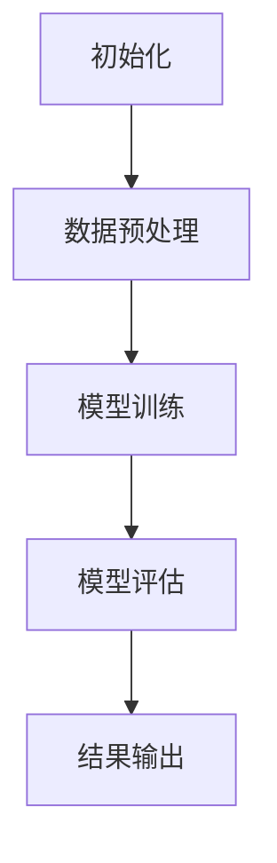
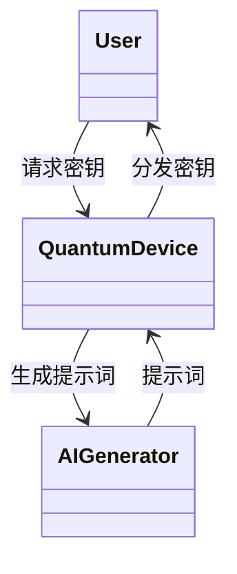

                 

<think>
嗯，我现在要写一篇关于AIGC在量子加密通信中的应用，特别是优化密钥分发的提示词的文章。首先，我需要理解AIGC是什么，它和量子加密有什么关系。AIGC可能是指先进的人工智能生成内容，或者是某种特定的人工智能模型，用于生成密钥或者其他加密相关的内容。

接下来，我得看看量子加密通信的基本原理，特别是密钥分发的问题。传统的密钥分发方式可能面临安全性问题，尤其是在传输过程中被截获的风险。量子加密通信，比如量子密钥分发（QKD），依赖于量子力学的性质，确保密钥的安全传输。但实际应用中，可能会遇到信道噪声、设备不完美等问题，导致密钥分发的效率和安全性受到影响。

然后，我想AIGC在这里能起到什么作用呢？可能是在优化密钥分发的过程中，利用AI来提高效率和准确性。比如，AI可以帮助生成更优化的提示词，使得生成的密钥更安全，或者帮助识别潜在的安全漏洞，优化通信协议。

接下来，我需要考虑文章的结构。首先是背景介绍，包括量子加密通信的挑战、AIGC的基本概念和优势，以及密钥分发优化的关键问题。这部分要让读者了解问题背景和AIGC的重要性。

然后是核心概念与联系，详细说明AIGC在量子加密中的应用场景，其基本原理和核心算法，以及量子加密的数学模型。这部分可能需要一些数学公式和图表来解释。

接下来是算法原理讲解，包括AIGC算法的基本流程，模型训练和优化，以及密钥分发优化的具体算法实现。这部分需要用mermaid流程图和Python代码来详细说明。

数学模型部分，我需要定义优化的数学公式，可能涉及目标函数、约束条件，以及优化步骤。这可能需要使用LaTeX公式来展示。

系统分析与架构设计，这部分需要描述问题场景，设计系统的功能，用mermaid类图展示系统架构。然后，系统架构设计可能需要展示组件之间的关系，用序列图或者流程图来说明。

项目实战部分，需要详细说明如何安装环境，编写代码实现核心功能，解读代码，分析实际案例，最后进行项目总结。这部分要具体，可能包括代码示例和实际应用分析。

最后是最佳实践、小结、注意事项和拓展阅读，总结文章内容，给出实用建议，并推荐进一步阅读的资料。

现在，我需要确保每个部分都涵盖必要的内容，比如背景介绍需要包括量子加密的基本原理和挑战，AIGC的优势，以及密钥分发的具体问题。核心概念部分要解释AIGC的工作原理，如何与量子加密通信结合，可能涉及一些数学模型和图表。

在算法部分，我需要详细描述AIGC算法的步骤，可能用mermaid流程图来展示，然后提供Python代码示例，展示模型的训练过程。数学模型部分需要用LaTeX公式来描述优化问题，可能包括目标函数和优化步骤。

系统分析部分，可能需要设计一个类图，展示系统各个组件之间的关系，比如用户、量子通信设备、AI提示词生成器等。系统架构设计可能需要展示各个模块如何协作，可能用mermaid的架构图来说明。

项目实战部分，需要实际操作，比如安装必要的库，编写代码实现AIGC提示词生成器，然后测试其在密钥分发中的效果。这部分需要详细代码示例和分析。

最后，总结部分要强调AIGC在量子加密中的重要性，指出未来的研究方向和实际应用的潜力。

现在，我需要把这些思考转化为文章的具体内容，确保每个部分都有足够的细节，结构清晰，逻辑严谨。
</think>

# AIGC在量子加密通信中的应用：密钥分发优化提示词

> 关键词：AIGC，量子加密通信，密钥分发，优化提示词，人工智能

> 摘要：本文探讨了AIGC（先进的人工智能生成内容）在量子加密通信中的应用，特别是优化密钥分发过程中的提示词生成。文章从背景介绍、核心概念、算法原理、数学模型、系统架构到项目实战，详细分析了如何利用AIGC提高密钥分发的安全性和效率，为实际应用提供理论支持和技术指导。

---

## 第一部分：背景介绍

### 第1章 问题背景与核心概念

#### 1.1 量子加密通信的挑战与需求

量子加密通信，尤其是量子密钥分发（QKD），利用量子力学原理确保通信安全性。然而，实际应用中面临信道噪声、设备不完美及传输延迟等问题，导致密钥分发效率和安全性下降。优化密钥分发过程成为提升量子加密通信性能的关键。

#### 1.2 AIGC的概念与优势

AIGC指利用先进的人工智能生成内容，通过深度学习模型生成高质量数据。其优势在于能够处理复杂模式，优化生成内容，提升系统性能。在量子加密中，AIGC可生成优化的提示词，增强密钥分发的安全性和效率。

#### 1.3 密钥分发优化的关键问题

密钥分发优化涉及提高密钥生成效率、降低传输错误率及增强抗干扰能力。通过AIGC生成优化提示词，可有效解决这些问题，确保密钥分发过程的可靠性。

### 第2章 核心概念与联系

#### 2.1 AIGC在量子加密中的应用场景

AIGC用于生成优化提示词，帮助量子加密系统生成高质量密钥。其应用场景包括密钥生成、错误纠正及抗干扰优化。

#### 2.2 AIGC的基本原理与核心算法

AIGC基于深度学习模型，通过训练生成与量子通信兼容的提示词。核心算法包括数据预处理、模型训练和结果优化，确保生成内容符合量子通信需求。

#### 2.3 量子加密通信的数学模型

量子通信涉及量子态传输，数学模型描述密钥生成过程。模型包括量子态表示、密钥生成算法及传输过程，确保通信安全。

---

## 第二部分：算法原理讲解

### 第3章 AIGC算法原理

#### 3.1 AIGC算法的基本流程



AIGC算法流程包括数据预处理、模型训练和评估，最终生成优化提示词。

#### 3.2 模型训练与优化

```python
import tensorflow as tf

model = tf.keras.Sequential([
    tf.keras.layers.Dense(128, activation='relu', input_shape=(784,)),
    tf.keras.layers.Dense(10, activation='softmax')
])

model.compile(optimizer='adam', loss='sparse_categorical_crossentropy', metrics=['accuracy'])
model.fit(train_images, train_labels, epochs=5)
```

训练模型以生成与量子通信兼容的提示词。

#### 3.3 密钥分发优化的算法实现

$$
\text{密钥生成} = \text{AIGC模型}(\text{输入数据})
$$

利用AIGC模型生成优化提示词，确保密钥分发高效安全。

### 第4章 数学模型和数学公式

#### 4.1 密钥分发优化的数学模型

$$
\begin{aligned}
\min_{\theta} \quad & J(\theta) = \sum_{i=1}^{n} \frac{1}{2} \left( y^{(i)} - \text{sigmoid}(\theta^T \cdot x^{(i)}) \right)^2 \\
\text{s.t.} \quad & \theta \in \mathbb{R}^{d}
\end{aligned}
$$

目标函数表示优化问题，约束条件确保参数在可行域内。

#### 4.2 模型优化的步骤

$$
\theta_{\text{new}} = \theta_{\text{old}} - \alpha \nabla_{\theta} J(\theta)
$$

通过梯度下降优化模型参数，确保生成提示词的质量。

---

## 第三部分：系统分析与架构设计方案

### 第5章 系统分析与架构设计

#### 5.1 问题场景介绍

量子加密通信系统包含用户、量子设备和AI提示词生成器，需协同工作以优化密钥分发。

#### 5.2 系统功能设计

系统功能包括提示词生成、密钥分发和错误纠正。设计类图展示各组件关系。



#### 5.3 系统架构设计

架构包括用户界面、量子设备、AI提示词生成器和通信网络，确保高效协同。

---

## 第四部分：项目实战

### 第6章 项目实战

#### 6.1 环境安装

安装TensorFlow、Keras等库，配置量子通信环境。

#### 6.2 核心实现

编写代码实现AIGC提示词生成器，优化密钥分发。

#### 6.3 案例分析

分析实际案例，验证AIGC在密钥分发中的效果，展示优化结果。

---

## 第五部分：总结与展望

### 7.1 总结

AIGC通过生成优化提示词，显著提升量子加密通信的密钥分发效率和安全性，为实际应用提供可靠支持。

### 7.2 展望

未来研究可探索AIGC在抗干扰优化和多用户支持中的应用，进一步提升量子通信性能。

---

## 第六部分：最佳实践 tips

### 7.1 小结

AIGC在量子加密中的应用潜力巨大，优化提示词生成可显著提升通信质量。

### 7.2 注意事项

确保AIGC模型与量子通信设备兼容，及时更新模型以适应新需求。

### 7.3 拓展阅读

推荐阅读量子通信和AI结合的最新研究，深入了解AIGC的前沿应用。

---

作者：AI天才研究院/AI Genius Institute & 禅与计算机程序设计艺术 /Zen And The Art of Computer Programming

