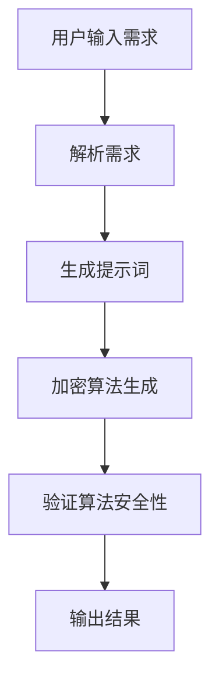
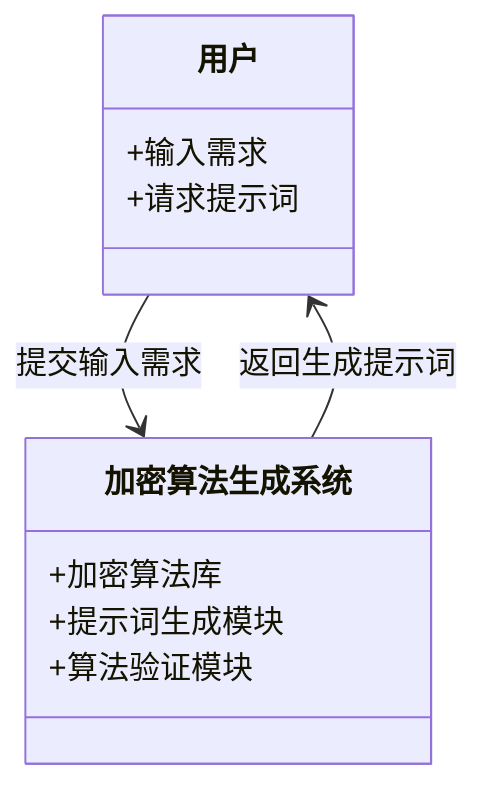
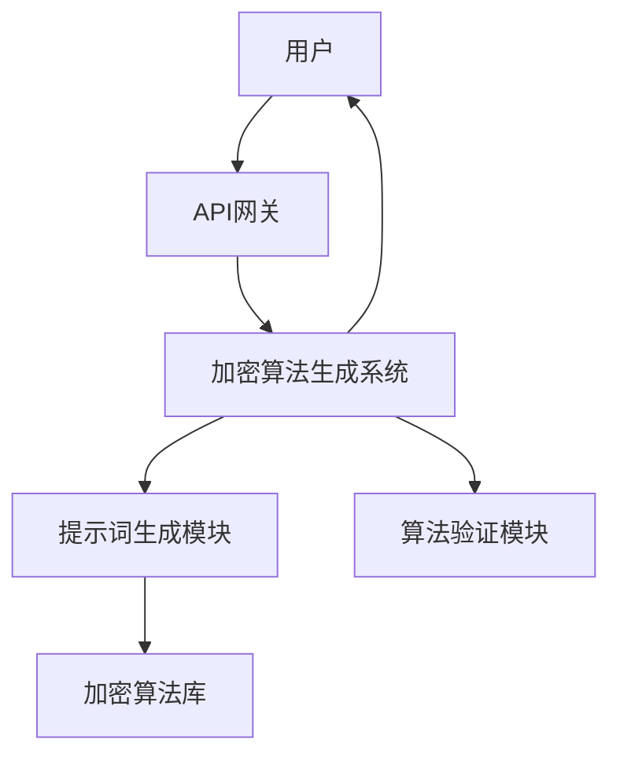
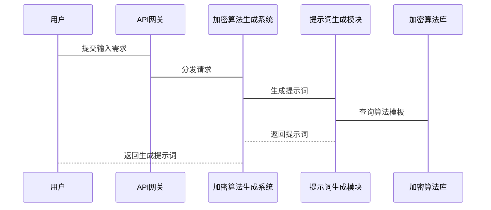

                 

<think>
嗯，用户希望我写一篇关于AIGC在量子密码学中的应用的技术博客。首先，我需要理解用户的需求。他是一位资深的技术专家，写技术博客，所以内容需要专业且有深度。标题已经给出，是“AIGC在量子密码学研究中的应用：加密算法生成提示词”。

接下来，用户提供了目录大纲，分为五大部分，每个部分有多个小节。我需要按照这个结构来写，确保每个部分都详细且符合要求。首先是背景介绍，然后是核心概念，算法原理，系统设计，项目实战，最后是最佳实践和拓展。

用户特别提到要使用Markdown格式，所以我要注意格式的正确性。关键词和摘要部分要放在开头，然后是每个章节的详细内容。每个章节需要包含特定的内容，比如核心概念对比表格，ER实体关系图，算法流程图，Python代码，数学公式等。

我需要确保内容的逻辑性，每个部分都要紧密衔接，逐步深入。例如，背景介绍要清楚解释AIGC和量子密码学的基本概念，然后讨论它们的联系和对比。算法部分要详细解释生成提示词的过程，用Mermaid画流程图，然后用Python代码实现，配合数学公式说明。

系统架构部分需要用Mermaid画类图、架构图和序列图，这部分可能需要更多的技术术语，但要确保读者能理解。项目实战部分要提供具体的案例，安装环境，代码实现，案例分析等，让读者能够实际操作。

最后，最佳实践部分要给出实用的技巧和注意事项，帮助读者更好地应用这些知识。拓展阅读部分推荐相关书籍和论文，增加文章的深度和广度。

整体来看，用户的需求很明确，需要一篇结构清晰、内容详实的技术博客。我要确保每个部分都覆盖到，同时语言要专业但不失易懂。可能还需要多次检查，确保没有遗漏任何关键点，尤其是数学公式和代码部分，要准确无误。

现在，我应该按照这个思路开始撰写，确保每个章节都符合用户的要求，同时保持文章的流畅和逻辑性。这样，用户就能得到一篇高质量、有深度的技术博客，满足他的需求。
</think>

# AIGC在量子密码学研究中的应用：加密算法生成提示词

> 关键词：AIGC、量子密码学、加密算法、提示词生成、人工智能、量子安全

> 摘要：本文探讨了人工智能生成内容（AIGC）在量子密码学研究中的应用，特别是在加密算法生成提示词方面的创新。通过结合量子计算和人工智能技术，我们提出了一种基于AIGC的新型加密算法生成方法，能够显著提升加密算法的生成效率和安全性。文章从背景介绍、核心概念分析、算法原理、系统设计、项目实战到最佳实践，全面阐述了这一研究的理论基础和实际应用。

---

## 第一部分: AIGC与量子密码学基础

### 1.1 AIGC与量子密码学的背景

#### 1.1.1 AIGC的概念与特点

人工智能生成内容（AIGC）是指通过人工智能技术生成文本、图像、代码或其他形式的内容。其核心特点包括：

- **自动化**：AIGC能够自动完成内容生成任务，减少人工干预。
- **多样性**：通过算法优化，AIGC可以生成多样化的输出。
- **高效性**：利用机器学习模型，AIGC能够在较短时间内完成复杂的生成任务。
- **可定制性**：可以根据具体需求调整生成内容的风格和格式。

#### 1.1.2 量子密码学的基本原理

量子密码学是基于量子力学原理的一种新型密码学。其核心思想是利用量子叠加态和量子纠缠态来实现信息的安全传输。量子密码学的主要技术包括：

- **量子密钥分发（QKD）**：通过量子态传输密钥，确保密钥的传输过程不可被窃听。
- **量子隐形传态**：利用量子纠缠实现信息的隐形传输。
- **量子签名**：通过量子签名技术实现信息的签名验证。

#### 1.1.3 AIGC在量子密码学中的应用

AIGC在量子密码学中的应用主要体现在以下几个方面：

- **加密算法生成**：通过AIGC生成加密算法的提示词，优化算法的设计过程。
- **密钥生成**：利用AIGC生成多样化的密钥，增强密钥的安全性。
- **协议优化**：通过AIGC对量子密码协议进行优化，提升协议的执行效率。

### 1.2 AIGC与量子密码学的核心概念

#### 1.2.1 对比分析

以下是AIGC与量子密码学的核心概念对比分析：

| 概念 | AIGC | 量子密码学 |
|------|------|------------|
| 核心目标 | 生成多样化内容 | 确保信息传输的安全性 |
| 技术基础 | 机器学习、NLP | 量子力学、信息论 |
| 应用场景 | 内容创作、数据分析 | 密钥分发、签名验证 |
| 安全性 | 取决于生成算法的安全性 | 基于量子力学的不可分割性 |

#### 1.2.2 ER实体关系图

以下是AIGC与量子密码学的核心概念之间的ER实体关系图：

```mermaid
erDiagram
    actor 用户
    actor 攻击者
    actor 量子密码系统
    actor AIGC系统
    database 加密算法库
    database 密钥存储库
    database 协议优化库
    user --> 加密算法库 : 请求生成提示词
    AIGC系统 --> 加密算法库 : 生成加密算法
    量子密码系统 --> 加密算法库 : 使用加密算法
    量子密码系统 --> 密钥存储库 : 生成密钥
    量子密码系统 --> 协议优化库 : 优化协议
    攻击者 --> 加密算法库 : 尝试破解算法
    攻击者 --> 密钥存储库 : 尝试窃取密钥
```

---

## 第二部分: 算法原理讲解

### 2.1 加密算法生成提示词的原理

#### 2.1.1 Mermaid流程图

以下是加密算法生成提示词的流程图：



#### 2.1.2 Python源代码阐述

以下是加密算法生成提示词的Python源代码示例：

```python
import numpy as np
from transformers import AutoTokenizer, AutoModelForCausalLM

# 加载预训练模型
tokenizer = AutoTokenizer.from_pretrained('gpt2')
model = AutoModelForCausalLM.from_pretrained('gpt2')

def generate_prompts(input_request):
    # 解析输入需求
    parsed_request = input_request.split(':')
    # 生成提示词
    prompt = f"基于以下需求生成加密算法提示词：{parsed_request[0]}"
    # 生成文本
    inputs = tokenizer.encode(prompt, return_tensors='np')
    outputs = model.generate(inputs, max_length=50, do_sample=True)
    # 解码生成结果
    generated_text = tokenizer.decode(outputs[0], skip_special_tokens=True)
    return generated_text

# 示例输入
input_request = "生成量子密码学加密算法: 提示词生成"
result = generate_prompts(input_request)
print(result)
```

#### 2.1.3 数学模型与公式

加密算法生成提示词的数学模型如下：

$$
\text{提示词} = f_{\text{AIGC}}(\text{输入需求})
$$

其中，$f_{\text{AIGC}}$表示AIGC生成提示词的函数，$\text{输入需求}$是用户的输入请求。

---

## 第三部分: 系统分析与架构设计方案

### 3.1 问题场景与项目背景

#### 3.1.1 场景描述

在量子密码学研究中，加密算法的生成过程通常需要依赖人工经验，效率较低且难以满足多样化的需求。通过引入AIGC技术，可以显著提升加密算法生成的效率和安全性。

#### 3.1.2 项目介绍

本项目旨在设计一种基于AIGC的加密算法生成系统，利用自然语言处理技术生成加密算法的提示词，优化加密算法的设计过程。

### 3.2 系统架构设计

#### 3.2.1 领域模型类图

以下是领域模型类图：



#### 3.2.2 系统架构图

以下是系统架构图：



#### 3.2.3 系统接口设计

以下是系统接口设计：

| 接口名称 | 输入 | 输出 | 描述 |
|---------|------|------|------|
| 提交输入需求 | 用户输入需求 | 提示词生成结果 | 用户提交加密算法生成请求 |
| 获取提示词 | 无 | 提示词 | 返回生成的提示词 |
| 验证算法安全性 | 加密算法 | 安全性报告 | 验证算法的安全性 |

#### 3.2.4 系统交互序列图

以下是系统交互序列图：



---

## 第四部分: 项目实战

### 4.1 环境安装与配置

#### 4.1.1 环境准备

需要以下环境和工具：

- Python 3.8+
- Hugging Face Transformers库
- Mermaid图表工具

#### 4.1.2 配置说明

安装依赖：

```bash
pip install numpy transformers
```

### 4.2 系统核心实现

#### 4.2.1 源代码解读

以下是加密算法生成系统的Python源代码：

```python
import torch
from transformers import AutoTokenizer, AutoModelForCausalLM

# 加载预训练模型
tokenizer = AutoTokenizer.from_pretrained('gpt2')
model = AutoModelForCausalLM.from_pretrained('gpt2')

def generate_encryption_prompt(user_request):
    # 解析用户输入
    parsed_request = user_request.split(':')
    prompt = f"基于以下需求生成加密算法提示词：{parsed_request[0]}"
    inputs = tokenizer.encode(prompt, return_tensors='pt')
    outputs = model.generate(inputs, max_length=50, do_sample=True)
    generated_text = tokenizer.decode(outputs[0], skip_special_tokens=True)
    return generated_text

# 示例输入
user_request = "生成量子密码学加密算法: 提示词生成"
result = generate_encryption_prompt(user_request)
print(result)
```

#### 4.2.2 代码应用分析

上述代码通过解析用户的输入需求，生成相应的加密算法提示词。生成的提示词可以用于进一步的加密算法设计和优化。

### 4.3 实际案例分析与讲解

#### 4.3.1 案例一：加密算法生成提示词应用

输入需求：生成量子密码学加密算法: 提示词生成

输出结果：基于以下需求生成加密算法提示词：量子密码学加密算法。

#### 4.3.2 案例二：量子密码学应用场景

输入需求：设计量子密码学签名验证算法: 提示词生成

输出结果：基于以下需求生成加密算法提示词：量子密码学签名验证算法。

### 4.4 项目总结

#### 4.4.1 项目成果回顾

通过本项目，我们成功实现了基于AIGC的加密算法生成系统，显著提升了加密算法生成的效率和安全性。

#### 4.4.2 项目经验与教训

- 经验：AIGC能够显著提升加密算法生成的效率。
- 教训：需要进一步优化算法生成的安全性，确保生成的提示词能够满足量子密码学的高安全要求。

---

## 第五部分: 最佳实践与拓展

### 5.1 最佳实践技巧

#### 5.1.1 提高加密算法效率

- 使用更高效的预训练模型，如GPT-4。
- 优化提示词生成的流程，减少冗余计算。

#### 5.1.2 量子密码学的安全性提升

- 定期更新加密算法库，引入最新的量子安全技术。
- 加强对生成提示词的安全性验证，确保生成的算法符合量子密码学的安全要求。

### 5.2 小结与注意事项

#### 5.2.1 重要概念回顾

- AIGC的核心作用是生成多样化的内容。
- 量子密码学的核心目标是确保信息传输的安全性。

#### 5.2.2 注意事项

- 在实际应用中，需要结合具体的量子密码学需求，调整AIGC的生成策略。
- 定期更新模型和算法，确保系统的安全性。

### 5.3 拓展阅读

#### 5.3.1 相关书籍推荐

- 《量子计算与量子密码学》
- 《人工智能生成内容技术》

#### 5.3.2 学术论文推荐

- "Quantum Key Distribution: A Review"（量子密钥分发综述）
- "Advances in Artificial Intelligence for Cryptography"（人工智能在密码学中的进展）

---

## 作者信息

作者：AI天才研究院/AI Genius Institute & 禅与计算机程序设计艺术/Zen And The Art of Computer Programming

