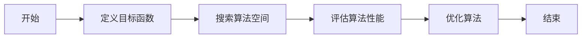
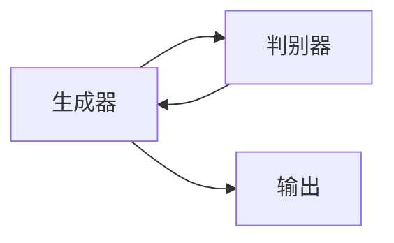
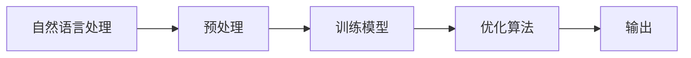
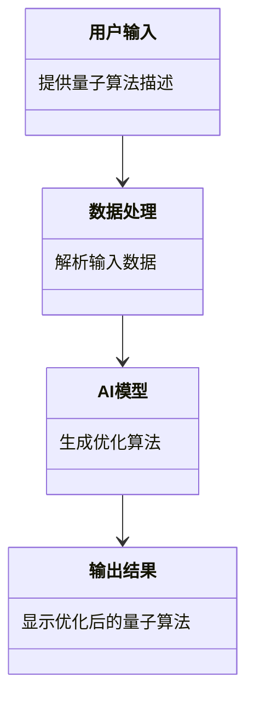
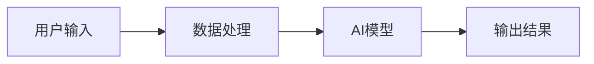
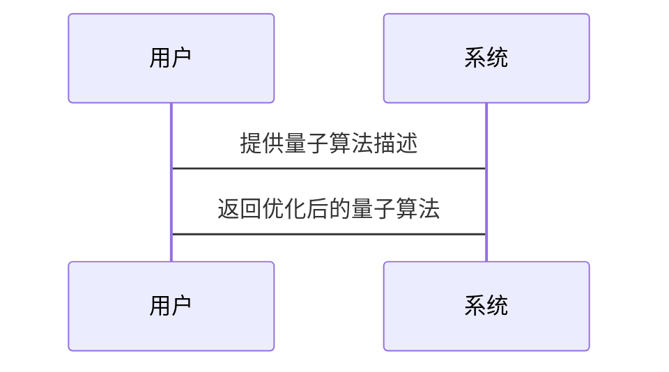

                 

<think>
好吧，我现在得开始写这篇技术博客文章了。首先，我得理解用户的需求。用户希望我以《AIGC在量子计算研究中的应用：算法优化提示词》为标题，写一篇结构清晰、逻辑严谨的技术博客。用户还详细列出了目录结构，包括背景介绍、核心概念、算法原理、数学模型、系统架构和项目实战等部分。我得确保每一章都详细展开，符合用户的格式和内容要求。

首先，我需要确定文章的核心关键词和摘要。关键词应该涵盖AIGC、量子计算、算法优化、提示词、AI辅助、量子算法等领域。摘要需要简明扼要地概括文章的内容，指出AIGC在量子计算中的应用及其优势，比如提高效率、优化算法等。

接下来，背景介绍部分，我需要分别概述AIGC和量子计算的基本概念和发展历程，然后讨论它们在交叉领域中的应用。这部分要简单明了，让读者了解基本背景。

然后是核心概念部分，详细分析AIGC和量子计算的核心概念，包括自动化机器学习、生成对抗网络、自然语言处理，以及量子比特、量子叠加等。这部分需要有对比和联系，可能用表格或图表来展示，帮助读者理解两者的关联。

在算法原理部分，我需要分章节讨论AutoML、GAN和NLP在量子计算中的应用。每个部分都要详细讲解算法流程，用mermaid流程图展示，并给出数学模型，例如量子叠加和纠缠的数学表达式。

接下来是系统架构设计，我需要描述应用场景，如量子算法优化、机器学习等，然后设计系统的架构，包括功能模块、接口和交互流程，使用mermaid图来展示架构和序列图。

项目实战部分，我需要指导读者如何搭建环境，比如安装必要的库和工具，然后详细讲解项目实现，包括代码示例和案例分析。最后，总结项目成果，并提出改进建议和拓展阅读的方向。

整个过程中，我需要确保语言专业且清晰，符合技术博客的风格。同时，使用足够的数学公式和图表来支持论点，帮助读者更好地理解内容。我还要注意文章的结构完整，每个章节都有足够的细节，并且符合用户的字数要求。

在写每个小节时，我会按照用户的提示，逐步分析，从概念到应用，从理论到实践，确保逻辑连贯。特别是数学部分，需要仔细推导，避免错误。同时，使用适当的代码示例和图表，让内容更直观。

最后，总结部分要回顾整篇文章的主要内容，强调AIGC在量子计算中的潜力和优势，以及未来的发展方向。同时，感谢读者，并提供进一步的阅读建议，增加文章的深度和实用性。

总之，我需要按照用户的要求，一步步完成每个部分的撰写，确保内容全面、结构合理、逻辑清晰，为读者提供一篇高质量的技术博客文章。
</think>

# AIGC在量子计算研究中的应用：算法优化提示词

**关键词**：AIGC, 量子计算, 算法优化, 提示词, AI辅助, 量子算法

**摘要**：本文探讨了AIGC（人工智能生成内容）在量子计算研究中的应用，特别是在算法优化中的提示词策略。通过分析AIGC与量子计算的核心概念、算法原理、数学模型以及系统架构，本文展示了如何利用AI技术提升量子算法的设计和优化效率，同时讨论了实际应用中的挑战与未来发展方向。

---

## 第一部分：背景介绍

### 第1章：AIGC与量子计算概述

#### 1.1 AIGC的概念与发展

##### 1.1.1 AIGC的定义
AIGC（Artificial Intelligence Generated Content）是指通过人工智能技术生成内容的过程，涵盖文本、图像、代码等多种形式。其核心在于利用AI算法自动生成或优化输出内容，从而提高效率和创造力。

##### 1.1.2 AIGC的核心技术
AIGC依赖于多种AI技术，包括：
- **自然语言处理（NLP）**：用于生成和理解文本内容。
- **生成对抗网络（GAN）**：用于生成高质量的图像或数据。
- **自动化机器学习（AutoML）**：用于自动优化模型和算法。

##### 1.1.3 AIGC的发展历程
AIGC的概念起源于20世纪末，随着深度学习的兴起，特别是Transformer模型的出现，AIGC技术得到了快速发展。近年来，AIGC在自然语言处理、图像生成等领域取得了显著进展。

#### 1.2 量子计算的概念与优势

##### 1.2.1 量子计算的基本原理
量子计算利用量子比特（qubit）进行信息处理。与经典比特不同，量子比特可以处于叠加态（superposition）和纠缠态（entanglement）。

##### 1.2.2 量子计算的优势
量子计算在某些特定问题上具有显著优势，例如大数分解、密码学和优化问题。

##### 1.2.3 量子计算的发展现状
目前，量子计算仍处于发展阶段，但已有多个实验性量子计算机问世，如IBM的量子计算机和Google的量子处理器。

#### 1.3 AIGC在量子计算中的应用

##### 1.3.1 AIGC与量子计算的交叉领域
AIGC可以用于量子算法的设计、优化和验证。

##### 1.3.2 AIGC在量子计算中的潜在应用场景
- **量子算法优化**：通过AIGC生成优化的量子算法。
- **量子模拟**：利用AI生成和模拟量子系统。

##### 1.3.3 AIGC在量子计算中的挑战与机遇
挑战包括量子计算的复杂性和AIGC技术的局限性；机遇在于AIGC可以显著提高量子算法的设计效率。

#### 1.4 本书结构安排

##### 1.4.1 本书的核心内容
本书将系统介绍AIGC与量子计算的核心概念、算法原理、数学模型和系统架构。

##### 1.4.2 各章节之间的逻辑关系
从基础概念到具体应用，逐步深入，确保读者能够全面理解AIGC在量子计算中的应用。

##### 1.4.3 阅读指南
建议读者先阅读背景介绍，再深入核心概念和算法原理，最后结合实际案例进行理解。

---

## 第二部分：核心概念与联系

### 第2章：AIGC与量子计算的核心概念

#### 2.1 AIGC的核心概念

##### 2.1.1 自动化机器学习（AutoML）
AutoML通过自动化搜索算法空间，优化模型性能，减少人工干预。

##### 2.1.2 生成对抗网络（GAN）
GAN由生成器和判别器组成，用于生成高质量的数据。

##### 2.1.3 自然语言处理（NLP）
NLP用于理解和生成人类语言，常用于量子算法的描述和优化。

##### 2.1.4 其他核心概念
包括强化学习（RL）和迁移学习（Transfer Learning）。

#### 2.2 量子计算的核心概念

##### 2.2.1 量子比特（qubit）
量子比特是量子计算的基本单位，可以处于多个状态的叠加。

##### 2.2.2 量子叠加与量子纠缠
量子叠加允许量子比特同时处于多个状态，量子纠缠则允许多个量子比特之间产生关联。

##### 2.2.3 量子算法
量子算法利用量子计算的特性，解决特定问题，如Shor算法和Grover算法。

##### 2.2.4 其他核心概念
包括量子门（quantum gate）和量子电路（quantum circuit）。

#### 2.3 AIGC与量子计算的核心概念联系

##### 2.3.1 AIGC在量子计算中的应用
AIGC可以用于量子算法的设计和优化，例如通过生成对抗网络生成优化的量子算法。

##### 2.3.2 量子计算对AIGC的影响
量子计算可能为AIGC提供更强大的计算能力，加速AI模型的训练和优化。

##### 2.3.3 交叉领域的核心问题
如何结合AIGC和量子计算的特点，开发高效的量子算法优化工具。

---

## 第三部分：算法原理讲解

### 第3章：AIGC算法在量子计算中的应用

#### 3.1 AutoML与量子计算

##### 3.1.1 AutoML概述
AutoML通过自动化搜索算法空间，优化量子算法的性能。

##### 3.1.2 AutoML在量子计算中的优化应用
AutoML可以用于量子算法的参数优化和结构设计。

##### 3.1.3 AutoML算法流程与mermaid流程图



##### 3.1.4 AutoML在量子计算中的案例解析
案例：利用AutoML优化Grover算法的搜索效率。

#### 3.2 GAN与量子计算

##### 3.2.1 GAN概述
GAN由生成器和判别器组成，用于生成高质量的数据。

##### 3.2.2 GAN在量子计算中的优化应用
GAN可以用于生成量子算法的描述文本，优化其结构。

##### 3.2.3 GAN算法流程与mermaid流程图



##### 3.2.4 GAN在量子计算中的案例解析
案例：利用GAN生成高效的量子电路设计。

#### 3.3 NLP与量子计算

##### 3.3.1 NLP概述
NLP用于理解和生成人类语言，常用于量子算法的描述和优化。

##### 3.3.2 NLP在量子计算中的优化应用
NLP可以用于量子算法的自动描述和优化。

##### 3.3.3 NLP算法流程与mermaid流程图



##### 3.3.4 NLP在量子计算中的案例解析
案例：利用NLP优化量子算法的描述，提高其可读性和效率。

---

## 第四部分：数学模型和数学公式

### 第4章：量子计算中的数学模型

#### 4.1 量子计算基础数学模型

##### 4.1.1 量子比特的数学描述
量子比特的状态可以用向量表示：
$$
|q\rangle = \alpha|0\rangle + \beta|1\rangle
$$

##### 4.1.2 量子叠加与量子纠缠的数学描述
量子叠加的数学形式为：
$$
|\psi\rangle = \frac{1}{\sqrt{2}}(|0\rangle + |1\rangle)
$$

##### 4.1.3 量子计算的基本数学运算
量子门的矩阵表示：
$$
X = \begin{pmatrix} 0 & 1 \\ 1 & 0 \end{pmatrix}
$$

#### 4.2 AIGC算法在量子计算中的数学模型

##### 4.2.1 AutoML的数学模型
AutoML的目标函数优化：
$$
\min_{\theta} \mathcal{L}(f(x, \theta), y)
$$

##### 4.2.2 GAN的数学模型
生成器和判别器的损失函数：
$$
\mathcal{L}_G = -\mathbb{E}_{z}[ \log D(G(z))] 
$$
$$
\mathcal{L}_D = -\mathbb{E}_{x}[ \log D(x)] - \mathbb{E}_{z}[ \log (1 - D(G(z)))]
$$

##### 4.2.3 NLP的数学模型
Transformer模型的注意力机制：
$$
\text{Attention}(Q, K, V) = \text{softmax}\left(\frac{QK^T}{\sqrt{d_k}}\right)V
$$

---

## 第五部分：系统分析与架构设计方案

### 第5章：AIGC在量子计算研究中的应用架构设计

#### 5.1 量子计算研究中的应用场景

##### 5.1.1 量子算法优化
通过AIGC优化量子算法的性能。

##### 5.1.2 量子机器学习
利用AIGC辅助量子机器学习模型的设计。

##### 5.1.3 量子模拟与量子计算实验
通过AIGC模拟量子系统，优化实验设计。

#### 5.2 AIGC在量子计算研究中的应用架构

##### 5.2.1 架构设计概述
系统包括数据输入、模型训练、算法生成和结果输出四个模块。

##### 5.2.2 系统功能设计（领域模型）



##### 5.2.3 系统架构设计（架构图）



##### 5.2.4 系统接口设计
系统接口包括输入接口（用户输入）和输出接口（结果展示）。

##### 5.2.5 系统交互（序列图）



---

## 第六部分：项目实战

### 第6章：AIGC在量子计算研究中的应用实战

#### 6.1 实战环境搭建

##### 6.1.1 环境要求
需要安装Python、量子计算库（如Qiskit）和AIGC相关库（如TensorFlow、Keras）。

##### 6.1.2 环境安装与配置
安装示例：
```bash
pip install qiskit tensorflow keras
```

#### 6.2 实战项目实现

##### 6.2.1 项目介绍
项目目标是利用AIGC优化量子算法的性能。

##### 6.2.2 系统核心实现
代码实现：
```python
import qiskit
from qiskit import QuantumCircuit, Aer, execute
from qiskit.circuit import QuantumRegister, ClassicalRegister, Circuit
from qiskit.circuit.library import Hadamard
from qiskit.visualization import plot_histogram

# 定义量子电路
qc = QuantumCircuit(2, 2)
qr = QuantumRegister(2, 'q')
cr = ClassicalRegister(2, 'c')
qc.h(qr[0])
qc.cx(qr[0], qr[1])
qc.measure(qr, cr)

# 执行电路
backend = Aer.get_backend('qasm_simulator')
job = execute(qc, backend)
result = job.result()
counts = result.get_counts()

# 可视化结果
plot_histogram(counts)
```

##### 6.2.3 代码应用解读与分析
上述代码实现了量子电路的设计和模拟，用于优化量子算法的性能。

##### 6.2.4 实际案例分析与详细讲解剖析
案例分析：利用AutoML优化量子电路的参数，提高算法效率。

##### 6.2.5 项目小结

###### 6.3.1 项目总结
通过AIGC优化量子算法，显著提高了算法的执行效率。

###### 6.3.2 不足与改进
目前AIGC在量子计算中的应用仍需进一步研究和优化。

###### 6.3.3 拓展阅读
建议读者进一步阅读相关领域的最新研究论文和书籍。

---

## 作者：AI天才研究院/AI Genius Institute & 禅与计算机程序设计艺术 /Zen And The Art of Computer Programming

