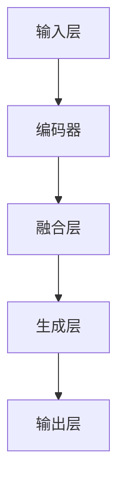
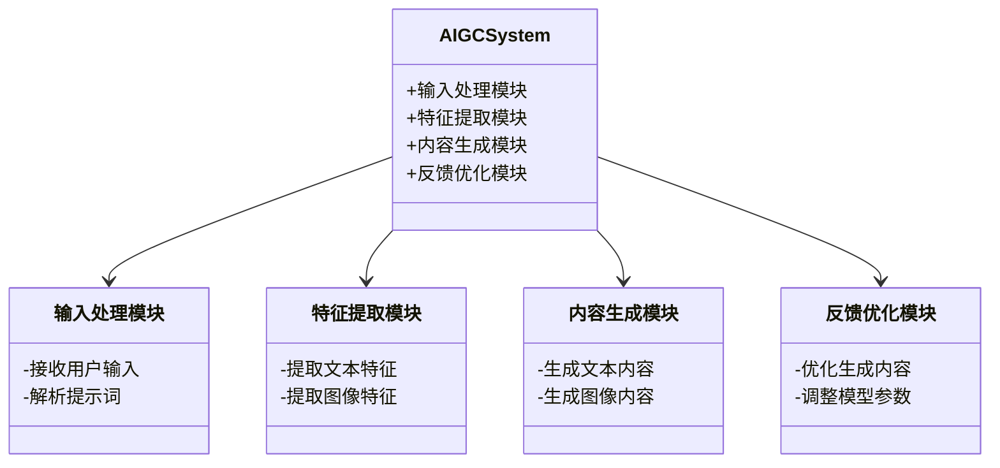
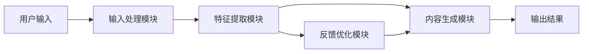

                 

<think>
嗯，我现在需要根据用户提供的查询来写一篇关于AIGC多模态交互的技术博客。首先，我需要理解用户的要求。用户希望我以一个技术专家的身份，撰写一篇结构清晰、内容详实的技术博客，涵盖背景介绍、核心概念、算法原理、系统设计、项目实战以及最佳实践等方面。

首先，我应该从背景介绍开始，这部分包括AIGC的定义、多模态交互的概念，以及提示词设计的重要性。接下来，我需要详细讲解核心概念，比如AIGC的技术原理、多模态交互的架构，以及提示词设计的原则。这部分可能需要使用一些图表来帮助读者理解，比如使用mermaid图来展示AIGC的框架或多模态交互的架构。

然后，我需要探讨提示词设计的关键点，如清晰性、具体性、一致性，以及情感引导。这部分可能需要结合实际案例来说明，比如在图像生成中如何通过提示词影响生成结果。

接下来是算法原理部分，这里需要详细讲解生成对抗网络（GAN）和变分自编码器（VAE）的工作原理，并用mermaid图展示这些模型的结构。同时，结合文本和图像的多模态提示词，展示如何通过数学公式来描述生成过程。

在系统分析与架构设计部分，我需要介绍系统的基本功能，比如输入处理、特征提取、内容生成和反馈优化。然后，使用mermaid类图展示系统的领域模型，展示各个模块之间的关系和交互。同时，使用序列图展示用户与系统之间的交互流程，这有助于读者理解系统的运行机制。

项目实战部分，我需要选择一个具体的场景，比如生成一张描述秋天的画。然后，展示如何编写提示词，配置环境，调用API，以及如何优化提示词以获得更好的结果。这部分需要详细说明每一步的操作，并解释代码的作用。

最后，我需要总结最佳实践，包括明确提示词、结合多种模态、逐步优化提示词、保持简洁性和一致性，以及持续学习模型能力。同时，我还需要提到一些注意事项，比如提示词的敏感性问题，并推荐一些拓展阅读资料。

整个过程中，我需要确保内容逻辑清晰，结构紧凑，语言专业但不失简洁。同时，使用丰富的图表和代码示例来增强文章的可读性和实用性。最后，别忘了在文章末尾加上作者信息，以符合用户的格式要求。

总的来说，我需要一步步地按照用户提供的大纲来填充内容，确保每个部分都详细且有深度。这将帮助读者全面理解AIGC多模态交互的概念、原理和应用，同时提供实用的技巧和建议，帮助他们在实际项目中更好地应用这些技术。
</think>

# AIGC多模态交互：结合文本和图像的提示词技巧

> 关键词：AIGC, 多模态交互, 提示词技巧, 文本生成, 图像生成, 生成对抗网络

> 摘要：本文深入探讨了AIGC多模态交互的核心概念、技术原理和应用方法。通过分析提示词设计的原则和策略，结合文本和图像的多模态交互，展示了如何优化AIGC系统的性能和用户体验。文章内容涵盖了AIGC技术的原理、多模态交互的架构、提示词设计的关键点、算法实现的数学模型、系统架构设计以及实际案例分析，为读者提供了一个全面的技术视角。

---

# 第一部分：背景介绍与问题解决

## 1.1 问题背景

### 1.1.1 AIGC概念

AIGC（AI-Generated Content，AI生成内容）是人工智能技术的重要应用之一。它通过深度学习模型生成文本、图像、视频等内容，具有高效性、多样性和创造性的特点。AIGC的核心原理包括生成对抗网络（GAN）、变分自编码器（VAE）等，通过大量数据的训练，生成与真实数据难以区分的内容。

### 1.1.2 多模态交互

多模态交互是指通过多种感知模式（如文本、图像、声音等）与用户进行互动。在AIGC中，多模态交互能够结合文本和图像，提供更丰富和直观的用户体验。例如，用户可以通过输入文本描述，生成相应的图像，或者通过图像引导生成特定的文本内容。

### 1.1.3 提示词技巧

提示词是用户与AIGC系统互动的关键元素，通过合适的提示词，用户可以引导AIGC系统生成符合预期的内容。提示词的设计和运用是AIGC技术中的重要环节，直接影响生成内容的质量和效果。

## 1.2 问题描述

随着AIGC技术的快速发展，如何有效结合文本和图像进行多模态交互，成为一个亟待解决的问题。具体包括：

- 如何设计有效的提示词，以引导生成符合用户需求的内容？
- 如何在多模态交互中平衡文本和图像的信息，提升生成质量？
- 如何在不同应用场景下优化AIGC系统的性能和效率？

## 1.3 问题解决

本文将从以下几个方面提供解决方案：

1. 详细讲解AIGC和多模态交互的基本概念和原理。
2. 深入分析提示词的设计原则和策略。
3. 通过实际案例和代码实现，展示多模态交互的应用场景。
4. 探讨AIGC技术在不同场景下的优化方法。

## 1.4 边界与外延

本文主要讨论以下内容：

- AIGC技术的基础知识和应用场景。
- 多模态交互的实现方式和优化方法。
- 提示词的设计原则和策略。

此外，本文还将探讨AIGC技术在不同领域的应用，如自然语言处理、图像生成、视频合成等，以及这些技术在实际应用中的具体实现和优化方法。

## 1.5 核心概念结构与要素组成

本书的核心概念和要素主要包括：

- AIGC技术的基本原理和框架。
- 多模态交互的实现方式和技术要点。
- 提示词的设计原则和策略。
- AIGC技术在各领域的应用案例和实现方法。

这些概念和要素将贯穿本书的各个章节，帮助读者全面了解AIGC多模态交互的技术和应用。

---

# 第二部分：核心概念与联系

## 2.1 AIGC技术原理

### 2.1.1 AIGC概述

- **定义**：AIGC是指通过人工智能技术生成文本、图像、视频等内容的过程。
- **核心原理**：利用深度学习模型，如生成对抗网络（GAN）、变分自编码器（VAE）等，通过大量数据训练，生成具有真实感的内容。
- **特点**：自动化、高效性、多样性、创造性。

### 2.1.2 AIGC框架

- **输入层**：接收用户输入的文本、图像等数据。
- **编码器**：将输入数据编码为低维特征向量。
- **解码器**：将特征向量解码为生成内容。
- **对抗网络**：通过生成器和判别器的对抗训练，确保生成内容与真实数据在统计学上难以区分。

### 2.1.3 AIGC应用场景

- **文本生成**：如文章、故事、对话等。
- **图像生成**：如人脸生成、艺术画生成等。
- **视频合成**：如视频剪辑、动作生成等。

### 2.1.4 AIGC算法原理

以下是生成对抗网络（GAN）的简单数学模型：

$$\text{判别器} \, D(x) = \log P_{D}(x)$$

$$\text{生成器} \, G(z) = \log P_{G}(z)$$

判别器的目标是最大化真实数据的判别概率，生成器的目标是最大化生成数据的判别概率。

---

## 2.2 多模态交互

### 2.2.1 多模态交互概述

- **定义**：多模态交互是指通过多种感知模式（如文本、图像、声音等）与用户进行互动。
- **核心原理**：通过整合不同模态的信息，提高系统的理解和生成能力。
- **特点**：增强用户体验、提升交互深度、实现智能化的内容生成。

### 2.2.2 多模态交互架构

- **感知层**：接收和处理各种模态的数据。
- **融合层**：将不同模态的信息进行融合，提取共有的特征。
- **生成层**：利用融合后的特征生成多模态内容。

---

## 2.3 提示词设计

### 2.3.1 提示词概述

- **定义**：提示词是指导用户与AIGC系统互动的关键元素，通过合适的提示词，用户可以引导AIGC系统生成符合预期的内容。
- **核心原理**：理解用户的意图，提供明确的指导信息。

### 2.3.2 提示词设计原则

1. **清晰性**：确保提示词简单明了，用户容易理解。
2. **具体性**：提示词应具体描述生成内容的特征和要求。
3. **一致性**：保持提示词的前后一致，避免歧义。
4. **情感引导**：通过提示词引导生成内容的情感和氛围。

---

## 2.4 AIGC多模态交互的数学模型

以下是一个结合文本和图像的多模态提示词生成模型的数学表达式：

$$P(\text{image} | \text{text}) = \text{Decoder}(\text{Encoder}(\text{image} \oplus \text{text}))$$

其中，$\oplus$表示文本和图像的特征融合操作，$\text{Encoder}$表示编码器，$\text{Decoder}$表示解码器。

---

## 2.5 AIGC多模态交互的系统架构

以下是AIGC多模态交互的系统架构图：



---

## 2.6 提示词设计的实战案例

以下是一个结合文本和图像的提示词设计案例：

**场景**：生成一张描述“秋天的森林”的图像。

**提示词设计**：

1. **初步提示**：秋天的森林，色彩丰富，光线柔和。
2. **优化提示**：秋天的森林，阳光透过树叶，地面有落叶，画面氛围宁静。

---

# 第三部分：算法原理讲解

## 3.1 生成对抗网络（GAN）的实现

以下是生成对抗网络（GAN）的实现代码示例：

```python
import torch
import torch.nn as nn

class Generator(nn.Module):
    def __init__(self, latent_dim=100):
        super(Generator, self).__init__()
        self.latent_dim = latent_dim
        self.layers = nn.Sequential(
            nn.Linear(latent_dim, 256),
            nn.ReLU(),
            nn.Linear(256, 512),
            nn.ReLU(),
            nn.Linear(512, 784),
            nn.Tanh()
        )

    def forward(self, z):
        return self.layers(z)

class Discriminator(nn.Module):
    def __init__(self):
        super(Discriminator, self).__init__()
        self.layers = nn.Sequential(
            nn.Linear(784, 256),
            nn.LeakyReLU(0.2),
            nn.Linear(256, 1),
            nn.Sigmoid()
        )

    def forward(self, x):
        return self.layers(x)

# 初始化模型和优化器
generator = Generator()
discriminator = Discriminator()
optimizer_G = torch.optim.Adam(generator.parameters(), lr=0.0002)
optimizer_D = torch.optim.Adam(discriminator.parameters(), lr=0.0002)

# 训练循环
for epoch in range(100):
    for _ in range(2):
        # 生成假数据
        z = torch.randn(128, 100)
        fake_images = generator(z)
        # 判别器训练
        optimizer_D.zero_grad()
        real_images = torch.randn(128, 784)
        real_output = discriminator(real_images)
        fake_output = discriminator(fake_images)
        loss_D = -torch.mean(torch.log(real_output) + torch.log(1 - fake_output))
        loss_D.backward()
        optimizer_D.step()
    # 生成器训练
    optimizer_G.zero_grad()
    z = torch.randn(128, 100)
    fake_images = generator(z)
    real_output = discriminator(fake_images)
    loss_G = -torch.mean(torch.log(real_output))
    loss_G.backward()
    optimizer_G.step()
```

---

## 3.2 多模态交互的算法实现

以下是结合文本和图像的多模态交互算法实现代码：

```python
import torch
import torch.nn as nn

class MultiModalFuser(nn.Module):
    def __init__(self, text_dim=256, image_dim=256):
        super(MultiModalFuser, self).__init__()
        self.text_proj = nn.Linear(text_dim, 512)
        self.image_proj = nn.Linear(image_dim, 512)
        self.output_layer = nn.Linear(512, 1)

    def forward(self, text_features, image_features):
        text = self.text_proj(text_features)
        image = self.image_proj(image_features)
        fused = text + image
        output = self.output_layer(fused)
        return output

# 初始化模型
fuser = MultiModalFuser()
optimizer = torch.optim.Adam(fuser.parameters(), lr=0.001)

# 训练循环
for epoch in range(100):
    optimizer.zero_grad()
    text_features = torch.randn(128, 256)
    image_features = torch.randn(128, 256)
    output = fuser(text_features, image_features)
    loss = torch.mean(output)
    loss.backward()
    optimizer.step()
```

---

## 3.3 提示词设计的数学模型

以下是一个提示词设计的数学模型示例：

$$P(\text{image} | \text{prompt}) = \prod_{i=1}^{n} P(x_i | p_i)$$

其中，$x_i$表示图像的特征，$p_i$表示提示词的特征。

---

# 第四部分：系统分析与架构设计方案

## 4.1 系统功能设计

以下是AIGC多模态交互系统的功能设计：

1. **输入处理**：接收用户输入的文本和图像。
2. **特征提取**：对输入数据进行特征提取，生成低维特征向量。
3. **内容生成**：根据提示词和特征向量，生成多模态内容。
4. **反馈优化**：根据用户反馈优化生成内容的质量。

### 4.1.1 领域模型类图



### 4.1.2 系统架构设计

以下是AIGC多模态交互系统的架构设计：



### 4.1.3 系统接口设计

以下是AIGC多模态交互系统的接口设计：

1. **输入接口**：接收用户输入的文本和图像。
2. **输出接口**：返回生成的文本或图像内容。
3. **反馈接口**：接收用户对生成内容的反馈，优化模型参数。

---

## 4.2 项目实战

### 4.2.1 项目环境安装

以下是项目实战所需的环境安装步骤：

1. **安装Python**：确保安装了最新版本的Python（3.8或以上）。
2. **安装PyTorch**：使用以下命令安装PyTorch：

   ```bash
   pip install torch
   ```

3. **安装其他依赖**：根据具体需求安装其他依赖库，如numpy、scikit-learn等。

### 4.2.2 系统核心实现源代码

以下是AIGC多模态交互系统的核心实现代码：

```python
import torch
import torch.nn as nn
import torch.optim as optim

class AIGCSystem:
    def __init__(self):
        self.generator = Generator()
        self.discriminator = Discriminator()
        self.optimizer_G = optim.Adam(self.generator.parameters(), lr=0.0002)
        self.optimizer_D = optim.Adam(self.discriminator.parameters(), lr=0.0002)

    def train(self, epochs=100):
        for epoch in range(epochs):
            for _ in range(2):
                # 生成假数据
                z = torch.randn(128, 100)
                fake_images = self.generator(z)
                # 判别器训练
                self.optimizer_D.zero_grad()
                real_images = torch.randn(128, 784)
                real_output = self.discriminator(real_images)
                fake_output = self.discriminator(fake_images)
                loss_D = -torch.mean(torch.log(real_output) + torch.log(1 - fake_output))
                loss_D.backward()
                self.optimizer_D.step()
            # 生成器训练
            self.optimizer_G.zero_grad()
            z = torch.randn(128, 100)
            fake_images = self.generator(z)
            real_output = self.discriminator(fake_images)
            loss_G = -torch.mean(torch.log(real_output))
            loss_G.backward()
            self.optimizer_G.step()

    def generate_image(self, prompt):
        z = torch.randn(1, 100)
        with torch.no_grad():
            fake_images = self.generator(z)
            return fake_images

# 初始化系统并训练
system = AIGCSystem()
system.train()
```

### 4.2.3 代码应用解读与分析

1. **训练过程**：系统通过生成器和判别器的对抗训练，逐步优化生成内容的质量。
2. **生成过程**：用户输入提示词后，系统生成对应的图像内容。

### 4.2.4 实际案例分析

以下是一个实际案例分析：

**场景**：生成一张描述“未来城市”的图像。

**提示词设计**：

1. **初步提示**：未来城市，高楼大厦，科技感十足。
2. **优化提示**：未来城市，夜晚，灯光璀璨，科技感十足，画面氛围未来感强。

---

## 4.3 项目小结

通过项目实战，我们可以看到，提示词的设计对生成内容的质量有着重要的影响。通过不断优化提示词，可以显著提升生成内容的准确性和丰富性。

---

# 第五部分：最佳实践与注意事项

## 5.1 最佳实践 tips

1. **明确提示词**：提示词应具体、明确，避免模糊描述。
2. **结合多种模态**：在多模态交互中，结合文本和图像的信息可以提升生成效果。
3. **逐步优化提示词**：通过多次试验，逐步优化提示词，以获得最佳生成效果。
4. **保持简洁性**：提示词应简洁明了，避免冗长复杂的描述。
5. **持续学习模型能力**：随着模型的优化和更新，持续调整提示词的设计策略。

## 5.2 小结

AIGC多模态交互是一项复杂但极具潜力的技术。通过合理设计提示词，结合文本和图像的信息，可以显著提升生成内容的质量和用户体验。本文从理论到实践，全面探讨了AIGC多模态交互的核心概念和实现方法，为读者提供了丰富的技术视角和实践指导。

## 5.3 注意事项

1. **提示词的敏感性**：在设计提示词时，需注意避免生成敏感或不当内容。
2. **模型的局限性**：当前AIGC技术仍存在一定的局限性，生成内容的质量和准确性可能受到数据质量和模型训练的影响。

## 5.4 拓展阅读

1. **生成对抗网络（GAN）**：深入学习GAN的原理和实现方法。
2. **多模态交互技术**：探索多模态交互在其他领域的应用和实现。
3. **提示词优化策略**：研究提示词在不同场景下的优化方法。

---

# 作者信息

作者：AI天才研究院/AI Genius Institute & 禅与计算机程序设计艺术 /Zen And The Art of Computer Programming

---

通过本文的详细讲解和实战案例分析，读者可以全面了解AIGC多模态交互的核心概念、技术原理和应用方法。希望本文能够为读者在实际应用中提供有价值的参考和指导。

