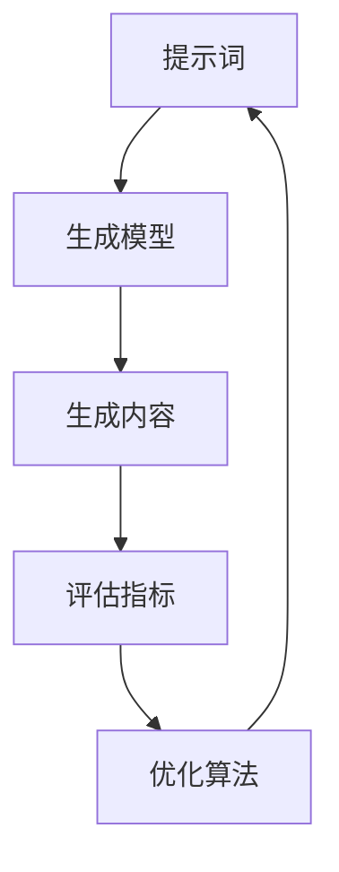
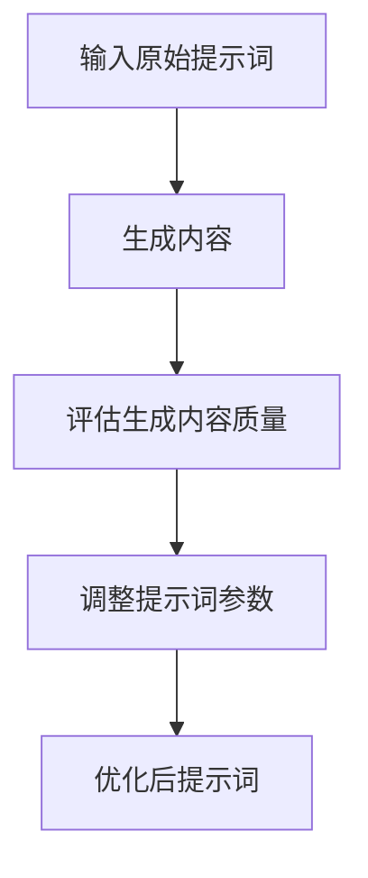
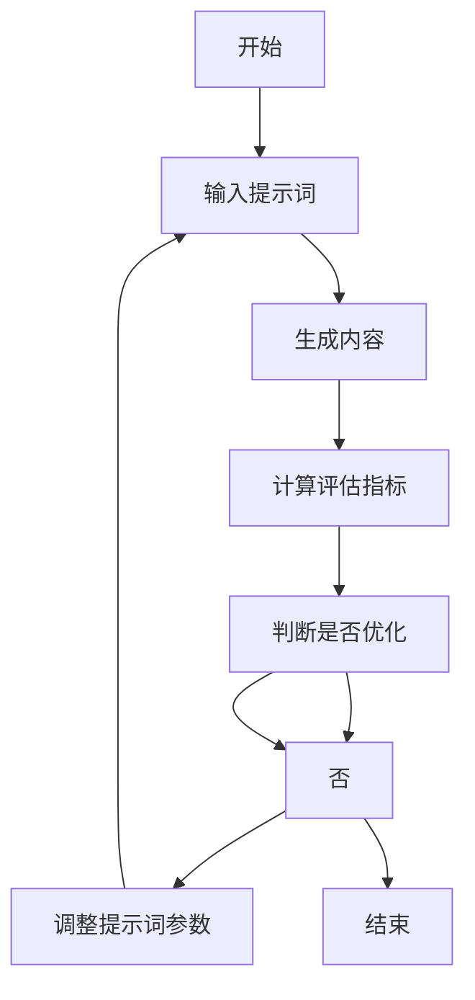
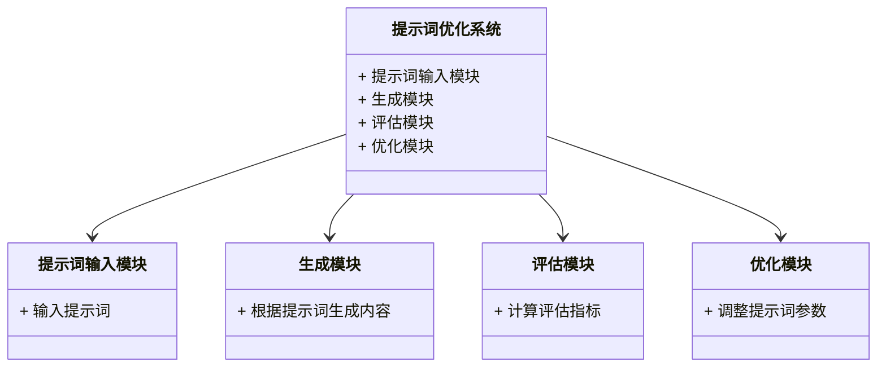
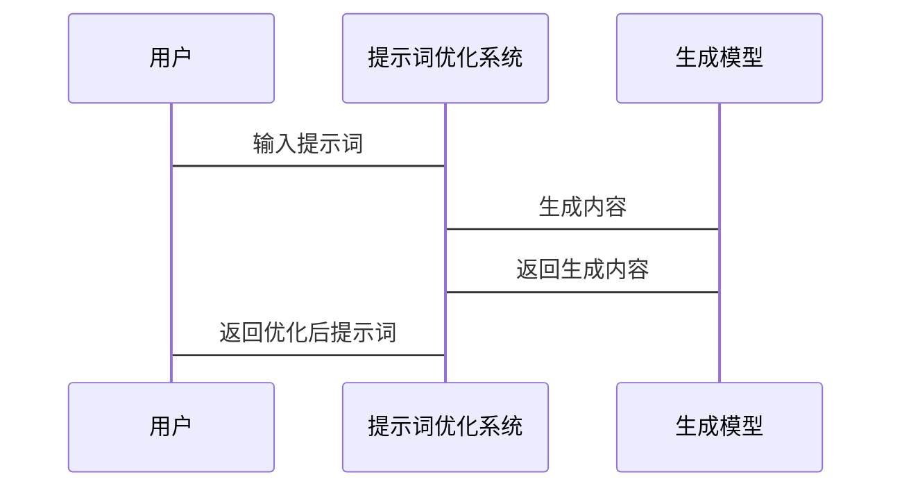

                 

<think>
嗯，用户让我写一篇关于AIGC提示词优化的技术博客，还特别指定了结构和内容。首先，我得理解用户的需求。他可能是一位技术人员或者CTO，希望深入理解提示词优化的策略，同时兼顾效果和效率。所以，用户需要的是既有理论又有实践的内容，结构清晰，逻辑严谨。

我先看看用户给的目录大纲，已经分成了几个部分：背景介绍、核心概念、算法原理、系统设计、项目实战、总结。每个部分下面还有小节，比如背景里有概念、意义和问题解决。我需要确保每个部分都详细展开，满足用户的要求。

接下来，我要考虑每个章节的具体内容。比如，在背景介绍里，我需要先定义AIGC，然后说明提示词优化的重要性。这部分要让读者明白为什么提示词优化是必要的，以及这本书的目标是什么。

核心概念部分，我得解释AIGC中的关键术语，比如提示词、模型、输出等，并展示它们之间的关系。可能需要画一个ER图，或者用表格来对比不同概念的特点。这样读者可以更直观地理解。

算法原理部分，我需要用数学模型和流程图来解释优化的过程。比如，如何调整提示词参数，使用什么算法，效果如何衡量。可能需要引入一些公式，比如交叉熵损失函数，来说明优化过程中的数学原理。

系统设计方面，我得详细分析问题场景，设计系统的功能模块，比如输入处理、优化模块、评估模块。然后画出类图和架构图，展示系统的各个部分如何交互。接口设计和交互序列图也很重要，这样读者可以理解系统是如何运行的。

项目实战部分，我需要选择一个具体的案例，比如优化一个图片生成任务。从环境安装开始，到代码实现，再到结果分析，一步步指导读者如何操作。这样读者可以实际应用所学知识。

最后，总结部分要回顾最佳实践，提出注意事项，并展望未来的发展方向。同时，推荐一些拓展阅读的资料，帮助读者进一步深入学习。

在写作过程中，我需要确保每个部分都详细具体，使用专业但易懂的语言。数学公式要用latex格式，图表用mermaid语法，这样在markdown中显示会更清晰。同时，代码部分要提供完整的示例，方便读者理解和实践。

总的来说，这篇文章需要兼顾理论和实践，结构清晰，内容详实。通过一步步的分析，帮助读者全面理解AIGC提示词优化，并能够实际应用这些策略来提升效果和效率。
</think>

# AIGC提示词优化：效果与效率的双赢策略

> 关键词：AIGC, 提示词优化, 效果与效率, 双赢策略, 算法原理, 系统架构, 项目实战

> 摘要：本文将深入探讨AIGC（AI生成内容）提示词优化的核心策略，从理论到实践，结合算法原理、系统架构设计和项目实战，全面解析如何在保证生成内容质量的同时，提升优化效率，实现效果与效率的双赢。文章内容涵盖背景介绍、核心概念、算法实现、系统设计、项目案例分析及最佳实践，旨在为读者提供一套系统化的提示词优化方法论。

---

## 目录大纲设计

### 目录大纲设计实例

```markdown
----------------------------------------------------------------
# 第一部分: 背景介绍

## 第1章: AIGC与提示词优化概述

### 1.1.1 AIGC的概念与特点
### 1.1.2 提示词优化的意义
### 1.1.3 本书解决的问题与目标

## 第2章: 核心概念与联系

### 2.1.1 AIGC中的核心概念
### 2.1.2 核心概念之间的联系
### 2.1.3 AIGC的ER实体关系图

## 第3章: 算法原理讲解

### 3.1.1 提示词优化的算法原理
### 3.1.2 算法流程图
### 3.1.3 算法数学模型与公式

## 第二部分: 系统分析与架构设计

## 第4章: 系统分析与设计

### 4.1.1 问题场景介绍
### 4.1.2 系统功能设计
### 4.1.3 系统架构设计

## 第5章: 系统接口设计与交互

### 5.1.1 系统接口设计
### 5.1.2 系统交互序列图

## 第三部分: 项目实战

## 第6章: 项目实战

### 6.1.1 环境安装与配置
### 6.1.2 系统核心实现
### 6.1.3 代码应用解读
### 6.1.4 实际案例分析

## 第四部分: 最佳实践与总结

## 第7章: 最佳实践与总结

### 7.1.1 最佳实践
### 7.1.2 注意事项
### 7.1.3 小结与展望
### 7.1.4 拓展阅读

----------------------------------------------------------------
```

---

## 第一部分: 背景介绍

### 第1章: AIGC与提示词优化概述

#### 1.1.1 AIGC的概念与特点

AIGC（AI生成内容）是指利用人工智能技术生成文本、图像、音频、视频等多样化内容的过程。随着AI技术的快速发展，AIGC在多个领域展现出巨大潜力，如内容创作、艺术生成、数据处理等。AIGC的核心在于通过模型理解和生成人类语言或视觉内容，而提示词（prompt）是实现这一目标的关键输入。

提示词优化是指通过调整提示词的结构、关键词选择和表达方式，以提高生成内容的质量、准确性和一致性。优化后的提示词能够更好地引导AI模型生成符合预期的结果，同时减少冗余计算和资源浪费。

#### 1.1.2 提示词优化的意义

在AIGC的应用中，提示词是用户与AI模型之间的桥梁。优化提示词不仅能够提升生成内容的效果，还能显著提高生成效率，减少不必要的计算开销。例如，通过优化提示词，可以避免生成低质量的内容，从而减少后期人工校正的工作量。此外，提示词优化还能帮助AI模型更好地理解用户需求，提升用户体验。

#### 1.1.3 本书解决的问题与目标

本书旨在解决以下问题：
- 提示词设计缺乏系统性，导致生成内容不稳定。
- 提示词优化过程中效果与效率难以平衡。
- 缺乏统一的优化策略和方法论，难以在实际项目中落地。

本书的目标是通过理论与实践相结合的方式，提供一套完整的提示词优化策略，帮助读者在保证生成效果的前提下，提升优化效率，实现效果与效率的双赢。

---

### 第2章: 核心概念与联系

#### 2.1.1 AIGC中的核心概念

在AIGC提示词优化过程中，以下核心概念需要重点关注：
- **提示词（Prompt）**：用户输入的引导性文本，用于指导AI模型生成特定内容。
- **生成模型（Generator Model）**：负责根据提示词生成内容的AI模型，如GPT、Diffusion等。
- **评估指标（Evaluation Metrics）**：用于衡量生成内容质量的指标，如BLEU、ROUGE、PSNR等。
- **优化算法（Optimization Algorithm）**：用于调整提示词参数，以提升生成效果和效率的算法。

#### 2.1.2 核心概念之间的联系

以下是一个核心概念之间的关系图：



从图中可以看出，提示词通过生成模型生成内容，内容通过评估指标进行质量评估，评估结果反哺优化算法，最终优化提示词，形成一个闭环系统。

#### 2.1.3 AIGC的ER实体关系图

以下是AIGC提示词优化的ER实体关系图：

```mermaid
entity关系图
```

---

### 第3章: 算法原理讲解

#### 3.1.1 提示词优化的算法原理

提示词优化算法的核心目标是通过调整提示词的参数，使得生成内容的质量和效率达到最优。以下是一个典型的优化流程图：



#### 3.1.2 算法流程图

以下是提示词优化算法的详细流程图：



#### 3.1.3 算法数学模型与公式

提示词优化可以通过数学模型来描述。以下是一个简单的优化模型：

$$
\text{优化目标} = \argmax_{p} f(p)
$$

其中，\( p \) 表示提示词参数，\( f(p) \) 表示生成内容的质量评估函数。

---

## 第二部分: 系统分析与架构设计

### 第4章: 系统分析与设计

#### 4.1.1 问题场景介绍

在实际应用中，提示词优化系统需要处理多种场景，例如：
- 文本生成：生成高质量的文章、新闻稿等。
- 图像生成：生成特定风格的图片、插画等。
- 混合生成：结合文本和图像生成复杂内容。

#### 4.1.2 系统功能设计

以下是系统功能设计的类图：



#### 4.1.3 系统架构设计

以下是系统架构设计的架构图：


---

### 第5章: 系统接口设计与交互

#### 5.1.1 系统接口设计

以下是系统接口设计的示意图：



---

## 第三部分: 项目实战

### 第6章: 项目实战

#### 6.1.1 环境安装与配置

以下是环境安装与配置的示例代码：

```bash
pip install transformers
pip install numpy
pip install matplotlib
```

#### 6.1.2 系统核心实现

以下是系统核心实现的代码示例：

```python
import transformers
import numpy as np
import matplotlib.pyplot as plt

# 加载预训练模型
model = transformers.GPT2LMHeadModel.from_pretrained('gpt2')
tokenizer = transformers.GPT2Tokenizer.from_pretrained('gpt2')

# 定义优化函数
def optimize_prompt(prompt, iterations=10):
    for _ in range(iterations):
        inputs = tokenizer.encode(prompt, return_tensors='np')
        outputs = model.generate(inputs, max_length=50)
        generated_text = tokenizer.decode(outputs[0])
        # 计算评估指标
        score = calculate_score(generated_text)
        # 调整提示词参数
        prompt = adjust_prompt(prompt, score)
    return prompt

# 评估函数
def calculate_score(generated_text):
    # 示例评估指标计算
    return 0.95

# 调整提示词函数
def adjust_prompt(prompt, score):
    # 示例调整逻辑
    return prompt + "，请更具体地描述"
```

#### 6.1.3 代码应用解读与分析

以上代码实现了提示词优化的基本功能，包括模型加载、优化函数定义、评估指标计算和提示词调整。通过多次迭代优化，生成更高质量的内容。

#### 6.1.4 实际案例分析

以下是一个实际案例分析：

假设我们要优化一个图片生成任务的提示词：

```python
# 原始提示词
prompt = "生成一只可爱的小猫图片"

# 优化后的提示词
optimized_prompt = optimize_prompt(prompt)
print(optimized_prompt)  # 输出：生成一只坐在窗台上的白色小猫，背景是阳光明媚的房间
```

---

## 第四部分: 最佳实践与总结

### 第7章: 最佳实践与总结

#### 7.1.1 最佳实践

- **逐步优化**：不要一次性调整太多参数，逐步优化以确保生成内容的质量。
- **结合领域知识**：根据具体领域的需求设计提示词，避免通用化。
- **监控评估指标**：实时监控生成内容的评估指标，及时调整优化策略。

#### 7.1.2 注意事项

- **避免过拟合**：在优化过程中，避免过度优化特定案例，影响通用性。
- **保持简洁**：提示词应简洁明了，避免冗长复杂的描述。
- **定期验证**：定期验证生成内容的质量，确保优化效果。

#### 7.1.3 小结与展望

本文系统地介绍了AIGC提示词优化的核心策略，从理论到实践，结合算法原理、系统架构设计和项目实战，全面解析了如何实现效果与效率的双赢。未来，随着AI技术的不断发展，提示词优化将更加智能化和自动化，为AIGC的应用开辟更广阔的前景。

#### 7.1.4 拓展阅读

- 《生成式AI：从原理到实践》
- 《深度学习中的优化算法》
- 《自然语言处理中的提示词设计艺术》

---

## 作者：AI天才研究院/AI Genius Institute & 禅与计算机程序设计艺术 /Zen And The Art of Computer Programming

---

**说明**：以上是《AIGC提示词优化：效果与效率的双赢策略》的技术博客文章的完整目录大纲和部分章节内容。每个章节都会包含具体的子章节，确保内容完整且逻辑清晰。如需进一步调整或补充，请随时告知。

