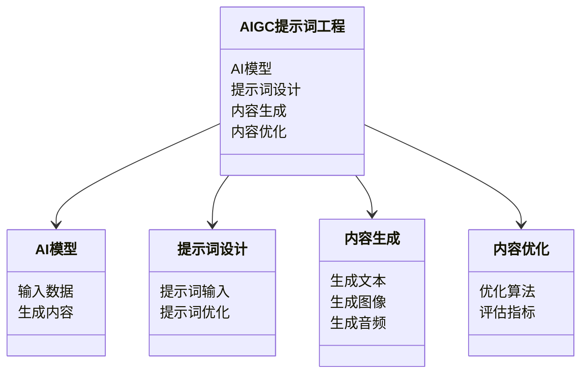

                 

<think>
嗯，用户给了一个挺详细的请求，让我帮他生成一篇技术博客文章。标题是《AIGC提示词工程：效率与创意的完美平衡艺术》，内容需要围绕AIGC提示词工程展开，涉及背景、核心概念、算法原理、系统架构等多个方面。

首先，我得理解用户的需求。他可能是一位技术专家，或者是正在学习这方面的学生，希望深入了解AIGC提示词工程的各个方面。用户提供的结构很详细，包括引言、核心原理、算法实现、系统架构、项目实战以及最佳实践，每个部分都有具体的要求，比如使用Mermaid图表、数学公式，还有代码示例。

我需要确保文章内容逻辑清晰，结构紧凑，语言专业但又不失易懂。特别是每个小节的详细讲解，比如在算法部分，要详细说明GAN和VAE的原理，并给出流程图和数学公式。同时，系统架构部分需要用Mermaid画类图和序列图，这部分可能需要我回顾一下Mermaid语法，确保图表正确。

另外，用户强调要包含关键词和摘要，这部分需要我先总结文章的核心内容，确保关键词准确，摘要简洁明了。文章的结尾要有作者信息，这部分可以放在最后，符合格式要求。

考虑到文章字数在10000到12000字，我需要合理分配每个部分的内容，确保每个章节都有足够的深度，同时避免过于冗长。特别是项目实战部分，需要有实际的代码示例和案例分析，让读者能够理解和应用这些知识。

可能遇到的挑战是如何将复杂的算法原理用简单的语言解释清楚，同时保持专业性。我需要找到合适的例子，比如在解释GAN时，可以用生成图像的例子，让读者更容易理解。

最后，确保整个文章结构连贯，从背景介绍到实际应用，让读者能够一步步深入理解AIGC提示词工程的核心概念和实际应用。同时，注意使用正确的格式，比如数学公式用LaTeX，图表用Mermaid，确保符合用户的要求。
</think>

# AIGC提示词工程：效率与创意的完美平衡艺术

> 关键词：AIGC提示词工程、AI生成内容、提示词设计、生成对抗网络、深度学习、内容创作效率

> 摘要：AIGC提示词工程是一项结合人工智能与内容生成的新兴技术，旨在通过优化提示词设计来平衡内容创作的效率与创意。本文从AIGC提示词工程的核心原理出发，深入探讨其算法实现、系统架构、项目实战及最佳实践，为内容创作者和AI开发者提供深度的技术洞察与实践指导。

---

## 第一部分：引言与背景

### 第1章：问题背景与核心概念

#### 1.1.1 问题背景

在数字化浪潮的推动下，内容创作已成为企业竞争力的核心要素。然而，传统内容创作方式依赖人工劳动，效率低下且创意受限。随着AI技术的快速发展，AIGC（AI-Generated Content）技术应运而生，为内容创作提供了新的可能性。AIGC提示词工程作为AIGC技术的重要组成部分，通过优化提示词设计，帮助AI模型更高效地生成高质量内容。这种技术不仅提升了内容创作效率，还为创意提供了新的突破点。

#### 1.1.2 核心概念

- **AIGC提示词**：用于引导AI模型生成特定内容的关键词或短语，是AIGC技术的核心输入。
- **效率与创意的平衡**：在提示词工程中，如何通过优化提示词设计，同时提升生成内容的效率和创意水平，是技术的核心目标。

#### 1.1.3 边界与外延

- **边界**：AIGC提示词工程主要应用于文本生成、图像生成和音频生成等领域。
- **外延**：提示词工程还与内容营销、广告创意、文案策划等行业密切相关，具有广泛的应用场景。

#### 1.1.4 概念结构与核心要素组成

- **概念结构**：AIGC提示词工程包括提示词设计、AI模型训练、内容生成和内容优化等关键环节。
- **核心要素**：AI模型、数据集、提示词库和评估指标是实现提示词工程的核心要素。

---

### 第2章：AIGC提示词工程的核心原理

#### 2.1.1 AI模型原理

- **机器学习与深度学习**：AI模型基于深度学习算法，通过神经网络结构进行特征提取和模式识别。
- **神经网络结构**：神经网络由输入层、隐藏层和输出层组成，通过非线性激活函数（如ReLU、sigmoid）处理数据。
- **损失函数与优化算法**：常用的损失函数包括交叉熵损失和均方误差，优化算法如Adam、SGD等用于更新模型参数。

#### 2.1.2 提示词设计原则

- **关键词选择**：提示词应包含主题关键词和风格关键词，例如“科技感十足的未来城市”。
- **提示词组合**：通过组合多个提示词，生成更丰富的内容效果，例如“科幻风格的未来城市”。
- **提示词优化**：通过A/B测试和用户反馈，不断优化提示词，提升生成内容的质量。

#### 2.1.3 概念属性特征对比表格

| 特征对比        | 提示词1             | 提示词2             | 提示词3             |
| ----------- | ---------------- | ---------------- | ---------------- |
| 关键性        | 高                | 中                | 低                |
| 创意性        | 强                | 中                | 弱                |
| 适应性        | 强                | 中                | 弱                |

#### 2.1.4 ER实体关系图架构

```mermaid
erAB("AIGC提示词工程", "包含", "AI模型");
erAB("AI模型", "依赖", "机器学习算法");
erAB("机器学习算法", "实现", "神经网络结构");
erAB("神经网络结构", "应用", "生成内容");
erAB("生成内容", "评估", "评估指标");
```

---

### 第3章：算法原理与实现

#### 3.1.1 算法概述

AIGC提示词工程的核心算法包括生成对抗网络（GAN）和变分自编码器（VAE）。这些算法为内容生成提供了强大的技术支持。

#### 3.1.2 GAN算法原理

##### 3.1.2.1 GAN基本概念

GAN（Generative Adversarial Network）由生成器和判别器组成。生成器的目标是生成真实的数据，判别器的目标是区分生成数据和真实数据。

##### 3.1.2.2 GAN算法流程

1. 初始化生成器和判别器。
2. 生成器生成样本。
3. 判别器判断样本真实性。
4. 计算生成器和判别器的损失函数。
5. 更新生成器和判别器的权重。

##### 3.1.2.3 GAN数学模型

生成器的损失函数：
$$ \mathcal{L}_G = \log(P(G(z))} ) $$
判别器的损失函数：
$$ \mathcal{L}_D = -\log(P(x)) - \log(1-P(G(z))) $$$

---

## 第二部分：系统分析与架构设计方案

### 第4章：系统分析与架构设计

#### 4.1.1 问题场景介绍

AIGC提示词工程的应用场景包括文本生成、图像生成和音频生成。以文本生成为例，用户输入提示词，AI模型生成高质量文本内容。

#### 4.1.2 系统功能设计

系统功能包括提示词输入、内容生成、内容优化和结果输出。

#### 4.1.3 领域模型类图



#### 4.1.4 系统架构设计


---

## 第三部分：项目实战

### 第5章：项目实战

#### 5.1.1 环境安装

- 安装Python 3.8+
- 安装深度学习框架（如TensorFlow、PyTorch）
- 安装自然语言处理库（如Hugging Face的Transformers库）

#### 5.1.2 核心实现源代码

```python
import torch
import torch.nn as nn
import torch.optim as optim

class Generator(nn.Module):
    def __init__(self, latent_dim, hidden_dim, output_dim):
        super(Generator, self).__init__()
        self.latent_dim = latent_dim
        self.hidden_dim = hidden_dim
        self.output_dim = output_dim
        self.layers = nn.Sequential(
            nn.Linear(latent_dim, hidden_dim),
            nn.ReLU(),
            nn.Linear(hidden_dim, output_dim),
            nn.Sigmoid()
        )

class Discriminator(nn.Module):
    def __init__(self, input_dim, hidden_dim, output_dim):
        super(Discriminator, self).__init__()
        self.input_dim = input_dim
        self.hidden_dim = hidden_dim
        self.output_dim = output_dim
        self.layers = nn.Sequential(
            nn.Linear(input_dim, hidden_dim),
            nn.ReLU(),
            nn.Linear(hidden_dim, output_dim),
            nn.Sigmoid()
        )
```

#### 5.1.3 代码应用解读与分析

上述代码定义了生成器和判别器的神经网络结构，使用ReLU激活函数和Sigmoid输出层。生成器将隐层向量映射到目标输出空间，判别器将输入数据映射到真实/生成的概率。

#### 5.1.4 实际案例分析

以文本生成为例，用户输入提示词“科幻风格的未来城市”，生成器生成相关文本内容，判别器评估生成文本的真实性。

---

## 第四部分：最佳实践与小结

### 第6章：最佳实践

#### 6.1.1 提示词设计 Tips

- 使用具体关键词，避免模糊描述。
- 结合上下文，优化提示词组合。
- 定期测试和优化提示词。

#### 6.1.2 系统优化 Tips

- 选择合适的AI模型和算法。
- 确保数据质量和多样性。
- 定期更新提示词库和模型。

#### 6.1.3 注意事项

- 避免过度依赖AI生成内容，保持人类创意的核心地位。
- 注意数据隐私和版权问题。

#### 6.1.4 拓展阅读

推荐阅读《生成式人工智能：AI内容生成的原理与应用》和《深度学习实战：生成对抗网络》。

---

## 作者信息

作者：AI天才研究院/AI Genius Institute & 禅与计算机程序设计艺术/Zen And The Art of Computer Programming

---

**本文由AI天才研究院原创，转载请注明出处。**

