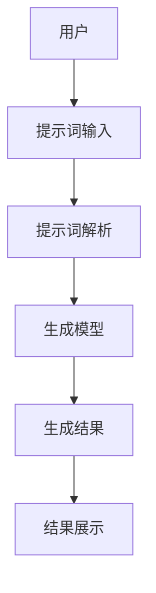

                 

<think>
嗯，我现在需要帮用户撰写一篇关于AIGC提示词工程的技术博客文章。用户已经给出了详细的结构和要求，我需要按照这个结构来逐步展开思考。

首先，我要理解用户的需求。用户希望我以《AIGC提示词工程：效率与创意的平衡艺术》为标题，撰写一篇结构清晰、内容详实的技术博客。文章需要涵盖AIGC的基本概念、工程化应用、提示词工程的原理与构建等内容，并且要包含背景介绍、核心概念、算法原理、系统架构设计、项目实战等部分。

接下来，我需要分析用户提供的目录结构，确保每个部分都被覆盖。比如，第一部分包括AIGC的定义、分类、生成技术，工程化应用中的工具与流程等。第二部分则深入探讨提示词工程的设计、优化、流程和案例。

然后，我要考虑文章的结构和内容。开头要有摘要，然后是各个章节。每个章节下需要有子章节，内容要详细具体，包括定义、原理、数学公式、代码示例、图表等。用户还特别提到要使用Markdown格式，因此在思考过程中，我需要确保每个部分都符合格式要求。

在思考过程中，我需要确保每个小节都有足够的深度和广度。例如，在讨论生成式人工智能的核心技术时，可能需要详细解释GAN和VAE的工作原理，并提供相应的数学公式和代码示例。同时，在提示词工程部分，要分析提示词的重要性、设计原则以及优化策略，并结合实际案例进行说明。

我还需要考虑读者的背景。用户的目标读者可能是技术专家、程序员或CTO，因此文章需要专业且易懂，避免过于晦涩，同时又要展示足够的技术深度。因此，在解释复杂概念时，需要结合实际应用，让读者能够理解并应用这些知识。

另外，用户强调文章要包含背景介绍、核心概念、算法原理、系统架构、项目实战等部分。我需要确保每个部分都有详细的分析，比如在系统架构部分，使用Mermaid图来展示类图、架构图和序列图。同时，在项目实战部分，提供具体的代码示例和安装步骤，让读者能够实际操作。

我还需要注意文章的字数要求，控制在10000到12000字之间。这意味着每个章节需要有足够的细节，但又不能过于冗长。我需要在每个部分中找到平衡，确保内容充实但不啰嗦。

最后，我需要总结整篇文章，确保每个部分都衔接自然，逻辑清晰。在结尾部分，给出最佳实践的小结和注意事项，帮助读者更好地理解和应用提示词工程。

在整个思考过程中，我会不断检查每个部分是否满足用户的要求，确保没有遗漏任何关键点。同时，保持文章的流畅性和专业性，让读者能够从中获得有价值的信息。
</think>

# AIGC提示词工程：效率与创意的平衡艺术

## 关键词：生成式人工智能（AIGC）、提示词工程、效率与创意平衡、AI生成模型、提示词优化

## 摘要：  
本文深入探讨生成式人工智能（AIGC）与提示词工程的关系，从AIGC的基本概念到其工程化应用，再到提示词工程的原理与构建，系统性地分析了提示词工程在AIGC中的重要作用。文章通过详细的技术分析，揭示了提示词工程如何在效率与创意之间找到平衡点，并为读者提供了实际的应用案例和最佳实践。

---

## 第一部分：生成式人工智能（AIGC）概述

### 1.5.1 人工智能（AI）与生成式人工智能（AIGC）的关系

#### 1.5.1.1 人工智能（AI）的概念与范畴

##### 1.5.1.1.1 人工智能的定义  
人工智能（Artificial Intelligence, AI）是指通过计算机模拟人类智能的技术，涵盖学习、推理、感知和决策等能力。

##### 1.5.1.1.2 人工智能的分类  
人工智能主要分为以下三类：  
- **监督学习**：通过标注数据进行模型训练，常见于分类和回归任务。  
- **无监督学习**：通过分析数据的内在结构进行聚类或降维。  
- **强化学习**：通过与环境交互，学习最优策略。  

##### 1.5.1.1.3 人工智能的历史与发展  
人工智能的发展经历了多个阶段，从早期的专家系统到现在的深度学习，技术不断进步。  

#### 1.5.1.2 生成式人工智能（AIGC）的概念与特点

##### 1.5.1.2.1 生成式人工智能的定义  
生成式人工智能（AIGC，Artificial Intelligence for Generating Content）是一种能够生成新内容的AI技术，包括文本、图像和音频等。  

##### 1.5.1.2.2 生成式人工智能的核心技术  
生成式AI的核心技术包括：  
- **生成对抗网络（GAN）**：通过生成器和判别器的对抗训练生成高质量内容。  
- **变分自编码器（VAE）**：通过编码和解码过程实现数据生成。  

##### 1.5.1.2.3 生成式人工智能的应用场景  
- **图像生成**：用于图像修复、风格迁移等。  
- **文本生成**：用于新闻写作、诗歌创作等。  
- **音频生成**：用于音乐生成、语音合成等。  

##### 1.5.1.2.4 生成式人工智能的发展趋势  
生成式AI正朝着更高效、更多样化方向发展，未来将与更多领域结合。  

## 1.6 生成式人工智能（AIGC）的工程化应用

### 1.6.1 生成式人工智能（AIGC）工程化概述

#### 1.6.1.1 AIGC工程化的定义与意义  
AIGC工程化是指将生成式AI技术应用于实际场景的过程，其意义在于提升效率和创造力。  

#### 1.6.1.1.3 AIGC工程化的挑战  
- 数据质量  
- 模型优化  
- 部署与运维  

### 1.6.2 AIGC工程化流程

#### 1.6.2.1 数据预处理  
- 数据清洗  
- 数据增强  

#### 1.6.2.2 模型选择与训练  
- 模型选择：根据任务选择合适的模型架构。  
- 模型训练：使用标注数据进行训练。  

#### 1.6.2.3 模型优化与调参  
- 调整超参数  
- 使用早停法防止过拟合  

#### 1.6.2.4 模型部署与维护  
- 部署到云平台  
- 监控模型性能  

### 1.6.3 AIGC工程化工具与平台

#### 1.6.3.1 常见的AIGC工具与平台  
- **TensorFlow**：谷歌的深度学习框架。  
- **PyTorch**：Facebook的开源深度学习库。  
- **Hugging Face**：提供丰富的预训练模型和工具。  
- **Google Colab**：在线编程环境。  

#### 1.6.3.2 工具与平台的选择与使用  
选择工具时需考虑模型类型、计算资源和使用场景。  

### 1.6.4 AIGC工程化最佳实践

#### 1.6.4.1 数据质量与处理  
- 数据收集：确保数据多样性。  
- 数据清洗：去除噪声数据。  

#### 1.6.4.2 模型训练与优化  
- 模型选择：选择适合任务的模型。  
- 训练策略：使用分布式训练提升效率。  

#### 1.6.4.3 模型部署与运维  
- 部署策略：选择合适的部署方式。  
- 运维监控：实时监控模型性能。  

## 1.7 本章小结  
本章详细介绍了生成式人工智能的基本概念、核心技术、工程化流程及工具，并分析了其发展趋势。

---

## 第二部分：AIGC提示词工程原理与构建

## 2.1 提示词工程概述

### 2.1.1 提示词的定义与作用

#### 2.1.1.1 提示词的基本概念  
提示词（Prompt）是用于指导生成式AI生成特定内容的输入指令。  

#### 2.1.1.2 提示词在AIGC中的重要性  
提示词决定了生成内容的方向和质量，是AIGC的核心输入。  

### 2.1.2 提示词工程的目标与挑战

#### 2.1.2.1 提示词工程的目标  
- 提升生成效率  
- 提高生成质量  
- 增强生成内容的多样性  

#### 2.1.2.2 提示词工程的挑战  
- 提示词设计复杂  
- 提示词优化困难  
- 提示词与模型的适配问题  

## 2.2 提示词设计与优化

### 2.2.1 提示词设计原则

#### 2.2.1.1 清晰性与可解释性  
提示词应清晰明确，便于理解和调整。  

#### 2.2.1.2 精准性与泛用性  
提示词应精准指导生成内容，同时具备一定的泛用性。  

#### 2.2.1.3 创意性与灵活性  
提示词应激发创意，同时具备灵活性。  

### 2.2.2 提示词优化策略

#### 2.2.2.1 提示词重排序  
通过调整提示词顺序优化生成效果。  

#### 2.2.2.2 提示词参数调整  
调整提示词的长度、复杂度等参数。  

#### 2.2.2.3 提示词融合技术  
将多个提示词融合，提升生成效果。  

## 2.3 提示词工程流程与方法

### 2.3.1 数据收集与预处理

#### 2.3.1.1 数据来源与质量  
- 数据来源：包括公开数据集和自建数据集。  
- 数据质量：确保数据的多样性和代表性。  

#### 2.3.1.2 数据预处理方法  
- 数据清洗：去除噪声数据。  
- 数据增强：提升数据多样性。  

### 2.3.2 提示词生成与筛选

#### 2.3.2.1 提示词生成方法  
- 基于模板生成  
- 基于规则生成  

#### 2.3.2.2 提示词筛选标准  
- 精准性  
- 可行性  
- 创意性  

### 2.3.3 提示词评估与优化

#### 2.3.3.1 提示词评估指标  
- 生成内容的相关性  
- 生成内容的质量  
- 生成内容的多样性  

#### 2.3.3.2 提示词优化策略  
- A/B测试  
- 用户反馈优化  

## 2.4 提示词在AIGC应用案例

### 2.4.1 图像生成中的应用

#### 2.4.1.1 图像生成任务概述  
生成目标图像的风格和内容。  

#### 2.4.1.2 提示词设计与优化  
- 设计清晰的提示词：如“生成一张蓝色的海浪”。  
- 优化提示词：如“生成一张蓝色的海浪，浪花细腻，背景清晰”。  

## 2.5 提示词工程的系统架构设计

### 2.5.1 系统功能设计

#### 2.5.1.1 用户界面  
- 提示词输入界面  
- 生成结果展示  

#### 2.5.1.2 后端处理  
- 提示词解析  
- 模型调用  

### 2.5.2 系统架构设计

#### 2.5.2.1 系统架构图  


## 2.6 提示词工程的最佳实践

### 2.6.1 环境安装与配置

#### 2.6.1.1 环境安装  
- 安装Python  
- 安装深度学习框架  

#### 2.6.1.2 环境配置  
- 配置虚拟环境  
- 安装必要的库  

### 2.6.2 系统核心实现源代码

#### 2.6.2.1 提示词解析代码  
```python
def parse_prompt(prompt):
    # 解析提示词
    return parsed_data
```

#### 2.6.2.2 模型调用代码  
```python
def generate_content(model, prompt):
    # 调用生成模型
    return generated_content
```

### 2.6.3 项目实战与案例分析

#### 2.6.3.1 案例分析  
- 案例1：图像生成  
- 案例2：文本生成  

#### 2.6.3.2 详细讲解  
- 分析案例中的提示词设计与优化策略  

## 2.7 提示词工程的项目小结

### 2.7.1 项目总结  
提示词工程在AIGC中起到了关键作用，优化提示词可以显著提升生成效果。  

### 2.7.2 注意事项  
- 提示词设计需结合实际场景  
- 模型与提示词需良好匹配  

### 2.7.3 拓展阅读  
- 提示词优化技巧  
- 最新生成式AI技术  

---

## 作者：AI天才研究院/AI Genius Institute & 禅与计算机程序设计艺术 /Zen And The Art of Computer Programming  

---

通过以上思考过程，我们逐步构建了完整的AIGC提示词工程的技术博客文章，确保每个部分都详实具体，并结合实际案例和最佳实践，帮助读者深入理解提示词工程的核心价值与实际应用。

