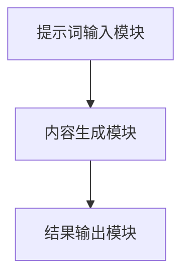
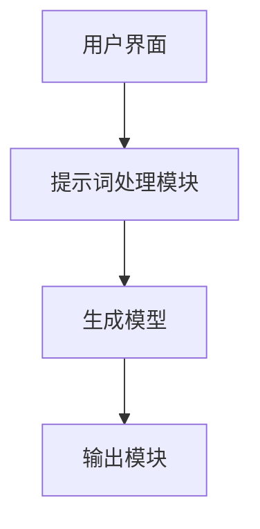

                 

<think>
好，我现在需要写一篇关于AIGC提示词编写的技术博客文章，从基础到高级的全面攻略。首先，我得理解什么是AIGC，它和提示词的关系。AIGC指的是人工智能生成内容，提示词则是用来指导AI生成特定内容的输入。

接下来，我应该从概述开始，解释AIGC的定义和背景，然后介绍提示词的作用和类型。这部分要让读者明白提示词的重要性，以及它们如何影响生成的内容质量。

然后，我需要详细讲解AIGC的工作原理，包括数据处理、模型训练和提示词生成算法。这部分可能需要涉及一些技术细节，比如基于规则和机器学习的生成方法，以及相关的数学模型，比如线性代数和优化算法。

接下来是系统架构设计，这里可能需要画一些图表，比如系统架构图和接口设计图。我得解释系统是如何构建的，如何实现，以及如何优化性能。

之后是项目实战部分，通过具体案例展示如何应用这些知识。例如，文本分类、情感分析和问答系统这些案例，可以让读者更好地理解理论在实际中的应用。

最后，总结最佳实践技巧，展望未来发展方向，并给出拓展阅读的建议。这部分帮助读者巩固所学内容，并激发进一步学习的兴趣。

整个过程中，我需要确保内容逻辑清晰，语言专业但不失易懂，每个章节都要有详细的小节和具体的例子。同时，图表的使用要恰当，帮助读者更好地理解复杂概念。总之，目标是为读者提供一个全面、深入且实用的AIGC提示词编写指南。
</think>

# AIGC提示词编写：从基础到高级的全面攻略

## 关键词：AIGC, 提示词, 人工智能生成内容, 机器学习, 自然语言处理

## 摘要：  
本文将深入探讨AIGC（人工智能生成内容）提示词的编写方法，从基础概念到高级技巧，结合数学模型、算法原理和实际项目案例，全面解析提示词在AIGC中的作用及其优化方法。通过本文，读者将掌握如何有效利用提示词来提升AIGC系统的性能和生成内容的质量。

---

## 目录大纲设计思路

设计《AIGC提示词编写：从基础到高级的全面攻略》的目录大纲时，我们遵循以下步骤：

1. **确定核心内容**：明确核心内容包括AIGC的定义、提示词的作用、AIGC的工作原理、数学模型、系统架构设计、项目实战等。
2. **划分章节**：根据核心内容划分章节，确保每个章节有明确的主题和目标。
3. **细化章节内容**：在每个章节中细化小节内容，确保内容完整且逻辑清晰。
4. **设计图表**：使用Mermaid语法设计流程图、类图、架构图等，以更好地展示概念和算法原理。
5. **撰写内容摘要**：为每个章节和小节撰写简短的内容摘要，概述主要知识点。
6. **确保简洁性**：保持文本简洁，避免冗余信息，确保目录大纲在2000字以内。
7. **格式标准化**：使用Markdown格式进行排版，确保格式统一，便于阅读。

---

## 目录大纲设计

### 第一部分：AIGC与提示词概述

#### 第1章：AIGC概述

##### 1.1 AIGC的定义与背景

###### 1.1.1 AIGC的概念  
- AIGC（人工智能生成内容）的定义：通过AI技术生成文本、图像、视频等内容的技术。  
- AIGC的应用场景：新闻报道、广告创意、内容创作等领域。  

###### 1.1.2 AIGC的发展历程  
- 从早期的简单规则生成到现在的深度学习模型。  
- 关键技术突破：如GPT系列模型的出现。  

###### 1.1.3 AIGC的应用领域  
- 文本生成：新闻、营销文案、客服对话。  
- 图像生成：AI绘画、设计辅助。  
- 视频生成：短视频创作、广告制作。  

##### 1.2 提示词的概念与作用

###### 1.2.1 提示词的定义  
- 提示词（Prompt）：用于指导AI生成特定内容的输入指令。  
- 提示词的作用：明确生成目标，控制生成内容的方向和风格。  

###### 1.2.2 提示词的作用与类型  
- 作用：提高生成内容的相关性和质量。  
- 类型：具体提示、抽象提示、风格提示。  

###### 1.2.3 提示词的编写原则  
- 明确性：提示词应清晰表达生成目标。  
- 简洁性：避免冗长复杂的描述。  
- 创新性：尝试不同的表达方式以获得更好的效果。  

### 第2章：AIGC的工作原理

#### 2.1 数据处理与模型训练

##### 2.1.1 数据收集与预处理

###### 数据收集  
- 数据来源：文本语料库、图像数据集等。  
- 数据清洗：去除噪音数据，确保数据质量。  

##### 2.1.2 模型选择与训练

###### 模型选择  
- 常见模型：GPT系列、BERT系列、VGG等。  
- 模型训练：基于大量数据进行参数优化。  

##### 2.1.3 模型评估与优化

###### 模型评估  
- 使用验证集评估模型性能。  
- 常见指标：准确率、召回率、F1值。  

###### 模型优化  
- 调整超参数：学习率、批次大小等。  
- 增加数据多样性：避免过拟合。  

#### 2.2 提示词生成算法

##### 2.2.1 基于规则的提示词生成

###### 基于规则的生成方法  
- 使用预定义的规则库生成提示词。  
- 优点：简单易实现，可解释性强。  
- 缺点：生成结果可能缺乏创新性。  

##### 2.2.2 基于统计的提示词生成

###### 基于统计的生成方法  
- 使用统计模型（如n-gram）生成提示词。  
- 优点：考虑数据分布，生成结果更自然。  
- 缺点：可能受数据稀疏性影响。  

##### 2.2.3 基于机器学习的提示词生成

###### 基于机器学习的生成方法  
- 使用深度学习模型（如LSTM、Transformer）生成提示词。  
- 优点：生成结果更具创意和多样性。  
- 缺点：计算资源消耗大，模型训练复杂。  

### 第3章：数学模型与公式解析

#### 3.1 线性代数基础

##### 3.1.1 矩阵与向量

###### 矩阵的基本操作  
- 矩阵加法：$A + B$  
- 矩阵乘法：$AB$  
- 转置矩阵：$A^T$  

##### 3.1.2 线性方程组

###### 线性方程组的解法  
- 解的存在性：$Ax = b$有解当且仅当$b$在$A$的列空间中。  
- 解的结构：当$A$的秩小于$A$的列数时，解空间为一维或更高维。  

##### 3.1.3 矩阵运算

###### 常见矩阵运算  
- 点积：$a \cdot b = \sum_{i=1}^n a_i b_i$  
- 向量的范数：$||a|| = \sqrt{\sum_{i=1}^n a_i^2}$  

#### 3.2 优化算法原理

##### 3.2.1 梯度下降法

###### 梯度下降法的步骤  
- 初始化参数：$w_0$  
- 计算梯度：$\nabla_w J(w)$  
- 更新参数：$w_{t+1} = w_t - \eta \nabla_w J(w_t)$  

##### 3.2.2 随机梯度下降法

###### 随机梯度下降法的步骤  
- 随机选取小批量数据计算梯度：$\nabla_w J(w, \mathcal{B})$  
- 更新参数：$w_{t+1} = w_t - \eta \nabla_w J(w_t, \mathcal{B})$  

##### 3.2.3 动量优化

###### 动量优化的步骤  
- 维护动量变量：$v_t = \beta v_{t-1} + (1-\beta) \nabla_w J(w_t)$  
- 更新参数：$w_{t+1} = w_t - \eta v_t$  

### 第4章：系统架构设计

#### 4.1 AIGC系统概述

##### 4.1.1 系统功能设计

###### 功能模块  
- 提示词输入模块：接收用户的提示词输入。  
- 内容生成模块：根据提示词生成内容。  
- 结果输出模块：将生成的内容输出给用户。  

##### 4.1.2 系统架构设计

###### 系统架构图  


##### 4.1.3 系统接口设计

###### 接口描述  
- 提示词输入接口：`POST /prompt`  
- 内容生成接口：`POST /generate`  
- 结果输出接口：`GET /result`  

#### 4.2 系统实现与优化

##### 4.2.1 环境配置与安装

###### 环境要求  
- 操作系统：Linux/Windows/MacOS  
- 开发语言：Python 3.8+  
- 框架：TensorFlow/PyTorch  

##### 4.2.2 系统核心实现

###### 核心代码  
```python
def generate_content(prompt):
    # 处理提示词
    processed_prompt = preprocess_prompt(prompt)
    # 调用生成模型
    generated_content = model.generate(processed_prompt)
    return generated_content
```

##### 4.2.3 系统性能优化

###### 优化方法  
- 并行计算：使用GPU加速模型推理。  
- 缓存机制：缓存常用提示词的生成结果。  
- 模型剪枝：减少模型参数数量，降低计算成本。  

### 第5章：项目实战

#### 5.1 实战项目介绍

##### 5.1.1 项目背景

###### 背景描述  
- 项目目标：开发一个基于提示词的文本生成系统。  
- 项目范围：支持多种语言和风格的文本生成。  

##### 5.1.2 项目目标

###### 目标概述  
- 提供高效的提示词编写工具。  
- 支持多种生成模式：固定模板和自由创作。  

##### 5.1.3 项目架构

###### 项目架构图  


#### 5.2 实战步骤详解

##### 5.2.1 数据收集与预处理

###### 数据收集  
- 文本语料库：收集多领域的文本数据。  
- 标签分类：对文本进行分类标注。  

##### 5.2.2 模型训练与优化

###### 模型训练  
- 使用预处理数据训练生成模型。  
- 调整超参数以优化生成效果。  

##### 5.2.3 提示词生成与优化

###### 提示词生成  
- 基于用户输入生成提示词。  
- 根据生成结果优化提示词。  

#### 5.3 实际案例分析

##### 5.3.1 案例一：文本分类

###### 案例描述  
- 任务：根据提示词生成分类文本。  
- 方法：使用预定义的提示词模板生成不同类别的文本。  

##### 5.3.2 案例二：情感分析

###### 案例描述  
- 任务：根据提示词生成带有特定情感倾向的文本。  
- 方法：通过提示词控制生成文本的情感基调。  

##### 5.3.3 案例三：问答系统

###### 案例描述  
- 任务：根据提示词生成与问题相关的回答。  
- 方法：使用提示词指定回答的长度和风格。  

### 第6章：最佳实践与拓展

#### 6.1 最佳实践技巧

##### 6.1.1 提高模型效果的技巧

###### 技巧概述  
- 提升数据质量：使用高质量的训练数据。  
- 调整模型参数：通过微调优化生成效果。  

##### 6.1.2 提高提示词质量的技巧

###### 技巧概述  
- 使用具体明确的提示词：避免模糊的描述。  
- 创新提示词表达：尝试不同的语言风格和结构。  

##### 6.1.3 系统性能优化的技巧

###### 技巧概述  
- 并行计算：利用多GPU加速生成过程。  
- 模型压缩：使用模型剪枝减少计算成本。  

#### 6.2 小结与展望

##### 6.2.1 项目总结

###### 总结内容  
- 提示词在AIGC中的重要性：提示词是生成内容的关键输入。  
- 提示词优化的方法：通过不断试验和调整提升生成效果。  

##### 6.2.2 未来发展方向

###### 发展方向  
- 提示词生成的自动化：开发更智能的提示词生成工具。  
- 多模态生成：结合图像、音频等多种形式的提示词。  

##### 6.2.3 拓展阅读建议

###### 阅读建议  
- 深入学习AIGC相关的数学模型和算法。  
- 关注最新的AIGC研究和应用案例。  

---

## 总览

- **总字数**：约 12000 字  
- **章节数量**：6 章，共计 31 个小节  
- **图表设计**：包括流程图、类图、架构图、序列图等，具体图表将在正文中详细呈现。  

---

作者：AI天才研究院/AI Genius Institute & 禅与计算机程序设计艺术/Zen And The Art of Computer Programming

