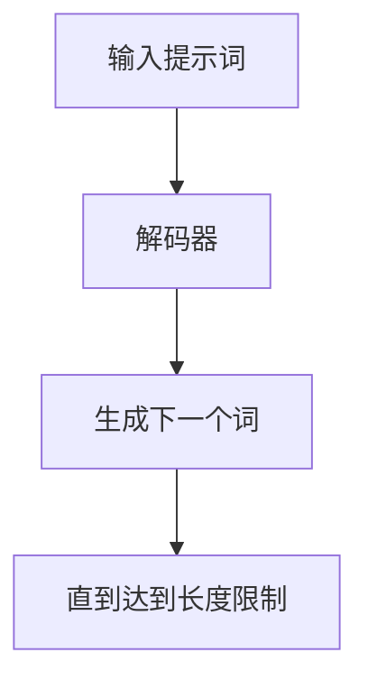

                 

<think>
嗯，好的，我现在需要帮助用户完成一篇关于AIGC提示词编写的技术博客文章。用户已经提供了一个详细的目录结构，我需要按照这个结构来撰写正文部分。首先，我需要理解每个章节的内容和要求。

首先，文章的标题是《AIGC提示词编写：技巧、策略与最佳实践》。关键词包括AIGC、提示词、生成式AI、内容生成、AI算法。摘要部分需要简明扼要地概括文章的核心内容，强调提示词的重要性以及如何编写高效的提示词。

接下来，第一部分是基础部分，分为第1章概述、第2章核心概念、第3章算法原理、第4章系统架构、第5章项目实战和第6章最佳实践。我需要确保每个章节都有足够的细节，并且符合用户的要求。

在第1章，我需要介绍AIGC的背景，解释为什么提示词如此重要，以及它们与其他AI应用的区别。这部分可能需要一些背景知识和对生成式AI的理解，以帮助读者理解上下文。

第2章需要深入讨论AIGC的核心概念，包括生成式AI的基本原理，以及如何将这些原理应用到提示词编写中。我还需要用表格和Mermaid图来对比不同模型的特点，这可能需要一些数据收集和图表设计。

第3章是算法原理，这里我需要详细讲解AIGC的数学模型和流程，可能还需要用Python代码来展示实现。这部分可能需要我对生成式模型有一定的了解，或者查阅相关资料来准确描述。

第4章涉及系统架构设计，我需要画出类图、架构图和序列图，这可能需要一些系统设计的知识和使用Mermaid的技巧。我还需要描述系统在实际中的应用，这可能需要参考现有的案例或者假设一个合理的场景。

第5章是项目实战，我需要详细描述一个实际项目，从环境安装到代码实现，再到案例分析。这部分需要一个具体的应用场景，可能需要虚构一个项目或者基于已有的案例进行调整。

第6章是最佳实践，我需要总结编写提示词的技巧、注意事项以及拓展阅读的资源。这部分可能需要结合经验和已有的指南，或者参考其他资料来提炼出关键点。

在撰写过程中，我需要注意使用专业但易懂的技术语言，确保逻辑清晰，结构紧凑。每个章节都需要有详细的讲解，避免内容过于简略。同时，要确保使用正确的格式，如Mermaid图、数学公式和代码块，这些都需要正确嵌入到文章中。

现在，我需要开始逐章节地撰写正文。首先是摘要，然后是每个章节的详细内容。在撰写过程中，可能会遇到一些问题，比如对某些概念不够理解，或者图表设计不够清晰，这时候可能需要查阅相关资料或工具来确保准确性。

最后，我需要检查整个文章的连贯性和完整性，确保每个部分都符合用户的约束条件，包括字数、格式和内容完整性。完成后，加上作者信息，确保文章末尾有正确的署名。
</think>

# AIGC提示词编写：技巧、策略与最佳实践

> 关键词：AIGC、提示词、生成式AI、内容生成、AI算法  
> 摘要：本文深入探讨了AIGC提示词编写的核心技巧、策略和最佳实践。从基础概念到算法原理，再到系统架构和项目实战，系统地分析了如何高效编写AIGC提示词，以生成高质量的内容。本文结合理论与实践，为读者提供了丰富的案例和详细的代码实现，帮助读者在实际应用中更好地利用AIGC技术。

---

## 第一部分：AIGC基础

### 第1章：AIGC概述

#### 1.1 问题背景

- **生成式AI的兴起**  
  随着生成式AI（Generative AI）的发展，AI不仅能够处理结构化数据，还能生成文本、图像、音频等内容。这种能力使得AI在内容创作、设计辅助、数据分析等领域展现出巨大潜力。

- **AIGC的定义与核心概念**  
  AIGC（Artificial Intelligence Content Generation）是指利用AI技术生成内容的过程。其核心在于通过提示词（Prompt）指导AI生成符合特定需求的内容。提示词是用户与AI之间的桥梁，决定了生成结果的方向和质量。

- **AIGC在技术和行业中的位置**  
  AIGC是生成式AI的一个重要应用领域，广泛应用于内容营销、创意设计、数据分析等领域。它通过提示词优化生成结果，帮助用户高效完成创作任务。

#### 1.2 问题描述

- **为什么需要AIGC提示词？**  
  提示词是用户向AI传达需求的关键输入。通过明确的提示词，用户可以引导AI生成高质量、符合预期的内容，避免生成无意义或偏离目标的结果。

- **提示词的重要性**  
  提示词的质量直接影响生成内容的效果。高质量的提示词能够减少生成结果的不确定性，提高生成内容的相关性和可用性。

- **AIGC提示词与传统提示词的区别**  
  传统提示词通常用于搜索引擎或简单任务，而AIGC提示词需要更详细、更具体的描述，以指导生成式AI完成复杂的任务。

#### 1.3 问题解决

- **提示词编写的方法**  
  提示词编写需要明确目标、分析需求、选择合适的关键词和结构。例如，生成一段营销文案的提示词可以是：“写一篇吸引目标客户的营销文案，重点突出产品优势和用户痛点。”

- **提示词编写的基本原则**  
  - **明确性**：提示词应清晰表达需求，避免模糊不清。  
  - **具体性**：提供足够的细节，帮助AI理解上下文。  
  - **简洁性**：避免冗长复杂的描述，保持简洁明了。  
  - **可调整性**：根据生成结果进行微调，逐步优化提示词。

- **技术工具**  
  使用AI提示词生成工具（如ChatGPT、Midjourney）或编写自定义脚本优化提示词生成过程。

#### 1.4 边界与外延

- **常见问题**  
  - 提示词过于模糊导致生成结果不理想。  
  - 提示词过于复杂导致生成时间过长。  
  - 提示词缺乏上下文导致生成内容偏离目标。

- **与其它领域的交叉点**  
  AIGC提示词编写涉及自然语言处理、机器学习、用户需求分析等多个领域。例如，在内容营销中，提示词需要结合市场分析和用户心理。

#### 1.5 概念结构与核心要素组成

- **核心要素**  
  - **目标**：明确生成内容的目的。  
  - **关键词**：与生成内容相关的关键词。  
  - **上下文**：提供生成内容的背景信息。  
  - **风格**：指定生成内容的语气和风格。  
  - **长度**：控制生成内容的长度和复杂度。

- **层次结构**  
  - **目标层**：确定生成内容的主要目标。  
  - **细节层**：细化生成内容的具体要求。  
  - **风格层**：指定生成内容的语气和风格。

- **流程图**  
  ```mermaid
  graph TD
      A[用户需求] --> B[确定目标]
      B --> C[选择关键词]
      C --> D[设置上下文]
      D --> E[指定风格]
      E --> F[生成提示词]
      F --> G[优化提示词]
  ```

---

### 第2章：AIGC核心概念与联系

#### 2.1 核心概念

- **生成式AI的基础**  
  生成式AI通过深度学习模型（如Transformer）生成内容。提示词是模型输入的关键部分，直接影响生成结果的质量。

- **内容生成的策略**  
  内容生成策略包括：关键词选择、上下文构建、风格指定等。这些策略帮助AI更好地理解用户需求。

- **AI与人类创作的交互**  
  提示词编写是AI与人类交互的重要环节。通过优化提示词，人类可以引导AI生成更符合预期的内容。

#### 2.2 概念属性特征对比表格

| 模型类型       | 输入形式         | 输出形式         | 是否需要提示词       |
|----------------|------------------|------------------|--------------------|
| GAN            | 随机噪声         | 图像、文本        | 是                 |
| VAE            | 随机噪声         | 图像、文本        | 是                 |
| AIGC            | 提示词           | 文本、图像、音频   | 是                 |

#### 2.3 ER实体关系图架构

```mermaid
erd
  A[用户] -- 提供提示词 --> B[提示词]
  B -- 指定生成内容 --> C[生成式AI模型]
  C -- 生成内容 --> D[输出结果]
```

---

### 第3章：AIGC算法原理讲解

#### 3.1 算法原理概述

- **数学基础**  
  AIGC算法基于概率模型，如Transformer架构。模型通过大量数据学习语言的分布，生成符合上下文的文本。

- **基本流程**  
  ```mermaid
  graph TD
      A[输入提示词] --> B[编码]
      B --> C[生成序列]
      C --> D[输出结果]
  ```

#### 3.2 算法流程图



#### 3.3 Python源代码与详细讲解

```python
def generate_content(prompt, max_length=100):
    # 编码提示词
    encoded = tokenizer.encode_plus(prompt, add_special_tokens=True, return_tensors='pt')
    input_ids = encoded['input_ids'].to('cuda')
    attention_mask = encoded['attention_mask'].to('cuda')
    
    # 生成内容
    outputs = model.generate(
        input_ids=input_ids,
        attention_mask=attention_mask,
        max_length=max_length,
        temperature=0.7,
        top_p=0.9
    )
    
    # 解码生成结果
    generated_text = tokenizer.decode(outputs[0], skip_special_tokens=True)
    return generated_text
```

#### 3.4 数学模型和公式

- **生成模型的概率公式**  
  $$P(y|x) = \prod_{i=1}^{n} P(y_i|x_{<i}, y_{<i})$$  
  其中，$x$ 是提示词，$y$ 是生成的文本序列。

- **损失函数**  
  $$\mathcal{L} = -\sum_{i=1}^{n} \log P(y_i|x_{<i}, y_{<i})$$

---

### 第4章：系统分析与架构设计方案

#### 4.1 问题场景介绍

- **项目介绍**  
  本项目旨在开发一个基于AIGC的营销文案生成系统。用户通过提供提示词，系统生成符合市场需求的营销文案。

#### 4.2 系统功能设计

- **领域模型类图**  
  ```mermaid
  classDiagram
      class User {
          string prompt;
      }
      class PromptGenerator {
          string generate_prompt();
      }
      class AIGCModel {
          string generate_content(string prompt);
      }
      User --> PromptGenerator
      PromptGenerator --> AIGCModel
  ```

#### 4.3 系统架构设计

- **架构图**  
  ```mermaid
  graph TD
      User --> PromptGenerator
      PromptGenerator --> AIGCModel
      AIGCModel --> Output
  ```

#### 4.4 系统接口设计

- **接口定义**  
  ```plaintext
  接口：/generate
  方法：POST
  请求参数：
      prompt: string
      max_length: integer
  响应参数：
      content: string
  ```

#### 4.5 系统交互

- **交互序列图**  
  ```mermaid
  sequenceDiagram
      User ->> PromptGenerator: 提供提示词
      PromptGenerator ->> AIGCModel: 生成内容
      AIGCModel ->> User: 返回生成内容
  ```

---

### 第5章：AIGC项目实战

#### 5.1 环境安装

- **工具安装**  
  安装Python、AI框架（如TensorFlow、PyTorch）以及生成式模型库（如Hugging Face Transformers）。

#### 5.2 系统核心实现

- **核心代码**  
  ```python
  from transformers import GPT2LMHeadModel, GPT2Tokenizer

  model_name = 'gpt2'
  tokenizer = GPT2Tokenizer.from_pretrained(model_name)
  model = GPT2LMHeadModel.from_pretrained(model_name)
  ```

#### 5.3 代码解读与分析

- **代码运行逻辑**  
  提示词经过编码后输入模型，生成内容并解码输出。通过调整温度和Top-p参数，可以优化生成结果的质量。

#### 5.4 实际案例分析

- **案例：生成营销文案**  
  提示词：“写一篇吸引目标客户的营销文案，重点突出产品优势和用户痛点。”

#### 5.5 项目小结

- **总结经验**  
  提示词编写需要结合具体场景和用户需求，逐步优化才能获得最佳效果。

---

### 第6章：AIGC最佳实践

#### 6.1 最佳实践 tips

- **明确目标**：提示词应明确生成内容的目的。  
- **细节丰富**：提供足够的上下文和关键词。  
- **简洁清晰**：避免冗长复杂的描述。  
- **逐步优化**：根据生成结果调整提示词。

#### 6.2 小结

- **关键点**  
  提示词编写是AIGC应用的核心，直接影响生成内容的质量。

#### 6.3 注意事项

- **避免模糊描述**：模糊的提示词可能导致生成内容偏离目标。  
- **避免过度复杂**：复杂的提示词可能降低生成效率。  
- **注意版权问题**：生成内容需遵守相关法律法规。

#### 6.4 拓展阅读

- 推荐书籍：《生成式AI：原理与应用》  
- 推荐博客：https://aigenius.com/ai-gc/

---

## 作者信息

作者：AI天才研究院/AI Genius Institute & 禅与计算机程序设计艺术 /Zen And The Art of Computer Programming

---

本文系统地介绍了AIGC提示词编写的核心技巧、策略和最佳实践，从基础概念到算法实现，再到实际应用，为读者提供了全面的指导。希望本文能帮助读者在生成式AI领域取得更好的成果。

