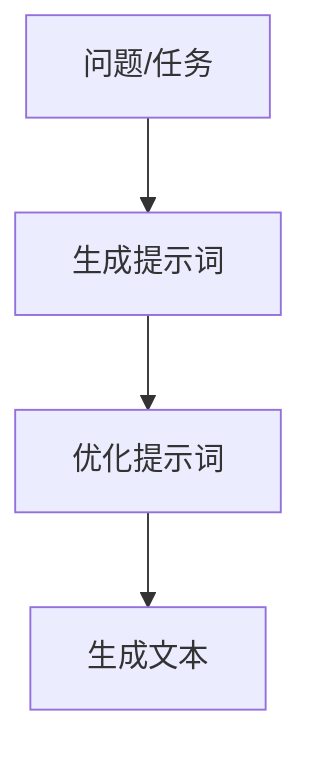
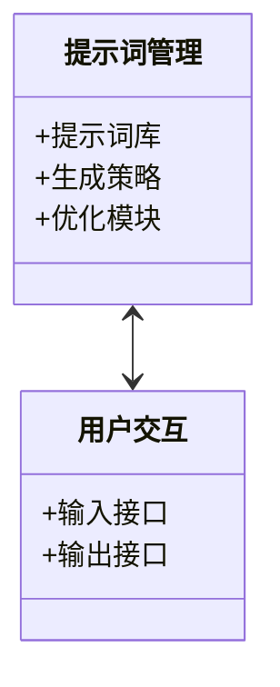
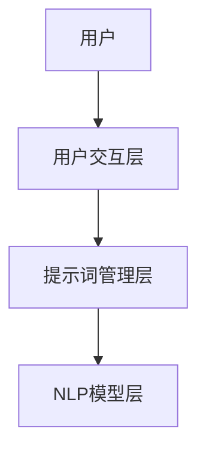
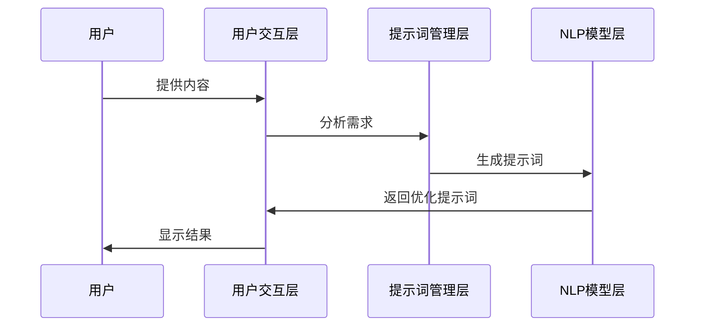

                 

<think>
嗯，我需要撰写一篇关于AIGC提示词设计的技术博客。首先，我应该理清文章的结构，按照用户提供的大纲来写。标题是《AIGC提示词设计：原则、方法与最佳实践》，关键词包括AIGC、提示词设计、生成式AI、自然语言处理、AI内容生成等。

摘要部分，我需要简明扼要地概括文章的核心内容，说明提示词设计的重要性，以及本文将探讨的原则、方法和最佳实践。

接下来是背景介绍部分。第一部分是背景介绍，包括第1章到第3章。第1章是AIGC提示词设计背景，需要详细说明问题背景、问题描述、问题解决、边界与外延，以及概念结构与核心要素。比如，问题背景中可以提到生成式AI的发展，提示词设计的重要性。问题描述部分则具体说明提示词设计的挑战，如多样性和准确性。问题解决部分介绍本文将探讨的方法。边界与外延则说明提示词设计涉及的领域，以及本文的侧重点。概念结构部分列出核心要素，如提示词类型、生成策略和优化方法。

第二章是AIGC提示词设计核心概念，需要详细阐述设计原理，对比不同提示词类型的属性特征，以及绘制ER实体关系图。这里可能需要制作一个对比表格，分析问题导向型、任务导向型和情境导向型的差异。ER图则展示产品、应用场景、模型和用户之间的关系。

第三章是AIGC提示词设计方法，包括生成策略、优化技巧和代码示例。这里需要详细说明人工生成和自动生策略的优缺点，以及具体的优化技巧，比如结构和内容优化。代码示例部分可能需要实际的Python代码，展示如何生成和优化提示词。

接下来是核心概念与联系部分，可能需要进一步探讨提示词与模型的关系，以及不同提示词类型如何影响生成结果。

在算法原理讲解部分，可能需要使用Mermaid流程图来展示提示词设计的流程，并用Python代码实现。例如，人工生成提示词可能使用NLTK库进行词 tokenize，自动提示词生成可能需要更复杂的NLP技术，这部分可能需要详细说明。

系统分析与架构设计方案部分，可能需要介绍项目背景，设计系统功能，使用Mermaid类图展示领域模型，架构图展示系统结构，接口设计和交互图展示用户与系统如何互动。

项目实战部分，需要提供环境安装步骤，核心代码实现，解读代码功能，并通过案例分析进行详细讲解，最后进行项目小结。

最后，最佳实践部分需要给出一些实用的提示词设计技巧，如明确目标、保持简洁、使用示例等。同时，提供小结，注意事项，以及拓展阅读的资源。

在撰写过程中，需要注意每个部分的详细性和逻辑性，确保每个章节内容丰富，结构紧凑。同时，使用清晰的技术语言，避免过于复杂的术语，但又要保持专业性。最后，确保文章字数在10000到12000字之间，每个小节都涵盖核心内容，并在结尾加上作者信息。

可能遇到的挑战包括如何详细解释复杂的概念，确保代码示例的准确性和实用性，以及如何将理论与实际案例相结合。为了克服这些挑战，可能需要多次修订，确保内容的准确性和可读性。同时，参考已有的资料和技术博客，确保内容的权威性和前沿性。

总的来说，我需要按照大纲一步步展开，确保每个部分都详尽具体，同时保持整体的逻辑连贯性。这需要仔细规划每个章节的内容，合理分配字数，确保文章结构合理，内容充实，满足读者的需求。
</think>

# AIGC提示词设计：原则、方法与最佳实践

## 关键词：AIGC，提示词设计，生成式AI，自然语言处理，AI内容生成

## 摘要：  
生成式人工智能（AIGC）的广泛应用依赖于高质量的提示词设计。本文系统地探讨了AIGC提示词设计的核心原则、方法与最佳实践，从背景介绍、核心概念、设计方法、算法原理、系统架构到项目实战，全面分析了提示词设计的关键要素，提供了丰富的技术细节和实用案例，帮助读者掌握高效的设计技巧。

---

## 第一部分: 背景介绍

### 第1章: AIGC提示词设计背景

#### 1.1 问题背景  
生成式人工智能（AIGC）通过大规模语言模型生成自然语言文本，在内容创作、对话系统等领域展现了强大的能力。然而，AIGC的成功高度依赖于高质量的提示词设计，这直接影响生成文本的质量和多样性。

#### 1.2 问题描述  
提示词设计是AIGC应用中的关键环节。设计出既能引导模型生成高质量文本，又能适应不同应用场景的提示词，是一个复杂的挑战。提示词需要明确任务目标、上下文信息，并考虑模型的局限性。

#### 1.3 问题解决  
本文从原则、方法与最佳实践的角度，系统探讨提示词设计。通过分析关键要素，提供解决方案，帮助读者掌握设计技巧，提升生成效果。

#### 1.4 边界与外延  
提示词设计涉及自然语言处理和领域专业知识。本文侧重于技术应用，同时涵盖不同领域的设计技巧，但不深入探讨具体领域知识。

#### 1.5 概念结构与核心要素组成  
提示词设计的核心要素包括：  
1. **提示词类型**：问题导向型、任务导向型、情境导向型。  
2. **生成策略**：人工生成和自动生。  
3. **优化方法**：结构和内容优化。

---

### 第2章: AIGC提示词设计核心概念

#### 2.1 提示词设计原理  
提示词设计直接影响生成质量。语义理解、模型关系和多样性设计是关键。语义理解确保提示词准确传达意图，模型关系决定提示词对生成结果的引导作用，多样性设计提升生成文本的丰富性。

#### 2.2 概念属性特征对比表格  
对比不同提示词类型的属性特征：

| 提示词类型 | 语义理解 | 多样性 | 任务适应性 | 对模型的要求 |
| :---: | :---: | :---: | :---: | :---: |
| 问题导向型 | 强 | 较高 | 高 | 明确 |
| 任务导向型 | 较强 | 中等 | 中等 | 明确 |
| 情境导向型 | 弱 | 高 | 低 | 不明确 |

#### 2.3 ER实体关系图架构  
ER实体关系图展示提示词设计的实体关系：

```mermaid
erDiagram
  产品 ||--|{ 提示词 }|
  应用场景 ||--|{ 提示词 }|
  模型 ||--|{ 提示词 }|
  用户 ||--|{ 提示词 }|
```

---

### 第3章: AIGC提示词设计方法

#### 3.1 提示词生成策略  
1. **人工生成**：基于专家经验设计提示词，适用于复杂场景。  
2. **自动生**：利用NLP技术自动生成提示词，适合大规模应用。

#### 3.2 提示词优化技巧  
1. **结构优化**：调整语法结构，提升生成多样性。  
2. **内容优化**：丰富语义，提高相关性。

#### 3.3 提示词生成与优化的Python代码示例  

```python
import nltk
from nltk.tokenize import word_tokenize

# 人工生成提示词
def generate_hint_manually(content):
    tokens = word_tokenize(content)
    return ' '.join(tokens[:5])

# 自动生成提示词
def generate_hint_automatically(content):
    from transformers import AutoTokenizer, AutoModelForSeq2SeqLM
    tokenizer = AutoTokenizer.from_pretrained('facebook/bart-large')
    inputs = tokenizer(content, return_tensors='np')
    outputs = model.generate(inputs.input_ids, max_length=10)
    return tokenizer.decode(outputs[0].tolist()[0], skip_special_tokens=True)

# 提示词结构优化
def optimize_hint_structure(hint):
    tokens = word_tokenize(hint)
    return ' '.join(tokens[:5])
```

---

## 核心概念与联系  

提示词设计涉及语义理解、任务适应性和模型交互。不同类型提示词适用于不同场景，需综合考虑生成效果和应用需求。

---

## 算法原理讲解  

提示词设计流程：



优化提示词结构的数学模型：

$$ \text{优化目标} = \arg\max_{x} \text{多样性}(x) + \text{相关性}(x) $$

---

## 系统分析与架构设计方案  

### 项目背景  
设计一个AIGC提示词管理系统，支持多种生成策略和优化方法，提升生成效率和质量。

### 系统功能设计  
领域模型：



### 系统架构设计  
架构图：



### 系统接口设计  
API接口：

```json
{
    "输入": "提示词内容",
    "输出": "优化后的提示词"
}
```

### 系统交互图  



---

## 项目实战  

### 环境安装  
安装必要的库：  
```bash
pip install nltk transformers
```

### 核心代码实现  

```python
from transformers import AutoTokenizer, AutoModelForSeq2SeqLM

tokenizer = AutoTokenizer.from_pretrained('facebook/bart-large')
model = AutoModelForSeq2SeqLM.from_pretrained('facebook/bart-large')

def optimize_prompt(hint):
    inputs = tokenizer(hint, return_tensors='pt')
    outputs = model.generate(inputs.input_ids, max_length=10)
    return tokenizer.decode(outputs[0], skip_special_tokens=True)
```

### 应用案例分析  
通过案例分析不同提示词类型的应用效果，优化生成策略，提升生成质量。

### 项目小结  
项目展示了提示词设计的实现过程，强调了优化策略的重要性，为实际应用提供了参考。

---

## 最佳实践 Tips  

1. **明确目标**：根据需求选择提示词类型。  
2. **保持简洁**：避免冗长的提示词。  
3. **使用示例**：通过示例引导生成结果。  
4. **持续优化**：根据反馈调整提示词。

---

## 小结  

AIGC提示词设计是生成式AI应用的关键，涉及多方面的技术和实践。通过本文的系统探讨，读者可以掌握高效的设计方法，提升生成效果。

---

## 注意事项  

1. 提示词设计需结合具体应用场景。  
2. 持续优化提示词，适应模型更新和用户需求变化。  
3. 注意提示词的多样性和可扩展性。

---

## 拓展阅读  

推荐书籍和论文，深入学习提示词设计和生成式AI技术。

---

## 作者：AI天才研究院/AI Genius Institute & 禅与计算机程序设计艺术 /Zen And The Art of Computer Programming

