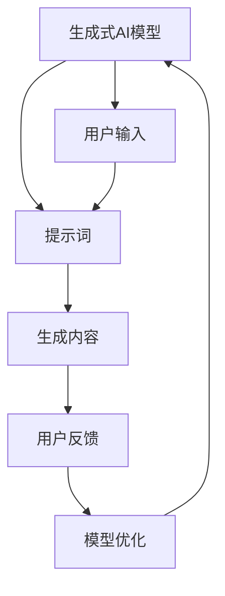
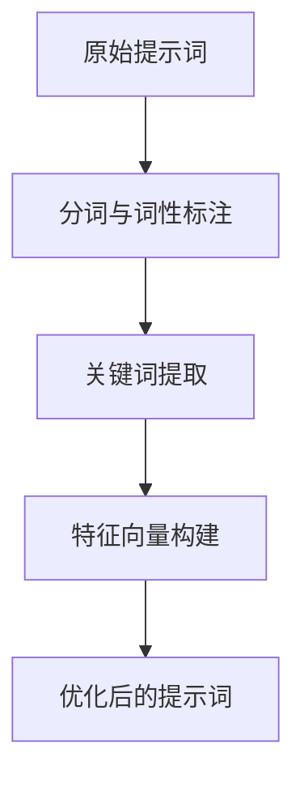
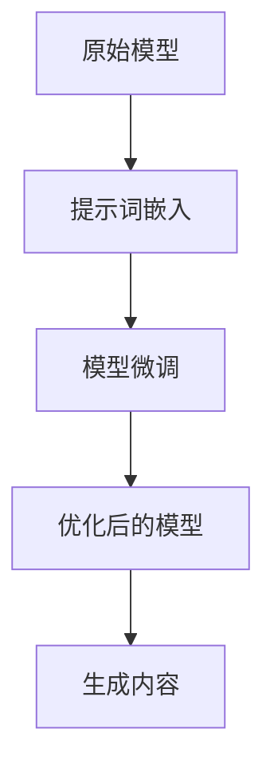
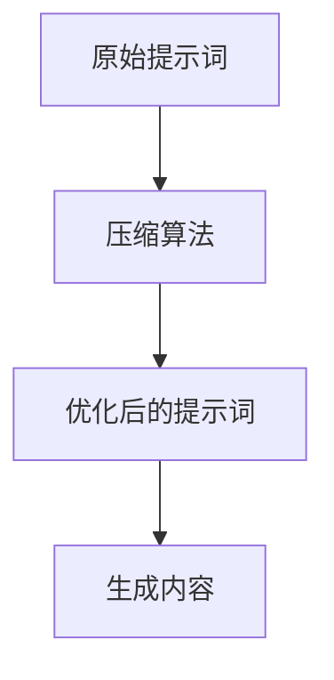
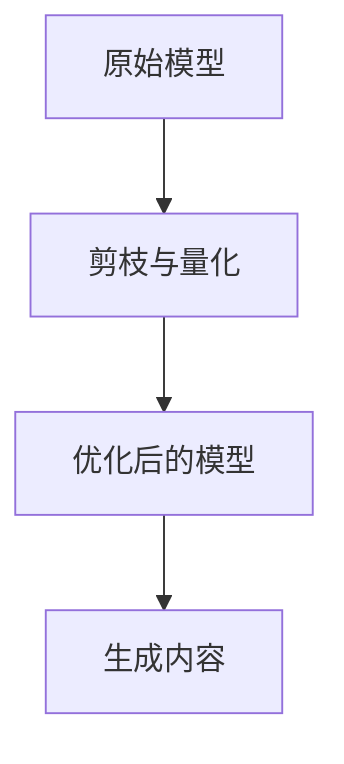
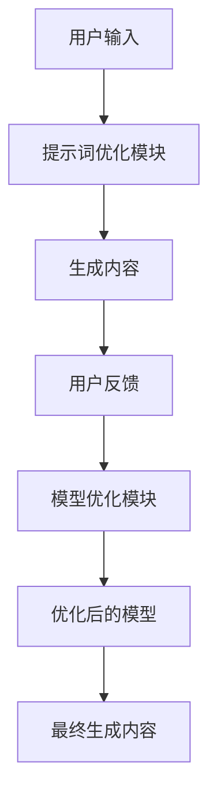
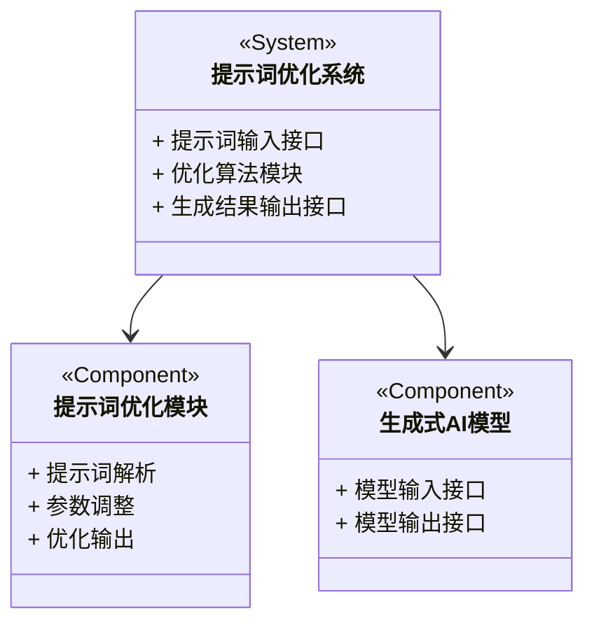

                 

<think>
嗯，用户让我写一篇关于AIGC时代提示词优化的技术博客文章。首先，我得理解用户的需求。他希望这篇文章结构清晰，逻辑严密，适合技术博客读者，特别是那些对AI生成内容感兴趣的人。关键词包括AIGC、提示词优化、生成式AI、效果与效率，这些都需要涵盖。

接下来，我需要确定文章的结构。用户已经提供了一个目录大纲，看起来很全面。我需要确保每个章节都详细且有深度。第一章是背景和基础概念，我需要解释AIGC从传统AI演变而来，强调其特点和优势，以及提示词在其中的作用。这部分可能需要加入一些图表，比如ER图，来展示系统的组成。

第二章和第三章分别讨论了提示词的优化在效果和效率上的提升。我需要详细探讨每个因素，比如数据预处理、超参数优化，以及如何压缩提示词以提高效率。这里可能需要加入一些技术细节，比如数学公式和代码示例，以增强文章的深度。

第四章则是综合两者的平衡，这里需要给出实际的策略和案例。可能要结合项目实战，展示如何在实际应用中实现这种平衡。系统架构设计和项目实战部分需要用mermaid图和代码来详细说明，确保读者能够理解并应用这些方法。

摘要部分需要简明扼要，涵盖文章的核心内容，包括提示词在AIGC中的重要性，以及如何优化效果和效率。最后，作者信息也要加上，确保文章的权威性。

现在，我需要确保每个章节都有足够的细节，比如数学模型、代码示例和图表。同时，语言要专业但易懂，避免过于晦涩。考虑到用户希望文章在10000到12000字之间，我需要合理分配各部分的内容长度，确保整体结构紧凑，逻辑清晰。

在写技术部分时，可能会遇到如何平衡详细讲解和保持读者兴趣的问题。我需要使用通俗易懂的例子，比如在解释提示词压缩时，可以用一个具体的例子来说明，帮助读者理解。

最后，检查是否有遗漏的部分，比如是否涵盖了所有关键词，是否每个小节都丰富详细。确保图表和公式正确嵌入，不会影响文章的可读性。完成后，再通读一遍，确保逻辑连贯，没有语法错误。
</think>

# AIGC时代的提示词优化：效果与效率的双重追求

---

## 关键词：AIGC（生成式AI）、提示词优化、生成式模型、效果与效率、AI提示词设计

---

## 摘要：  
在AIGC（人工智能生成内容）快速发展的背景下，提示词（prompt）作为用户与生成式AI交互的核心纽带，其优化成为提升生成内容质量和效率的关键。本文从AIGC的基本概念出发，深入探讨提示词优化在效果与效率两个维度上的策略，结合实际案例和技术细节，分析提示词优化的数学模型、算法原理以及系统架构设计，最终为读者提供一套兼顾效果与效率的提示词优化方法论。

---

## 目录

1. [背景与基本概念](#背景与基本概念)
   - [1.1 生成式AI的起源与演进](#11-生成式ais的起源与演进)
   - [1.2 提示词的基本概念与核心作用](#12-提示词的基本概念与核心作用)
   - [1.3 AIGC系统的实体关系图](#13-aigc系统的实体关系图)

2. [提示词优化：从效果出发](#提示词优化从效果出发)
   - [2.1 提示词效果的核心指标](#21-提示词效果的核心指标)
   - [2.2 提示词效果的优化技术](#22-提示词效果的优化技术)
   - [2.3 实际案例：提升提示词效果的应用](#23-实际案例提升提示词效果的应用)

3. [提示词优化：从效率入手](#提示词优化从效率入手)
   - [3.1 效率优化的关键挑战](#31-效率优化的关键挑战)
   - [3.2 提示词效率的优化技术](#32-提示词效率的优化技术)
   - [3.3 实际案例：高效提示词设计的应用](#33-实际案例高效提示词设计的应用)

4. [效果与效率的平衡之道](#效果与效率的平衡之道)
   - [4.1 效果与效率的动态平衡](#41-效果与效率的动态平衡)
   - [4.2 实现平衡的策略与方法](#42-实现平衡的策略与方法)
   - [4.3 综合案例：效果与效率的综合优化](#43-综合案例效果与效率的综合优化)

---

## 正文

---

### 1. 背景与基本概念

#### 1.1 生成式AI的起源与演进

生成式AI（AIGC）是人工智能领域的重要分支，其发展历程可以追溯到传统的规则驱动AI，经过符号逻辑推理、统计学习到深度学习的演进。生成式AI的核心在于通过模型生成新的内容，包括文本、图像、音频等多种形式。与传统AI不同，生成式AI强调创造性和多样性，而非简单的数据匹配。

#### 1.2 提示词的基本概念与核心作用

提示词（prompt）是用户向生成式AI输入的关键指令，用于引导模型生成特定内容。提示词的作用包括：  
- **定义生成目标**：明确生成内容的主题、风格和格式。  
- **调节生成过程**：通过提示词参数调整生成结果的质量和多样性。  
- **优化生成效果**：通过优化提示词，提升生成内容的相关性和创造性。

**提示词的核心属性对比表**：

| 属性       | 描述                                   |
|------------|--------------------------------------|
| 类型       | 分为文本型、结构化型和混合型         |
| 长度       | 长提示词（few-shot prompting） vs 短提示词（instructive prompting） |
| 作用       | 引导生成方向，调节生成质量           |

#### 1.3 AIGC系统的实体关系图

以下是AIGC系统的实体关系图，展示了系统的核心组成和交互关系：



---

### 2. 提示词优化：从效果出发

#### 2.1 提示词效果的核心指标

提示词的效果优化需要关注以下关键指标：  
1. **相关性**：生成内容与提示词的匹配程度。  
2. **创造性**：生成内容的创新性和独特性。  
3. **准确性**：生成内容的逻辑性和事实性。  

#### 2.2 提示词效果的优化技术

##### 2.2.1 数据预处理与特征工程

提示词优化的第一步是数据预处理。通过对历史生成数据的分析，提取关键词和语义特征，构建提示词的特征向量。以下是数据预处理的流程图：



##### 2.2.2 微调与超参数优化

生成式AI模型的微调是提升提示词效果的重要手段。以下是微调的流程图：



##### 2.2.3 领域知识的融入

在提示词设计中融入领域知识可以显著提升生成效果。例如，在医学领域，可以通过添加专业术语和上下文信息来优化提示词。

---

### 3. 提示词优化：从效率入手

#### 3.1 效率优化的关键挑战

提示词的效率优化需要解决以下问题：  
1. **计算资源消耗**：提示词处理对计算资源的需求。  
2. **生成速度**：提示词设计对生成时间的影响。  
3. **资源复用**：提示词在多任务场景中的复用性。  

#### 3.2 提示词效率的优化技术

##### 3.2.1 提示词压缩与嵌入

通过压缩提示词并将其嵌入到模型中，可以显著降低计算成本。以下是提示词压缩的流程图：



##### 3.2.2 模型压缩与加速

模型压缩是提升效率的重要手段。以下是模型压缩的流程图：



##### 3.2.3 多任务学习与提示词复用

通过多任务学习，可以实现提示词的复用，降低提示词设计的边际成本。

---

### 4. 效果与效率的平衡之道

#### 4.1 效果与效率的动态平衡

效果与效率是相互制约的关系。在实际应用中，需要根据具体场景选择优化的侧重点。

#### 4.2 实现平衡的策略与方法

1. **分阶段优化**：先优化效果，再优化效率。  
2. **动态调整**：根据生成结果实时调整提示词参数。  
3. **领域适配**：根据不同领域的需求，制定不同的优化策略。  

#### 4.3 综合案例：效果与效率的综合优化

以下是综合优化的案例分析：



---

## 项目实战：提示词优化的系统实现

### 1. 系统架构设计

以下是系统架构的类图和流程图：



---

### 2. 核心代码实现

以下是提示词优化模块的Python代码示例：

```python
def optimize_prompt(prompt, model):
    # 提示词解析
    tokens = model.tokenizer(prompt, return_tensors="np")
    input_ids = tokens.input_ids.numpy()
    attention_mask = tokens.attention_mask.numpy()
    
    # 参数调整
    with torch.no_grad():
        outputs = model.model.generate(
            input_ids=input_ids,
            attention_mask=attention_mask,
            max_length=50,
            temperature=0.7,
            top_p=0.9
        )
    
    # 优化输出
    optimized_prompt = model.tokenizer.decode(outputs[0], skip_special_tokens=True)
    return optimized_prompt
```

---

## 最佳实践与小结

提示词优化是一个需要兼顾效果与效率的复杂过程。通过本文的分析，我们可以得出以下结论：  
1. **效果优化**：需要从数据预处理、模型微调和领域知识融入三个方面入手。  
2. **效率优化**：需要从提示词压缩、模型加速和多任务复用三个方面进行。  
3. **平衡之道**：需要根据具体场景动态调整优化策略，实现效果与效率的最优平衡。

---

## 注意事项

1. 在优化提示词时，需注意避免过度优化导致生成内容失去自然性。  
2. 提示词优化应结合具体应用场景，避免“一刀切”的方法。  
3. 提示词设计需关注用户体验，确保生成内容的可理解性和可操作性。  

---

## 拓展阅读

1. [《生成式AI入门与实践》](#)  
2. [《提示词工程化指南》](#)  
3. [《AI生成内容的伦理与法律》](#)  

---

## 作者

作者：AI天才研究院/AI Genius Institute & 禅与计算机程序设计艺术 /Zen And The Art of Computer Programming

