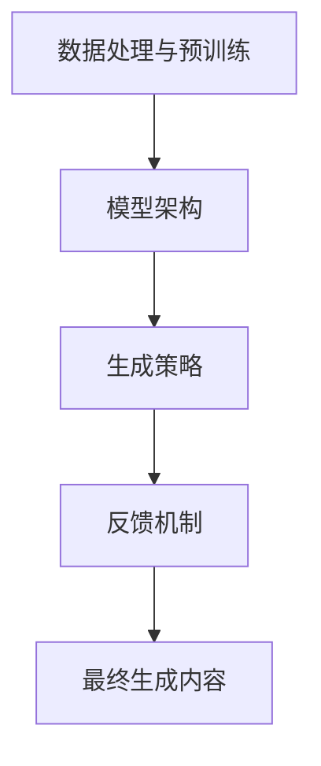

                 

<think>
嗯，我现在要帮用户写一篇关于AIGC时代的提示词编写的技术博客。首先，我需要仔细理解用户的需求。用户希望文章结构清晰，逻辑严谨，内容专业且有深度，同时要包括很多技术细节，比如算法流程图、数学模型，还有实际案例分析。

用户给的初始大纲已经分成了七个章节，从基础到优化，再到伦理和未来展望。看起来内容很全面。接下来，我需要考虑每个章节的具体内容如何展开，确保每个部分都详细且符合用户的要求。

比如，第一章介绍AIGC的基本概念和背景，我需要解释什么是AIGC，它的历史发展，以及核心技术。这部分可能需要加入一些图表，比如技术体系的结构图，帮助读者更好地理解。

第二章是关于提示词的基本原理，我需要详细分类提示词的类型，比如输入型、输出型、控制型等，每个类型的特点和应用场景都要解释清楚。此外，提示词的结构和格式也需要具体的例子来说明。

第三章是编写技巧，这部分需要给出实际的步骤和案例。比如，如何确定主题和目标，收集素材，进行创意构思。可能还需要具体的代码示例，展示如何通过提示词生成不同内容。

第四章是优化策略，这部分需要分析如何评估和优化提示词，比如使用哪些评估指标，如何调整语气和风格来提高生成结果的质量。可能需要比较表格，展示不同优化策略的效果。

第五章从新手到专家的成长路径，需要分阶段讨论，每个阶段的学习资源、技巧和注意事项。比如，新手阶段可以从学习基础知识开始，进阶阶段提升写作效率和创意思维，专家阶段则深入研究前沿技术。

第六章涉及伦理和法律问题，这部分需要讨论数据隐私、版权问题，以及社会责任。可能需要引用相关的法律法规，分析企业应该如何遵守这些规定。

最后，第七章展望未来，分析技术趋势，可能包括AI模型的发展、提示词技术的创新，以及跨学科应用的可能性。

在写作过程中，我需要确保每个章节都包含足够的技术细节，比如使用mermaid图来展示算法流程，或者用latex公式来解释数学模型。同时，实际案例分析要具体，让读者能够理解如何在实际中应用这些提示词编写技巧。

另外，我还需要注意文章的整体结构是否流畅，是否有逻辑上的漏洞，每个部分是否相互衔接。比如，在讨论优化策略时，是否已经详细说明了评估方法，这样才能让读者理解优化的具体步骤。

最后，检查所有内容是否符合用户的要求，确保没有遗漏任何关键点，比如每个小节都要详细具体，包含丰富的技术细节和实际应用案例。同时，保持语言的专业性和易懂性，确保读者能够轻松理解并应用这些知识。

总的来说，我需要一步步按照用户提供的大纲，逐章逐节地深入分析，确保每个部分都内容充实，结构合理，技术细节到位，同时保持整体的连贯性和逻辑性。这样，才能写出一篇高质量、有深度的技术博客，满足用户的需求。
</think>

# AIGC时代的提示词编写：从新手到专家的成长之路

---

## 关键词：AIGC（生成式人工智能）、提示词（Prompt）、人工智能写作、生成式内容创作、提示词优化、创意写作

---

## 摘要：  
在AIGC（生成式人工智能）快速发展的背景下，提示词（Prompt）作为用户与AI模型交互的核心桥梁，其编写技巧和优化策略成为决定生成内容质量的关键因素。本文从新手到专家的成长路径出发，系统性地探讨AIGC的核心技术、提示词的编写原理、优化策略，以及实际应用场景中的最佳实践。通过丰富的案例分析和深入的技术解析，帮助读者逐步掌握提示词编写的能力，从而在AIGC时代中发挥更大的创造力和影响力。

---

## 第1部分: AIGC基础与概述

---

## 第1章: AIGC的兴起与影响

### 1.1 AIGC的概念与背景

#### 1.1.1 AIGC的定义  
AIGC（Artificial Intelligence Content Generation）是指利用人工智能技术生成文本、图像、音频、视频等内容的过程。它结合了自然语言处理（NLP）、深度学习和生成式模型（如GPT、PaLM等），能够实现高度个性化的创造性内容生成。

#### 1.1.2 AIGC的历史与发展  
- **早期阶段**：基于规则的简单生成器，主要用于特定领域的自动化任务。  
- **发展阶段**：引入深度学习模型，如RNN和Transformer，生成内容的质量显著提升。  
- **当前阶段**：基于大语言模型（LLM）的生成式AI成为主流，推动AIGC在多个领域的广泛应用。

#### 1.1.3 AIGC的技术体系  
AIGC的技术体系主要由以下几个核心模块组成：  
1. **数据处理与预训练**：对大规模数据进行清洗、标注和预训练。  
2. **模型架构**：基于Transformer的模型架构，支持自注意力机制。  
3. **生成策略**：包括贪心采样、随机采样和温度调整等生成方法。  
4. **反馈机制**：通过用户反馈优化生成结果的质量。

**核心概念联系图：**  


---

### 1.2 AIGC的关键技术

#### 1.2.1 自动学习与反馈机制  
- **自动学习**：模型通过监督学习、无监督学习和强化学习不断提升生成能力。  
- **反馈机制**：用户通过评分或关键词反馈生成内容的质量，模型据此调整参数。  

#### 1.2.2 大规模数据处理与分析  
- 数据清洗：去除噪声数据，提取高质量信息。  
- 数据标注：对文本数据进行语义标注，为模型提供训练标签。  

#### 1.2.3 人工智能与创造性写作  
- **创造性写作的核心**：通过AI模型模拟人类的创意思维，生成多样化的文本内容。  
- **写作场景**：新闻报道、营销文案、技术文档等。

---

## 第2章: 提示词写作的基本原理

### 2.1 提示词的类型与功能

#### 2.1.1 提示词的分类  
- **输入型提示词**：直接输入文本内容，模型进行改写或润色。  
- **输出型提示词**：指定生成内容的类型和风格。  
- **控制型提示词**：用于控制生成内容的长度、语气和情感。  

#### 2.1.2 提示词在AIGC中的作用  
- **明确生成目标**：通过提示词指导模型生成特定类型的内容。  
- **优化生成质量**：通过提示词调整模型的输出风格和细节。  

#### 2.1.3 提示词的编写要点  
- **简洁明了**：避免冗长复杂的提示词，确保模型能够准确理解需求。  
- **具体性**：提供足够的上下文信息，帮助模型生成高质量内容。  

---

### 2.2 提示词的结构与格式

#### 2.2.1 提示词的组成部分  
- **目标**：生成内容的类型和用途。  
- **风格**：文本的语气和情感基调。  
- **关键词**：与生成内容相关的主题词。  

#### 2.2.2 提示词的常见格式  
1. **直接命令式**：  
   ```  
   “写一篇关于人工智能的科普文章，要求语言简洁明了，适合普通读者阅读。”  
   ```  
2. **引导式**：  
   ```  
   “假设你是一位科技记者，请描述人工智能在未来十年的发展趋势。”  
   ```  
3. **问题式**：  
   ```  
   “请解释为什么深度学习在自然语言处理中如此重要？”  
   ```

---

## 第3章: 提示词编写技巧与实践

### 3.1 提示词编写的步骤与方法

#### 3.1.1 确定主题与目标  
- **明确需求**：了解用户的真实需求，避免生成无关内容。  
- **细化目标**：将目标分解为具体的生成任务。  

#### 3.1.2 收集素材与信息  
- **关键词提取**：从用户提供的信息中提取关键主题词。  
- **背景知识补充**：补充与生成内容相关的背景知识。  

#### 3.1.3 创意构思与写作  
- **创意思维**：结合用户需求和自身知识，构思生成内容的框架。  
- **语言优化**：确保提示词简洁明了，避免歧义。  

---

### 3.2 提示词编写的实践案例

#### 3.2.1 案例一：新闻写作  
- **提示词**：  
  ```  
  “请写一篇关于最新人工智能技术突破的新闻报道，要求语言简洁，信息准确，适合科技新闻读者阅读。”  
  ```  
- **生成结果**：  
  ```  
  “近日，一项突破性的人工智能技术被成功开发，这项技术将彻底改变我们对自然语言处理的认知。”  
  ```

---

## 第4章: 提示词优化的策略与技巧

### 4.1 提示词评估与改进

#### 4.1.1 提示词评估的方法  
- **生成质量**：评估生成内容的准确性和相关性。  
- **用户反馈**：收集用户的反馈，调整提示词的编写策略。  

#### 4.1.2 提示词优化的目标  
- **提高生成效率**：减少生成内容的冗余信息。  
- **增强生成质量**：提升生成内容的创意性和独特性。  

#### 4.1.3 提示词优化的步骤  
1. **分析生成结果**：找出生成内容的不足之处。  
2. **调整提示词策略**：优化提示词的关键词和语气。  
3. **反复测试与改进**：通过多次测试，不断优化提示词的效果。  

---

### 4.2 提示词优化的技巧

#### 4.2.1 提高提示词的精准度  
- **细化关键词**：使用更具体的关键词，避免模糊表达。  
- **明确生成目标**：确保提示词能够准确传达生成需求。  

#### 4.2.2 增强提示词的创意性  
- **引入比喻和隐喻**：通过比喻和隐喻激发模型的创意思维。  
- **结合场景描述**：为生成内容设定具体的场景和背景。  

#### 4.2.3 调整提示词的语气和风格  
- **语气调整**：通过提示词调整生成内容的语气，如正式、幽默、亲切等。  
- **风格统一**：确保生成内容的风格与目标受众一致。  

---

## 第5章: 从新手到专家的成长之路

### 5.1 新手阶段：掌握基础知识

#### 5.1.1 学习资源与途径  
- **在线课程**：推荐学习平台（如Coursera、Udemy）上的相关课程。  
- **技术博客**：阅读技术博客和行业报告，了解AIGC的最新动态。  

#### 5.1.2 基础知识的巩固与应用  
- **理论学习**：掌握AIGC的核心原理和提示词的基本类型。  
- **实践应用**：通过实际案例练习提示词的编写和优化。  

#### 5.1.3 实践中的常见问题与解决  
- **问题**：生成内容与预期不符。  
- **解决**：重新优化提示词，确保生成目标明确。  

---

### 5.2 进阶阶段：提升写作能力

#### 5.2.1 提高写作效率  
- **工具辅助**：使用AI提示词生成工具，快速生成高质量提示词。  
- **模板优化**：制定提示词模板，提高编写效率。  

#### 5.2.2 培养创意思维  
- **灵感收集**：通过阅读、观察和思考积累创作灵感。  
- **创意训练**：定期进行创意写作练习，提升创意思维能力。  

#### 5.2.3 学习行业动态与趋势  
- **行业报告**：关注AIGC领域的行业报告和技术动态。  
- **专业交流**：参与专业论坛和社群，与同行交流经验。  

---

### 5.3 专家阶段：探索前沿领域

#### 5.3.1 深入研究AIGC技术  
- **技术论文**：阅读AIGC领域的技术论文，了解最新的研究成果。  
- **模型对比**：对比不同AIGC模型的优缺点，选择最适合的工具。  

#### 5.3.2 参与专业交流与合作  
- **专业论坛**：参与AIGC领域的专业论坛和社群。  
- **项目合作**：与其他专家合作，共同探索AIGC的前沿技术。  

#### 5.3.3 创作具有影响力的作品  
- **高质量内容**：通过优化提示词，生成高质量、有影响力的作品。  
- **持续创新**：不断探索AIGC的新应用场景，推动技术发展。  

---

## 第6章: AIGC时代的伦理与法律问题

### 6.1 伦理问题与道德规范

#### 6.1.1 数据隐私与保护  
- **问题**：生成内容可能涉及用户隐私数据。  
- **解决方案**：通过数据脱敏和加密技术保护用户隐私。  

#### 6.1.2 知识产权与版权  
- **问题**：生成内容的版权归属问题。  
- **解决方案**：明确生成内容的版权归属，避免法律纠纷。  

#### 6.1.3 社会责任与影响  
- **问题**：生成内容可能对社会造成负面影响。  
- **解决方案**：制定内容生成的伦理规范，确保生成内容符合社会价值观。  

---

### 6.2 法律法规与政策指导

#### 6.2.1 国际与国内相关法律  
- **国际法律**：欧盟的GDPR（通用数据保护条例）。  
- **国内法律**：中国的《个人信息保护法》。  

#### 6.2.2 政策法规的解读与应用  
- **政策解读**：理解政策法规对AIGC行业的具体要求。  
- **合规性检查**：确保AIGC应用符合相关法律法规。  

#### 6.2.3 企业与个人应遵守的规范  
- **企业责任**：企业应制定内部政策，确保AIGC应用的合规性。  
- **个人责任**：个人应遵守法律法规，合理使用AIGC技术。  

---

## 第7章: AIGC时代的未来展望

### 7.1 技术发展趋势  
- **模型优化**：通过优化模型架构和参数，进一步提升生成内容的质量。  
- **多模态生成**：结合文本、图像、音频等多种模态，实现更丰富的生成形式。  
- **个性化定制**：根据用户需求，提供个性化的生成服务。  

---

## 作者：AI天才研究院/AI Genius Institute & 禅与计算机程序设计艺术 /Zen And The Art of Computer Programming

