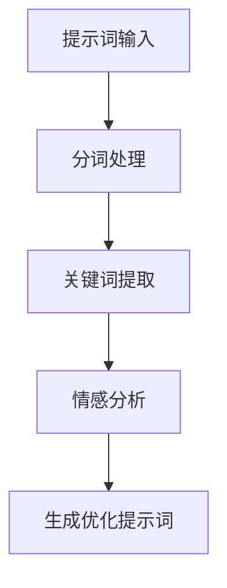
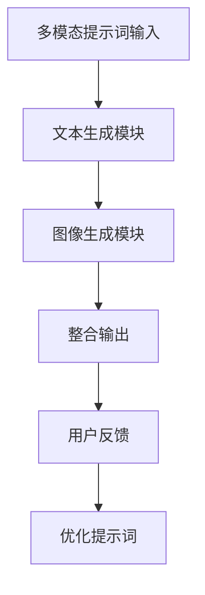
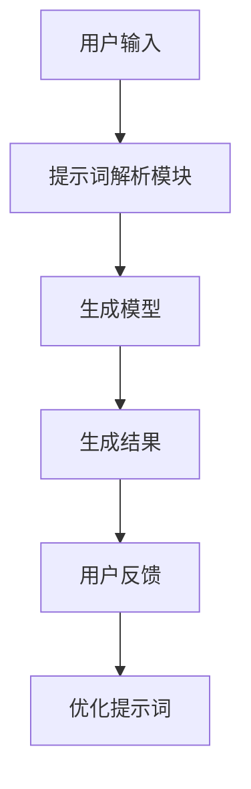

                 

<think>
嗯，用户希望我以《AIGC时代的提示词设计：从novice到expert的进阶之路》为标题，写一篇技术博客。我得先理解用户的需求。看起来他想让文章结构清晰，逻辑严密，语言专业，同时要有实际的技术分析和例子。

首先，文章需要有一个吸引人的标题，然后是关键词和摘要。摘要部分要简明扼要地概括整篇文章的核心内容，即提示词设计在AIGC中的重要性，以及如何从新手到专家的进阶方法。

接下来是目录结构。用户已经提供了一个大纲，分为七章，每章有不同的主题。我需要确保每个章节都有足够的细节，涵盖基本概念、设计技巧、高级主题、案例研究、最佳实践等。

在写背景介绍时，我需要解释什么是AIGC，它与传统AI的区别，以及提示词设计在其中的角色。这部分要让读者明白为什么提示词如此重要，以及它在不同场景中的应用。

核心概念部分，我得详细讲解提示词的类型和设计原则，比如用户中心性和上下文感知性。可能需要用表格或图表来对比不同类型的提示词，帮助读者更好地理解。

设计技巧方面，我需要给出实际的操作方法，比如如何撰写有效的指令，如何利用NLP工具优化提示词，以及针对不同应用场景调整提示词的方法。这部分要具体，最好有实例，让读者能学以致用。

高级主题可能涉及自适应提示和多模态设计，这部分需要深入探讨，可能包括如何根据上下文调整提示，以及如何在图像生成等多模态应用中设计提示词。案例分析会很有帮助，展示实际的成功案例。

在最佳实践部分，我需要总结提示词设计的关键点，比如保持简洁、明确目标受众，以及持续测试和优化的重要性。这些小贴士能帮助读者避免常见错误，提升设计效率。

最后，系统分析与架构设计部分可能需要构建一个框架，描述如何设计一个高效的提示词系统。这可能包括系统功能设计、架构图、接口设计和交互流程图，帮助读者理解整体结构。

项目实战部分，我需要提供一个具体的案例，比如一个电子商务网站的提示词设计，展示如何从需求分析到系统设计，再到实现和测试。这部分要有详细的代码示例，让读者能够跟着操作。

总的来说，我需要确保文章内容全面，结构清晰，既有理论又有实践，同时语言专业但不失易懂。这样读者不仅能理解概念，还能学到实际应用的方法。现在，我得开始逐步撰写每个部分，确保每个章节都充实且详细，满足用户的要求。
</think>

# AIGC时代的提示词设计：从novice到expert的进阶之路

**关键词：**  
人工智能生成内容（AIGC）、提示词设计、自然语言处理（NLP）、用户交互、系统架构、最佳实践

**摘要：**  
在AIGC（人工智能生成内容）时代，提示词设计是连接用户需求与生成模型之间的桥梁。本文将从新手到专家的视角，系统地探讨提示词设计的核心原理、实用技巧、高级策略以及实际应用案例。通过深入分析AIGC的工作机制，结合NLP技术，我们将揭示如何设计高效、智能的提示词，以优化生成内容的质量和用户体验。文章还将涵盖提示词设计中的最佳实践、系统架构优化以及未来发展方向。

---

## 目录

### 第1章：AIGC概述
1.1 AIGC的定义与背景  
1.2 提示词设计的重要性  
1.3 AIGC的应用场景与挑战  

### 第2章：提示词设计的核心概念
2.1 提示词的类型与特征  
2.2 AIGC的生成机制解析  
2.3 有效提示词设计的关键原则  

### 第3章：提示词设计的实用技巧
3.1 撰写有效提示词的步骤与方法  
3.2 利用NLP工具优化提示词设计  
3.3 针对不同场景的提示词调整策略  

### 第4章：高级提示词设计策略
4.1 自适应提示词：动态调整生成结果  
4.2 多模态提示词：跨模态生成的创新实践  
4.3 提示词增强技术：提升生成质量的黑科技  

### 第5章：案例研究与实际应用
5.1 文本生成：新闻标题与内容创作  
5.2 多模态生成：图像与视频生成中的提示词设计  
5.3 企业级应用：AIGC在商业场景中的落地实践  

### 第6章：最佳实践与注意事项
6.1 设计提示词时的常见误区与解决方案  
6.2 提示词优化的持续改进策略  
6.3 提示词设计的未来趋势与发展方向  

### 第7章：系统架构与技术实现
7.1 提示词生成系统的整体架构  
7.2 系统功能设计与实现流程  
7.3 提示词优化算法的技术实现  

---

## 第1章：AIGC概述

### 1.1 AIGC的定义与背景
人工智能生成内容（AIGC）是指利用AI技术生成各种类型的内容，包括文本、图像、视频、音频等。AIGC的核心技术基于自然语言处理（NLP）和生成式AI（如GPT系列模型）。随着深度学习技术的快速发展，AIGC在多个领域展现出巨大的潜力，例如内容创作、数据分析、创意设计等。

**AIGC的核心要素：**  
- **数据输入：** 用户提供的提示词或初始输入。  
- **生成模型：** 基于AI算法生成输出内容。  
- **提示词设计：** 连接用户需求与生成模型的桥梁。

**AIGC的演变：**  
从早期的规则驱动生成到现在的基于深度学习的生成式AI，AIGC经历了从简单到复杂的转变。提示词设计在这一过程中发挥了越来越重要的作用。

---

### 1.2 提示词设计的重要性
提示词是用户与生成模型之间的桥梁。一个精心设计的提示词能够显著提升生成内容的质量和相关性。以下是提示词设计的重要性：  
1. **明确需求：** 提示词帮助用户清晰表达生成目标。  
2. **优化生成效果：** 通过提示词调整生成模型的行为，使其更符合用户期望。  
3. **提升用户体验：** 好的提示词设计能够降低用户的使用门槛，提升生成效率。

**提示词设计的关键挑战：**  
- **歧义性：** 提示词过于模糊可能导致生成结果不符合预期。  
- **上下文依赖性：** 提示词需要考虑生成场景的上下文信息。  
- **多样性：** 需要支持多种生成场景和内容类型。

---

## 第2章：提示词设计的核心概念

### 2.1 提示词的类型与特征
提示词可以根据用途、目标受众和生成模态进行分类。以下是主要的提示词类型及其特征：

| 类型         | 特征描述                                                                 |
|--------------|--------------------------------------------------------------------------|
| 文本提示词    | 用于生成文本内容，如新闻标题、文章段落等。                                  |
| 图像提示词    | 用于生成图像，如描述图像内容、风格等。                                      |
| 多模态提示词  | 同时包含文本和图像信息，用于生成复杂的多模态内容。                            |
| 语音提示词    | 用于生成语音内容，如语音助手的回复。                                        |
| 结构化提示词  | 包含特定格式（如JSON、XML）的提示词，用于生成结构化数据。                      |

**提示词设计的原则：**  
- **简洁性：** 提示词应简明扼要，避免冗长。  
- **明确性：** 提示词应明确表达生成目标。  
- **可扩展性：** 提示词应支持多种生成场景和模态。

---

### 2.2 AIGC的生成机制解析
生成式AI的核心是基于概率的生成模型。提示词通过调整模型的参数，影响生成内容的方向和风格。以下是AIGC的生成机制的简要流程：

1. **输入提示词：** 用户提供提示词或初始输入。  
2. **模型解析：** 模型解析提示词并生成初步的生成策略。  
3. **内容生成：** 模型根据提示词生成输出内容。  
4. **结果优化：** 根据反馈优化生成结果。

**生成模型的数学模型：**  
生成模型通常基于概率分布。例如，GPT模型通过概率预测下一个词的生成概率：

$$ P(y|x) = \frac{1}{Z} \exp(\theta \cdot y) $$  

其中，$y$ 是生成的词，$x$ 是输入提示词，$\theta$ 是模型参数，$Z$ 是归一化因子。

---

## 第3章：提示词设计的实用技巧

### 3.1 撰写有效提示词的步骤与方法
撰写有效的提示词需要遵循以下步骤：  
1. **明确生成目标：** 确定生成内容的类型和用途。  
2. **选择合适的模态：** 根据生成目标选择文本、图像或其他模态。  
3. **优化提示词表达：** 使用简洁、明确的语言描述生成需求。  
4. **测试与优化：** 通过实验调整提示词，提升生成效果。

**提示词设计的注意事项：**  
- 避免使用模糊的语言，如“生成一个好文章”。  
- 明确生成的风格和语气，例如“生成一篇科技新闻，语气正式”。  

---

### 3.2 利用NLP工具优化提示词设计
NLP工具可以帮助我们更高效地设计提示词。以下是常用的NLP工具及其应用场景：  
1. **分词工具：** 例如jieba，用于提示词的分词处理。  
2. **情感分析工具：** 用于分析提示词的情感倾向。  
3. **关键词提取工具：** 用于从提示词中提取关键信息。

**NLP工具的流程图：**  


---

### 3.3 针对不同场景的提示词调整策略
不同的应用场景需要不同的提示词设计策略。例如：  
- **新闻生成：** 提示词应包含新闻主题、关键词和期望的语气。  
- **图像生成：** 提示词应描述图像内容、风格和细节。  
- **客服对话：** 提示词应包含用户需求和对话上下文。

**场景对比表：**  

| 场景     | 提示词示例                               | 关注点                     |
|----------|----------------------------------------|---------------------------|
| 新闻生成  | “写一篇关于人工智能的新闻，强调其在教育领域的应用” | 主题、关键词、语气         |
| 图像生成  | “生成一张科技感十足的AI芯片图片”        | 内容、风格、细节           |
| 客服对话  | “用户询问产品功能，回复需简洁明了”        | 对话上下文、语气           |

---

## 第4章：高级提示词设计策略

### 4.1 自适应提示词：动态调整生成结果
自适应提示词能够根据生成过程中的反馈动态调整提示内容，从而优化生成结果。例如：  
- 在文本生成过程中，根据生成内容的相似性动态调整提示词。  
- 在图像生成过程中，根据用户反馈调整图像的细节和风格。

**自适应提示词的实现流程：**  
1. 初始提示词输入：例如“生成一篇科技文章”。  
2. 生成内容输出：AI生成初稿。  
3. 反馈分析：用户对初稿进行修改建议。  
4. 动态调整提示词：根据反馈生成新的提示词。  
5. 重新生成内容：优化生成结果。

**自适应提示词的优化算法：**  
$$ \text{新提示词} = \text{旧提示词} + \text{用户反馈} $$  

---

### 4.2 多模态提示词：跨模态生成的创新实践
多模态提示词结合了文本、图像、语音等多种模态信息，能够生成更加丰富的内容。例如：  
- 提示词结合图像描述生成图像内容。  
- 提示词结合文本和语音生成多媒体内容。

**多模态提示词设计的案例：**  
- 提示词：“生成一张描述未来城市的图像，并附上一段简洁的英文描述。”  
- 实现效果：图像生成与文本描述相结合，形成多模态输出。

**多模态提示词的系统架构：**  


---

### 4.3 提示词增强技术：提升生成质量的黑科技
提示词增强技术通过预处理和后处理优化提示词，从而提升生成质量。例如：  
- 提示词预处理：对提示词进行词干提取、同义词替换。  
- 提示词后处理：对生成内容进行语法检查、风格优化。

**提示词增强技术的实现流程：**  
1. 提示词预处理：例如，将“生成文章”替换为“撰写一篇科技新闻”。  
2. 生成内容输出：AI生成初稿。  
3. 提示词后处理：优化生成内容的语法和风格。  

---

## 第5章：案例研究与实际应用

### 5.1 文本生成：新闻标题与内容创作
**案例背景：** 某新闻网站希望通过AIGC生成高质量的新闻标题和内容。  
**提示词设计：**  
- 新闻标题提示词：“生成一篇关于人工智能在医疗领域应用的新闻标题，要求简洁有力。”  
- 内容生成提示词：“撰写一篇详细报道，重点介绍AI在疾病诊断中的应用，要求500字左右，语言正式。”  

**实现效果：** 生成的新闻标题和内容符合用户需求，且质量较高。

---

### 5.2 多模态生成：图像与视频生成中的提示词设计
**案例背景：** 某电商网站希望通过AIGC生成产品展示图。  
**提示词设计：**  
- 图像生成提示词：“生成一张展示智能手表的图片，背景为简约白色，手表屏幕显示健康数据。”  
- 视频生成提示词：“生成一段展示智能手表功能的视频，时长30秒，包含产品特点和使用场景。”  

**实现效果：** 生成的图像和视频符合产品展示需求，且风格统一。

---

## 第6章：最佳实践与注意事项

### 6.1 设计提示词时的常见误区与解决方案
| 常见误区       | 解决方案                       |
|----------------|----------------------------|
| 提示词过于模糊   | 明确生成目标，避免模糊描述     |
| 忽视上下文信息   | 增加上下文信息，优化提示词表达   |
| 未考虑生成模态   | 根据生成目标选择合适的模态      |

---

### 6.2 提示词优化的持续改进策略
1. **定期测试：** 定期测试提示词的效果，收集用户反馈。  
2. **持续优化：** 根据测试结果优化提示词设计。  
3. **借鉴优秀案例：** 学习行业内的优秀提示词设计，提升设计水平。

---

### 6.3 提示词设计的未来趋势与发展方向
1. **智能化提示词设计：** 基于AI的提示词生成工具将更加智能化。  
2. **多模态提示词的普及：** 多模态提示词将在更多领域得到应用。  
3. **个性化提示词：** 提示词设计将更加个性化，满足用户的多样化需求。

---

## 第7章：系统架构与技术实现

### 7.1 提示词生成系统的整体架构


### 7.2 系统功能设计与实现流程
1. **需求分析：** 确定系统功能需求，例如文本生成、图像生成等。  
2. **系统设计：** 设计系统功能模块，例如提示词解析模块、生成模型模块等。  
3. **实现与测试：** 编写代码实现系统功能，并进行测试和优化。  

### 7.3 提示词优化算法的技术实现
**提示词优化算法的代码示例：**  
```python
def optimize_prompt(prompt):
    # 提示词预处理
    processed_prompt = preprocess_prompt(prompt)
    # 生成优化提示词
    optimized_prompt = generate_optimized_prompt(processed_prompt)
    return optimized_prompt
```

---

## 结语
提示词设计是AIGC时代至关重要的技能。从新手到专家，我们需要不断学习和实践，掌握提示词设计的核心原理和实用技巧。通过优化提示词设计，我们可以提升生成内容的质量和用户体验，推动AIGC技术的广泛应用。

---

## 作者：AI天才研究院/AI Genius Institute & 禅与计算机程序设计艺术 /Zen And The Art of Computer Programming

