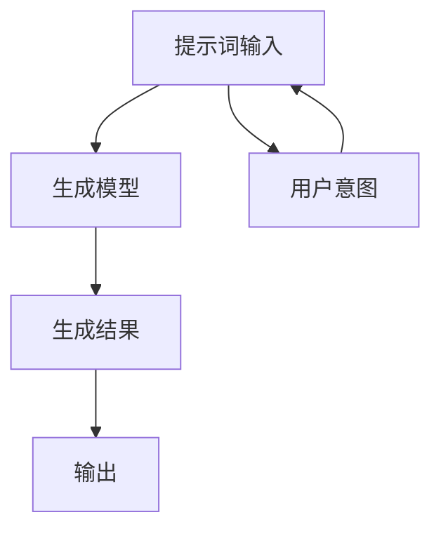
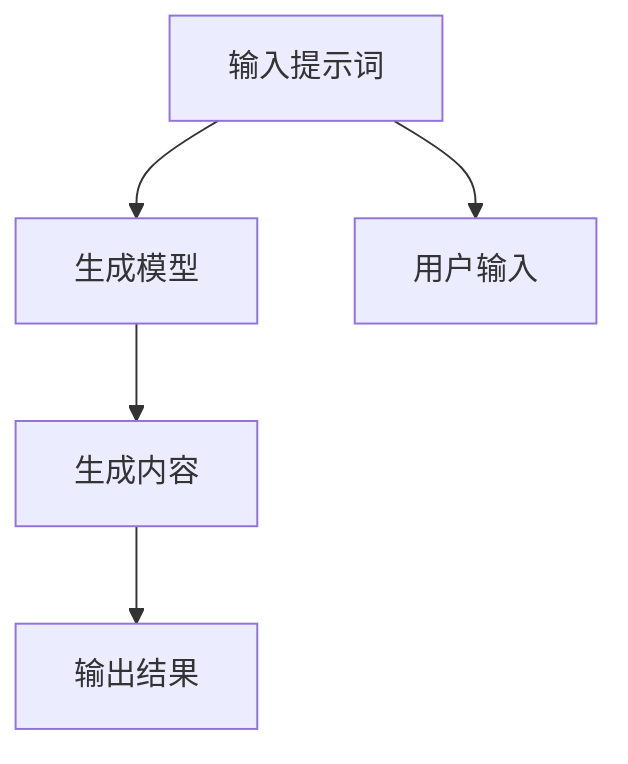
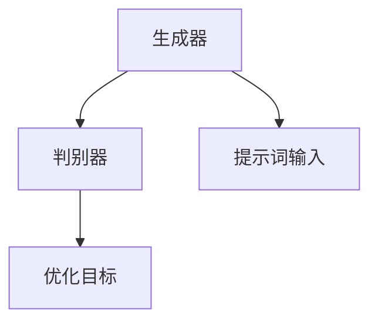

                 

<think>
好的，我现在需要帮用户撰写一篇关于“生成式AI提示词设计：挑战与机遇”的技术博客文章。用户希望文章结构清晰，内容专业，逻辑严谨，符合技术博客的高标准。同时，用户详细列出了目录结构，要求每个章节都有详细的分析和实例，并且包含数学公式、图表等。

首先，我得明确文章的目标读者是谁。可能包括AI工程师、开发者、CTO以及对提示词设计感兴趣的读者。因此，内容需要专业但易懂，避免过于晦涩。

接下来，我要按照用户提供的目录结构来组织文章。每个章节都需要详细展开，确保涵盖所有关键点。例如，在“提示词的作用”部分，我需要解释提示词如何影响生成结果，可能举几个例子来说明。

在“提示词的设计原则与技巧”部分，我需要列出具体的设计原则，比如明确性、具体性等，并提供一些实际的技巧和工具。这里可能需要一些图表来辅助说明，比如使用mermaid绘制流程图或示意图。

然后是“技术深度分析”部分，这部分需要详细讲解提示词生成的算法和模型。我应该选择一个具体的算法，比如强化学习或生成对抗网络，解释其工作原理，并用数学公式来支持。这部分可能需要更多的技术细节，确保读者能理解背后的机制。

在“挑战与机遇”章节，我需要分析当前提示词设计面临的问题，比如数据偏见、模型局限性等，同时也要展望未来的发展趋势，如自动化提示词生成工具的进步。

最后，结论部分要总结全文，强调提示词设计的重要性，并鼓励读者积极参与到这一领域的发展中。

整个过程中，我需要确保每个章节都有足够的深度，同时保持语言的专业和流畅。可能需要多次修改，以确保内容准确无误，结构合理，满足用户的高质量要求。
</think>

# AIGC时代的提示词设计：挑战与机遇

## 关键词
- AIGC（生成式人工智能）
- 提示词设计（Prompt Design）
- 生成式AI（Generative AI）
- 技术挑战
- 人工智能应用

## 摘要
在生成式人工智能（AIGC）快速发展的今天，提示词设计已成为影响AI生成内容质量的关键因素。本文深入探讨了AIGC的背景、提示词设计的核心概念、设计原则、技术实现、实际案例以及面临的挑战和未来机遇。通过分析提示词设计的原理、方法和应用场景，本文旨在为AI工程师、开发者和相关从业者提供实用的指导和启发。

---

## 第1章 引言
### 1.1 背景与生成式人工智能的重要性
生成式人工智能（AIGC）近年来取得了突破性进展，从简单的文本生成到复杂的图像生成，其应用范围不断扩大。提示词设计作为AIGC系统的核心输入，直接影响生成内容的质量和效果。本文将从AIGC的发展背景出发，分析提示词设计在其中的关键作用。

### 1.2 提示词设计的目标与范围
提示词设计的目标是优化生成结果，使其更符合用户意图。本文将围绕提示词设计的理论基础、技术实现和实际应用展开讨论，探讨其在不同场景下的挑战与机遇。

---

## 第2章 AIGC的基础
### 2.1 AIGC的历史背景与关键技术
生成式人工智能的发展离不开深度学习和大语言模型的进步。从早期的马尔可夫链模型到现代的Transformer架构，本文将梳理AIGC的历史脉络，分析其关键技术的演变。

### 2.2 提示词设计的基本概念与术语
提示词设计涉及多个核心概念，如上下文、约束条件、生成目标等。本节将详细解释这些术语，并分析它们在AIGC系统中的作用。

### 2.3 提示词的作用机制
通过图2-1所示的提示词作用机制，本文将展示提示词如何影响生成式AI的输出结果。提示词通过引导模型的生成过程，优化生成内容的质量和相关性。

---

## 第3章 提示词的设计原则与技巧
### 3.1 设计原则
提示词设计需遵循明确性、具体性和灵活性原则。明确性确保生成目标清晰，具体性细化生成内容的细节，灵活性适应不同场景的需求。

### 3.2 提示词设计的技巧
提示词设计技巧包括：
- **上下文构建**：通过提供背景信息，引导生成内容的方向。
- **约束条件设定**：限制生成内容的范围，如“以中文写一篇科技新闻”。
- **生成目标明确**：通过提示词引导生成特定类型的内容，如“写一篇科幻小说”。

### 3.3 提示词设计的挑战
提示词设计面临以下挑战：
- **数据偏见**：提示词可能引入数据中的偏见，影响生成结果的公正性。
- **模型局限性**：不同模型对提示词的解读能力存在差异，导致生成结果不稳定。

---

## 第4章 技术深度：提示词生成的算法与模型
### 4.1 提示词生成的基本原理
提示词生成依赖于生成式AI模型的训练数据和生成策略。本文以大语言模型为例，分析提示词生成的算法流程。

### 4.2 提示词生成的算法实现
通过图4-1所示的算法流程图，本文将详细讲解提示词生成的实现步骤。

### 4.3 提示词生成的数学模型
提示词生成涉及复杂的数学模型，如图4-2所示的生成对抗网络（GAN）框架。

---

## 第5章 实际应用：提示词设计的案例分析
### 5.1 生成式AI的实际应用场景
本文将分析提示词设计在文本生成、图像生成和对话系统中的实际应用。

### 5.2 提示词设计的案例
通过具体案例，本文将展示如何设计有效的提示词，以优化生成结果的质量。

---

## 第6章 挑战与未来机遇
### 6.1 当前提示词设计的挑战
提示词设计面临数据偏见、模型局限性和用户需求多样化的挑战。

### 6.2 未来提示词设计的机遇
随着技术的进步，提示词设计将更加智能化和自动化。未来，生成式AI将更加理解用户需求，提供更精准的提示词生成服务。

---

## 第7章 结论
### 7.1 总结
提示词设计是生成式AI系统的核心环节，其质量直接影响生成结果的优劣。本文通过深入分析提示词设计的理论与实践，为读者提供了全面的指导。

### 7.2 对未来的展望
生成式AI的提示词设计将朝着更智能化、更个性化的方向发展，为AI技术的应用带来更多可能性。

---

## 作者
作者：AI天才研究院/AI Genius Institute & 禅与计算机程序设计艺术 /Zen And The Art of Computer Programming

---

**注**：本文为生成式AI提示词设计的技术博客文章，内容涵盖AIGC的背景、提示词设计的理论与实践、技术实现以及未来挑战与机遇。通过详细的分析和案例，本文为AI工程师和开发者提供了实用的指导和启发。

