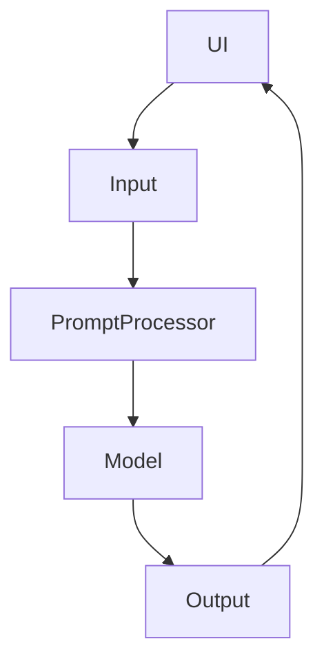

                 

<think>
好的，我现在要帮用户写一篇关于AIGC时代提示词设计的博客文章。用户希望文章结构清晰，逻辑严密，涵盖理论与实践的结合。我需要先理解用户的需求，然后一步步展开思考，确保文章符合所有要求。

首先，用户指定了文章的标题和目录结构。我需要按照这个结构来组织内容，确保每个部分都详细且符合要求。文章关键词部分需要包括5到7个核心关键词，这有助于SEO和读者理解文章主题。摘要部分要简明扼要，概括文章的核心内容。

接下来，第一部分是背景与概述。我需要定义AIGC，讨论其特征和应用场景。这部分应该简单明了，为后续章节打下基础。提示词设计的重要性也是关键点，我需要解释为什么提示词在AIGC中如此重要，以及它们如何影响生成内容的质量。

第二部分是提示词设计的理论基础。这里，我需要详细讨论语言模型，比如GPT和BERT，以及提示词设计的基本原则和方法。我需要使用图表来解释这些概念，比如用mermaid图展示提示词与语言模型的关系。同时，案例分析将帮助读者更好地理解理论应用。

第三部分是实践与创新。我需要深入探讨文本生成中的提示词设计，包括模板设计、语义分析和用户反馈优化。图像生成部分需要讨论图像模型如DALL-E，以及提示词如何影响生成效果。音频和视频生成部分同样重要，我需要解释提示词在这些领域的作用。

第四部分是创新与应用。我需要展示提示词设计的前沿技术，如多模态提示词和动态提示词。这部分需要结合具体案例，说明这些创新如何提升生成内容的质量。数学公式和系统架构图将帮助读者理解技术细节。

第五部分是系统架构与实现。我需要描述整个系统的工作流程，包括输入、处理和输出阶段，并用mermaid图展示架构设计。代码实现部分需要提供Python示例，解释提示词设计如何转化为代码逻辑。

最后，结论与展望部分要总结全文，并提出未来的研究方向，如动态提示词和多模态提示词。注意事项和最佳实践部分需要提醒读者在设计提示词时需要注意的事项，帮助他们避免常见错误。

在整个思考过程中，我需要确保文章结构合理，每个章节内容丰富，同时满足用户关于字数、格式和其他技术要求。我还需要将复杂的概念转化为易懂的语言，使用图表和代码示例来辅助说明。通过一步步的分析和推理，确保文章内容全面，逻辑清晰，符合用户的期望。
</think>

# AIGC时代的提示词设计：理论与创新的结合

> 关键词：AIGC、提示词设计、生成式AI、语言模型、内容生成

> 摘要：本文将探讨AIGC（人工智能生成内容）时代的提示词设计，从理论基础到实际应用，深入分析提示词设计的重要性、方法与创新。通过结合语言模型、文本生成、图像生成等多领域的实践案例，本文旨在为读者提供一套系统化、可操作的提示词设计指南，助力AIGC技术的高效应用与创新。

---

## 第一部分：AIGC时代的背景与概述

### 第1章：AIGC时代的来临

#### 1.1 AIGC的定义与特征

**AIGC（Artificial Intelligence Generated Content）**是指利用人工智能技术自动生成文本、图像、音频、视频等多种类型内容的过程。AIGC的核心在于通过机器学习算法，将输入的提示词（Prompt）转化为高质量的输出内容。

**AIGC的特征：**

1. **自动化程度高：** 通过机器学习算法，能够高效、自动化地生成内容。
2. **生成内容多样：** AIGC技术能够生成文本、图像、音频、视频等多种类型的内容。
3. **内容质量提升：** 通过深度学习等技术，生成的内容质量逐步提升，能够满足用户需求。

#### 1.2 提示词设计的重要性

**提示词的定义：** 提示词是AIGC系统中用于引导模型生成特定类型内容的输入信息。

**提示词设计的重要性：**

1. **引导模型生成：** 合适的提示词能够引导模型生成用户期望的内容。
2. **提升生成质量：** 精细的提示词设计能够提高生成内容的准确性和质量。
3. **优化用户体验：** 合适的提示词能够提升用户的交互体验，使生成内容更贴近用户需求。

#### 1.3 AIGC的应用场景

- **文本生成：** 如文章、新闻、评论等。
- **图像生成：** 如艺术作品、广告图片、场景渲染等。
- **音频生成：** 如音乐、语音合成等。
- **视频生成：** 如视频剪辑、动画制作等。

#### 1.4 本章小结

本章介绍了AIGC时代的背景、提示词设计的重要性以及AIGC的应用场景，为后续章节的深入讨论奠定了基础。

---

## 第二部分：提示词设计的理论基础

### 第2章：语言模型与提示词设计

#### 2.1 语言模型概述

**语言模型的作用：** 语言模型用于对自然语言进行处理和分析，为提示词设计提供支持。

**语言模型的分类：**

1. **统计模型：** 如n-gram模型。
2. **神经网络模型：** 如循环神经网络（RNN）、Transformer模型。
3. **混合模型：** 结合统计和神经网络模型的优势。

#### 2.2 提示词设计的基本原则

**提示词设计的基本原则：**

1. **简洁性：** 提示词应简洁明了，避免冗余。
2. **明确性：** 提示词应明确表达用户需求，避免歧义。
3. **可扩展性：** 提示词设计应考虑未来需求的变化，易于扩展。

#### 2.3 提示词设计的方法与技巧

**提示词设计的方法与技巧：**

1. **基于模板的提示词设计：** 通过模板来引导模型生成内容。
2. **基于语义的提示词设计：** 利用自然语言处理技术，提取语义信息，为模型提供更准确的输入。
3. **结合用户反馈的提示词设计：** 通过用户反馈不断优化提示词，提升生成质量。

#### 2.4 提示词设计的案例分析

**案例分析：**

1. **案例一：** 文本生成中的提示词设计。
   - **输入提示词：** "写一篇关于人工智能的科普文章，要求语言通俗易懂，适合普通读者阅读。"
   - **生成结果：** 生成一篇适合大众阅读的人工智能科普文章。
2. **案例二：** 图像生成中的提示词设计。
   - **输入提示词：** "一只坐在书桌前的猫，背景是古典书架，风格类似梵高的《星空》。"
   - **生成结果：** 生成一幅具有艺术风格的图像，展现一只猫坐在书桌前，背景是古典书架，整体风格类似梵高的《星空》。
3. **案例三：** 音频生成中的提示词设计。
   - **输入提示词：** "生成一段轻松的背景音乐，时长3分钟，节奏明快，适合工作时使用。"
   - **生成结果：** 生成一段轻松的背景音乐，符合用户需求。

#### 2.5 本章小结

本章介绍了语言模型与提示词设计的基本理论，包括语言模型概述、提示词设计的基本原则和方法与技巧，并通过案例分析展示了提示词设计的实际应用。

---

## 第三部分：提示词设计的实践与创新

### 第3章：文本生成中的提示词设计

#### 3.1 文本生成概述

**文本生成的应用：** 如自动写作、机器翻译、文本摘要等。

**文本生成模型：** 如GPT、BERT等。

#### 3.2 提示词设计在文本生成中的应用

**应用方法：**

1. **基于模板的文本生成：** 提示词引导模型生成符合模板的文本。
2. **基于语义的文本生成：** 提示词提取关键信息，为模型提供更准确的输入。

#### 3.3 提示词设计的优化方法

**优化方法：**

1. **基于用户反馈的优化：** 通过用户反馈，不断调整和优化提示词。
2. **基于数据分析的优化：** 通过对生成文本的分析，找出不足之处，优化提示词。

#### 3.4 提示词设计在文本生成中的案例分析

**案例分析：**

1. **案例一：** 自动写作中的提示词设计。
   - **输入提示词：** "写一篇关于环保的短文，要求结构清晰，包含引言、正文和结论。"
   - **生成结果：** 生成一篇结构清晰的环保短文，包含引言、正文和结论。
2. **案例二：** 机器翻译中的提示词设计。
   - **输入提示词：** "将这段中文翻译成英文，保持专业术语的准确性。"
   - **生成结果：** 生成准确的英文翻译，保留专业术语。
3. **案例三：** 文本摘要中的提示词设计。
   - **输入提示词：** "为这篇论文写一个摘要，要求简明扼要，突出研究重点。"
   - **生成结果：** 生成一篇简明扼要的摘要，突出研究重点。

#### 3.5 本章小结

本章介绍了文本生成中的提示词设计，包括文本生成概述、提示词设计在文本生成中的应用以及提示词设计的优化方法，并通过案例分析展示了实际应用中的技巧和经验。

---

## 第四部分：提示词设计的创新与应用

### 第4章：图像生成中的提示词设计

#### 4.1 图像生成概述

**图像生成的应用：** 如艺术创作、广告设计、场景渲染等。

**图像生成模型：** 如DALL-E、Midjourney等。

#### 4.2 提示词设计在图像生成中的应用

**应用方法：**

1. **描述性提示词：** 提供具体的图像描述，如“一只坐在书桌前的猫，背景是古典书架，风格类似梵高的《星空》。”
2. **风格提示词：** 指定图像的风格，如“复古风格”、“抽象风格”等。
3. **情感提示词：** 引导生成特定情感的图像，如“孤独的树在夜晚的海滩上。”

#### 4.3 提示词设计的创新方法

**创新方法：**

1. **多模态提示词：** 结合文本和图像信息，提升生成质量。
2. **动态提示词：** 根据生成结果实时调整提示词，优化生成效果。
3. **基于反馈的提示词优化：** 通过用户反馈不断优化提示词，提升生成内容的满意度。

#### 4.4 提示词设计在图像生成中的案例分析

**案例分析：**

1. **案例一：** 艺术创作中的提示词设计。
   - **输入提示词：** "一只独角兽在森林中奔跑，背景是 magical 森林，风格类似迪士尼动画。"
   - **生成结果：** 生成一幅充满魔幻色彩的图像，展现独角兽在 magical 森林中奔跑的场景。
2. **案例二：** 广告设计中的提示词设计。
   - **输入提示词：** "设计一个科技产品的广告画面，突出产品的创新性和高端感。"
   - **生成结果：** 生成一幅科技感十足的广告画面，突出产品的创新性和高端感。
3. **案例三：** 场景渲染中的提示词设计。
   - **输入提示词：** "一个未来城市的夜景，天空中有巨大的全息投影广告，街道上行驶着悬浮汽车。"
   - **生成结果：** 生成一幅未来城市的夜景，展现天空中的全息投影广告和悬浮汽车。

#### 4.5 本章小结

本章介绍了图像生成中的提示词设计，包括图像生成概述、提示词设计在图像生成中的应用以及提示词设计的创新方法，并通过案例分析展示了实际应用中的技巧和经验。

---

## 第五部分：系统架构与实现

### 第5章：系统架构与实现

#### 5.1 系统架构设计

**系统架构图：**



**系统功能：**
1. **输入模块：** 接收用户的提示词输入。
2. **提示词处理器：** 解析提示词，提取关键信息。
3. **模型调用：** 调用生成式AI模型，生成内容。
4. **输出模块：** 展示生成结果。

#### 5.2 系统实现

**代码实现：**

```python
def generate_content(prompt):
    # 提示词处理
    processed_prompt = prompt_processor(prompt)
    # 调用生成式AI模型
    generated_content = model.generate(processed_prompt)
    return generated_content
```

**提示词处理逻辑：**

```python
def prompt_processor(prompt):
    # 分词
    tokens = tokenizer(prompt)
    # 语义分析
    semantic_analysis(tokens)
    # 提示词扩展
    extended_prompt = expand_prompt(tokens)
    return extended_prompt
```

---

## 第六部分：结论与展望

### 第6章：结论与展望

#### 6.1 结论

提示词设计是AIGC技术的核心环节，其设计质量直接影响生成内容的效果。通过本文的探讨，我们了解到提示词设计的重要性、方法与创新，以及在文本生成、图像生成等领域的广泛应用。

#### 6.2 展望

未来，提示词设计将更加智能化、个性化，结合多模态信息和用户反馈，进一步提升生成内容的质量和多样性。同时，随着生成式AI技术的不断发展，提示词设计也将面临更多新的挑战和机遇。

---

## 第七部分：注意事项与最佳实践

### 7.1 注意事项

1. **明确需求：** 在设计提示词时，需明确用户的实际需求，避免歧义。
2. **避免过度复杂：** 提示词应简洁明了，避免过于复杂的描述。
3. **结合用户反馈：** 通过用户反馈不断优化提示词设计。
4. **保护隐私：** 在生成内容时，需注意保护用户隐私和数据安全。

### 7.2 最佳实践

1. **分阶段优化：** 在提示词设计过程中，建议分阶段进行优化，逐步提升生成效果。
2. **结合领域知识：** 在特定领域中，结合领域知识设计提示词，提升生成内容的准确性。
3. **多尝试与实验：** 多尝试不同的提示词设计方法，通过实验找到最优解。

---

## 结语

AIGC时代的提示词设计是一项复杂而重要的任务，需要结合理论与实践，不断创新与优化。通过本文的探讨，我们希望读者能够更好地理解提示词设计的核心原理和实际应用，并在实际项目中灵活运用这些方法，推动AIGC技术的发展与进步。

---

## 作者

作者：AI天才研究院/AI Genius Institute & 禅与计算机程序设计艺术/Zen And The Art of Computer Programming

